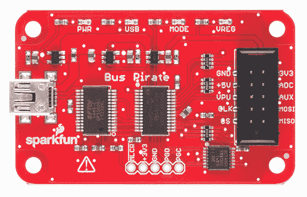
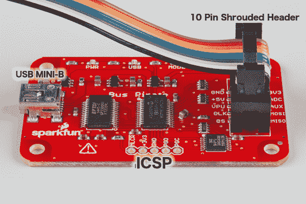
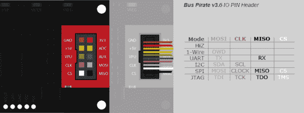
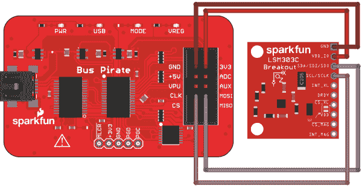
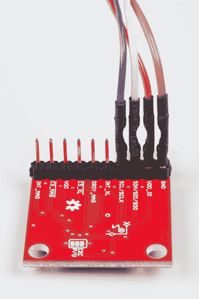
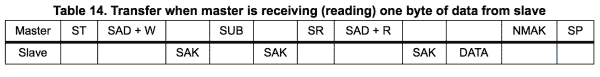
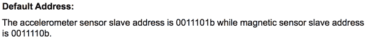

# 总线盗版 3.6a 连接指南

> 原文：<https://learn.sparkfun.com/tutorials/bus-pirate-v36a-hookup-guide>

## 介绍

[巴士海盗](https://www.sparkfun.com/products/12942)是一个电子原型的梦想。它包含了启动和运行项目所需的许多工具。Bus Pirate 可以执行各种测试设备功能，例如测量电压和频率以及生成 PWM 信号。

[](https://cdn.sparkfun.com/assets/learn_tutorials/4/0/4/12942-04.jpg)

总线盗版的大部分功能都围绕着串行协议。总线盗版器可以通过 1 线、2 线、3 线、UART、I ² C、SPI 和 HD44780 LCD 协议进行通信。它还有一个 bitbang 模式，用于其他或自定义选项。

本指南旨在快速概述并涵盖危险原型提供的[总线盗版文档](http://dangerousprototypes.com/docs/Bus_Pirate)中未明确涵盖的一些内容。

### 推荐阅读

本指南将提到以下概念。如果你对它们中的任何一个都不熟悉，可以查看相应的教程。

*   [串行通信](https://learn.sparkfun.com/tutorials/serial-communication)
*   [I2C 通信](https://learn.sparkfun.com/tutorials/i2c)
*   [串行外设接口(SPI)](https://learn.sparkfun.com/tutorials/serial-peripheral-interface-spi)
*   [脉宽调制(PWM)](https://learn.sparkfun.com/tutorials/pulse-width-modulation)
*   [串行终端基础知识](https://learn.sparkfun.com/tutorials/terminal-basics)

## 主板概述

[](https://cdn.sparkfun.com/assets/learn_tutorials/4/0/4/Bus_Pirate_Labeled.jpg)*Bus Pirate Ports*

总线盗版有 3 个端口。第一个是 ICSP 端口，用于直接对该产品核心的 PIC 微控制器进行编程。因为有一个引导加载程序和刷新工具，你不应该使用这个端口。

第二个端口是 mini-B USB 插孔。用标准的 A 转 mini-B 线把这个连接到电脑上。这将为电路板提供电源，并允许您与总线盗版进行通信。

第三个港口是最有趣的。这是一个带护罩的 0.1 英寸间距 2x5 引脚接头。我们出售一根[便捷电缆](https://www.sparkfun.com/products/9556)将总线盗版连接到你正在开发、调试或逆向工程的系统。下图显示了 IO 功能与电缆颜色的对应关系。

[](https://cdn.sparkfun.com/assets/learn_tutorials/4/0/4/Bp-cable-color.png)*Pin header image based on [Dangerous Prototypes](http://dangerousprototypes.com/docs/images/b/be/Bp-cable-color-hk.png) ([CC BY-SA](https://creativecommons.org/licenses/by-sa/4.0/))*

下表更详细地描述了每个引脚的用途。它的排序顺序与电缆上的导线相同。电源可以在软件中打开或关闭，每个电源可以提供高达 150mA 的电流为您的项目供电。

**Bus Pirate - IO Pins**

| Pin 名称 | 描述(公交海盗是高手) |
| GND | 接地，连接到测试电路的接地 |
| +3.3V | +3.3 伏可切换电源 |
| +5.0V | +5 伏可切换电源 |
| 物理输出核心 | 电压测量探头(最大 6V) |
| VPU | 板载上拉电阻的电压输入(0V 至 5V)。 |
| 去吧 | 辅助 IO、频率探头、脉宽调制器 |
| CLK | 时钟信号(I2C、SPI、JTAG、KB) |
| MOSI | 主机数据输出、从机输入(SPI、JTAG)、串行数据(单线 I ² C、KB)、TX (UART) |
| 特许测量员 | 片选(SPI)、TMS (JTAG) |
| 军事情报部门组织(Military Intelligence Service Organization) | 主机数据输入，从机输出(SPI，JTAG) RX (UART) |

## 使用巴士海盗

总线盗版者通过 FTDI USB 转 UART 桥与你的主机通信。关于使用标准 FTDI 驱动程序的更多信息，请参考我们的教程。

总线盗版有两种接口模式，[二进制脚本模式](#bsm)，和[用户终端模式](#utm)。

### 二进制脚本模式

二进制脚本模式允许应用程序和/或脚本控制总线盗版。这个接口可以用来编写 GUI、自动化测试等。启动并运行它需要更多的工作，但它更强大。下面的代码块是一个最小的 Python 脚本，可以作为在大多数平台上使用二进制访问模式的起点。它将总线盗版器置于二进制模式，发送一个命令，然后打印出一个响应。除此之外，它实际上什么也不做；这只是一个框架。

在我的 Mac 上，我运行一个类似于`./binaryModeDemo.py -p /dev/tty.usbserial-AL00ESEJ`的命令。总线盗版的**默认波特率是 115200** 。如需帮助，请运行`python binaryModeDemo.py --help`。它应该可以在任何运行 Python 解释器的平台上运行。如果运行非 2.7 版本的 Python，可能需要做一些调整。

```
language:python
#!/usr/bin/env python
# encoding: utf-8
"""
Example code to interface the Bus Pirate in binary mode
Brent Wilkins 2015

This code requires pyserial:
    $ sudo pip install pyserial
or:
    $ sudo easy_install -U pyserial
"""
import sys
import serial
import argparse

commands = {
        'BBIO1': '\x00',    # Enter reset binary mode
        'SPI1':  '\x01',    # Enter binary SPI mode
        'I2C1':  '\x02',    # Enter binary I2C mode
        'ART1':  '\x03',    # Enter binary UART mode
        '1W01':  '\x04',    # Enter binary 1-Wire mode
        'RAW1':  '\x05',    # Enter binary raw-wire mode
        'RESET': '\x0F',    # Reset Bus Pirate
        'STEST': '\x10',    # Bus Pirate self-tests
}

def arg_auto_int(x):
    return int(x, 0)

class FatalError(RuntimeError):
    def __init__(self, message):
        RuntimeError.__init__(self, message)

def main():
    parser = argparse.ArgumentParser(description = 'Bus Pirate binary interface demo', prog = 'binaryModeDemo')

    parser.add_argument(
            '--port', '-p',
            help = 'Serial port device',
            default = '/dev/ttyUSB0')

    parser.add_argument(
            '--baud', '-b',
            help = 'Serial port baud rate',
            type = arg_auto_int,
            default = 115200)

    args = parser.parse_args()

    print '\nTrying port: ', args.port, ' at baudrate: ', args.baud

    try:
        port = serial.Serial(args.port, args.baud, timeout=0.1)
    except Exception as e:
        print 'I/O error({0}): {1}'.format(e.errno, e.strerror)
        print 'Port cannot be opened'
    else:
        print 'Ready!'
        print 'Entering binary mode...\n'

        count = 0
        done = False
        while count < 20 and not done:
            count += 1
            port.write(commands.get('BBIO1'))
            got = port.read(5)  # Read up to 5 bytes
            if got == 'BBIO1':
                done = True
        if not done:
            port.close()
            raise FatalError('Buspirate failed to enter binary mode')

        # Now that the Buspirate is in binary mode, choose a BP mode
        port.write(commands.get('RESET'))
        while True:
            got = port.readline()
            if not got:
                break
            print(got),

        """
        port.write(commands.get('SPI1'))
        got = port.read(4)
        if got == 'SPI1':
            print 'Entered binary SPI mode'
        else:
            raise FatalError('Buspirate failed to enter new mode')
        """

        port.close()

if __name__ == '__main__':
    try:
        main()
    except FatalError as e:
        print '\nA fatal error occurred: %s' % e
        sys.exit(2) 
```

### 用户终端模式

终端模式可能是大多数用户选择的界面，至少在开始时是这样。它提供了一个用于配置总线盗版的交互式菜单系统。使用它只需要一个[终端模拟器](https://learn.sparkfun.com/tutorials/terminal-basics)。

首先要注意的是如何获得帮助或列出所有命令。在提示符下输入`?`。

帮助:

```
HiZ>?
General                                 Protocol interaction
---------------------------------------------------------------------------
?       This help                       (0)     List current macros
=X/|X   Converts X/reverse X            (x)     Macro x
~       Selftest                        [       Start
#       Reset                           ]       Stop
$       Jump to bootloader              {       Start with read
&/%     Delay 1 us/ms                   }       Stop
a/A/@   AUXPIN (low/HI/READ)            "abc"   Send string
b       Set baudrate                    123
c/C     AUX assignment (aux/CS)         0x123
d/D     Measure ADC (once/CONT.)        0b110   Send value
f       Measure frequency               r       Read
g/S     Generate PWM/Servo              /       CLK hi
h       Commandhistory                  \       CLK lo
i       Versioninfo/statusinfo          ^       CLK tick
l/L     Bitorder (msb/LSB)              -       DAT hi
m       Change mode                     _       DAT lo
o       Set output type                 .       DAT read
p/P     Pullup resistors (off/ON)       !       Bit read
s       Script engine                   :       Repeat e.g. r:10
v       Show volts/states               .       Bits to read/write e.g. 0x55.2
w/W     PSU (off/ON)            <x>/<x= >/<0>   Usermacro x/assign x/list all
HiZ> 
```

#### 例子

下面是一个从 I ² C 总线上的器件读取寄存器的快速示例。我有一个 [LSM303C 突破](https://www.sparkfun.com/products/13303)躺在我的桌子上，所以我会使用它。任何 I ² C 设备都会以类似的方式工作。这是为分线板供电和通信所需的所有连接的图片。该板采用 3.3V 电源，因此我们将用红线为其供电。

**注意:**默认情况下，LSM303C 分线点上的 VDD & VDD_IO 是相连的，其中任何一个都可以用来给电路板供电。

[](https://cdn.sparkfun.com/assets/learn_tutorials/4/0/4/BusPirate_Ex.png)*Fritzing diagram of Bus Pirate connected to LSM303C*[](https://cdn.sparkfun.com/assets/learn_tutorials/4/0/4/Bus_Pirate_to_LSM303C.jpg)*Bus Pirate cable attached to the LSM303C Breakout*

在 Mac 或 Linux 上，我通常运行 [picocom](http://linux.die.net/man/8/picocom) 。你可以使用任何你喜欢的终端模拟器。我用一个命令连接，比如`picocom -b115200 /dev/tty.usbserial-AL00ESEO`。总线盗的默认波特率是 *115200 波特*，我手头的硬件显示在*/dev/tty . usbserial-al 00 eseo*。第一步是选择正确的模式。我们在上面的帮助中说 m 是“改变模式”命令。这将显示 9 个模式选项。

```
HiZ>m
1\. HiZ
2\. 1-WIRE
3\. UART
4\. I2C
5\. SPI
6\. 2WIRE
7\. 3WIRE
8\. LCD
9\. DIO
x. exit(without change) 
```

我们想要 I ² C，所以我们将输入 4:

```
(1)>4
Set speed:
 1\. ~5KHz
 2\. ~50KHz
 3\. ~100KHz
 4\. ~400KHz 
```

我们选择 400KHz 模式吧，因为可以，何乐而不为呢？

```
(1)>4
Ready 
```

为了给电路板供电，我们需要使用“W”来启用电源调节器(“W”将禁用):

```
I2C>W
Power supplies ON 
```

此时，您可能还想使能上拉电阻。为此，您需要将 VPU 引脚连接到正确的电源电压。那么“P”将连接电阻。LSM303C 分线点已经有上拉电阻，因此我们可以跳过这一步。我们准备好开始与 IC 通信了。

让我们来看看 LSM303C 的数据手册，看看它期望在 I ² C 总线上看到什么:

[](https://cdn.sparkfun.com/assets/learn_tutorials/4/0/4/I2Csequence.png)

看起来，作为主机，我们需要发送一个起始条件，然后发送一个读/写位清零的从机地址，以便进行写操作。然后，LSM303C 应确认接收(ACK)。接下来，我们需要发送注册地址或利息。从机/LSM303C 应该应答。接下来，我们需要发送一个重复起始条件(与正常起始条件相同)，之后是 r/w 位置 1 的从机地址，以进行读取。LSM303C 应该有回应，我们作为主人不承认。序列以停止条件结束。

看起来我们需要更多的细节，比如地址。LSM303C 数据手册给出的加速度计 7 位从机地址为 0011101b (0x1D ),磁力计为 0011110b (0x1E)。

[](https://cdn.sparkfun.com/assets/learn_tutorials/4/0/4/I2CslaveAddress.png)*I²C Slave Addresses*

要使用这些地址，我们需要在末尾添加读/写位。在我们的例子中，如果我们想从加速度计读取数据，我们需要将 0b0011101 左移一次，或者用 0x01 表示读取。移位产生 0b0111010，并且将该结果与 1 进行“或”运算得到 0b0111011 (0x3B)。如果我们对 0x00 进行“或”运算，写入地址将为 0b0111010 (0x3A)。让我们使用一个总线盗版宏来查看这些地址是否存在于总线上:

```
I2C>(1)
Searching I2C address space. Found devices at:
0x3A(0x1D W) 0x3B(0x1D R) 0x3C(0x1E W) 0x3D(0x1E R) 
```

果然，我们在 0x3A 处可以看到一个写地址，在 0x3B 处可以看到一个读地址！现在我们需要知道要读取的寄存器的地址。世卫组织 _AM_I_A (0x0F)寄存器始终包含 0x41，因此易于读取验证。

[](https://cdn.sparkfun.com/assets/learn_tutorials/4/0/4/whoAmI.png)*Who Am I Register Details*

让我们将所有这些地址放入总线盗版语法中，并采用 LSM303C 将响应的格式。起始条件`[`，写地址`0x3A`，寄存器地址`0x0F`，重复起始条件`[`，用读命令读地址`0x3B r`，用停止条件`]`结束这一切。以下是总线盗版者对该输入的响应:

```
I2C>[0x3a 0x0f [0x3b r]
I2C START BIT
WRITE: 0x3A ACK 
WRITE: 0x0F ACK 
I2C START BIT
WRITE: 0x3B ACK 
READ: 0x41 
NACK
I2C STOP BIT
I2C> 
```

总线盗版读取 *0x41* ，这是该寄存器应该包含的内容！

### 其他命令

通过用户终端模式，还有许多其他命令可用。以下是他们的快速参考以及他们的反应。

转换一个字节的基数(=X)

```
DIO>=0x7E
0x7E = 126 = 0b01111110 
```

反转一个字节(|X)

```
DIO>|0b100110
0x64 = 100 = 0b01100100 
```

自检(~) -仅在 HiZ 模式下运行

```
HiZ>~
Disconnect any devices
Connect (Vpu to +5V) and (ADC to +3.3V)
Space to continue
Ctrl
AUX OK
MODE LED OK
PULLUP H OK
PULLUP L OK
VREG OK
ADC and supply
5V(5.01) OK
VPU(5.00) OK
3.3V(3.35) OK
ADC(3.43) OK
Bus high
MOSI OK
CLK OK
MISO OK
CS OK
Bus Hi-Z 0
MOSI OK
CLK OK
MISO OK
CS OK
Bus Hi-Z 1
MOSI OK
CLK OK
MISO OK
CS OK
MODE and VREG LEDs should be on!
Any key to exit
Found 0 errors. 
```

重置(#)

```
HiZ>#
RESET

Bus Pirate v3a
Firmware v5.10 (r559)  Bootloader v4.4
DEVID:0x0447 REVID:0x3046 (24FJ64GA002 B8)
http://dangerousprototypes.com 
```

跳转到引导程序($)

```
HiZ>$
Are you sure? y
BOOTLOADER 
```

延迟时间(&/%)

```
HiZ>&
DELAY 1us
HiZ>%
DELAY 1ms 
```

辅助 Pin 码(a/A/@)

```
DIO>a
AUX LOW
DIO>A
AUX HIGH
DIO>@
AUX INPUT/HI-Z, READ: 1 
```

设置波特率(b)

```
HiZ>b
Set serial port speed: (bps)
 1\. 300
 2\. 1200
 3\. 2400
 4\. 4800
 5\. 9600
 6\. 19200
 7\. 38400
 8\. 57600
 9\. 115200
10\. BRG raw value

(9)>9
Adjust your terminal
Space to continue 
```

辅助分配

```
HiZ>c
a/A/@ controls AUX pin
HiZ>C
a/A/@ controls CS pin 
```

测量 ADC (d/D)

```
once:

1-WIRE>d
VOLTAGE PROBE: 3.33V

continuous:

DIO>D
VOLTMETER MODE
Any key to exit
VOLTAGE PROBE: 0.00V 
```

auxpin 上的 g - 3.3V PWM(蓝线)

```
DIO>g
PWM disabled
DIO>g
1KHz-4,000KHz PWM
Frequency in KHz 
(50)>
Duty cycle in % 
(50)>
PWM active 
```

HiZ > = 0x 1010
0x 10 = 16 = 0b 00010000

```
HiZ>o
 1\. HEX
 2\. DEC
 3\. BIN
 4\. RAW 
```

模式:

```
HiZ>m
1\. HiZ
2\. 1-WIRE
3\. UART
4\. I2C
5\. SPI
6\. 2WIRE
7\. 3WIRE
8\. LCD
9\. DIO
x. exit(without change)

(1)> 
```

## 资源和更进一步

现在你已经对巴士海盗有了一个简要的概述，看看[官方文档](http://dangerousprototypes.com/docs/Bus_Pirate)和[危险原型 SVN 储存库](https://code.google.com/p/the-bus-pirate/source/browse/#svn%2Fv5.10)。

[](https://learn.sparkfun.com/tutorials/serial-communication) [### 串行通信](https://learn.sparkfun.com/tutorials/serial-communication) Asynchronous serial communication concepts: packets, signal levels, baud rates, UARTs and more 100[](https://learn.sparkfun.com/tutorials/serial-peripheral-interface-spi) [### 串行外设接口(SPI)](https://learn.sparkfun.com/tutorials/serial-peripheral-interface-spi) SPI is commonly used to connect microcontrollers to peripherals such as sensors, shift registers, and SD cards.[Favorited Favorite](# "Add to favorites") 91[](https://learn.sparkfun.com/tutorials/i2c) [### I2C](https://learn.sparkfun.com/tutorials/i2c) An introduction to I2C, one of the main embedded communications protocols in use today.[Favorited Favorite](# "Add to favorites") 128[](https://learn.sparkfun.com/tutorials/terminal-basics) [### 串行终端基础知识](https://learn.sparkfun.com/tutorials/terminal-basics) This tutorial will show you how to communicate with your serial devices using a variety of terminal emulator applications.[Favorited Favorite](# "Add to favorites") 46