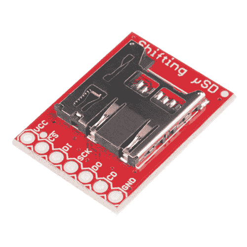

# 带电平转换器连接指南的 MicroSD 分线点

> 原文：<https://learn.sparkfun.com/tutorials/microsd-breakout-with-level-shifter-hookup-guide>

## 介绍

内置电平转换器的 [MicroSD 分线点可以在 5V 系统下轻松为您的项目添加大容量存储。](https://www.sparkfun.com/products/13743)

 

将**添加到您的[购物车](https://www.sparkfun.com/cart)中！**

### [SparkFun 电平转换 microSD 突破](https://www.sparkfun.com/products/13743)

[In stock](https://learn.sparkfun.com/static/bubbles/ "in stock") DEV-13743

SparkFun 电平转换 microSD 突破与 SparkFun microSD Transflash 突破非常相似，但包含了

$5.959[Favorited Favorite](# "Add to favorites") 27[Wish List](# "Add to wish list")** **### 所需材料

要遵循本连接指南，您需要以下内容:**