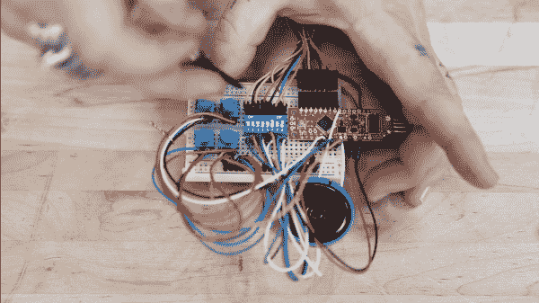

# BadgerHack: Synth 附加套件

> 原文：<https://learn.sparkfun.com/tutorials/badgerhack-synth-add-on-kit>

## 介绍

您在我们参加的各种活动中参观 SparkFun 展台时收到的 BadgerStick 可以被破解来执行各种各样的任务。它甚至可以制作音乐，就看你对音乐的定义了。

本教程将指导你把你的 BadgerStick 变成一个小的噪声电路，易于建立，易于编程，易于改变和制作自己的！

*It looks a little messy, but it sounds pretty... okay, it doesn't sound pretty either, but it is a lot of fun!*

遵循这个指南，你很快就会发出甜美的声音！

**NOTE:** The BadgerStick and RedStick are two different products. The BadgerStick (aka BadgerHack) originated as an event-only platform to aid SparkFun in teaching soldering and programming at events like Maker local Faires and SXSW. The [RedStick](https://www.sparkfun.com/products/13741) evolved from that concept and is the retail version of the BadgerStick, available for sale on SparkFun.com. All of the BadgerStick tutorials and expansion kits are compatible with both the BadgerStick and the RedStick, unless otherwise stated.

#### 所需材料

我们需要一些其他的组件来让这个东西工作: