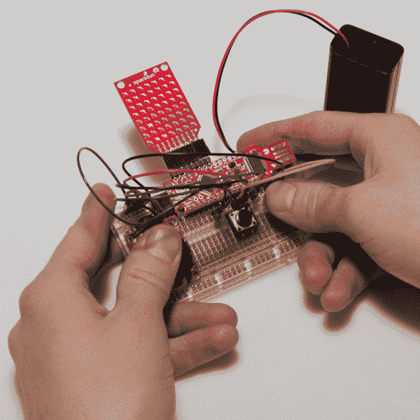

# BadgerHack:游戏附加套件

> 原文：<https://learn.sparkfun.com/tutorials/badgerhack-gaming-add-on-kit>

## 介绍

您在我们参加的各种活动中参观 SparkFun 展台时收到的 BadgerStick 可以被破解来执行各种各样的任务。显示屏可能很小(不要对在 8x7 单色显示屏上运行 [Doom](https://learn.sparkfun.com/tutorials/setting-up-raspbian-and-doom) 抱太大希望)。然而，我们可以用它来显示信息，甚至玩一些基本的游戏。

本教程将指导你把你的 BadgerStick 变成一个微型游戏系统。还记得游戏[突围](http://en.wikipedia.org/wiki/Breakout_%28video_game%29)吗？让我们在我们的 BadgerStick 上添加一个操纵杆和一些按钮来制作一个突破性的克隆！

**NOTE:** The BadgerStick and RedStick are two different products. The BadgerStick (aka BadgerHack) originated as an event-only platform to aid SparkFun in teaching soldering and programming at events like Maker local Faires and SXSW. The [RedStick](https://www.sparkfun.com/products/13741) evolved from that concept and is the retail version of the BadgerStick, available for sale on SparkFun.com. All of the BadgerStick tutorials and expansion kits are compatible with both the BadgerStick and the RedStick, unless otherwise stated.

#### 所需材料

我们还需要一些其他的组件来为 BadgerStick 制作一个简单的控制器。