# GPS 记录器屏蔽连接指南

> 原文：<https://learn.sparkfun.com/tutorials/gps-logger-shield-hookup-guide>

## 介绍

[SparkFun GPS Logger Shield](https://www.sparkfun.com/products/13750) 为您的 Arduino 配备了 GPS 模块、SD 存储卡插槽和所有其他外围设备，您将需要这些设备来将您的 Arduino 变成一个位置跟踪、速度监控、海拔观察的神奇记录器。

[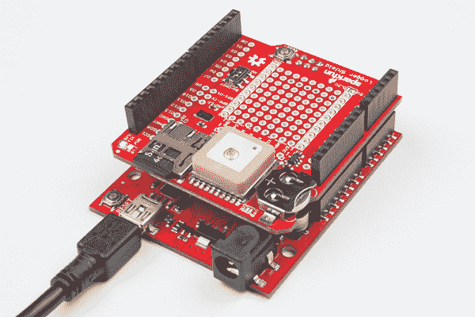](https://www.sparkfun.com/products/13750)

该盾牌基于一个 [GP3906-TLP GPS 模块](https://cdn.sparkfun.com/assets/learn_tutorials/4/6/8/GP3906-TLP_DataSheet_Rev_A01.pdf) -一个 66 通道 GPS 接收器，具有联发科 MT3339 架构和高达 10Hz 的更新速率。GPS 模块将通过一个简单的[串行 UART](https://learn.sparkfun.com/tutorials/serial-communication) 传输恒定的位置更新，然后你可以将其记录到一个 [SD 卡](https://www.sparkfun.com/products/11609)中，和/或用于其他位置或时间跟踪目的。

shield 上的一切都是高度可配置的:开关允许您在硬件或软件端口之间选择 GPS 模块的 UART 接口，SD 卡通过硬件 SPI 端口操作，这应该与大多数 Arduino 布局兼容，额外的原型空间应该允许您添加完成项目所需的最后几个组件。

### 本教程涵盖的内容

本教程旨在记录所有与 GPS Logger Shield 相关的东西，包括启动和运行它所需的硬件和软件。它分为以下几个部分:

*   **[硬件概述](https://learn.sparkfun.com/tutorials/gps-logger-shield-hookup-guide#hardware-overview)**-spark fun GPS Logger Shield 的原理图、布局和功能概述。
*   **[硬件设置](https://learn.sparkfun.com/tutorials/gps-logger-shield-hookup-guide#hardware-setup)** -组装 GPS 记录器防护罩的提示，以最大程度满足您的项目需求。
*   【Arduino 草图示例
    *   **[GPS 串行通过](https://learn.sparkfun.com/tutorials/gps-logger-shield-hookup-guide#example-sketch-gps-serial-passthrough)** -一个简单的草图，您可以使用它来验证您的 GPS 记录器屏蔽的功能，并了解 GP3906 GPS 模块产生何种数据。
    *   **[TinyGPS++串口流](https://learn.sparkfun.com/tutorials/gps-logger-shield-hookup-guide#example-sketch-tinygps-serial-streaming)**——使用 TinyGPS++ Arduino 库将 GPS 模块的 NMEA 字符串解析成纬度、经度、高度、速度等等。
    *   **[SD 卡 GPS 登录](https://learn.sparkfun.com/tutorials/gps-logger-shield-hookup-guide#example-sketch-sd-card-gps-logging)**——最后，我们将解析后的 GPS 数据插入一个 CSV 文件，保存到 SD 卡中。

### 建议的材料

要使 GPS 记录器屏蔽完全启动并运行，您需要一些额外的组件:

最重要的是，你需要一个 **Arduino 或兼容 Arduino 的开发板**。GPS 的串行和 SD SPI 端口应该与几乎所有 Arduino 尺寸的开发板兼容。这包括经典款，如 [Arduino Uno](https://www.sparkfun.com/products/11021) 和 [SparkFun RedBoard](https://www.sparkfun.com/products/12757) ，以及更新的型号，如 [Arduino Leonardo](https://www.sparkfun.com/products/11286) 、 [Genuino 101](https://www.sparkfun.com/products/13788) 和[spark fun samd 21 Dev Breakout](https://www.sparkfun.com/products/13672)。

[](https://www.sparkfun.com/products/11021) 

将**添加到您的[购物车](https://www.sparkfun.com/cart)中！**

### [Arduino Uno - R3](https://www.sparkfun.com/products/11021)

[In stock](https://learn.sparkfun.com/static/bubbles/ "in stock") DEV-11021

这是新的 Arduino Uno R3。除了以前主板的所有功能外，Uno 现在使用 ATmega16U2 代替…

$27.95138[Favorited Favorite](# "Add to favorites") 162[Wish List](# "Add to wish list")****[](https://www.sparkfun.com/products/13672) 

将**添加到您的[购物车](https://www.sparkfun.com/cart)中！**

### [SparkFun SAMD21 开发突破](https://www.sparkfun.com/products/13672)

[In stock](https://learn.sparkfun.com/static/bubbles/ "in stock") DEV-13672

如果您准备从旧的 8 位/16MHz 微控制器升级您的 Arduino 游戏，SparkFun SAMD21 Dev Breakout 是一个…

$29.507[Favorited Favorite](# "Add to favorites") 13[Wish List](# "Add to wish list")****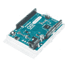 

### Arduino Leonardo 头球攻门

[Retired](https://learn.sparkfun.com/static/bubbles/ "Retired") DEV-11286

Arduino 是一个开源的物理计算平台，它基于一个简单的 i/o 板和一个开发环境

10 **Retired**[](https://www.sparkfun.com/products/retired/12757) 

### [spark fun red board——用 Arduino 编程 T3](https://www.sparkfun.com/products/retired/12757)

[Retired](https://learn.sparkfun.com/static/bubbles/ "Retired") DEV-12757

在 SparkFun，我们使用许多 Arduinos，我们一直在寻找最简单、最稳定的一款。每块板都有点不同…

127 **Retired**[Favorited Favorite](# "Add to favorites") 78[Wish List](# "Add to wish list")**** ****我们还**强烈推荐一款 [12mm 纽扣电池](https://www.sparkfun.com/products/337)** ，它适合 GPS Shield 的电池座。GP3906 GPS 模块的电池电源输入需要某种电压。如果您没有电池，请务必仔细阅读硬件概述的 [VBAT 章节](https://learn.sparkfun.com/tutorials/gps-logger-shield-hookup-guide#GP3906-VBAT)。

[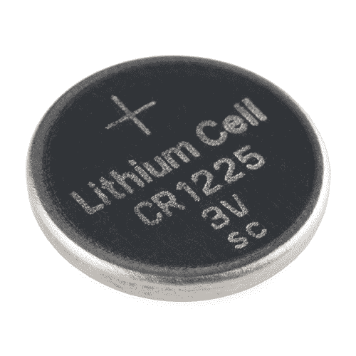](https://www.sparkfun.com/products/337) 

将**添加到您的[购物车](https://www.sparkfun.com/cart)中！**

### [纽扣电池- 12mm (CR1225)](https://www.sparkfun.com/products/337)

[In stock](https://learn.sparkfun.com/static/bubbles/ "in stock") PRT-00337

CR1225 锂金属 3V 12mm 47mAh 纽扣电池。微型传感器节点应用的完美小型电池。Thes…

$2.102[Favorited Favorite](# "Add to favorites") 14[Wish List](# "Add to wish list")** **你还需要**将一些接头**焊接到屏蔽罩中，以在屏蔽罩和 Arduino 之间建立牢固的机械和电气连接。我们推荐 [Arduino R3 可堆叠接头组件](https://www.sparkfun.com/products/11417)，但是一套[公接头](https://www.sparkfun.com/products/116)也可能适合您的需求。

[](https://www.sparkfun.com/products/116) 

将**添加到您的[购物车](https://www.sparkfun.com/cart)中！**

### [破开头球——直击](https://www.sparkfun.com/products/116)

[In stock](https://learn.sparkfun.com/static/bubbles/ "in stock") PRT-00116

一排标题-打破适应。40 个引脚，可切割成任何尺寸。用于定制 PCB 或通用定制接头。

$1.7520[Favorited Favorite](# "Add to favorites") 133[Wish List](# "Add to wish list")****[](https://www.sparkfun.com/products/115) 

将**添加到您的[购物车](https://www.sparkfun.com/cart)中！**

### [女标题](https://www.sparkfun.com/products/115)

[In stock](https://learn.sparkfun.com/static/bubbles/ "in stock") PRT-00115

单排 40 孔，内螺纹接头。可以用一把钢丝钳切割成合适的尺寸。标准 0.1 英寸间距。我们广泛使用它们…

$1.758[Favorited Favorite](# "Add to favorites") 71[Wish List](# "Add to wish list")****[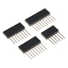](https://www.sparkfun.com/products/11417) 

将**添加到您的[购物车](https://www.sparkfun.com/cart)中！**

### [Arduino 可堆叠接头套件- R3](https://www.sparkfun.com/products/11417)

[In stock](https://learn.sparkfun.com/static/bubbles/ "in stock") PRT-11417

这些接头适用于 Arduino Uno R3、Leonardo 和新的 Arduino 板。他们是完美的 h…

$1.7512[Favorited Favorite](# "Add to favorites") 68[Wish List](# "Add to wish list")****[](https://www.sparkfun.com/products/retired/11609) 

### [带适配器的 MicroSD 卡——8GB](https://www.sparkfun.com/products/retired/11609)

[Retired](https://learn.sparkfun.com/static/bubbles/ "Retired") COM-11609

这是一个 8g 的 microSD 存储卡。它非常适合大规模数据记录，而不会占用太多空间。这些 microSD 卡…

2 **Retired**[Favorited Favorite](# "Add to favorites") 7[Wish List](# "Add to wish list")****** ******最后，如果你打算将 GPS 数据记录到 SD 卡上，你可能想要一个 [SD 卡和 SD 适配器](https://www.sparkfun.com/products/11609)。Arduino SD 库应该支持大多数用 FAT16 或 FAT32 文件系统格式化的 SD 卡。

### 推荐阅读

这是一个初级教程 GPS Logger Shield 是一个对初学者友好的产品——但是在继续之前，有几个概念你应该熟悉。如果这些主题听起来不熟悉，请考虑在继续之前阅读这些教程。

*   GPS 基础知识 -这个教程是一个关于 GPS 奇迹的很好的入门。了解我们如何通过收听(至少)四颗卫星发送的时间戳和空中位置来找到我们在地球上的位置。
*   [串行通信](https://learn.sparkfun.com/tutorials/serial-communication)-gp 3906 通过简单的串行 UART 进行通信。本教程将帮助您熟悉串行相关概念，如 RX、TX 和波特率。
*   如何焊接:通孔焊接 -如果你以前从未焊接过，现在是开始的好时机，这是一个很好的学习教程。
*   [安装 Arduino 库](https://learn.sparkfun.com/tutorials/installing-an-arduino-library) -我们将使用两个出色的 Arduino 库将 GPS 数据记录到 SD 卡中。

[](https://learn.sparkfun.com/tutorials/how-to-solder-through-hole-soldering) [### 如何焊接:通孔焊接](https://learn.sparkfun.com/tutorials/how-to-solder-through-hole-soldering) This tutorial covers everything you need to know about through-hole soldering.[Favorited Favorite](# "Add to favorites") 70[](https://learn.sparkfun.com/tutorials/serial-communication) [### 串行通信](https://learn.sparkfun.com/tutorials/serial-communication) Asynchronous serial communication concepts: packets, signal levels, baud rates, UARTs and more 100[](https://learn.sparkfun.com/tutorials/gps-basics) [### GPS 基础知识](https://learn.sparkfun.com/tutorials/gps-basics) The Global Positioning System (GPS) is an engineering marvel that we all have access to for a relatively low cost and no subscription fee. With the correct hardware and minimal effort, you can determine your position and time almost anywhere on the globe.[Favorited Favorite](# "Add to favorites") 31[](https://learn.sparkfun.com/tutorials/installing-an-arduino-library) [### 安装 Arduino 库](https://learn.sparkfun.com/tutorials/installing-an-arduino-library) How do I install a custom Arduino library? It's easy! This tutorial will go over how to install an Arduino library using the Arduino Library Manager. For libraries not linked with the Arduino IDE, we will also go over manually installing an Arduino library.[Favorited Favorite](# "Add to favorites") 22

## 硬件概述

要快速了解 GPS 记录器防护罩的组件和功能，请参考下图:

[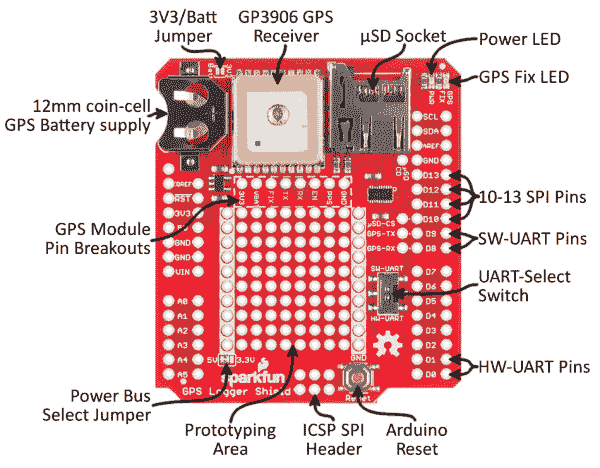](https://cdn.sparkfun.com/assets/learn_tutorials/4/6/8/hardware-annotated-gps-shield-top.jpg)

本节的其余部分将深入探讨该屏蔽的一些更关键的元件，包括电源要求以及 UART 和 SPI 接口配置。

### 给 GPS 记录器防护罩供电

GPS 记录器屏蔽的主电源取自 **Arduino 5V** 插头引脚。该电压被下调至 3.3V，同时提供给 GPS 模块和 SD 卡。

这两个元件的平均功耗约为 30mA，但偶尔会达到 100mA 以上。

#### 逻辑电平转换

该屏蔽包括一个 [TXB0108 8 通道电平转换器](https://www.sparkfun.com/products/11771)，它在 Arduino 和 3.3V GPS UART 和 SD SPI 信号之间转换电压电平。不管你的 Arduino 是在 5V 还是 3.3V 下运行，你都不必担心在两个组件之间转换电压。

Arduino 端逻辑电平电压由 **IOREF 引脚**设置，大多数 Arduino 开发板将其连接至 5V 或 3.3V。

**⚡如果你的 Arduino 板没有 IOREF 引脚**，或者该引脚上没有电压，你需要手动设置 IOREF 电压。该屏蔽包括电路板背面的跳线，标记为 **IOREF-SEL** ，您可以使用它将 IOREF 电压设置为 3.3V 或 5V。

[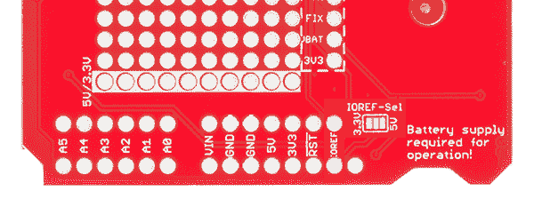](https://cdn.sparkfun.com/assets/learn_tutorials/4/6/8/hardware-ioref-jumper-03.png)

如果您的 Arduino 板没有 IOREF 引脚，请设置此跳线以匹配您想要的逻辑电平。

#### GP3906 电池电源(VBAT)

GP3906 是一个很棒的小模块，但它有一个大怪癖:VBAT 引脚上需要 2.0-4.3V 之间的**电源电压**。如果你有一个[12 毫米硬币电池](https://www.sparkfun.com/products/337)，提供电压就像把它推进电池插座一样简单。当你插入电池时，确保你把它插入 ***+* 面朝上**。

[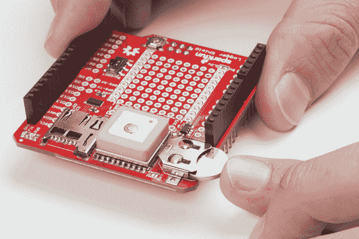](https://cdn.sparkfun.com/assets/learn_tutorials/4/6/8/gps-battery-plug.jpg)

如果你手边没有电池，有一些变通办法。你可以拿一个烙铁，**短接电池插座旁边的 3V3 电池跳线**。

[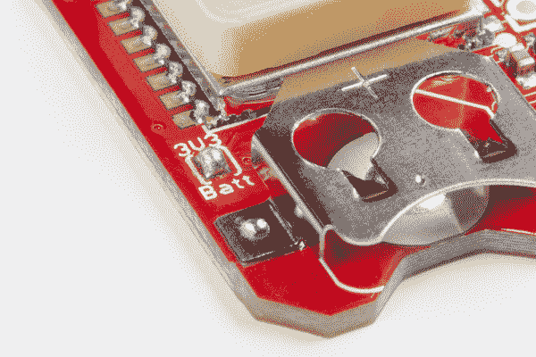](https://cdn.sparkfun.com/assets/learn_tutorials/4/6/8/gps-battery-jumper.jpg)*If you don't have a 12mm battery, shorting the 3V3/Batt jumper will at least keep your GPS module functional.*

或者您可以将断开的 **VBAT 引脚**连接到 2.0-4.3V 之间的任何电压源。

**⚡ VBAT Supply Required:** The GP3906 requires some form of voltage supply on its VBAT pin, whether that be an actual battery, or simply the 3.3V regulator output. If your the GPS LED isn't at least blinking (or illuminated) when the shield is powered up, that may indicate lack of supply to the VBAT port (or a dead battery).

为 GP3906 提供备用电池电源可确保其实时时钟(RTC)继续运行，即使板的其余部分断电。这使得该模块在最初通电时可以获得更快的 GPS 定位。它并不消耗太多的功率——我们测得约为 5-6a——所以一块 12 毫米的纽扣电池可以让电路板“运行”(在睡眠模式下)大约一年。

### GPS 引脚转接

大多数 GPS 输入、输出和电源引脚都连接到 GPS 记录器屏蔽上的*某处*，但它们也都连接到这个 8 引脚接头。

[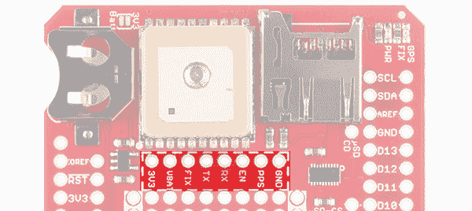](https://cdn.sparkfun.com/assets/learn_tutorials/4/6/8/hardware-gps-breakout.jpg)

下面是每个引脚及其功能的简要概述:

| Pin Label | 进/出 | 电路板连接 | Pin 描述 |
| GND | 在…里 | 地面 | GPS 模块接地(0V 参考电压) |
| 再附言 | 在外 |  | 1 个每秒脉冲时间基准 |
| 在中 | 在…里 |  | 高电平有效芯片使能–拉低以复位或关闭 |
| 药方(prescription 的缩写) | 在…里 | Arduino TX/D9 | 串行数据输入 |
| 谢谢 | 在外 | Arduino RX/D8 | 串行数据输出 |
| 固定 | 在外 | GPS 定位 LED | GPS 定位指示灯–在定位前闪烁，一旦定位有效，则亮起 |
| VBAT | 在…里 | 12 毫米硬币电池插座 | 备用电源–保持 RTC 运行(2.0-4.3V 输入范围) |
| 3V3 | 在…里 | 板载 3.3V 稳压器 | 3.3V 电源输入 |

**PPS** 和 **EN** 引脚保持未连接。如果您需要每秒脉冲信号或对 GPS 模块操作的额外控制，您可以自由地将它们连接到任何 Arduino 引脚。

### 选择串行端口

GPS 模块通过简单的 UART(串行)接口进行通信。**UART -选择开关**允许你在 Arduino 的硬件 UART-在管脚 D0 和 D1 上-或者在管脚 D8 和 D9 上的[软件串行](https://www.arduino.cc/en/Reference/SoftwareSerial)端口之间切换接口。

[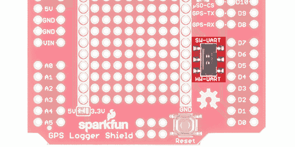](https://cdn.sparkfun.com/assets/learn_tutorials/4/6/8/hardware-uart-switch.jpg)

如果您需要参考，下表显示了 GPS 模块和 Arduino UART 之间的映射:

| GPS Pin | Arduino 软件 UART 引脚 | Arduino 硬件 UART 引脚 |
| 药方(prescription 的缩写) | nine | 1 (TX) |
| 谢谢 | eight | 0(接收) |

如果您使用 Arduino Uno 或任何带有一个预先占用的硬件 UART 的开发板，您可能会被迫使用软件串行端口。幸运的是，GPS 模块的波特率默认为缓慢稳定的 **9600 bps** ，这对软件 Serial 来说应该没有问题。

如果您需要移动软件串行端口引脚，可以通过**切割引脚 GPS-RX 和 D8 和/或 GPS-TX 和 D9 之间的焊接跳线**将它们自定义路由至任何其他引脚。

[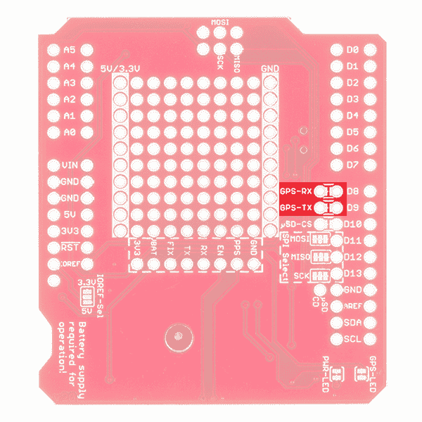](https://cdn.sparkfun.com/assets/learn_tutorials/4/6/8/GPS_SoftwareSerialJumpers2.jpg)

一旦这些跳线被切断，您可以将 GPS-RX 和 GPS-TX 引脚连接到您想要的任何其他引脚。

### 选择 SD SPI 引脚

在旧的 Arduino 板上，找到 SPI 端口非常简单——它在 10-13 号管脚上，分别映射到 CS、MOSI、MISO 和 SCLK。然而，在最近发布的 Arduino 主板上，这些引脚很可能只出现在*6 引脚 2x3 SPI 接头上。GPS Logger Shield 将 SD SPI 引脚映射到这两个接头，以便支持尽可能多的开发板。*

三个三路焊接跳线可用于修改哪些 Arduino 引脚连接到 SD 卡的 SPI I/O。

[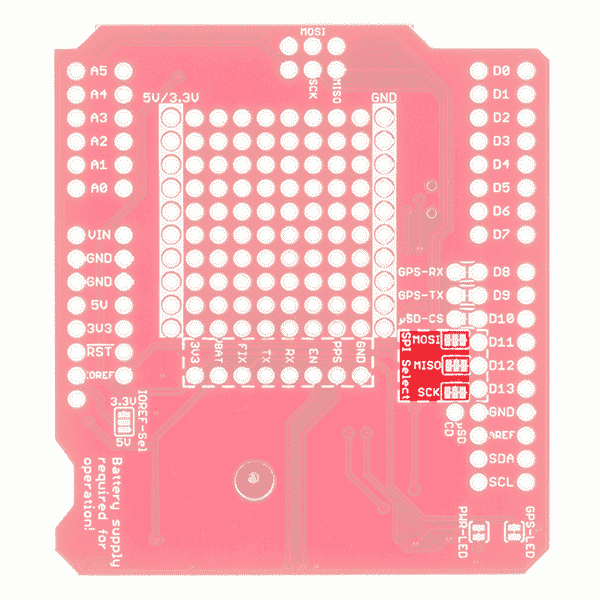](https://cdn.sparkfun.com/assets/learn_tutorials/4/6/8/GPS_SPIJumpers.jpg)

这些跳线的中间焊盘将信号传送到 SD 卡或从 sd 卡接收信号。电路板内侧的焊盘将信号传输至 SPI 接头，外侧的焊盘将信号传输至引脚 10-13。

**将 SPI 映射到引脚 10-13 的电路板**包括 Arduino Uno、RedBoard、Arduino Pro 和大多数基于 ATmega328P 的电路板。如果你使用这些板中的任何一个，不接触跳线应该是安全的(因为它们也可能在 Arduino 上短路在一起)。

**仅*将 SPI 映射到 2x3 SPI 头的板***包括 Arduino Leonardo(和其他大多数基于 ATmega32U4 的板)、Arduino Due 和 Arduino Zero(和大多数基于 ATSAMD21 的板)。在这些电路板上，您需要切断连接中间焊盘与 D11、D12 和 D13 侧焊盘的焊接跳线。连接到 D10 引脚的 SD_CS 可以在任何引脚上定义，因此无需修改。

查看下文，了解有关**标清 SPI 跳线**的更多信息。

### 电源和 GPS 固定状态指示灯

屏蔽罩角上的这对 led 是初始故障诊断的便利工具。**红色 PWR** LED 连接到屏蔽板上 3.3V 调节器的输出端。如果防护罩通电，这个 LED 灯应该亮着。

**蓝色 GPS 定位** LED 连接到 GP3906 的“3D_FIX”引脚。它可用于识别 GPS 模块是否具有正确的定位。当你第一次给屏蔽加电时，LED 应该闪烁——表明它正在试图找到一个解决办法。一旦 LED 稳定亮起，您就可以放心，您的 GPS 模块可以很好地定位您的位置。

[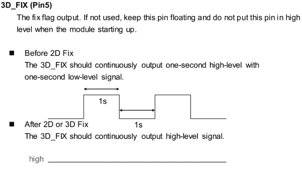](https://cdn.sparkfun.com/assets/learn_tutorials/4/6/8/gps-fix-led-datasheet.png)*The GP3906's 3D_Fix pin operation. The LED will be on when the GPS fix is valid, and blinking at 1/2 Hz otherwise.*

这两个 led 下方都有**焊接跳线**，如果您发现需要禁用其中任何一个。要将焊盘从电路中移除，只需在焊盘之间快速切片。如果您在低功耗应用中使用 GPS Logger Shield，这可能会很有用，在这种应用中，即使 led 消耗几毫安的电流也意味着项目的电池寿命会减少几个月。

## 硬件设置

GPS 记录器屏蔽的组装主要归结为将*某物*焊接到所有 6、8 和 10 针 Arduino 接头上。对于这项工作，我们通常推荐 [Arduino R3 可堆叠接头](https://www.sparkfun.com/products/11417)，但是[公接头](https://www.sparkfun.com/products/116)也可以工作——只要这是屏蔽堆叠中的顶部板。

[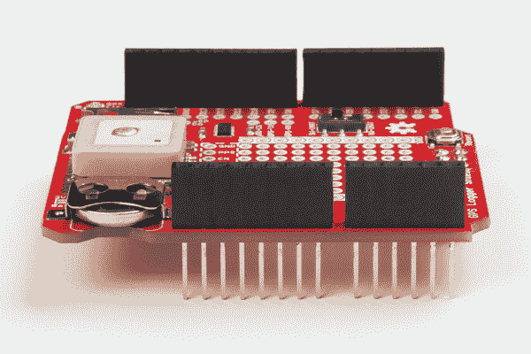](https://cdn.sparkfun.com/assets/learn_tutorials/4/6/8/gps-headers-soldered.jpg)

如果您的应用需要使用 **6 引脚、2x3 SPI 接头**，您可能还想将[母接头](https://www.sparkfun.com/products/115)焊接到这些引脚上(确保它们指向下方，并且容易插入您的 Arduino 公 SPI 引脚)。

如果你以前从未焊接过 Arduino 屏蔽，请查看我们的 [Arduino 屏蔽组装教程](https://learn.sparkfun.com/tutorials/arduino-shields-v2#installing-headers-preparation)以获得一些提示。

### 飞行前清单

在您获得 GPS 屏蔽的许可之前，请确保您最后一次仔细检查这些常见的陷阱:

#### 电池(VBAT)电源

确保有可靠的电源为 GPS 模块的 VBAT 引脚供电。如果你有一个闪亮的，新的[12 毫米硬币电池](https://www.sparkfun.com/products/337)插入，那就完美了。否则，确保你已经短接了 3.3V/VBAT 跳线，或者正在向 GPS 模块的 *VBAT* 分线点提供一些东西。

[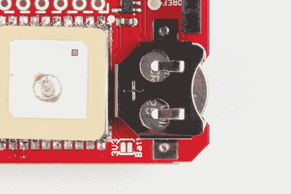](https://cdn.sparkfun.com/assets/learn_tutorials/4/6/8/gps-battery-in.jpg)

#### 选择 UART

确保 UART 选择开关指向您的首选 UART。如果你使用的是 **Uno、Redboard 或任何其他基于 ATmega328P 的 Arduino** ，假设硬件 UART 用于编程和串行调试，你很可能需要将开关指向 **SW-UART** 。

If you're using an ATmega328-based Arduino, no matter what your sketch ends up doing, **the switch must be in the SW-UART position during any programming upload**.

如果您使用的是 **Leonardo** (基于 ATmega32U4 的板) **Zero** (基于 ATSAMD21 的板)，或任何其他在 0/1 引脚上有专用和免费硬件 UART 的 Arduino，我们建议将开关留在 **HW-UART** 位置。

#### 标清 SPI 跳线

计划将数据记录到 SD 卡中？确保 SPI 跳线设置正确。如果你使用的是 Uno、Redboard 或任何其他基于 ATmega328P 的 Arduino，你或许可以不动跳线。无论如何，SPI 都应连接到引脚 10-13 和 SPI 接头。

如果你使用的是 **Leonardo** (基于 ATmega32U4 的板) **Zero** (基于 ATSAMD21 的板)，或者任何其他不会中断 SPI 信号到引脚 10-13 的 Arduino，你会想要**切断中间焊盘和 D11-D13 引脚之间的三个 SPI 选择跳线**。这将释放这些引脚，用于项目中的其他用途。连接到 D10 引脚的 SD_CS 可以在任何引脚上定义，因此无需修改。

[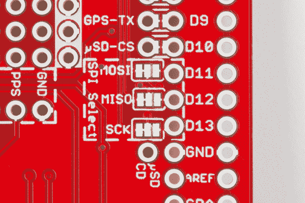](https://cdn.sparkfun.com/assets/learn_tutorials/4/6/8/gps-spi-headers-cut.jpg)*Looking closely, you'll see traces cut on all three SPI lines between the middle pad and D11, D12, and D13\. That disconnects the µSD lines from those pins -- leaving them connected to the SPI header.*

如果您依赖 2x3 针 ICSP 接头的 SPI 端口，不要忘记将接头焊接到 SPI 端口！

## 其他微控制器上的软件串行和 SPI

### 软件序列

演示代码最初是为 Arduino Uno 上的 ATmega328P 设计的。如果你是配合 ATmega2560(即 Arduino Mega 2560)或 ATmega32U4(即 Arduino Leonardo、Pro Micro 5V/16MHz、Pro Micro 3.3V/8Mhz、FioV3 等)使用。)，您需要重新配置软件串行引脚定义并调整连接。并非所有引脚都支持串行 Rx 引脚的更改中断，具体取决于所使用的 Arduino 微控制器。您将需要重新定义引脚定义并重新布线连接。

有关限制的更多信息，请尝试查看 Arduino 参考语言中的软件串行库。

[Arduino Software Serial Library](https://www.arduino.cc/en/Reference/SoftwareSerial)

#### 软件串行引脚的重新定义

要在 Arduino Mega 2560 上使用 GPS logger shield，您只需调整代码中的软件串行 pin 定义，代码如下所示:

```
language:c
#define ARDUINO_GPS_RX 9 // Arduino RX pin connected to GPS TX
#define ARDUINO_GPS_TX 8 // Arduino TX pin connected to GPS RX 
```

让我们分别使用模拟引脚 A9 和 A8 来更改软件串行引脚。

```
language:c
#define ARDUINO_GPS_RX A9 // Arduino RX pin connected to GPS TX
#define ARDUINO_GPS_TX A8 // Arduino TX pin connected to GPS RX 
```

#### 软件串行引脚的重新路由

一旦你调整了代码，确保重新连接。使用[业余爱好刀](https://www.sparkfun.com/products/9200)切割电镀通孔之间的轨迹。走线上方有一个红色阻焊膜，确保走线被完全切断。

[](https://cdn.sparkfun.com/assets/learn_tutorials/4/6/8/GPS_SoftwareSerialJumpers2.jpg)

切割走线后，将接头引脚或电线焊接到电镀通孔。为了方便在不同开发板之间切换，增加了母接头。

[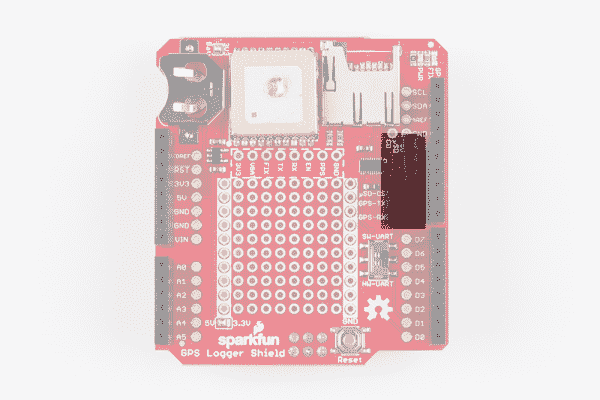](https://cdn.sparkfun.com/assets/learn_tutorials/4/6/8/GPSLoggerShieldAltSerialPins_1.png)

焊接完成后，两条[公对公跳线](https://www.sparkfun.com/products/8431)被添加到最靠近 GPS-Rx 和 GPS-Tx 的通孔引脚。重新布线后，GPS-Tx 被重新路由至引脚 A9，GPS-Rx 被重新路由至引脚 A8。虽然不是必需的，但在数据记录示例中，添加黄色跳线是为了方便地将 SPI 的 CS 引脚重新路由到另一个 I/O。

[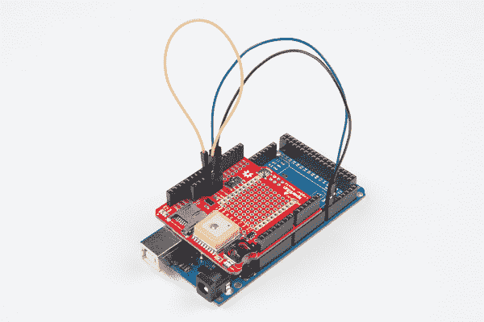](https://cdn.sparkfun.com/assets/learn_tutorials/4/6/8/SoftwareSerial_Reroutedwith_JumperWires.jpg)

### 精力

演示代码最初是为 Arduino Uno 上的 ATmega328P 设计的。如果您使用的是*CSV _ Logger _ tinygpsplus . ino*日志示例，那么您只需要担心 SPI 引脚的调整。就像软件串行一样，您需要重新路由连接。

有关这些限制的更多信息，请参考 SPI 库的参考语言。

[Arduino SPI Library](https://www.arduino.cc/en/Reference/SPI)

#### SPI 引脚的重新路由

要在 Arduino Mega 2560 上使用 GPS Logger Shield，您只需重新布线 SPI 引脚。用一把业余爱好刀，在 MOSI、味噌和 SCK 的中间和右边垫子之间剪下痕迹。

[](https://cdn.sparkfun.com/assets/learn_tutorials/4/6/8/gps-spi-headers-cut.jpg)*Looking closely, you'll see traces cut on all three SPI lines between the middle pad and D11, D12, and D13\. That disconnects the µSD lines from those pins -- leaving them connected to the SPI header.*

切割后，您可以选择将一个 2x3 母接头或两个 1x3 可堆叠接头焊接到 ICSP 引脚上。

[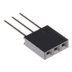](https://www.sparkfun.com/products/13875) 

将**添加到您的[购物车](https://www.sparkfun.com/cart)中！**

### [【可堆叠接头- 3 针(母，0.1”)](https://www.sparkfun.com/products/13875)

[In stock](https://learn.sparkfun.com/static/bubbles/ "in stock") PRT-13875

这是一个简单的 3 针阴性 PTH 接头。该割台的配置非常适合与[MyoWare …配合使用

$0.75[Favorited Favorite](# "Add to favorites") 8[Wish List](# "Add to wish list")****[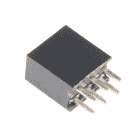](https://www.sparkfun.com/products/retired/13010) 

### [表头- 2x3(母，0.1”)](https://www.sparkfun.com/products/retired/13010)

[Retired](https://learn.sparkfun.com/static/bubbles/ "Retired") PRT-13010

这是一个简单的 2x3 母 PTH 接头。此接头是 ISP 连接器的常见配置。每个引脚都有一个空间…

**Retired**[Favorited Favorite](# "Add to favorites") 11[Wish List](# "Add to wish list")** **确保从屏蔽的顶部焊接，使母头引脚面朝下朝向 Arduino 的 ICSP 引脚。

[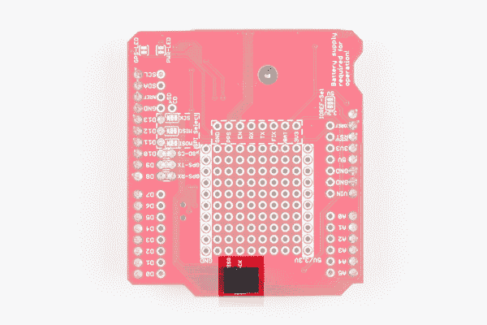](https://cdn.sparkfun.com/assets/learn_tutorials/4/6/8/GPSLoggerICSPHeader_1.png)

一旦焊接了接头，将其堆叠在 Arduino Mega 2560 上，并重新路由软件串行引脚。CS 引脚可以被切断并重新路由到微控制器上的另一个引脚。然而，引脚 10 上的默认走线仍然有效。

[](https://cdn.sparkfun.com/assets/learn_tutorials/4/6/8/SoftwareSerial_Reroutedwith_JumperWires.jpg)

## 示例草图:GPS 串行传递

现在您的硬件已经设置好了，我们有三段示例代码来让您体验 GPS Logger Shield 的功能。第一个例子并不十分有用，但至少可以确保一切正常。此外，它将向您展示 NMEA GPS 字符串的原始丑陋，让您更加欣赏像 T2 TinyGPS T3 这样的伟大库。

这个例子不需要任何额外的库。只需将 shield 插入 Arduino 并上传示例代码。根据您使用的 Arduino 和/或串行端口，我们有几个例子。

**注意:**此示例假设您在桌面上使用的是最新版本的 Arduino IDE。如果这是你第一次使用 Arduino，请回顾我们关于[安装 Arduino IDE 的教程。](https://learn.sparkfun.com/tutorials/installing-arduino-ide)

If you have not previously installed an Arduino library, please check out our [installation guide.](https://learn.sparkfun.com/tutorials/installing-an-arduino-library)

### 软件串口示例

如果您使用的是 Arduino Uno、Redboard 或任何其他基于 ATmega328P 的 Arduino，并且 UART-select 开关处于 **SW-UART** 位置，请将这段示例代码上传到您的 Arduino:

```
language:c
    /******************************************************************************
Basic_Passthrough_Software.ino
Basic Software Serial GPS Passthrough
By Jim Lindblom @ SparkFun Electronics
February 9, 2016
https://github.com/sparkfun/GPS_Shield

This example uses SoftwareSerial to communicate with the GPS module on
pins 8 and 9\. SoftwareSerial should work on most Arduinos, but it's a
necessity on Arduino Uno's, RedBoard's and any other Arduino
based around an ATmega328P.

After uploading the code, open your serial monitor, set it to 9600 baud, and
watch the GPS module's NMEA strings begin to flow by. See if you can pick
out the latitude and longitude.

Resources:
SoftwareSerial Library (included with Arduino)

Development/hardware environment specifics:
Arduino IDE 1.6.7
GPS Logger Shield v2.0 - Make sure the UART switch is set to SW-UART
Arduino Uno, RedBoard, Pro, etc.
******************************************************************************/

#include <SoftwareSerial.h> // Include the SoftwareSerial library
#define ARDUINO_GPS_RX 9 // Arduino RX pin connected to GPS TX
#define ARDUINO_GPS_TX 8 // Arduino TX pin connected to GPS RX
#define GPS_BAUD_RATE 9600 // The GPS Shield module defaults to 9600 baud
// Create a SoftwareSerial object called gps:
SoftwareSerial gpsPort(ARDUINO_GPS_TX, ARDUINO_GPS_RX);

// We'll also define a more descriptive moniker for the Serial Monitor port.
// This is the hardware serial port on pins 0/1.
#define SerialMonitor Serial

void setup() 
{
  gpsPort.begin(GPS_BAUD_RATE);
  SerialMonitor.begin(9600);
}

void loop() 
{
  if (gpsPort.available()) // If GPS data is available
    SerialMonitor.write(gpsPort.read()); // Read it and print to SerialMonitor
  if (SerialMonitor.available()) // If SerialMonitor data is available
    gpsPort.write(SerialMonitor.read()); // Read it and send to GPS
} 
```

将上述代码复制并粘贴到您的 Arduino IDE 中。您也可以从我们的 GitHub 资源库下载所有示例草图。

[Download GPS Shield Examples](https://github.com/sparkfun/GPS_Shield/archive/master.zip)

本例使用 [SoftwareSerial](https://www.arduino.cc/en/Reference/SoftwareSerial) 库与 GPS 模块通信，并将硬件串口留给串口监视器调试。

### 硬件串行端口示例

如果您使用 Arduino Leonardo、Arduino Due、Arduino Zero 或任何其他在引脚 0/1 上有空闲 UART 的 Arduino，请将 UART 选择开关设置为 **HW-UART** ，并上传以下示例:

```
language:c
    /******************************************************************************
Basic_Passthrough_Hardware.ino
Basic Hardware Serial GPS Passthrough
By Jim Lindblom @ SparkFun Electronics
February 9, 2016
https://github.com/sparkfun/GPS_Shield

This example uses an Arduino's hardware serial port -- on pins 0 and 1 -- to
communicate with the GPS module. 

Hardware serial should work on any Arduino's with a free hardware serial 
UART on pins 0/1\. That includes Arduino Leonardo, Zero, Due, and SparkFun's
SAMD21 Dev Board.

After uploading the code, open your serial monitor, set it to 9600 baud, and
watch the GPS module's NMEA strings begin to flow by. See if you can pick
out the latitude and longitude.

Development/hardware environment specifics:
Arduino IDE 1.6.7
GPS Logger Shield v2.0 - Make sure the UART switch is set to HW-UART
Arduino Leonardo, Arduino Zero, Arduino Due, SparkFun SAMD21 Dev Board, etc
******************************************************************************/

#define GPS_BAUD_RATE 9600 // The GPS Shield module defaults to 9600 baud

// Define the serial monitor port. On the Leonardo this is 'Serial'
//  but on other boards this may be 'SerialUSB'
#define SerialMonitor Serial // e.g. Arduino Leonardo
// Define the harware serial port on pins 0/1\. On the Leonardo this is 'Serial1'
//  but on other boards this may be 'Serial'
#define gpsPort Serial1 // e.g. Arduino Leonardo
// See https://www.arduino.cc/en/Reference/Serial to find out which Serial ports
//  you should use in the defines above.

void setup() 
{
  SerialMonitor.begin(9600); // Initialize the serial monitor port at 9600 baud
  gpsPort.begin(GPS_BAUD_RATE); // The GPS module's default baud is 9600
}

void loop() 
{
  if (gpsPort.available()) // If GPS data is available
    SerialMonitor.write(gpsPort.read()); // Send it to the serial monitor
  if (SerialMonitor.available()) // If data is sent to the serial monitor
    gpsPort.write(SerialMonitor.read()); // send it to the GPS module
} 
```

你*可能*必须修改代码顶部的一个或两个串口`#defines`。有关串行端口的更多信息，请参考开发板的数据手册或产品信息页面。

### 使用串行直通草图

一旦你上传了草图，打开你的[串行监视器](https://learn.sparkfun.com/tutorials/terminal-basics)并将波特率设置为 9600。你应该立即开始看到 GPS NMEA 数据开始以 1Hz 的速率流过。

例如，一组字符串可能看起来像:

```
$GPRMC,235316.000,A,4003.9040,N,10512.5792,W,0.09,144.75,141112,,*19
$GPGGA,235317.000,4003.9039,N,10512.5793,W,1,08,1.6,1577.9,M,-20.7,M,,0000*5F
$GPGSA,A,3,22,18,21,06,03,09,24,15,,,,,2.5,1.6,1.9*3E 
```

如果您在串行监视器中看不到任何内容，请确保 UART 选择开关处于正确的位置。还要仔细检查蓝色的“GPS 定位”LED 是否至少在闪烁。如果不是，模块可能没有通电。别忘了供应 VBAT！

如果您仍然运气不佳，请联系我们的[技术支持团队](https://www.sparkfun.com/technical_assistance)。

* * *

[NMEA 字符串](https://en.wikipedia.org/wiki/NMEA_0183)是几乎所有 GPS 接收机产生的标准消息格式。它们可以传递各种信息，包括时间、纬度、经度、高度和可见卫星的数量，但除非你是一个速度惊人的解析者，否则这些句子基本上没有任何意义。幸运的是，Arduino 可以读取这些字符串，为您解析它们，并为您提供更多人类可读的数据。

## 示例草图:TinyGPS 串行流

我们最喜欢的几个 GPS 解析 Arduino 库是 [TinyGPS](http://arduiniana.org/libraries/tinygps/) 和 [TinyGPS++](http://arduiniana.org/libraries/tinygpsplus/) 。这些库简化了解析过多 NMEA 字符串的任务，只留下我们关心的少量数据。

您需要在 Arduino IDE 中安装这些库。请访问上面的链接下载它们。参考我们的[安装 Arduino 库](https://learn.sparkfun.com/tutorials/installing-an-arduino-library)教程，获得你可能需要的任何额外的库安装帮助。

### TinyGPS++示例

这里有一个简单的例子，它使用 TinyGPS++库来解析 NMEA 字符串中的位置、高度、时间和日期。将下面的代码复制并粘贴到您的 Arduino IDE 中，然后上传到您的主板。

```
language:c
/******************************************************************************
  TinyGPSPlus_GPS_Shield.ino
  TinyGPS++ Library Example for the SparkFun GPS Logger Shield
  By Jim Lindblom @ SparkFun Electronics
  February 9, 2016
  https://github.com/sparkfun/GPS_Shield

  This example uses SoftwareSerial to communicate with the GPS module on
  pins 8 and 9\. It uses the TinyGPS++ library to parse the NMEA strings sent
  by the GPS module, and prints interesting GPS information to the serial
  monitor.

  After uploading the code, open your serial monitor, set it to 9600 baud, and
  watch for latitude, longitude, altitude, course, speed, date, time, and the
  number of visible satellites.

  Resources:
  TinyGPS++ Library  - https://github.com/mikalhart/TinyGPSPlus/releases
  SoftwareSerial Library

  Development/hardware environment specifics:
  Arduino IDE 1.6.7
  GPS Logger Shield v2.0 - Make sure the UART switch is set to SW-UART
  Arduino Uno, RedBoard, Pro, etc.
******************************************************************************/

#include <TinyGPS++.h> // Include the TinyGPS++ library
TinyGPSPlus tinyGPS; // Create a TinyGPSPlus object

#define GPS_BAUD 9600 // GPS module baud rate. GP3906 defaults to 9600.

// If you're using an Arduino Uno, RedBoard, or any board that uses the
// 0/1 UART for programming/Serial monitor-ing, use SoftwareSerial:
#include <SoftwareSerial.h>
#define ARDUINO_GPS_RX 9 // GPS TX, Arduino RX pin
#define ARDUINO_GPS_TX 8 // GPS RX, Arduino TX pin
SoftwareSerial ssGPS(ARDUINO_GPS_TX, ARDUINO_GPS_RX); // Create a SoftwareSerial

// Set gpsPort to either ssGPS if using SoftwareSerial or Serial1 if using an
// Arduino with a dedicated hardware serial port
#define gpsPort ssGPS  // Alternatively, use Serial1 on the Leonardo

// Define the serial monitor port. On the Uno, and Leonardo this is 'Serial'
//  on other boards this may be 'SerialUSB'
#define SerialMonitor Serial

void setup()
{
  SerialMonitor.begin(9600);
  gpsPort.begin(GPS_BAUD);
}

void loop()
{
  // print position, altitude, speed, time/date, and satellites:
  printGPSInfo();

  // "Smart delay" looks for GPS data while the Arduino's not doing anything else
  smartDelay(1000); 
}

void printGPSInfo()
{
  // Print latitude, longitude, altitude in feet, course, speed, date, time,
  // and the number of visible satellites.
  SerialMonitor.print("Lat: "); SerialMonitor.println(tinyGPS.location.lat(), 6);
  SerialMonitor.print("Long: "); SerialMonitor.println(tinyGPS.location.lng(), 6);
  SerialMonitor.print("Alt: "); SerialMonitor.println(tinyGPS.altitude.feet());
  SerialMonitor.print("Course: "); SerialMonitor.println(tinyGPS.course.deg());
  SerialMonitor.print("Speed: "); SerialMonitor.println(tinyGPS.speed.mph());
  SerialMonitor.print("Date: "); printDate();
  SerialMonitor.print("Time: "); printTime();
  SerialMonitor.print("Sats: "); SerialMonitor.println(tinyGPS.satellites.value());
  SerialMonitor.println();
}

// This custom version of delay() ensures that the tinyGPS object
// is being "fed". From the TinyGPS++ examples.
static void smartDelay(unsigned long ms)
{
  unsigned long start = millis();
  do
  {
    // If data has come in from the GPS module
    while (gpsPort.available())
      tinyGPS.encode(gpsPort.read()); // Send it to the encode function
    // tinyGPS.encode(char) continues to "load" the tinGPS object with new
    // data coming in from the GPS module. As full NMEA strings begin to come in
    // the tinyGPS library will be able to start parsing them for pertinent info
  } while (millis() - start < ms);
}

// printDate() formats the date into dd/mm/yy.
void printDate()
{
  SerialMonitor.print(tinyGPS.date.day());
  SerialMonitor.print("/");
  SerialMonitor.print(tinyGPS.date.month());
  SerialMonitor.print("/");
  SerialMonitor.println(tinyGPS.date.year());
}

// printTime() formats the time into "hh:mm:ss", and prints leading 0's
// where they're called for.
void printTime()
{
  SerialMonitor.print(tinyGPS.time.hour());
  SerialMonitor.print(":");
  if (tinyGPS.time.minute() < 10) SerialMonitor.print('0');
  SerialMonitor.print(tinyGPS.time.minute());
  SerialMonitor.print(":");
  if (tinyGPS.time.second() < 10) SerialMonitor.print('0');
  SerialMonitor.println(tinyGPS.time.second());
} 
```

你可能需要调整草图顶部附近的`gpsPort`和`SerialMonitor`定义。实际上，草图设置为使用软件串口。

上传代码后，打开你的串口监视器来观看解析后的 GPS 数据流。

如果你的模块没有一个好的 GPS 定位，你可能会看到很多 0 流过；时间应该是递增的，尽管它是不正确的(除非你在午夜插上你的 Arduino！).

如果你能找到一种方法把你的电脑和 Arduino 设置带到外面，那将是你解决问题的最佳选择。否则，尽量把它放在开着的窗户附近。它对天空的视野越好，就越有可能找到它需要的四颗卫星。

一个成功的、固定的 GPS 流看起来应该是这样的:

```
Lat: 40.090422
Long: -105.184534
Alt: 5243.77
Course: 295.56
Speed: 0.01
Date: 26/1/2016
Time: 20:19:34
Sats: 6 
```

有关使用 TinyGPS++库的更多信息，请查看[项目主页](http://arduiniana.org/libraries/tinygpsplus/)。

## 示例草图:SD 卡 GPS 记录

现在我们有了好的 GPS 数据，最后一步是开始将它记录到 SD 卡中。

和上一个例子一样，这个草图使用了 [TinyGPS++](http://arduiniana.org/libraries/tinygpsplus/) ，它也使用了 Arduino 内置的 [SD 库](https://www.arduino.cc/en/Reference/SD)。

将以下代码上传到您的 Arduino 上。

```
language:c
    /******************************************************************************
  CSV_Logger_TinyGPSPlus.ino
  Log GPS data to a CSV file on a uSD card
  By Jim Lindblom @ SparkFun Electronics
  February 9, 2016
  https://github.com/sparkfun/GPS_Shield

  This example uses SoftwareSerial to communicate with the GPS module on
  pins 8 and 9, then communicates over SPI to log that data to a uSD card.

  It uses the TinyGPS++ library to parse the NMEA strings sent by the GPS module,
  and prints interesting GPS information - comma separated - to a newly created
  file on the SD card.

  Resources:
  TinyGPS++ Library  - https://github.com/mikalhart/TinyGPSPlus/releases
  SD Library (Built-in)
  SoftwareSerial Library (Built-in)

  Development/hardware environment specifics:
  Arduino IDE 1.6.7
  GPS Logger Shield v2.0 - Make sure the UART switch is set to SW-UART
  Arduino Uno, RedBoard, Pro, etc.
******************************************************************************/

#include <SPI.h>
#include <SD.h>
#include <TinyGPS++.h>

#define ARDUINO_USD_CS 10 // uSD card CS pin (pin 10 on SparkFun GPS Logger Shield)

/////////////////////////
// Log File Defintions //
/////////////////////////
// Keep in mind, the SD library has max file name lengths of 8.3 - 8 char prefix,
// and a 3 char suffix.
// Our log files are called "gpslogXX.csv, so "gpslog99.csv" is our max file.
#define LOG_FILE_PREFIX "gpslog" // Name of the log file.
#define MAX_LOG_FILES 100 // Number of log files that can be made
#define LOG_FILE_SUFFIX "csv" // Suffix of the log file
char logFileName[13]; // Char string to store the log file name
// Data to be logged:
#define LOG_COLUMN_COUNT 8
char * log_col_names[LOG_COLUMN_COUNT] = {
  "longitude", "latitude", "altitude", "speed", "course", "date", "time", "satellites"
}; // log_col_names is printed at the top of the file.

//////////////////////
// Log Rate Control //
//////////////////////
#define LOG_RATE 5000 // Log every 5 seconds
unsigned long lastLog = 0; // Global var to keep of last time we logged

/////////////////////////
// TinyGPS Definitions //
/////////////////////////
TinyGPSPlus tinyGPS; // tinyGPSPlus object to be used throughout
#define GPS_BAUD 9600 // GPS module's default baud rate

/////////////////////////////////
// GPS Serial Port Definitions //
/////////////////////////////////
// If you're using an Arduino Uno, RedBoard, or any board that uses the
// 0/1 UART for programming/Serial monitor-ing, use SoftwareSerial:
#include <SoftwareSerial.h>
#define ARDUINO_GPS_RX 9 // GPS TX, Arduino RX pin
#define ARDUINO_GPS_TX 8 // GPS RX, Arduino TX pin
SoftwareSerial ssGPS(ARDUINO_GPS_TX, ARDUINO_GPS_RX); // Create a SoftwareSerial

// Set gpsPort to either ssGPS if using SoftwareSerial or Serial1 if using an
// Arduino with a dedicated hardware serial port
#define gpsPort ssGPS  // Alternatively, use Serial1 on the Leonardo

// Define the serial monitor port. On the Uno, and Leonardo this is 'Serial'
//  on other boards this may be 'SerialUSB'
#define SerialMonitor Serial

void setup()
{
  SerialMonitor.begin(9600);
  gpsPort.begin(GPS_BAUD);

  SerialMonitor.println("Setting up SD card.");
  // see if the card is present and can be initialized:
  if (!SD.begin(ARDUINO_USD_CS))
  {
    SerialMonitor.println("Error initializing SD card.");
  }
  updateFileName(); // Each time we start, create a new file, increment the number
  printHeader(); // Print a header at the top of the new file
}

void loop()
{
  if ((lastLog + LOG_RATE) <= millis())
  { // If it's been LOG_RATE milliseconds since the last log:
    if (tinyGPS.location.isUpdated()) // If the GPS data is vaild
    {
      if (logGPSData()) // Log the GPS data
      {
        SerialMonitor.println("GPS logged."); // Print a debug message
        lastLog = millis(); // Update the lastLog variable
      }
      else // If we failed to log GPS
      { // Print an error, don't update lastLog
        SerialMonitor.println("Failed to log new GPS data.");
      }
    }
    else // If GPS data isn't valid
    {
      // Print a debug message. Maybe we don't have enough satellites yet.
      SerialMonitor.print("No GPS data. Sats: ");
      SerialMonitor.println(tinyGPS.satellites.value());
    }
  }

  // If we're not logging, continue to "feed" the tinyGPS object:
  while (gpsPort.available())
    tinyGPS.encode(gpsPort.read());
}

byte logGPSData()
{
  File logFile = SD.open(logFileName, FILE_WRITE); // Open the log file

  if (logFile)
  { // Print longitude, latitude, altitude (in feet), speed (in mph), course
    // in (degrees), date, time, and number of satellites.
    logFile.print(tinyGPS.location.lng(), 6);
    logFile.print(',');
    logFile.print(tinyGPS.location.lat(), 6);
    logFile.print(',');
    logFile.print(tinyGPS.altitude.feet(), 1);
    logFile.print(',');
    logFile.print(tinyGPS.speed.mph(), 1);
    logFile.print(',');
    logFile.print(tinyGPS.course.deg(), 1);
    logFile.print(',');
    logFile.print(tinyGPS.date.value());
    logFile.print(',');
    logFile.print(tinyGPS.time.value());
    logFile.print(',');
    logFile.print(tinyGPS.satellites.value());
    logFile.println();
    logFile.close();

    return 1; // Return success
  }

  return 0; // If we failed to open the file, return fail
}

// printHeader() - prints our eight column names to the top of our log file
void printHeader()
{
  File logFile = SD.open(logFileName, FILE_WRITE); // Open the log file

  if (logFile) // If the log file opened, print our column names to the file
  {
    int i = 0;
    for (; i < LOG_COLUMN_COUNT; i++)
    {
      logFile.print(log_col_names[i]);
      if (i < LOG_COLUMN_COUNT - 1) // If it's anything but the last column
        logFile.print(','); // print a comma
      else // If it's the last column
        logFile.println(); // print a new line
    }
    logFile.close(); // close the file
  }
}

// updateFileName() - Looks through the log files already present on a card,
// and creates a new file with an incremented file index.
void updateFileName()
{
  int i = 0;
  for (; i < MAX_LOG_FILES; i++)
  {
    memset(logFileName, 0, strlen(logFileName)); // Clear logFileName string
    // Set logFileName to "gpslogXX.csv":
    sprintf(logFileName, "%s%d.%s", LOG_FILE_PREFIX, i, LOG_FILE_SUFFIX);
    if (!SD.exists(logFileName)) // If a file doesn't exist
    {
      break; // Break out of this loop. We found our index
    }
    else // Otherwise:
    {
      SerialMonitor.print(logFileName);
      SerialMonitor.println(" exists"); // Print a debug statement
    }
  }
  SerialMonitor.print("File name: ");
  SerialMonitor.println(logFileName); // Debug print the file name
} 
```

您可能需要编辑代码顶端的`gpsPort`和`SerialMonitor`对象，以使该示例在您的 Arduino 上正确运行。草图默认为 GPS 使用软件串行，只要 UART 选择开关移向 SW-UART，这应该适用于大多数电路板。

在上传代码之前，**将 SD 卡插入您的 GPS 记录器护罩**。轻轻推入，直到听到咔嗒声。然后松开，让它锁定到位。

[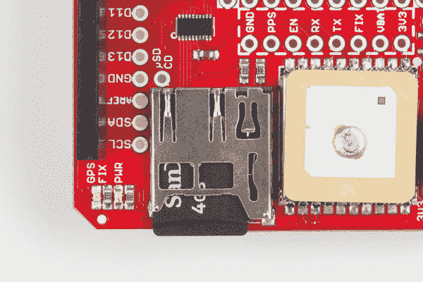](https://cdn.sparkfun.com/assets/learn_tutorials/4/6/8/gps-sd-card-in.jpg)

一旦完成，上传并运行！您可以检查串行监视器的调试数据，或者只是相信记录器正在记录。

一旦 GPS 模块获得良好的定位，Arduino 将开始将经度、纬度、高度、速度、路线、日期、时间和可见卫星的数量记录到 CSV 文件中。数据被设置为每五秒记录一次，但是如果您需要更多或更少的数据，这是很容易调整的。

让它记录一段时间后，关闭你的 Arduino，将 SD 卡装入你的电脑，并检查一个`GPSLOG###.CSV`文件。在电子表格程序中打开它，或者只是使用文本编辑器来查看你的 Arduino 记录了什么。

[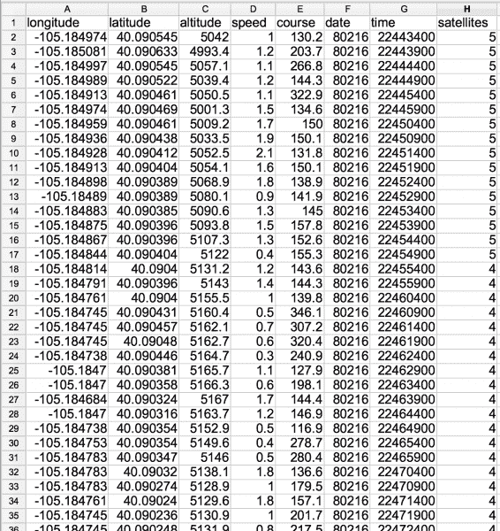](https://cdn.sparkfun.com/assets/learn_tutorials/4/6/8/gps-log-csv-example.png)

现在真正测试记录器！用电池给你的 Arduino 充电(我们的 [9V 转筒式插孔适配器](https://www.sparkfun.com/products/9518)很方便)...

[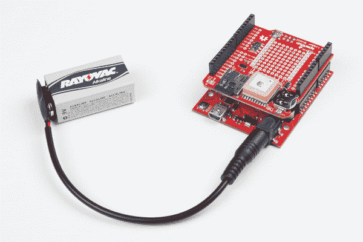](https://cdn.sparkfun.com/assets/learn_tutorials/4/6/8/gps-action-shot-02.jpg)

...带着你的 Arduino 去散步。

## 资源和更进一步

现在你已经让你的 GPS 日志屏蔽启动并运行，你打算做什么样的位置跟踪 Arduino 项目？需要更多的指导，这里有几个你可能会觉得方便的链接:

*   **SparkFun GPS 记录器屏蔽资源**
    *   [SparkFun GPS 记录器 Shield GitHub 储存库](https://github.com/sparkfun/GPS_Shield)
    *   [SparkFun GPS 记录器屏蔽示意图](https://cdn.sparkfun.com/assets/learn_tutorials/4/6/8/GPS_Logger_Shield-v20-Schematic.pdf)
    *   [GP3906-TLP GPS 模块数据表](https://cdn.sparkfun.com/assets/learn_tutorials/4/6/8/GP3906-TLP_DataSheet_Rev_A01.pdf)
*   **Arduino GPS 资源**
    *   [TinyGPS Arduino 库](http://arduiniana.org/libraries/tinygps/)
    *   [TinyGPS++ Arduino 库](http://arduiniana.org/libraries/tinygpsplus/)
    *   [阿达果 _GPS Arduino 库](https://github.com/adafruit/Adafruit_GPS)

如果你需要一点项目灵感，这里有一个 SparkFun 直播，在这里你可以观看一个 **GPS 速度表**的完整构建:

[https://www.youtube.com/embed/EAsZ7MLTk-A](https://www.youtube.com/embed/EAsZ7MLTk-A)

或者查看一些相关的 SparkFun 教程:

[](https://learn.sparkfun.com/tutorials/copernicus-ii-hookup-guide) [### 哥白尼 II 连接指南](https://learn.sparkfun.com/tutorials/copernicus-ii-hookup-guide) A guide for how to get started with the Copernicus II GPS module.[Favorited Favorite](# "Add to favorites") 2[](https://learn.sparkfun.com/tutorials/alphanumeric-gps-wall-clock) [### 字母数字 GPS 挂钟](https://learn.sparkfun.com/tutorials/alphanumeric-gps-wall-clock) This is a GPS controlled clock - a clock you truly never have to set! Using GPS and some formulas, we figure out what day of the week and if we are in or out of daylight savings time.[Favorited Favorite](# "Add to favorites") 13[](https://learn.sparkfun.com/tutorials/can-bus-shield-hookup-guide) [### CAN 总线屏蔽连接指南](https://learn.sparkfun.com/tutorials/can-bus-shield-hookup-guide) A basic introduction to working with the CAN-Bus shield.[Favorited Favorite](# "Add to favorites") 11

或者看看这篇博客文章。

[](https://www.sparkfun.com/news/2850 "January 9, 2019: It's in the name of science! No, really, it is, I swear.") [### 使用这款自己动手制作的 GPS 湿度追踪器，变得又重又潮湿

January 9, 2019](https://www.sparkfun.com/news/2850 "January 9, 2019: It's in the name of science! No, really, it is, I swear.")[Favorited Favorite](# "Add to favorites") 0**************