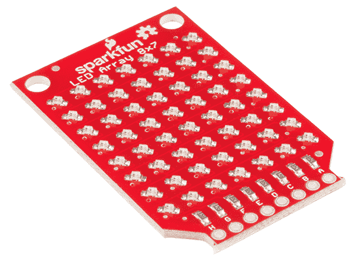

# RedStick 连接指南

> 原文：<https://learn.sparkfun.com/tutorials/redstick-hookup-guide>

## 介绍

SparkFun RedStick 是 BadgerStick 的量产版，它在你附近的一个贸易展上以 [BadgerHack 徽章](https://learn.sparkfun.com/tutorials/badgerhack)亮相。这个版本带有一个 NCP1402 升压调节器(正如在 [SparkFun 5.0v 升压分线板](https://www.sparkfun.com/products/10968)中看到的，因此它可以在 **16MHz** 下从 6V 到 2V 输入运行！

*The RedStick***The RedStick operates as an Arduino Uno in the Arduino IDE!** **### 本教程涵盖的内容

*   [硬件概述](https://learn.sparkfun.com/tutorials/redstick-hookup-guide#hardware-overview)-PCB 参观。
*   [给红棒供电](https://learn.sparkfun.com/tutorials/redstick-hookup-guide#powering-the-redstick)
*   [眨眼草图](https://learn.sparkfun.com/tutorials/redstick-hookup-guide#example-the-blink-sketch)
*   [使用 8x7 LED 阵列](https://learn.sparkfun.com/tutorials/redstick-hookup-guide#example-using-the-8x7-led-array)-8x 7 LED 阵列库已更新，可在此主板上使用！
*   [添加第二个电压轨](https://learn.sparkfun.com/tutorials/redstick-hookup-guide#example-adding-a-second-voltage-rail)——如何在 RedStick 上构建 LDO。
*   [结论和资源](https://learn.sparkfun.com/tutorials/redstick-hookup-guide#conclusion-and-resources)

### 推荐阅读

*   [RedBoard 连接指南](https://learn.sparkfun.com/tutorials/redboard-hookup-guide)-red board 和 RedStick 有很多相似之处。在本教程中学习在 Arduino IDE 中启动和运行的详细内容。
*   [BadgerHack](https://learn.sparkfun.com/tutorials/badgerhack) -原始 BadgerStick(推广)文档。
*   [Charlieplexed 8x7 LED 阵列 Github](https://github.com/sparkfun/BadgerArray) -如果你想了解更多关于 8x7 LED 阵列编程的信息，请查看代码文件。

## 硬件概述

下面列出了 RedStick 的功能:

*   升压调节器为 Atmega328p 提供 5V 电压，输入范围为 2 至 6 伏。
*   16 MHz 系统时钟(由于额外的电源电压而允许)
*   Arduino IDE 中的 Uno 兼容。只需选择棋盘“Arduino/Genuino Uno”并开始！
*   USB 端匹配标准 USB 厚度和宽度。

红条不是:

*   一个红板——它不提供 3.3 伏，只有 5 伏。
*   电池充电器——当插入 USB 端口时，RedStick 会关闭电池。

*Parts of the RedStick*

下表列出了 RedStick 上的所有引脚及其功能。

| 针丝
 | 功能 | 笔记 |
| 谢谢 | 串行传输
 | 这是来自红条的串行数据。
 |
| 药方(prescription 的缩写) | 串行接收
 | 这是进入
的串行数据 |
| Two | 数字
 |  |
| ~3 | 带 PWM 的数字
 |  |
| four | 数字的 |  |
| ~5 | 带 PWM 的数字
 |  |
| ~6 | 带 PWM 的数字
 |  |
| seven | 数字的 |  |
| 8
 | 数字的 |  |
| nine | 数字的 |  |
| ~10 | 数字/ PWM / SS
 |  |
| ~11
 | 数字/脉宽调制/ MOSI
 | SPI 总线
 |
| Twelve | PWM / MISO
 | SPI 总线
 |
| Thirteen | 数字/ SCK / LED
 | SPI 总线
 |
| A0 | 数字/模拟
 |  |
| 一流的 | 数字/模拟
 |  |
| 主动脉第二声 | 数字/模拟
 |  |
| A3
 | 数字/模拟
 |  |
| A4
 | 数字/模拟/ SDA
 | I2C 总线-一些应用需要上拉
 |
| A5
 | 数字/模拟/ SCL
 | I2C 总线-一些应用需要上拉 |
| A6 | 模拟
 | 仅限模拟！
 |
| A7 | 模拟的 | 仅限模拟！ |
| RXI
 | 串行接收
 | 电气连接到 RX
 |
| TXI | 串行传输
 | 电气连接到 TX |
| VCC
 | 微处理器功率(升压输出)
 | 如果用作输入，提供 5.0 v 稳压电源
 |
| GND | 地面 |  |
| + | 电池正极
 | 供应 2.0 至 6.0 伏电压
 |
| - | 电池负极
 | 这也是 GND
 |

## 给红棒供电

RedStick 的设计允许使用两种能源。

*   直接从 USB 端口供电。
*   电池端子上的电压为 2-6 伏。

*A block diagram showing how the power flows in this board*

### 功能描述

当 USB 端口通电时，电源不会流入电池。或者，如果 USB 电压低于电池电压，电源将不会流入 USB 主机。

要使用 AA 电池，例如在带开关的 [2xAA 电池座中，将电线直接焊接到电池端子孔中，使红色与正极匹配。](https://www.sparkfun.com/products/9547)

要使用可充电电池，如 [1 Ah 锂离子电池](https://www.sparkfun.com/products/339)，将 [JST 连接器](https://www.sparkfun.com/products/9749)焊接到较小的 2mm 间距的孔中，并连接电池。再次将红色与阳性配对。

**Note on VCC:** It's conceivable that power might be applied to the VCC pin instead. This is OK as long as the input voltage is regulated while the USB and battery inputs are left open.

### 关于 DC-DC 转换器的说明

RedStick 使用升压电路将低电压(> 2.0 伏 DC)转换为 5 伏 DC。这种 DC-DC 转换在当今世界相当普遍，因为线性调节器不够有效。该升压电路的效率约为 83%。

这里有几个与 DC-DC 转换器相关的概念需要考虑

#### DC-DC 转换器和电源

理想情况下，DC-DC 转换器的效率是 100%。在数学模型中，这意味着输出功率=输入功率。因此，如果转换器在 5V 时提供 200mA 电流，根据电功率的定义，功率为 1W (P = V * I)。如果我们从输出端消耗 1W，我们必须向输入端提供 1W。如果输入是一个 3V 的电池，提供 1W 的电流，它必须提供 330mA 的电流。那比我们出去的还多！

随着 DC-DC 转换器的输入电压下降，维持输出负载的电流消耗增加。

这也适用于调光不兼容的 LED 和 CCFL 灯泡。随着调光器降低电压，电流*增加*并烧坏调光器电路，因为它是为行为符合欧姆定律的电阻性负载(白炽灯)而设计的。

#### DC-DC 转换器的缺点

DC-DC 转换器的吸引力在于完整电路的低成本。这是因为电感被用来代替变压器。电感器在高频下工作，因此尺寸可以做得很小，这使得它们很便宜。控制电路是一个逻辑系统，它选择操作电感的时间和速度，以便在输出端建立必要的电压。根据电路的负载，该开关频率可以被视为 DC-DC 转换器输出端的纹波。

这种 DC-DC 转换器在 5kHz 至 250kHz 范围内产生 30 至 170 mV 的纹波，最佳性能在 2.5 至 4.5 伏(典型电池电压)之间。

## 示例:眨眼草图

RedStick 带有加载和运行的闪烁草图，因此 LED(引脚 13)将每秒切换一次。本节展示了如何使用 Arduino IDE 返回到这个基本草图。

*The RedStick running the blink application to insure basic function. In this photo, the RedStick is being powered from two AA cells.*

要重新加载草图，从菜单中选择 Arduino/Genuino Uno 板，选择基本示例 blink，然后按上传。

*Selecting the Arduino Uno board. Don't forget to select your com port too if it wasn't auto-selected**Select the blink.ino sketch from the basic examples menu*

现在编译并运行！这就是全部了！

## 示例:使用 8x7 LED 阵列

如果你想像使用 BadgerStick 一样使用带有 RedStick 的 [8x7 LED 阵列](https://www.sparkfun.com/products/13795),你可以！这些库已更新为使用 F_CPU 来设置 4、8 和 16MHz 主板的滚动速度。

**Using a promo 8x7:** The original promo 8x7 LED array was designed for 3.3v operation but the RedStick operates at 5\. Applying a 8x7 from a show (has badger logo on back) will have increased brightness and current consumption. For proper compatibility remove the 8 SMD resistors and replace with 82 ohms each, though it'll probably be ok if you choose not to alter it.

### 安装 Arduino 库

8x7 LED 阵列有自己的库。它作为一个名为[spark fun _ LED _ Array _ 8x 7 _ Arduino _ Library](https://github.com/sparkfun/SparkFun_LED_Array_8x7_Arduino_Library)的 github 存储库提供。它不是库管理器的一部分，需要手动安装(放在/libraries 文件夹中)。

有关更多信息，请查看本[安装 Arduino 库指南](https://learn.sparkfun.com/tutorials/installing-an-arduino-library)

### 运行示例草图

在“示例”下，选择 8x7 库，然后选择示例草图“ScrollText”。该草图在 8x7 LED 阵列上显示滚动文本，但该库也可用于绘制单个像素、形状和位图。

*Selecting the example sketch*

编译并运行草图。示例文本`Hello. :)`和`Let's scroll!`应该在数组中滚动。从这一点来说，可以改变文本，或者可以使用库的其他功能。查看 [BadgerHack 的“制作游戏”部分](https://learn.sparkfun.com/tutorials/badgerhack/all#make-a-game)中使用 8x7 API 的示例代码。

*The RedStick driving a modified 8x7 LED array (promo item). Here, it scrolls ":)" as part of the example*

## 示例:添加第二个电压轨

不是所有的项目都是 led 和数字逻辑。如果你想增加工作电压*不是*5.0 伏的器件，可以增加一个低压差调节器(LDO)来解决这个问题。在这里，我已经使用基本组件将一个 [BME280 大气传感器](https://www.sparkfun.com/products/13676)安装到我的 RedStick 上。当然，你可以使用[试验板供电棒](https://www.sparkfun.com/products/10804)。我不希望桶插孔和额外的空间用完，所以我使用分立元件。

这个便宜的愿望清单给你带来了调节器、大量的电容和大量的原型板。**