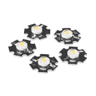
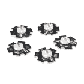
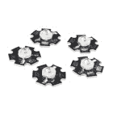
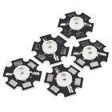
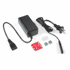
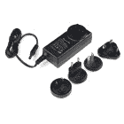
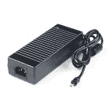
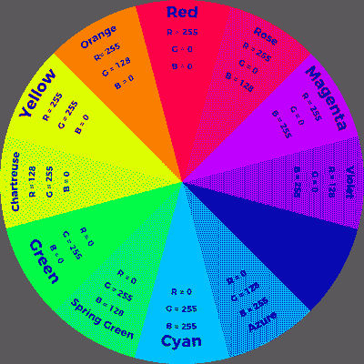

# FemtoBuck 恒流 LED 驱动器连接指南 v13

> 原文：<https://learn.sparkfun.com/tutorials/femtobuck-constant-current-led-driver-hookup-guide-v13>

## 介绍

**Note:** This tutorial is for the latest version of the FemtoBuck, V12\. If you have an older version of the FemtoBuck, please consult [this guide](https://learn.sparkfun.com/tutorials/retired---femtobuck-constant-current-led-driver-hookup-guide).

[FemtoBuck](https://www.sparkfun.com/products/13716) 是一款小型单输出恒流 [LED](https://www.sparkfun.com/leds) 驱动器。默认情况下，FemtoBuck 以 330mA 驱动。可以通过向电路板提供模拟电压或 PWM 信号来降低该电流。如本教程后面所述，通过闭合电路板上的一个跳线，可以将电流提高到 660mA。

 

将**添加到您的[购物车](https://www.sparkfun.com/cart)中！**

 **### [FemtoBuck 带队司机](https://www.sparkfun.com/products/13716)

[In stock](https://learn.sparkfun.com/static/bubbles/ "in stock") COM-13716

这就是 FemtoBuck，一款小尺寸单输出恒流 LED 驱动器。每只母羚羊都有淡化罪恶的能力…

$8.9517[Favorited Favorite](# "Add to favorites") 28[Wish List](# "Add to wish list")** **### 推荐阅读

这里有一些你在使用 FemtoBuck 之前应该知道的话题。如果您需要更多信息，请查看。

 [### 电压、电流、电阻和欧姆定律](https://learn.sparkfun.com/tutorials/voltage-current-resistance-and-ohms-law) Learn about Ohm's Law, one of the most fundamental equations in all electrical engineering.[Favorited Favorite](# "Add to favorites") 132 [### 脉宽灯](https://learn.sparkfun.com/tutorials/pulse-width-modulation) An introduction to the concept of Pulse Width Modulation.[Favorited Favorite](# "Add to favorites") 46 [### 电阻](https://learn.sparkfun.com/tutorials/resistors) A tutorial on all things resistors. What is a resistor, how do they behave in parallel/series, decoding the resistor color codes, and resistor applications.[Favorited Favorite](# "Add to favorites") 57 [### 发光二极管](https://learn.sparkfun.com/tutorials/light-emitting-diodes-leds) Learn the basics about LEDs as well as some more advanced topics to help you calculate requirements for projects containing many LEDs.[Favorited Favorite](# "Add to favorites") 67 [### 电力](https://learn.sparkfun.com/tutorials/electric-power) An overview of electric power, the rate of energy transfer. We'll talk definition of power, watts, equations, and power ratings. 1.21 gigawatts of tutorial fun 54

## FemtoBuck 概述

### 连接雌鲸

对于 FemtoBuck 的 1.2 版本，我们提高了器件的电压额定值，以允许输入电压覆盖 AL8860 的**全 36V 范围**。注意，电源电压必须至少为 6.0V，并且应该比要驱动的 LED 的正向电压至少高 2-3V。您可以使用该板驱动任何高功率 LED，如下所示。请记住，您需要 3 个 FemtoBucks 来控制三路输出高功率 RGB LED 上的每个通道。

 

将**添加到您的[购物车](https://www.sparkfun.com/cart)中！**

 **### [三路输出大功率 RGB LED](https://www.sparkfun.com/products/15200)

[In stock](https://learn.sparkfun.com/static/bubbles/ "in stock") COM-15200

这款每通道 3W、三路输出的高功率 RGB LED 肯定能为您添加的任何项目提供大量照明。

$5.50[Favorited Favorite](# "Add to favorites") 12[Wish List](# "Add to wish list")**** 

将**添加到您的[购物车](https://www.sparkfun.com/cart)中！**

 **### [【LED-3W 铝 PCB (5 个装，暖白色)](https://www.sparkfun.com/products/13104)

[In stock](https://learn.sparkfun.com/static/bubbles/ "in stock") COM-13104

如此小的封装却有如此大的功率和亮度。这 5 包“温暖的”白色 3 瓦铝背印刷电路板肯定会脱落…

$8.957[Favorited Favorite](# "Add to favorites") 21[Wish List](# "Add to wish list")**** 

将**添加到您的[购物车](https://www.sparkfun.com/cart)中！**

 **### [【LED-3W 铝 PCB (5 个装，冷白色)](https://www.sparkfun.com/products/13105)

[In stock](https://learn.sparkfun.com/static/bubbles/ "in stock") COM-13105

如此小的封装却有如此大的功率和亮度。这 5 包“酷”白色 3 瓦铝背印刷电路板肯定会脱落…

$8.954[Favorited Favorite](# "Add to favorites") 15[Wish List](# "Add to wish list")**** 

### [【LED-3W 铝 PCB (5 个装，红色)](https://www.sparkfun.com/products/retired/13106)

[Retired](https://learn.sparkfun.com/static/bubbles/ "Retired") COM-13106

如此小的封装却有如此大的功率和亮度。这 5 包红色 3 瓦铝背印刷电路板肯定会脱落很多李…

3 **Retired**[Favorited Favorite](# "Add to favorites") 7[Wish List](# "Add to wish list") 

### [【LED-3W 铝 PCB (5 个装，蓝色)](https://www.sparkfun.com/products/retired/13107)

[Retired](https://learn.sparkfun.com/static/bubbles/ "Retired") COM-13107

如此小的封装却有如此大的功率和亮度。这 5 包蓝色 3 瓦铝背印刷电路板肯定会脱落很多 l…

**Retired**[Favorited Favorite](# "Add to favorites") 3[Wish List](# "Add to wish list") 

### [【LED-3W 铝制 PCB (5 个装，绿色)](https://www.sparkfun.com/products/retired/13185)

[Retired](https://learn.sparkfun.com/static/bubbles/ "Retired") COM-13185

如此小的封装却有如此大的功率和亮度。这 5 包绿色 3 瓦铝背印刷电路板肯定会脱落很多…

**Retired**[Favorited Favorite](# "Add to favorites") 2[Wish List](# "Add to wish list")****** ******由于 FemtoBuck 是一个恒流驱动器，从电源汲取的电流会随着电源电压的升高而下降。一般来说，FemtoBuck 的效率约为 95%，具体取决于输入电压。

一路信号输入用于调光控制。提供了一个接地引脚(DGND ),作为控制模块的精确参考。调光可以通过模拟电压(通过在 0.5v-2.5V 范围内改变电压，最大电流的 20%-100%)或 PWM(只要 PWM 最小电压小于 0.4v，最大电压大于 2.4V)实现，范围为 0-100%。

电源引脚旁边还有另一个接地(PGND)引脚，用于提供高电流返回路径。对于[标准接头](https://www.sparkfun.com/products/553)，输入侧的四个孔的间距为 0.1”。

 

将**添加到您的[购物车](https://www.sparkfun.com/cart)中！**

 **### [破开头球——直击](https://www.sparkfun.com/products/116)

[In stock](https://learn.sparkfun.com/static/bubbles/ "in stock") PRT-00116

一排标题-打破适应。40 个引脚，可切割成任何尺寸。用于定制 PCB 或通用定制接头。

$1.7520[Favorited Favorite](# "Add to favorites") 133[Wish List](# "Add to wish list")**** 

将**添加到您的[购物车](https://www.sparkfun.com/cart)中！**

 **### [断后头——龙](https://www.sparkfun.com/products/10158)

[In stock](https://learn.sparkfun.com/static/bubbles/ "in stock") PRT-10158

这些是我们【标准】的加长版(http://www . spark fun . com/commerce/product _ info . PHP？products_id=116)挣脱他…

$3.253[Favorited Favorite](# "Add to favorites") 14[Wish List](# "Add to wish list")**** 

将**添加到您的[购物车](https://www.sparkfun.com/cart)中！**

 **### [【螺丝端子 2.54mm 螺距(2 针)](https://www.sparkfun.com/products/10571)

[In stock](https://learn.sparkfun.com/static/bubbles/ "in stock") PRT-10571

这些是带有 2.54 毫米间距引脚的简单双位螺丝端子。额定高达 150 伏@ 6A，这个终端可以接受 30 至 18A…

$0.953[Favorited Favorite](# "Add to favorites") 18[Wish List](# "Add to wish list")****** ******输出侧有一个 0.1 英寸间距的孔对和一个 3.5 毫米间距的孔对，以允许用户连接我们的[3.5 毫米螺丝端子](https://www.sparkfun.com/products/8084)。

 

将**添加到您的[购物车](https://www.sparkfun.com/cart)中！**

 **### 螺距 3.5mm 的螺丝端子(2 针)

[In stock](https://learn.sparkfun.com/static/bubbles/ "in stock") PRT-08084

将端子 3.5 毫米节距销与滑动锁紧装置拧在一起，形成您需要的任何尺寸。额定高达 125V @ 6A，并可接受…

$1.05[Favorited Favorite](# "Add to favorites") 23[Wish List](# "Add to wish list")** **电路板两端的槽口允许您在焊接后使用拉链将电线固定在电路板上。

最新版本有一个小的焊接跳线，如上所述，可以用一团焊料封闭，使输出电流加倍，从 330mA 增加到 660mA。我们建议在将接头、端子或电线焊接到附近的孔之前，关闭该跳线*。**注意，你很可能会在相邻的电阻片上沾到一些焊料。这完全没问题。**无论如何，当你完成时，这些焊盘会被短接在一起。*

最后，注意母羚羊的大小。如果需要，整个电路板可以滑入一块 9mm 的热缩管中，以提供绝缘和应变消除。

 

将**添加到您的[购物车](https://www.sparkfun.com/cart)中！**

 **### [热收缩套装](https://www.sparkfun.com/products/9353)

[In stock](https://learn.sparkfun.com/static/bubbles/ "in stock") PRT-09353

我们喜欢热收缩！我们用它来做各种各样方便的项目。用它来加强连接，保护设备和电子…

$8.957[Favorited Favorite](# "Add to favorites") 40[Wish List](# "Add to wish list")** **## 连接到 Arduino 或兼容的主板

如果只有一两个 led，可以将 FemtoBuck 直接连接到 Arduino 上的 VIN 引脚。**您需要从外部电源**为电路板供电，因为 USB 提供的 5V 电压不足以给 FemtoBuck 供电(FemtoBuck 不会在低于 6V 的电压下开启)。

如果您想要多个 FemtoBuck，或者如果您已经关闭了焊接跳线以增加驱动电流，则需要添加外部电源。试图让太多的电流流过 Arduino 上的走线并不好。**请注意，发光二极管是单独连接到每只母羚羊上的！**这个很重要；每只雌羚的产出必须完全与其他雌羚隔离开来！这意味着带有“公共”引脚(公共阳极或公共阴极)的 RGB LEDs 不能与 FemtoBuck 一起使用！

**Note:** When using an external supply for the Femtobuck, the grounds of the two boards must be connected! If the power supply is 12V or less, the Arduino can be powered from it as well, but do not attempt to power the Femtobuck from the Arduino if you are using anything higher! Below are a few power options and accessories that can be used with the FemtoBuck.

 

将**添加到您的[购物车](https://www.sparkfun.com/cart)中！**

 **### [DC 筒式千斤顶适配器——母](https://www.sparkfun.com/products/10288)

[In stock](https://learn.sparkfun.com/static/bubbles/ "in stock") PRT-10288

此适配器允许您将筒式插孔连接器连接到裸线。一端有螺丝端子，另一端有一个 5.5…

$3.501[Favorited Favorite](# "Add to favorites") 24[Wish List](# "Add to wish list")**** 

将**添加到您的[购物车](https://www.sparkfun.com/cart)中！**

 **### [【spark fun ATX 电源连接器转接套件- 12V/5V (4 针)](https://www.sparkfun.com/products/15701)

[Only 11 left!](https://learn.sparkfun.com/static/bubbles/ "only 11 left!") KIT-15701

ATX 电源连接器从一个墙壁适配器上为您的 12V 和 5V 设备断开标准的 4 针计算机外围设备端口…

$19.504[Favorited Favorite](# "Add to favorites") 16[Wish List](# "Add to wish list")**** 

将**添加到您的[购物车](https://www.sparkfun.com/cart)中！**

 **### [全局电源- 15V 4.34A](https://www.sparkfun.com/products/14338)

[In stock](https://learn.sparkfun.com/static/bubbles/ "in stock") PRT-14338

这不是你的普通电源。全局电源是一个 15V，4.34A 的电源设备，专门设计用于…

$34.95[Favorited Favorite](# "Add to favorites") 0[Wish List](# "Add to wish list")**** 

### [墙壁适配器电源- 9VDC 650mA](https://www.sparkfun.com/products/retired/298)

[Retired](https://learn.sparkfun.com/static/bubbles/ "Retired") TOL-00298

专为 Spark Fun Electronics 制造的高质量开关“壁式电源”AC 到 DC 9V 650mA 壁式电源。T…

12 **Retired**[Favorited Favorite](# "Add to favorites") 23[Wish List](# "Add to wish list") 

### [电源- 24V (5A)](https://www.sparkfun.com/products/retired/13758)

[Retired](https://learn.sparkfun.com/static/bubbles/ "Retired") TOL-13758

该 5A 电源输出 24v 直流电压，端接一个中心正极 5.5 x 2.1mm 毫米筒形连接器。

**Retired**[Favorited Favorite](# "Add to favorites") 4[Wish List](# "Add to wish list")****** ******如图所示，多个 led 可以串联连接，并且电源电压应该比 led 的正向电压之和至少高 2-3V。

例如，我们的[蓝色 3W led](https://www.sparkfun.com/products/13107)具有 3.2V 至 3.8V 的正向电压。为了安全起见，请使用该范围内的最高电压。如果您想要连接其中的四个，您需要大约 17V 或更高的电源(3.8V+3.8V+3.8V+3.8V = 15.2v；加 2V 的“头部空间”)。

由于 17V 高于 Arduino 可以承受的输入电压，我们还必须为 Arduino 提供外部电源。这可以是标准的 5V USB 电源。

**Tip:** If you have three FemtoBucks together, you can mix colors with the RGB high power LED. Try using [Arduino.cc's Color Cross Fader example](https://www.arduino.cc/en/Tutorial/ColorCrossfader) to mix the colors like a rainbow using the Arduino's analog pins.

Try checking the example that was used in the [LilyPad ProtoSnap Plus Activity Guide for custom color mixing with tertiary colors](https://learn.sparkfun.com/tutorials/lilypad-protosnap-plus-activity-guide/3-custom-color-mixing). Just make sure to update the pin definitions.

*RGB LED Lighting Up from [Experiment 3: Custom Color Mixing](https://learn.sparkfun.com/tutorials/lilypad-protosnap-plus-activity-guide/3-custom-color-mixing)*
Or try using the code from the [Non-Addressable RGB LED Strip Hookup Guide](https://learn.sparkfun.com/tutorials/non-addressable-rgb-led-strip-hookup-guide). While the code was written for RGB strips with transistors, the code functions the same with the the PickBuck.

 [### 不可寻址的 RGB LED 灯条连接指南

#### 2020 年 2 月 19 日](https://learn.sparkfun.com/tutorials/non-addressable-rgb-led-strip-hookup-guide) Add color to your projects with non-addressable LED strips! These are perfect if you want to control and power the entire strip with one color for your props, car, fish tank, room, wall, or perhaps under cabinet lighting in your home.[Favorited Favorite](# "Add to favorites") 2

## 进一步增加电流驱动强度

如果 660 毫安的电流对你来说还不够，可以将 FemtoBuck 板的最大电流提高到每通道 1A。为此，请用较小的值替换电流检测电阻。要计算新电阻值，请使用以下公式:

**I[LED] = 0.1 / R[set]**

因此，对于 1A 电流，你需要一个 0.1ω的电阻。别忘了警惕现在的收视率；在 1A，感应电阻将消耗 1/10W，所以你可能需要一个至少 1/8W 额定值的电阻。封装是标准的 0805。

## 资源和更进一步

有关 FemtoBuck 的更多信息，请查看以下资源:

*   [示意图](https://cdn.sparkfun.com/assets/4/a/3/d/0/femtobuckv13.pdf)
*   [老鹰档案](https://cdn.sparkfun.com/assets/5/f/7/9/d/femtobuckv13.zip)
*   [关于 led 的一切](https://www.sparkfun.com/leds)
*   [数据表](https://cdn.sparkfun.com/assets/5/9/8/e/4/AL8860.pdf) (AL8860)
*   (设计文件)

有关本指南中概念的更多信息，请参考其他教程:

*   [光](https://learn.sparkfun.com/tutorials/light)——涵盖了一些有用的概念，比如为什么电流加倍看起来不会使亮度加倍。
*   二极管 -二极管比电阻稍微复杂一点。我们的二极管教程将帮助你理解为什么我们需要一个特殊的设备来供电。
*   [Pico Buck 连接指南](https://learn.sparkfun.com/tutorials/picobuck-hookup-guide-v12) -需要控制更多 led？PicoBuck 就像 FemtoBuck 一样，只是它有三个通道，每个通道都能提供 350mA 的电流。非常适合控制需要单独控制每种颜色的高功率 RGB LEDS。

你的下一个项目需要一些灵感吗？查看与触摸电位计一起使用的 PWM 照明控制器示例:

*PWM Lighting Controller in the [Touch Potentiometer Hookup Guide](https://learn.sparkfun.com/tutorials/touch-potentiometer-hookup-guide#example-1-pwm-lighting-controller)*

或者试着用 FemtoBuck 做一些 LED 家居照明。

[https://www.youtube.com/embed/yf9F3nqZH_Y/?autohide=1&border=0&wmode=opaque&enablejsapi=1](https://www.youtube.com/embed/yf9F3nqZH_Y/?autohide=1&border=0&wmode=opaque&enablejsapi=1)************************