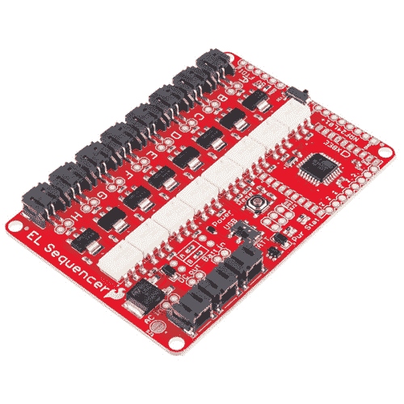
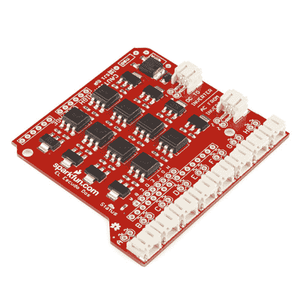

# EL 序列器/Escudo Dos 连接指南

> 原文：<https://learn.sparkfun.com/tutorials/el-sequencerescudo-dos-hookup-guide>

## 介绍

**Heads up!** Originally, this tutorial was written to configure an XBee Series 1 to communicate in transparency mode. However, this can apply to the XBee Series 3 module as long as you configure the firmware to the legacy 802.15.4 protocol. For more information, check out the [Exploring XBees and XCTU](https://learn.sparkfun.com/tutorials/exploring-xbees-and-xctu) tutorial.

[SparkFun EL Sequencer](https://www.sparkfun.com/products/12781) 是一款 Arduino-compatible 微控制器，带有控制多达八股[电致发光(EL)线](http://en.wikipedia.org/wiki/Electroluminescent_wire)的电路。Arduino shield 版本的序列器是 [SparkFun EL Escudo Dos](https://www.sparkfun.com/products/10878) ，它可以与任何 Arduino Uno footprint 兼容的微控制器一起使用。

 [Retired](https://learn.sparkfun.com/static/bubbles/ "Retired") COM-12781

SparkFun EL Sequencer 是一个包含 Arduino 兼容微控制器和电路的板，用于控制高达…

10 **Retired**[Favorited Favorite](# "Add to favorites") 26[Wish List](# "Add to wish list") 

### [spark fun EL Escudo Dos](https://www.sparkfun.com/products/retired/10878)

[Retired](https://learn.sparkfun.com/static/bubbles/ "Retired") COM-10878

我们听到了你的声音，并对我们的 EL 盾做了一些改进。新版本增加了过零光隔离三端双向可控硅开关。

10 **Retired**[Favorited Favorite](# "Add to favorites") 21[Wish List](# "Add to wish list")

### 所需材料

为了跟随本教程，我们建议您除了音序器或 Escudo Dos 之外，还可以访问以下资料。