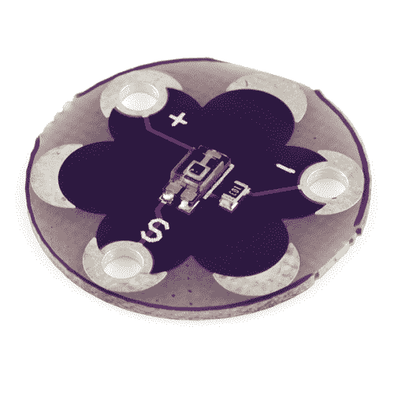

# LilyPad 光线传感器连接指南

> 原文：<https://learn.sparkfun.com/tutorials/lilypad-light-sensor-hookup-guide>

## 介绍

[LilyPad 光线传感器](https://www.sparkfun.com/products/8464)是[环境光线传感器分接头](https://www.sparkfun.com/products/8688)的电子纺织品友好版本。如果你以前在一个项目中使用过 breakout，那么连接和代码将会非常相似。您需要连接到 LilyPad Arduino 或其他微控制器，以读取传感器值并在代码中使用。

该传感器输出 0 至 3.3V 的模拟值。在明亮的光线下(完全日光下)，该传感器将输出 3.3V，如果被完全覆盖，将输出 0V。在典型的室内照明情况下，传感器将输出大约 1 到 2V 的电压。

 

### [LilyPad 光传感器](https://www.sparkfun.com/products/retired/8464)

[Retired](https://learn.sparkfun.com/static/bubbles/ "Retired") DEV-08464

这是一个简单易用的光传感器，输出 0 到 5V 的模拟值。暴露在日光下，该传感器将会失效

**Retired**[Favorited Favorite](# "Add to favorites") 9[Wish List](# "Add to wish list")

为了跟随代码示例，我们建议: