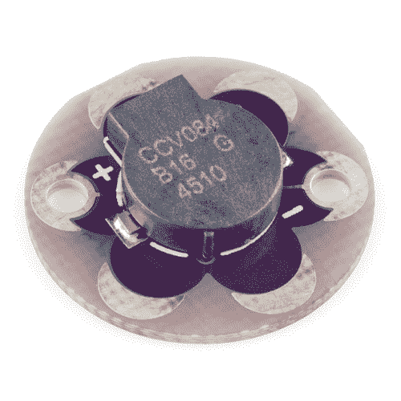

# LilyPad 蜂鸣器连接指南

> 原文：<https://learn.sparkfun.com/tutorials/lilypad-buzzer-hookup-guide>

## 介绍

[LilyPad 蜂鸣器](https://www.sparkfun.com/products/8463)可以让你在连接到 LilyPad Arduino 时使用代码创造不同的噪音。向蜂鸣器发送一系列音调，您可以制作音乐旋律、特殊效果声音、闹钟等等。这个蜂鸣器不是很响，但是在您的项目附近可以听到。在本教程中，我们将演示如何连接到 LilyPad Arduino，以及如何使用 Arduino 中的`tone()`功能来发出声音。

LilyPad 蜂鸣器不同于播放音频的扬声器，如果你正在寻找一个加载和播放音乐的项目，我们推荐 [LilyPad MP3](https://www.sparkfun.com/products/11013) 。

 

将**添加到您的[购物车](https://www.sparkfun.com/cart)中！**

 **### [LilyPad 蜂鸣器](https://www.sparkfun.com/products/8463)

[In stock](https://learn.sparkfun.com/static/bubbles/ "in stock") DEV-08463

这是 LilyPad 系统的一个小蜂鸣器。在 LilyPad 主板上使用 2 个 I/O 引脚，并根据…产生不同的噪音

$4.95[Favorited Favorite](# "Add to favorites") 11[Wish List](# "Add to wish list")****This particular LilyPad component cannot be washed. We recommend sewing to a piece of fabric using [metal snaps](https://www.sparkfun.com/products/11347) so that it can be removed for washing. See the [Sewing Into a Project](https://learn.sparkfun.com/tutorials/using-the-lilypad-buzzer#sewing-into-a-project) section for more details.

为了跟随代码示例，我们建议:**