# 分立半导体套件识别指南

> 原文：<https://learn.sparkfun.com/tutorials/discrete-semiconductor-kit-identification-guide>

## 概观

让我们从几个定义开始。

**[Discrete](https://en.wiktionary.org/wiki/discrete)**
1\. Separate; distinct; individual; non-continuous.
2\. That can be perceived individually and not as connected to, or part of something else.
3\. (electrical engineering) Having separate electronic components, such as individual resistors and inductors — the opposite of integrated circuitry.**[Discreet](https://en.wiktionary.org/wiki/discreet)**
1\. Respectful of privacy or secrecy; quiet; diplomatic.
2\. Not drawing attention, anger or challenge; inconspicuous.

**Usage notes**
<t>Do not confuse with discrete.</t>

*礼遇*

## 背景

如果你做任何与电子有关的事情，你可能已经在使用晶体管，但你可能在大型、高度集成的集群中使用它们。例如，atmega 328 p([red board](https://www.sparkfun.com/products/12757)和 [ProMini](https://www.sparkfun.com/products/11113) 上的主芯片)就包含数十万个这样的芯片。它们很小，封装在塑料中，并且已经被配置为用作微控制器。

但是有时候你只需要一个...如果你手边没有一个，那么不得不去订购一个[单晶体管](https://www.sparkfun.com/products/13689)会很不方便。

[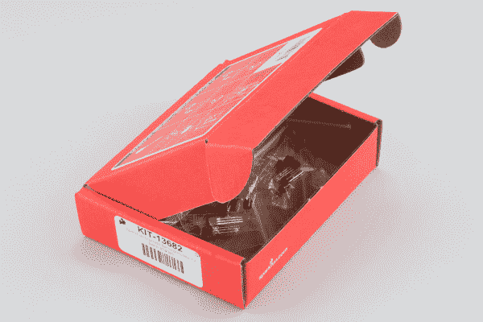](https://cdn.sparkfun.com/assets/learn_tutorials/4/2/3/open-box.jpg)*What's in the Discretes Kit?*

[分立半导体套件](https://www.sparkfun.com/products/13682)满足您的基本分立半导体需求。它有 PNP 和 NPN 双极性晶体管、N 沟道和 P 沟道 MOSFETs、二极管、可调基准电压源和可调稳压器。

[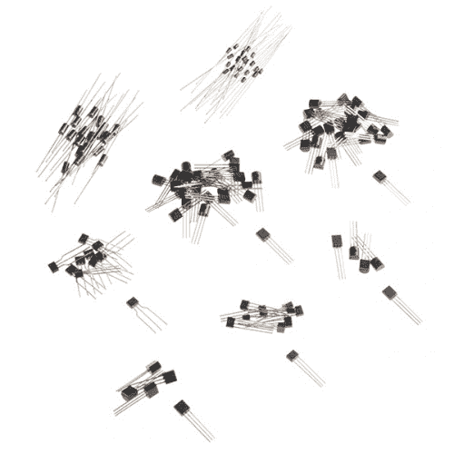](https://www.sparkfun.com/products/13682) 

将**添加到您的[购物车](https://www.sparkfun.com/cart)中！**

 **### [SparkFun 分立半导体套件](https://www.sparkfun.com/products/13682)

[In stock](https://learn.sparkfun.com/static/bubbles/ "in stock") KIT-13682

SparkFun 分立半导体套件满足了您只需要一个或几个晶体管而不需要…

$12.956[Favorited Favorite](# "Add to favorites") 62[Wish List](# "Add to wish list")** **本指南将引导您识别这些组件。

### 背景材料

*   我们的[晶体管教程](https://learn.sparkfun.com/tutorials/transistors)涵盖了双极结型晶体管的基础知识。
*   根据 Pete 的说法，有**集他讨论了:**
    *   [二极管和晶体管](https://www.youtube.com/watch?v=w9cd7B5QRRo)
    *   [金属氧化物半导体场效应晶体管](https://www.youtube.com/watch?v=CFt8hkh17_w)
    *   [电压调节器](https://www.youtube.com/watch?v=s1CM6P80EyQ)
*   该套件中的所有组件都经过[极化](https://learn.sparkfun.com/tutorials/polarity)。

## 套件内容

[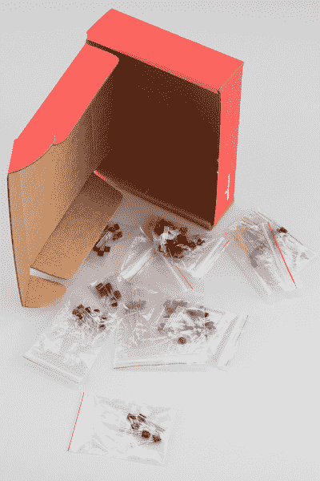](https://cdn.sparkfun.com/assets/learn_tutorials/4/2/3/box-spilled.jpg)*Spilled Onto The Workbench*

### 内容列表

你可以在工具箱中找到以下零件。

| **分立半导体套件材料清单** |
| **数量** | **零件号
&链接至数据表** | **类型** | **标记** |
| Twenty-five | [2N3904](https://cdn.sparkfun.com/assets/learn_tutorials/4/2/3/2N3904.PDF) | NPN 晶体管 | 2N3904 |
| Twenty-five | [2N3906](https://cdn.sparkfun.com/assets/learn_tutorials/4/2/3/2N3906.PDF) | PNP 晶体管 | 2N3906 |
| Ten | [5LN01SP](https://cdn.sparkfun.com/assets/learn_tutorials/4/2/3/5ln01sp.PDF) | n 沟道 MOSFET | 镱 |
| Ten | [5LP01SP](https://cdn.sparkfun.com/assets/learn_tutorials/4/2/3/5lp01sp.PDF) | p 沟道 MOSFET | XB |
| Twenty | [1N4148](https://cdn.sparkfun.com/assets/learn_tutorials/4/2/3/1n4148.pdf) | 硅二极管 | Four thousand one hundred and forty-eight |
| Twenty | [1N4004](https://cdn.sparkfun.com/assets/learn_tutorials/4/2/3/1N4004.pdf) | 功率二极管 | 1n4004 |
| five | [TL431A](https://cdn.sparkfun.com/assets/learn_tutorials/4/2/3/TL431.pdf) | 参考电压 | TL431A |
| five | [LM317L](https://cdn.sparkfun.com/assets/learn_tutorials/4/2/3/lm317l.pdf) | 稳压器 | LM317LZ |

这些零件看起来非常相似。上面的“标记”栏表示您会发现印在零件上的名称。除了 MOSFETs 之外，标记通常包含一个版本的器件号。有些零件可能还会有附加符号或印刷，表示制造商和生产日期等信息。

BJT、基准电压源和调节器都是常见的 TO-92 形状因素，具有铅笔橡皮擦大小的主体和三个突出的腿。MOSFETs 是略小的 SC-72(又名“单 SPA”)封装。

[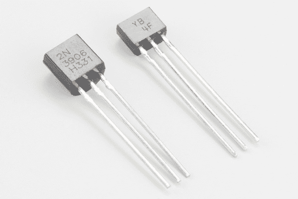](https://cdn.sparkfun.com/assets/learn_tutorials/4/2/3/package-sizes.jpg)*Comparison of TO-92 and SC-72 Packages*

这些器件的极性很重要，通常通过引脚编号来表示。

要识别针脚，请握住设备，使标记面朝向您，支脚朝下。从左到右，引脚编号为 1、2 和 3。分配给每个引脚的功能取决于器件，我们将在相应部分讨论每个器件的功能。

[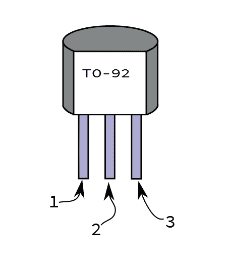](https://cdn.sparkfun.com/assets/learn_tutorials/4/2/3/to-92-numbered.png)*TO-92 Pin Numbering*

### 规范

因为分立半导体是电子电路的基本组成部分，所以它们比其他元件有更详细的规格。一个应用程序中的关键参数在另一个应用程序中可能是无意义的。这使得很难呈现零件规格的简要概要。我们没有在线列出一些参数，而是决定通过将表上方的[表中的零件号链接到相应的数据表来简化参数信息的访问。](https://learn.sparkfun.com/tutorials/discrete-semiconductor-kit-identification-guide/kit-contents#KIT_BOM)

## 二极管

二极管是套件中最简单的半导体，每个都有两条引线。它们都是硅二极管，大体相似，但最大电压和电流规格不同。

#### 功率二极管

1N4004 功率二极管是带有灰色标记的黑色圆柱体，它们比小信号二极管大。工具箱里有 20 个。车身上印有“1N4004”标记。

[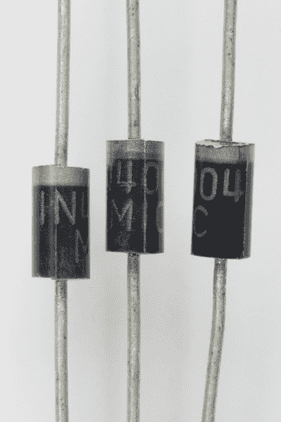](https://cdn.sparkfun.com/assets/learn_tutorials/4/2/3/power-diode.jpg)*1N4004*

由于这些是功率二极管，它们可以承受高电压和高电流。它们的额定最大反向电压为 400 伏，平均整流电流输出为 1A。开启它们所需的[正向电压](https://learn.sparkfun.com/tutorials/diodes/real-diode-characteristics#forward_drop)非常高，最大为 1 伏。在工作台上随意测试正向压降，发现实际正向电压略低，约为 0.7 V。

功率二极管通常用作电源中的桥式整流器。

#### 小信号二极管

还有 20 片 1N4148 小信号二极管。它比功率二极管小，有一个橙色的玻璃主体，在一端也有一个条纹。

*1N4148*

“4148”印在二极管的主体上，但是因为主体是透明的，所以数字可能很难看到。

这些二极管适合不需要高电压或高电流的应用。它们的额定最大反向电压为 100V，平均正向电流为 200 mA。与功率二极管一样，规定的最大正向电压为 1V，但通常测量值更接近 0.65V。典型应用包括[二极管逻辑](https://learn.sparkfun.com/tutorials/diodes#diode-applications)或[精密整流器](https://en.wikipedia.org/wiki/Precision_rectifier)。

#### 二极管极性

两个二极管的极性都用主体一端的条纹表示。条纹对应于示意符号中的线，表示阴极。另一端(无条纹)是阳极，由示意图符号中的三角形表示。

[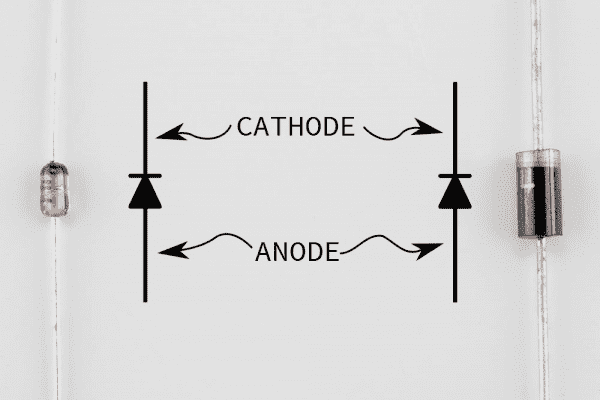](https://cdn.sparkfun.com/assets/learn_tutorials/4/2/3/both-diodes.png)*Diode Polarity*

一旦超过正向电压，电流就会通过二极管从阳极流向阴极。这就给我们带来了一些用终端来记忆的记忆方法。

*   印刷在车身上的示意符号中的线是阴极。线 a 类似于负号，因为这将是二极管更负的一端。
*   示意图符号中的三角形是 **A** 节点，字母“A”构成一个三角形。
*   符号中的三角形也与我们绘制的表示电流的箭头相匹配。

[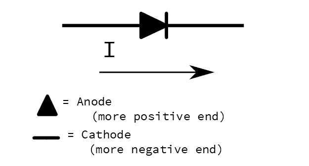](https://cdn.sparkfun.com/assets/learn_tutorials/4/2/3/diodes-lineart.png)*Remembering How a Diode is Drawn*

## 晶体管

### 双极结晶体管

普通的晶体管是双极结型晶体管。电气工程师经常将这个名字缩写成首字母“BJT”该套件包含 2n3904 和 2n3906 BJTs 各 25 件。这些是无处不在的“软糖”零件，可用于许多通用晶体管电路。

如果你看一本关于基本晶体管电路的书，你很有可能会遇到 2N3904 及其互补器件 2N3906。它们已经生产了很长时间，是非常有用的通用晶体管。

#### 2N3904 NPN

[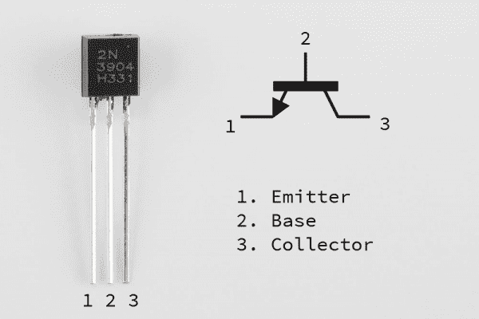](https://cdn.sparkfun.com/assets/learn_tutorials/4/2/3/2n3904-legend.png)*The 2N3904 is clearly labeled.*

引脚排列相当简单:

1.  发射器
2.  基础
3.  收藏者

2N3904s 易于在试验板上使用，因为底座在中间，原理图符号和器件本身是对应的。

#### 2N3906 PNP

2N3906 是 2N3904 的 PNP 补充产品。

*Also Clearly Marked.*

2N3904 和 2N3906 的 pin 顺序很容易记住，因为它们是相同的。只要记住字母“EBC”

尽管引脚顺序相同，但请记住，发射极会在 NPN 和 PNP 变体之间翻转！您可以将 2N3906 视为 2N3904 的镜像。

### 金属氧化物半导体场效应晶体管

套件中的金属氧化物半导体场效应晶体管比其他晶体管要小，体积只有一半。由于更小，打印的空间更小，所以零件号是一个简洁的代码。

#### 5LN01SP N 沟道 MOSFET

[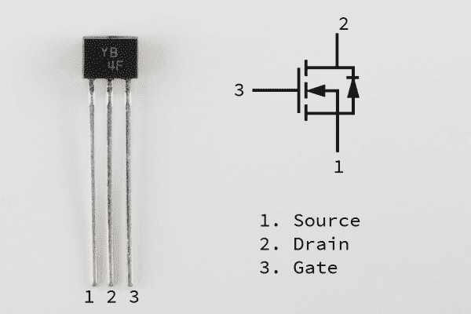](https://cdn.sparkfun.com/assets/learn_tutorials/4/2/3/5ln01sp-legend.png)*YB is not so obvious*

包装上的字母“YB”是标识符。照片中零件上的另一个标记是批号或日期代码，如果你不知道如何解码，这就没有什么特别的意义了。

引脚排列是

1.  来源
2.  流干
3.  大门

#### 5LP01SP P 沟道 MOSFET

由于所涉及的基本半导体物理特性，P 沟道 MOSFETss 不如 N 沟道 MOSFET 常见。5Lx01SP 系列有些独特，它包括一个 P 沟道变体，是其 N 沟道同类器件的合理补充。

[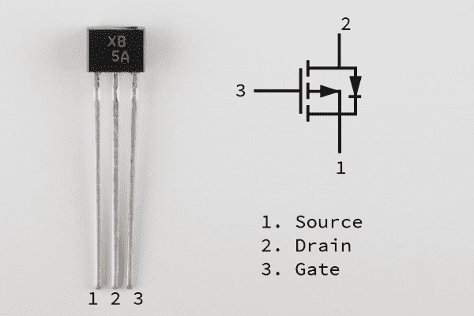](https://cdn.sparkfun.com/assets/learn_tutorials/4/2/3/5lp01sp-legend.png)*"XB" not XBee*

同样，零件上的标记有些神秘——印在车身上的“XB”是标识符。

引脚排列与其 N 沟道表亲(源极、栅极、漏极)相匹配。与 BJT 一样，这些 MOSFETs 具有相同的引脚排列，但极性相反。

虽然 5LP01SP 旨在作为 5LN01SP 的补充，但其规格并不是完美的镜像。它的跨导较低，栅极电容较高，开关时间较慢。这些差异在典型应用中可能并不显著。

## 电压设备

实际上，我们用接下来的两个元件欺骗了分立器件的定义。它们实际上都是集成电路！

不过，它们仍然在 TO-92 封装中。第一种实际上是齐纳二极管的通用替代品。第二个是电压调节器，同样不是分立的，但非常方便携带。

### TL431A 基准电压源

当我们为这个套件选择零件时，我们认为有一些齐纳二极管可能会很好——但对于[齐纳电压](https://en.wikipedia.org/wiki/Zener_diode)没有达成一致。我们真正想要的是一个可调齐纳二极管:输入 TL431A 基准电压源。其功能类似于齐纳二极管，但电压通过外部电阻设置。

[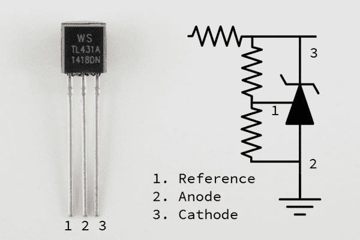](https://cdn.sparkfun.com/assets/learn_tutorials/4/2/3/tl431a-legend.png)*TL431A*

输出电压可以在 2.5V 和电源电压之间变化，最高可达 36V。像[齐纳分流器](https://en.wikipedia.org/wiki/Linear_regulator#Simple_shunt_regulator)一样，它需要一个与阴极串联的电阻。

当您希望产生稳定恒定的电压，但输入电压变化时，齐纳分流电路非常有用。例如， [RedBoard](https://www.sparkfun.com/products/12757) 在其桶形插孔上可以接受 7 到 15 伏直流电。如果我们需要从中获得稳定的基准电压，最明显的方法是使用[分压器](https://learn.sparkfun.com/tutorials/voltage-dividers)，但我们会发现，最终电压会随着输入电压的变化而变化。齐纳分流器(或有源基准电压源)是获得独立于输入的基准电压的一种方式。

#### 极性

TL431A 有三个引脚，即基准电压、阳极和阴极。阳极和阴极术语借用自齐纳二极管。

Just a reminder -- when we use Zener diodes as [voltage references](https://en.wikipedia.org/wiki/Zener_diode#Uses), we're taking advantage of their *reverse breakdown voltage*. Stated more simply, we're biasing them backwards, with the more positive voltage applied to the cathode.

当我们探索下面的例子时，这将更有意义。

#### 示例电路

最简单的 TL431A 电路在阴极需要一个电阻。基准引脚连接到阴极，输出取自阴极。无论输入电压如何，结果都是阴极为 2.5V。

[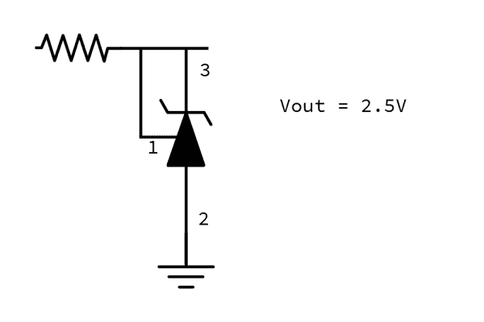](https://cdn.sparkfun.com/assets/learn_tutorials/4/2/3/tl431a-schem1.png)

需要选择上图所示的输入电阻，使 TL431A 偏置至少 1 mA。您可以使用公式 **Rin = (Vin-Vout)/0.001** 找到最大值。典型应用使用 150 &欧姆之间的值；和 10K &欧姆；用作空载基准电压源时，输入电阻相对来说并不重要，但如果提供大电流，电阻越小，功耗越低。

改变输出电压需要另外两个电阻。

[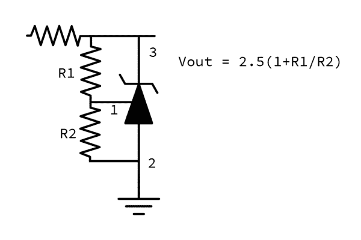](https://cdn.sparkfun.com/assets/learn_tutorials/4/2/3/tl431a-schem2.png)

如数据手册的[图 10](https://cdn.sparkfun.com/assets/learn_tutorials/4/2/3/TL431.pdf) 所示，如果您为 R1 使用电位计，您可以制作一个可变电压基准。

You'll notice that the first circuit is actually the extreme case of the second circuit. R1 is 0, and R2 is infinity, the R1/R2 term becomes 0, and the output becomes *Vout = (2.5V * 1)* or simply *2.5V*.

TL431A 的输出最适合用作其它电路的基准电压源(如比较器或模数转换器)，但不太适合为外部电路供电。虽然它可以产生稳定的输出电压，但它需要阴极电阻，如果负载消耗大量电流，阴极电阻就会散热。可调电压调节器是一种类似的集成电路，可以绕过这一限制。

### LM317L 电压调节器

LM317L 类似于 TL431A，但它旨在用作电源的一部分。

*LM317L*

您会注意到照片中零件上的标记有一个额外的后缀“Z ”,表示 TO-92 主体，包装为松散件(与胶带相对)。

LM317L 的配置也类似于 LT431A，由一对电阻设置输出电压。您会注意到，它不像 TL431A 那样在输入端需要电阻。

在该电路中，值得注意的是从输入端到地和输出端到地的电容。[数据表](https://cdn.sparkfun.com/assets/learn_tutorials/4/2/3/lm317l.pdf)表示

> 输入电容不是必需的，但建议使用，特别是当调节器不靠近电源滤波器电容时。
> ...
> 输出电容改善瞬态响应，但不需要稳定。

它还建议输入电容值为 0.1uF，输出电容值为 1uF。

LM317L 的额定电源高达 100 mA。如果你需要更大的电流，可以考虑增加 LM317L 的更大的兄弟，TO-220 封装的 LM317。如果你增加一个大的[散热器](https://www.sparkfun.com/products/9576)，你可以从中吸取更多的电流。

## 资源和更进一步

### 资源

*   每个器件的数据表:
    *   [1N4004](https://cdn.sparkfun.com/assets/learn_tutorials/4/2/3/1N4004.pdf) 功率二极管
    *   [1N4148](https://cdn.sparkfun.com/assets/learn_tutorials/4/2/3/1n4148.pdf) 小信号二极管
    *   [2N3904](https://cdn.sparkfun.com/assets/learn_tutorials/4/2/3/2N3904.PDF) NPN 晶体管
    *   [2N3906](https://cdn.sparkfun.com/assets/learn_tutorials/4/2/3/2N3906.PDF) PNP 晶体管
    *   [5LN01SP](https://cdn.sparkfun.com/assets/learn_tutorials/4/2/3/5ln01sp.PDF) N 沟道 MOSFET
    *   [5LP01SP](https://cdn.sparkfun.com/assets/learn_tutorials/4/2/3/5lp01sp.PDF) P 沟道 MOSFET
    *   [TL431A](https://cdn.sparkfun.com/assets/learn_tutorials/4/2/3/TL431.pdf) 可调参考电压
    *   [LM317L](https://cdn.sparkfun.com/assets/learn_tutorials/4/2/3/lm317l.pdf) 可调稳压器
*   这里有几个方便的在线计算器
    *   对于 [LM317 电阻](http://www.learningaboutelectronics.com/Articles/LM317-resistor-and-voltage-calculator.php)
    *   对于 [TL431A 电阻器](http://www.a-ling.net/alweb/hifi/tl431_reg_calc/tl431_reg.htm)
*   那些有趣的 *1Nxxxx* 和 *2Nxxxx* 零件号是 [JEDEC 编号系统](https://www.jedec.org/standards-documents/type-registration-data-sheets)的例子。

### 更进一步

*   如果你用分立半导体构建电路，你可能需要一些其他元件来充分利用它们。
    *   [电阻器套件](https://www.sparkfun.com/products/10969)
    *   [电源电阻套件](https://www.sparkfun.com/products/13053)
    *   [电容器套件](https://www.sparkfun.com/products/13698)
*   根据 Pete 的视频，有许多讨论分立半导体应用的视频。
    *   [晶体管偏置](https://www.youtube.com/watch?v=t0UOSIUve9E)
    *   [晶体管偏置，Pt 2。](https://www.youtube.com/watch?v=IkabRft5Sdk&index=5&list=PL9EF3C374FD903ACE)
    *   [电流镜](https://www.youtube.com/watch?v=Lo7lNnfcCsY&index=4&list=PL9EF3C374FD903ACE)
    *   [差分对](https://www.youtube.com/watch?v=l4i76jKmI8g&index=3&list=PL9EF3C374FD903ACE)
*   Forrest Mims 的书里充满了简单的电路，你可以用少量的元件在试验板上构建这些电路。与分立半导体特别相关的是[电子公式中的电路，符号&电路](https://www.sparkfun.com/products/11134)。
*   对于一个稍微高级一点的项目，高保真音频大师 Nelson Pass 写了一篇关于使用双极晶体管、MOSFETs 和真空管构建[分立运算放大器](https://www.passdiy.com/pdf/diyopamp.pdf)的文章。**