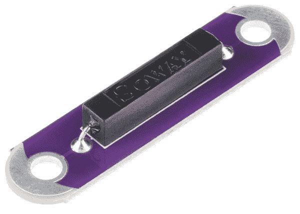

# LilyPad 簧片开关连接指南

> 原文：<https://learn.sparkfun.com/tutorials/lilypad-reed-switch-hookup-guide>

## LilyPad 簧片开关简介

[LilyPad 簧片开关](https://www.sparkfun.com/products/13343)是簧片开关的一个简单分支，它将使其易于在电子纺织品电路中使用，就像您目前可以使用 [LilyPad 按钮](https://www.sparkfun.com/products/8776)和[开关](https://www.sparkfun.com/products/9350)一样。为了使它更耐用，我们使用了[不同风格的](https://www.sparkfun.com/products/10601)簧片开关，它是绝缘的。这意味着同样的玻璃开关被黑色塑料包裹着，更难被打破，但它的工作方式完全相同。

### 材料

为了跟随本教程，我们推荐以下材料: