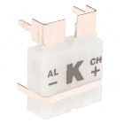

# MAX31855K 热电偶分接头连接指南

> 原文：<https://learn.sparkfun.com/tutorials/max31855k-thermocouple-breakout-hookup-guide>

## 介绍

[MAX31855K 热电偶分线点](https://www.sparkfun.com/products/13266)是一款简单的 14 位分辨率、SPI 兼容型串行接口热电偶数字化仪，可以读取各种温度。我们将这款设备与所有必要的组件一起放在一个分线板上，让使用它变得轻而易举！

 

将**添加到您的[购物车](https://www.sparkfun.com/cart)中！**

 **### [SparkFun 热电偶分接头- MAX31855K](https://www.sparkfun.com/products/13266)

[23 available](https://learn.sparkfun.com/static/bubbles/ "23 available") SEN-13266

SparkFun MAX31855K 热电偶分线器是一款简单的 14 位分辨率、SPI 兼容型串行接口热电偶分线器…

$18.508[Favorited Favorite](# "Add to favorites") 20[Wish List](# "Add to wish list")** **该分线点设计用于与 k 型热电偶配合使用，如下面所示的[这个](https://www.sparkfun.com/products/251)。

 

将**添加到您的[购物车](https://www.sparkfun.com/cart)中！**

 **### [热电偶类型-K -玻璃编织绝缘(裸线)](https://www.sparkfun.com/products/251)

[In stock](https://learn.sparkfun.com/static/bubbles/ "in stock") SEN-00251

36 "高温 K 型热电偶，带玻璃编织绝缘。

$16.951[Favorited Favorite](# "Add to favorites") 10[Wish List](# "Add to wish list")** **在本教程中，我们将让您熟悉 MAX31855K 的工作原理。我们将讨论如何将其连接到我们的 [3.3V Arduino Pro Mini](https://www.sparkfun.com/products/11114) ，但是您可以使用这种分线板和几乎无限的其他选项。任何可以通过 SPI 通信的东西都可以。它可以像一组定制的逻辑门、大多数微处理器一样简单，也可以像你的服务器主板一样复杂。确保您使用的是 3.3V 的**，或者电平转换到 3.0V 到 3.6V 的范围内。我们将用一些示例 Arduino 代码来结束本教程。**

### 建议的材料

要跟随本教程，您需要以下内容:

 

将**添加到您的[购物车](https://www.sparkfun.com/cart)中！**

 **### [Arduino Pro Mini 328-3.3V/8 MHz](https://www.sparkfun.com/products/11114)

[In stock](https://learn.sparkfun.com/static/bubbles/ "in stock") DEV-11114

SparkFun 对 Arduino 的极简设计方法。这是一个 3.3V Arduino 运行 8MHz 引导加载程序。

$10.9552[Favorited Favorite](# "Add to favorites") 91[Wish List](# "Add to wish list")**** 

将**添加到您的[购物车](https://www.sparkfun.com/cart)中！**

 **### [SparkFun FTDI 基本突破- 3.3V](https://www.sparkfun.com/products/9873)

[In stock](https://learn.sparkfun.com/static/bubbles/ "in stock") DEV-09873

这是我们[FTDI Basic](https://www . spark fun . com/products/retired/8772)的最新修订版。我们现在使用 SMD 6 针头…

$16.9566[Favorited Favorite](# "Add to favorites") 55[Wish List](# "Add to wish list")**** 

将**添加到您的[购物车](https://www.sparkfun.com/cart)中！**

 **### [热电偶类型-K -玻璃编织绝缘(裸线)](https://www.sparkfun.com/products/251)

[In stock](https://learn.sparkfun.com/static/bubbles/ "in stock") SEN-00251

36 "高温 K 型热电偶，带玻璃编织绝缘。

$16.951[Favorited Favorite](# "Add to favorites") 10[Wish List](# "Add to wish list")**** 

将**添加到您的[购物车](https://www.sparkfun.com/cart)中！**

 **### [SparkFun 热电偶分接头- MAX31855K](https://www.sparkfun.com/products/13266)

[23 available](https://learn.sparkfun.com/static/bubbles/ "23 available") SEN-13266

SparkFun MAX31855K 热电偶分线器是一款简单的 14 位分辨率、SPI 兼容型串行接口热电偶分线器…

$18.508[Favorited Favorite](# "Add to favorites") 20[Wish List](# "Add to wish list")******** ********或者，您可以将该热电偶探头与热电偶连接器结合使用

 

将**添加到您的[购物车](https://www.sparkfun.com/cart)中！**

 **### [热电偶类型-K -不锈钢](https://www.sparkfun.com/products/13715)

[In stock](https://learn.sparkfun.com/static/bubbles/ "in stock") SEN-13715

这是一个不锈钢 K 型热电偶探头。热电偶的工作原理是将两根不同金属制成的导线连接起来

$5.504[Favorited Favorite](# "Add to favorites") 12[Wish List](# "Add to wish list")**** 

将**添加到您的[购物车](https://www.sparkfun.com/cart)中！**

 **### [热电偶连接器- PCC-SMP-K](https://www.sparkfun.com/products/13612)

[Only 1 left!](https://learn.sparkfun.com/static/bubbles/ "only 1 left!") PRT-13612

这种热电偶连接器非常适合桥接带 PCB 的标准连接器的 K 型热电偶之间的间隙。…

$10.95[Favorited Favorite](# "Add to favorites") 13[Wish List](# "Add to wish list")**** *****   一个 3.3V Arduino 板，如我们的 [3.3V Arduino Pro Mini](https://www.sparkfun.com/products/11114) ，或另一个运行在 3.3V 的微控制器或任何带有一个或两个[逻辑电平转换器](https://www.sparkfun.com/products/12009)的微控制器。
*   K 型热电偶 -这些热电偶有多种形式
*   [MAX31855K 分线板](https://www.sparkfun.com/products/13266)

为了将分线点连接到微控制器，你可能需要一些[公接头](https://www.sparkfun.com/products/116)，或者你可以使用几根[线](https://www.sparkfun.com/products/11375)。

此外，您可能需要以下内容:

*   [PCC-SMP-K 热电偶连接器](https://www.sparkfun.com/products/13612) -允许插入标准热电偶。
*   [带连接器的热电偶](http://www.phidgets.com/products.php?product_id=3108_1) - K 型热电偶****************