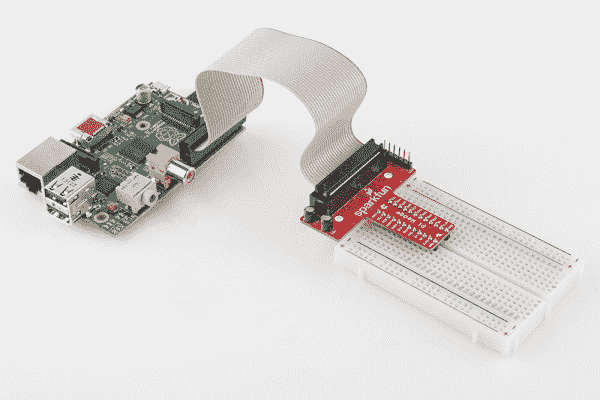

# 树莓 gPIo

> 原文：<https://learn.sparkfun.com/tutorials/raspberry-gpio>

## 介绍

相对于它的尺寸来说，树莓派(Raspberry Pi)是一台强劲的计算机——它可以驱动 HDMI 显示器，处理鼠标、键盘和相机输入，连接到互联网，并运行全功能的 Linux 发行版。但它不仅仅是一台小型计算机，它还是一个硬件原型制作工具！Pi 有**双向 I/O 引脚**，可以用来驱动发光二极管、旋转电机或读取按钮。

本教程最初是为 [Raspberry Pi 型号 B](https://www.sparkfun.com/products/11546) 编写的，但适用于任何带有标准 2x20 标题的 Raspberry Pi 型号。

*Example [Pi Wedge](https://www.sparkfun.com/products/12652) on a Model B*

驱动 Raspberry Pi 的 I/O 线路需要一点编程。用什么语言编程？你挑吧！快速浏览一下 [Raspberry Pi GPIO 示例](http://elinux.org/RPi_Low-level_peripherals#GPIO_Code_examples)会发现有几十种编程语言可供选择。我们精简了列表，最终得到了两个真正可靠、简单的驱动 I/O 的工具: [Python](https://www.sparkfun.com/python) 和 C(使用 WiringPi 库)。

如果你从未使用 Raspberry Pi 驱动过 LED 或阅读过按钮，本教程将帮助你入门。无论您是易读的解释性脚本语言 Python 的粉丝，还是铁杆 C 程序员，您都会找到适合我们需求的编程选项。

### 本教程涵盖的内容

在本教程中，我们将展示读取和驱动 Raspberry Pi 的 GPIO 引脚的两种不同方法: **python** 和 **C** 。以下是涵盖内容的快速概述:

*   [GPIO 引脚排列](https://learn.sparkfun.com/tutorials/raspberry-gpio/gpio-pinout)-Pi 的 GPIO 头概述。
*   **Python API 和示例**
    *   [RPi。GPIO API](https://learn.sparkfun.com/tutorials/raspberry-gpio/python-rpigpio-api)——概述了可以用来驱动 GPIO 的 Python 函数。
    *   [RPi。GPIO 示例](https://learn.sparkfun.com/tutorials/raspberry-gpio/python-rpigpio-example)——展示输入和输出功能的示例 Python 脚本。
*   **C(和 WiringPi) API 和示例**
    *   [WiringPi 设置和测试](https://learn.sparkfun.com/tutorials/raspberry-gpio/c-wiringpi-setup)——如何安装 WiringPi，然后在命令行上进行测试。
    *   [wiring pi API](https://learn.sparkfun.com/tutorials/raspberry-gpio/c-wiringpi-api)——wiring pi 库提供的基本功能概述。
    *   这个简单的示例程序展示了 WiringPi 的输入和输出能力。
*   [使用 IDE](https://learn.sparkfun.com/tutorials/raspberry-gpio/using-an-ide) -如何下载和安装 Geany。我们最喜欢的在 Raspberry Pi 上编程的 IDE。

每种编程语言都有各自的优点和缺点。Python 很简单(尤其是如果你是编程新手)，不需要任何编译。c 更快，对于熟悉旧备用的人来说可能更容易。

### 你需要什么

这里有一个愿望清单——包含了我们在本教程中用到的所有东西。