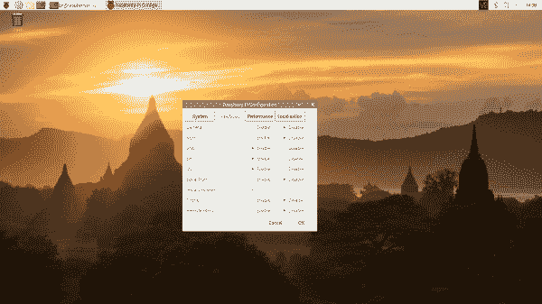
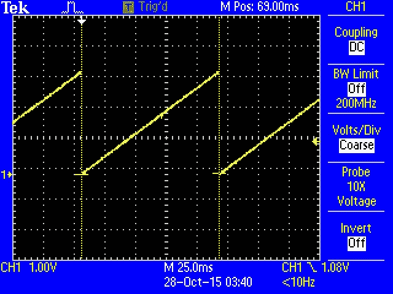

# 树莓派 SPI 和 I2C 教程

> 原文：<https://learn.sparkfun.com/tutorials/raspberry-pi-spi-and-i2c-tutorial>

## 介绍

有许多外设可以通过 I2C 和 SPI 串行接口添加到微处理器中。其中包括[大气传感器](https://www.sparkfun.com/products/13676)、[EEPROM](https://www.sparkfun.com/products/525)、[几种](https://www.sparkfun.com/products/11441) [类型](https://www.sparkfun.com/products/13279)的[显示器](https://www.sparkfun.com/products/13003)。

[](https://cdn.sparkfun.com/assets/learn_tutorials/4/4/9/wedge-n-pi.jpg)*The Pi Wedge helps access the I2C and SPI signals.*

本教程将带你了解树莓 PI 的 I2C 和 SPI 接口。这些接口在默认情况下是不启用的，在使用它们之前需要一些额外的配置。

### 推荐阅读

在我们开始之前，你可能想回顾一些相关的背景材料。

*   [I2C](https://learn.sparkfun.com/tutorials/i2c) 是一种有用的总线，允许微控制器和外设之间以最少的布线进行数据交换。
*   SPI 是 I2C 的近亲，也有类似的应用。
*   对于 C/C++示例，我们将使用 [wiringPi](http://wiringpi.com/) 库与这些总线接口
*   对于 [Python](https://www.sparkfun.com/python) 的例子，我们将使用 [spidev](https://pypi.org/project/spidev/) 用于 SPI，smbus 用于 I2C。

**Updated Aug 17, 2018:** Added Python examples, added suggestions for alternative ways of installing Raspbian, updated screenshots to show newer raspi-config, and added suggested projects in the "Resources and Going Further" section.

## 想亲自体验树莓派吗？

我们掩护你！

[](https://www.sparkfun.com/products/13717) 

将**添加到您的[购物车](https://www.sparkfun.com/cart)中！**

 **### [spark funπ楔](https://www.sparkfun.com/products/13717)

[Out of stock](https://learn.sparkfun.com/static/bubbles/ "out of stock") BOB-13717

这是 SparkFun Pi Wedge，一个连接到 Raspberry Pi 上的 40 针 GPIO 连接器并断开 Pi 的小电路板…

$12.9512[Favorited Favorite](# "Add to favorites") 46[Wish List](# "Add to wish list")****[](https://www.sparkfun.com/products/14643) 

### [树莓派 3 B+](https://www.sparkfun.com/products/14643)

[Out of stock](https://learn.sparkfun.com/static/bubbles/ "out of stock") DEV-14643

Raspberry Pi 3 B+在这里为您提供与以前相同的 Pi，但现在具有千兆位和 PoE 能力的以太网！

35[Favorited Favorite](# "Add to favorites") 75[Wish List](# "Add to wish list")[](https://www.sparkfun.com/products/15446) 

### [【树莓派 4 型号 B (2 GB)](https://www.sparkfun.com/products/15446)

[Out of stock](https://learn.sparkfun.com/static/bubbles/ "out of stock") DEV-15446

2 GB Raspberry Pi 4 具有运行两个 4k 分辨率显示器的能力，以运行真正的千兆位以太网操作，所有…

4[Favorited Favorite](# "Add to favorites") 119[Wish List](# "Add to wish list")[](https://www.sparkfun.com/products/15447) 

### [树莓派 4 型号 B (4 GB)](https://www.sparkfun.com/products/15447)

[Out of stock](https://learn.sparkfun.com/static/bubbles/ "out of stock") DEV-15447

4 GB Raspberry Pi 4 具有运行两个 4k 分辨率显示器的能力，以运行真正的千兆以太网操作，所有…

17[Favorited Favorite](# "Add to favorites") 173[Wish List](# "Add to wish list")****[See all Raspberry Pi products](https://www.sparkfun.com/categories/233)** **## 背景和软件设置

[Raspberry Pi](https://www.sparkfun.com/raspberry_pi) 在 GPIO 头上有三种类型的串行接口。你可能已经熟悉了 UART 串行端口，它允许你从[串行终端应用](https://learn.sparkfun.com/tutorials/terminal-basics)打开一个登录会话，比如 [PuTTY](http://www.putty.org/) 。

另外两个串行接口是串行外设接口( **SPI** )和集成电路间总线( **I2C** )。[Pi 上的 SPI](https://learn.sparkfun.com/tutorials/serial-peripheral-interface-spi) 允许最多连接两个设备，而 [I2C](https://learn.sparkfun.com/tutorials/i2c) 可能允许许多设备，只要它们的地址不冲突。

### 软件详情

自从引入 Pi 以来，Raspberry Pi 的软件环境已经有了很大的发展。许多不同的操作系统被移植到 Pi 上，设备驱动程序基础设施也发生了很大的变化。

对于本教程，我们将使用最新版本的 Raspbian(通过 NOOBS 安装)，以及 C/C++的 wiringPi I/O 库(或者 Python 的 spidev/smbus)。

随着 Raspbian 中设备树覆盖的实现，一些特定的接口启用细节发生了变化。如果你正在使用一个旧的安装，备份你的 SD 卡并开始一个全新的安装可能是值得的。

#### 操作系统和库安装

如果你是从零开始，用一张空白的 SD 卡，你会想安装 Raspbian。如果您已经有了一个可以工作的 Raspbian 系统，请跳到下一节。

*   下载 NOOBS 的图片。在撰写本文时，它的版本是 2.8.2。
*   遵循官方[安装说明](https://www.raspberrypi.org/help/noobs-setup/)。

如果您想用其他方法设置您的 Pi，请参考以下教程:

[](https://learn.sparkfun.com/tutorials/raspberry-pi-3-starter-kit-hookup-guide) [### 树莓 Pi 3 入门套件连接指南](https://learn.sparkfun.com/tutorials/raspberry-pi-3-starter-kit-hookup-guide) Guide for getting going with the Raspberry Pi 3 Model B and Raspberry Pi 3 Model B+ starter kit.[Favorited Favorite](# "Add to favorites") 13[](https://learn.sparkfun.com/tutorials/headless-raspberry-pi-setup) [### 无头 Raspberry Pi 设置](https://learn.sparkfun.com/tutorials/headless-raspberry-pi-setup) Configure a Raspberry Pi without a keyboard, mouse, or monitor.[Favorited Favorite](# "Add to favorites") 16[](https://learn.sparkfun.com/tutorials/setting-up-a-raspberry-pi-3-as-an-access-point) [### 将 Raspberry Pi 3 设置为接入点](https://learn.sparkfun.com/tutorials/setting-up-a-raspberry-pi-3-as-an-access-point) This guide will show you how to configure a Raspberry Pi as an access point and connect it to your local Ethernet network to share Internet to other WiFi devices.[Favorited Favorite](# "Add to favorites") 8[](https://learn.sparkfun.com/tutorials/how-to-use-remote-desktop-on-the-raspberry-pi-with-vnc) [### 如何用 VNC 在树莓 Pi 上使用远程桌面](https://learn.sparkfun.com/tutorials/how-to-use-remote-desktop-on-the-raspberry-pi-with-vnc) Use RealVNC to connect to your Raspberry Pi to control the graphical desktop remotely across the network.[Favorited Favorite](# "Add to favorites") 8

对于用 C/C++编程的人，我们建议查看 [Raspberry gPIo 来设置](https://learn.sparkfun.com/tutorials/raspberry-gpio#c-wiringpi-setup)接线 Pi。为了您的方便，我们在下面提供了以下说明。

[](https://learn.sparkfun.com/tutorials/raspberry-gpio) [### 树莓 gPIo

#### 2015 . 10 . 29](https://learn.sparkfun.com/tutorials/raspberry-gpio) How to use either Python or C++ to drive the I/O lines on a Raspberry Pi.[Favorited Favorite](# "Add to favorites") 17

#### C/C++(接线 Pi)设置

**Note:** Wiring Pi is now pre-installed with standard Raspbian systems. The [instructions from the official WiringPi homepage are now depreciated.](https://projects.drogon.net/raspberry-pi/wiringpi/download-and-install/) The original wiringPi source "`git://git.drogon.net/wiringPi`" is not available.

以前，早期版本的 Raspbian 不包含接线 Pi。这需要用户下载并安装它。幸运的是，布线 Pi 包含在标准 Raspbian 系统中。如果您正在寻找使用镜像连线 Pi 进行小更新来支持较新的硬件，我们建议查看这个 [GitHub 库](https://github.com/WiringPi/WiringPi)。

您将需要 git(可能默认安装)。如果没有安装 git，请在命令行中输入以下内容。

```
language:bash
sudo apt-get install git-core 
```

我们强烈建议使用 Git 下载最新版本。要检查您的版本，请输入以下命令。

```
language:bash
gpio -v 
```

如果您用`Unknown17`收到类似于下面的输出，您将希望在 Raspberry Pi 4 或更高版本上更新 WiringPi。

```
language:bash
gpio version: 2.50
Copyright (c) 2012-2018 Gordon Henderson
This is free software with ABSOLUTELY NO WARRANTY.
For details type: gpio -warranty

Raspberry Pi Details:
  Type: Unknown17, Revision: 02, Memory: 0MB, Maker: Sony
    * Device tree is enabled.
    * --> Raspberry Pi 4 Model B Rev 1.2
    * This Raspberry Pi supports user-level GPIO access. 
```

输入以下内容以删除 wiringPi 和配置文件。

```
language:bash
sudo apt-get purge wiringpi 
```

然后为 Pi 键入以下内容，删除所有记住 wiringPi 的位置。

```
language:bash
hash -r 
```

只要安装了 Git，下载和安装 Wiring Pi 就只需要这些命令了。

```
language:bash
git clone https://github.com/WiringPi/WiringPi.git 
```

这将在当前目录下创建一个名为 WiringPi 的文件夹。前往接线 Pi 目录。

```
language:bash
cd WiringPi 
```

然后从原点拉最新的变化。

```
language:bash
git pull origin 
```

然后输入以下命令。`./build`是一个从源文件构建接线 Pi 的脚本。这将构建助手文件，修改 Linux 中的一些路径，并使 WiringPi 准备就绪。

```
language:bash
./build 
```

此时，库应该工作。运行下面显示的`gpio`命令，查看一些关于 wiringPi 版本和运行它的 Pi 的信息。

```
language:bash
gpio -v 
```

输入以下命令将绘制一个表格，说明 40 针连接器中的针配置。

```
language:bash
gpio readall 
```

I2C 和 SPI 接口都需要一些额外的配置和初始化，我们将在后面的章节中介绍。

#### Python (spidev/smbus)设置

按照 Python 编程教程中的[配置您的 Pi 部分来设置 Python 3 并安装 pip。](https://learn.sparkfun.com/tutorials/python-programming-tutorial-getting-started-with-the-raspberry-pi/configure-your-pi)

[](https://learn.sparkfun.com/tutorials/python-programming-tutorial-getting-started-with-the-raspberry-pi) [### Python 编程教程:Raspberry Pi 入门

#### 2018 年 6 月 27 日](https://learn.sparkfun.com/tutorials/python-programming-tutorial-getting-started-with-the-raspberry-pi) This guide will show you how to write programs on your Raspberry Pi using Python to control hardware.[Favorited Favorite](# "Add to favorites") 27

## 连接到端口

在我们进入配置和软件示例之前，让我们先找到每个接口使用的引脚。

如果您直接连接到 Pi 上的引脚，它们有点杂乱无章。I2C.1 靠近一端，SPI 和 I2C.0 在表头中间。如果您连接到这些引脚，请务必仔细计数。

[](https://cdn.sparkfun.com/assets/learn_tutorials/4/4/9/pin-labels-on-pi-ver2.png)*Pi Serial Bus Pins*

[Pi 楔](https://www.sparkfun.com/products/13717)适配器 PCB 重新排列管脚，并清楚地标记它们。我们将在下面的例子中使用楔形。

[](https://cdn.sparkfun.com/assets/learn_tutorials/4/4/9/pin-labels-on-wedge.png)*Wedge Serial Bus Pins*

## PI 上的 SPI

### 配置

SPI 外设默认不开启。有两种方法可以调整设置。要启用它，请执行以下操作。

#### 通过桌面 GUI 进行 Raspberry Pi 配置

 您可以通过进入 **Pi 开始菜单** > **偏好设置** > **树莓 Pi 配置**来使用桌面 GUI。

[](https://cdn.sparkfun.com/assets/learn_tutorials/4/4/9/Raspberry-Pi-Configuration-User-Settings-GUI.png)*Click on image for a closer view.*

将弹出一个带有不同选项卡的窗口来调整设置。我们感兴趣的是**界面**标签。点击选项卡，选择**启用**SPI。此时，您可以根据项目需要启用其他接口。点击**确定**按钮保存。

[](https://cdn.sparkfun.com/assets/learn_tutorials/4/4/9/Raspberry-Pi-Configuration-Enable-Interfaces.png)*Click on image for a closer view.*

我们建议重新启动您的 Pi 以确保更改生效。点击 **Pi 开始菜单** > **首选项** > **关机**。因为我们只需要重启，所以点击**重启**按钮。

|  | [](https://cdn.sparkfun.com/assets/learn_tutorials/4/4/9/Raspberry-Pi-Menu-Shutdown.png) |
| *关机* | *关机、重启、注销* |

*Click on images for a closer view.*

#### raspi-配置工具通过终端

如果您使用的是终端，您需要:

1.  运行`sudo raspi-config`。
2.  使用向下箭头选择`5 Interfacing Options`
3.  向下箭头指向`P4 SPI`。
4.  当它要求您启用 SPI 时，选择`yes`，
5.  如果询问是否自动加载内核模块，也选择`yes`。
6.  使用向右箭头选择`<Finish>`按钮。
7.  当它要求重启时，选择`yes`。

[](https://cdn.sparkfun.com/assets/learn_tutorials/4/4/9/spi-menu2.png)*Raspi-config for SPI*

系统将重新启动。当它重新启动时，登录并输入以下命令

```
language:bash
ls /dev/*spi* 
```

Pi 应该响应

```
language:bash
/dev/spidev0.0  /dev/spidev0.1 
```

它们分别代表芯片使能引脚 0 和 1 上的 SPI 器件。这些引脚在 Pi 中是硬连线的。通常，这意味着该接口最多支持两个外设，但也有多个器件以菊花链形式连接，共享一个芯片使能信号的情况。

### 编程示例

#### 所需材料

*   [40 针圆头楔](https://www.sparkfun.com/products/13717)。
*   一台[树莓 Pi B+](https://www.sparkfun.com/products/12994) 或[Pi 2 B 型](https://www.sparkfun.com/products/13297)单板机。
*   一个[无焊](https://www.sparkfun.com/products/12002)T2 试验板。
*   一些[跳线](https://www.sparkfun.com/products/8431)。
*   您选择的标题。
*   一个[串行七段](https://www.sparkfun.com/products/11441)显示。

串行 7 段显示对于测试串行接口特别有用，因为它可以接受来自 UART、SPI 或 I2C 的命令。接线前，确保在 7 段显示器上[焊接](https://learn.sparkfun.com/tutorials/how-to-solder-through-hole-soldering)插头引脚。

#### 连接表

显示器通过 Pi 楔连接到 Pi，如下所示。

| **树莓 Pi 信号** | **串行 7 段信号** |
| GND | GND |
| 3.3V | VCC |
| 这一个 | 换档选择 |
| 血清肌酸激酶 | 血清肌酸激酶 |
| MOSI | 战略防御计划(Strategic Defence Initiative) |
| 军事情报部门组织(Military Intelligence Service Organization) | 合成干性油（synthetic drying oil 的缩写） |

测试硬件看起来像这样。

[](https://cdn.sparkfun.com/assets/learn_tutorials/4/4/9/spi-sample.jpg)*Serial 7-Segment connections for SPI*

#### 示例 C++程序

```
language:c
/******************************************************************************
spitest.cpp
Raspberry Pi SPI interface demo
Byron Jacquot @ SparkFun Electronics>
4/2/2014
https://github.com/sparkfun/Pi_Wedge

A brief demonstration of the Raspberry Pi SPI interface, using the SparkFun
Pi Wedge breakout board.

Resources:

This example makes use of the Wiring Pi library, which streamlines the interface
to the the I/O pins on the Raspberry Pi, providing an API that is similar to the
Arduino.  You can learn about installing Wiring Pi here:
http://wiringpi.com/download-and-install/

The wiringPi SPI API is documented here:
https://projects.drogon.net/raspberry-pi/wiringpi/spi-library/

The init call returns a standard file descriptor.  More detailed configuration
of the interface can be performed using ioctl calls on that descriptor.
See the wiringPi SPI implementation (wiringPi/wiringPiSPI.c) for some examples.
Parameters configurable with ioctl are documented here:
http://git.kernel.org/cgit/linux/kernel/git/torvalds/linux.git/tree/Documentation/spi/spidev

Hardware connections:

This file interfaces with the SparkFun Serial 7 Segment display:
https://www.sparkfun.com/products/11629

The board was connected as follows:
(Raspberry Pi)(Serial 7 Segment)
GND  -> GND
3.3V -> Vcc
CE1  -> SS (Shift Select)
SCK  -> SCK 
MOSI -> SDI
MISO -> SDO

To build this file, I use the command:
>  g++ spitest.cpp -lwiringPi

Then to run it, first the spi kernel module needs to be loaded.  This can be 
done using the GPIO utility.
> gpio load spi
> ./a.out

This test uses the single-segment mode of the 7 segment display.  It shifts a 
bit through the display characters, lighting a single character of each at a 
time.

Development environment specifics:
Tested on Raspberry Pi V2 hardware, running Raspbian.
Building with GCC 4.6.3 (Debian 4.6.3-14+rpi1)

This code is beerware; if you see me (or any other SparkFun employee) at the
local, and you've found our code helpful, please buy us a round!

Distributed as-is; no warranty is given.
******************************************************************************/

#include <iostream>
#include <errno.h>
#include <wiringPiSPI.h>
#include <unistd.h>

using namespace std;

// channel is the wiringPi name for the chip select (or chip enable) pin.
// Set this to 0 or 1, depending on how it's connected.
static const int CHANNEL = 1;

int main()
{
   int fd, result;
   unsigned char buffer[100];

   cout << "Initializing" << endl ;

   // Configure the interface.
   // CHANNEL insicates chip select,
   // 500000 indicates bus speed.
   fd = wiringPiSPISetup(CHANNEL, 500000);

   cout << "Init result: " << fd << endl;

   // clear display
   buffer[0] = 0x76;
   wiringPiSPIDataRW(CHANNEL, buffer, 1);

   sleep(5);

   // Do a one-hot bit selection for each field of the display
   // It displays gibberish, but tells us that we're correctly addressing all 
   // of the segments.
   for(int i = 1; i <= 0x7f; i <<= 1)
   {
      // the decimals, colon and apostrophe dots
      buffer[0] = 0x77;
      buffer[1] = i;
      result = wiringPiSPIDataRW(CHANNEL, buffer, 2);

      // The first character
      buffer[0] = 0x7b;
      buffer[1] = i;
      result = wiringPiSPIDataRW(CHANNEL, buffer, 2);

      // The second character
      buffer[0] = 0x7c;
      buffer[1] = i;
      result = wiringPiSPIDataRW(CHANNEL, buffer, 2);

      // The third character
      buffer[0] = 0x7d;
      buffer[1] = i;
      result = wiringPiSPIDataRW(CHANNEL, buffer, 2);

      // The last character
      buffer[0] = 0x7e;
      buffer[1] = i;
      result = wiringPiSPIDataRW(CHANNEL, buffer, 2);

      // Pause so we can see them
      sleep(5);
   }

   // clear display again
   buffer[0] = 0x76;
   wiringPiSPIDataRW(CHANNEL, buffer, 1);

} 
```

当您构建 wiringPi 时，您可能已经注意到了关于如何根据它编译应用程序的语句。

```
language:bash
NOTE: To compile programs with wiringPi, you need to add:
    -lwiringPi
to your compile line(s) To use the Gertboard, MaxDetect, etc.
code (the devLib), you need to also add:
    -lwiringPiDev
to your compile line(s). 
```

因此，我们使用命令进行编译。

```
language:bash
g++ spitest.cpp -l wiringPi -o spitest 
```

它生成一个可执行文件`spitest`。当我们运行`./spitest`时，它将锻炼显示器的每个部分。在移动到下一个区段之前，它点亮每个数字的一个区段 5 秒钟。总共需要 40 秒左右。

#### 示例 Python 程序

```
language:python
# spitest.py
# A brief demonstration of the Raspberry Pi SPI interface, using the Sparkfun
# Pi Wedge breakout board and a SparkFun Serial 7 Segment display:
# https://www.sparkfun.com/products/11629

import time
import spidev

# We only have SPI bus 0 available to us on the Pi
bus = 0

#Device is the chip select pin. Set to 0 or 1, depending on the connections
device = 1

# Enable SPI
spi = spidev.SpiDev()

# Open a connection to a specific bus and device (chip select pin)
spi.open(bus, device)

# Set SPI speed and mode
spi.max_speed_hz = 500000
spi.mode = 0

# Clear display
msg = [0x76]
spi.xfer2(msg)

time.sleep(5)

# Turn on one segment of each character to show that we can
# address all of the segments
i = 1
while i < 0x7f:

    # The decimals, colon and apostrophe dots
    msg = [0x77]
    msg.append(i)
    result = spi.xfer2(msg)

    # The first character
    msg = [0x7b]
    msg.append(i)
    result = spi.xfer2(msg)

    # The second character
    msg = [0x7c]
    msg.append(i)
    result = spi.xfer2(msg)

    # The third character
    msg = [0x7d]
    msg.append(i)
    result = spi.xfer2(msg)

    # The last character
    msg = [0x7e]
    msg.append(i)
    result = spi.xfer2(msg)

    # Increment to next segment in each character
    i <<= 1

    # Pause so we can see them
    time.sleep(5)

# Clear display again
msg = [0x76]
spi.xfer2(msg) 
```

用类似于 *spitest.py* 的名称保存程序，并运行它:

```
language:bash
python spitest.py 
```

这将在移动到下一个片段之前照亮每个字符的每个片段 5 秒钟。整个程序运行大约需要 40 秒。

## Pi 上的 I2C

### 配置

默认情况下，I2C 外围设备不打开。与 SPI 一样，有两种方法可以调整设置。要启用它，请执行以下操作。

#### 通过桌面 GUI 进行 Raspberry Pi 配置

 您可以通过进入 **Pi 开始菜单** > **偏好设置** > **树莓 Pi 配置**来使用桌面 GUI。

[](https://cdn.sparkfun.com/assets/learn_tutorials/4/4/9/Raspberry-Pi-Configuration-User-Settings-GUI.png)*Click on image for a closer view.*

将弹出一个带有不同选项卡的窗口来调整设置。我们感兴趣的是**界面**标签。点击选项卡，选择**为 I2C 启用**。此时，您可以根据项目需要启用其他接口。点击**确定**按钮相同。

[](https://cdn.sparkfun.com/assets/learn_tutorials/4/4/9/Raspberry-Pi-Configuration-Enable-Interfaces.png)*Click on image for a closer view.*

我们建议重新启动您的 Pi 以确保更改生效。点击 **Pi 开始菜单** > **首选项** > **关机**。因为我们只需要重启，所以点击**重启**按钮。

|  | [](https://cdn.sparkfun.com/assets/learn_tutorials/4/4/9/Raspberry-Pi-Menu-Shutdown.png) |
| *关机* | *关机、重启、注销* |

*Click on images for a closer view.*

#### raspi-配置工具通过终端

与 SPI 外设一样，I2C 默认不开启。同样，我们可以使用`raspi-config`来启用它。

1.  运行`sudo raspi-config`。
2.  使用向下箭头选择`5 Interfacing Options`
3.  向下箭头指向`P5 I2C`。
4.  当它要求您启用 I2C 时，选择`yes`
5.  如果询问是否自动加载内核模块，也选择`yes`。
6.  使用向右箭头选择`<Finish>`按钮。
7.  当它要求重启时，选择`yes`。

[](https://cdn.sparkfun.com/assets/learn_tutorials/4/4/9/i2c-menu2.png)*Raspi-config for I2C*

系统将重新启动。当它重新启动时，登录并输入以下命令

```
language:bash
ls /dev/*i2c* 
```

Pi 应该响应

```
language:bash
/dev/i2c-1 
```

它表示用户模式的 I2C 界面。

### 公用事业

有一组命令行实用程序可以帮助 I2C 界面工作。你可以通过 apt 包管理器得到它们。

```
language:bash
sudo apt-get install -y i2c-tools 
```

特别是，`i2cdetect`程序将探测总线上的所有地址，并报告是否存在任何设备。在命令行中输入以下命令。`-y`标志将禁用交互模式，这样您就不必等待确认。`1`表示我们正在扫描 I ² C 总线 1 上的 I ² C 设备(如 i2c-1)。

```
language:bash
i2cdetect -y 1 
```

您将从您的 Raspberry Pi 获得类似于下面的输出。

```
language:bash
pi@raspberrypi:~/$ i2cdetect -y 1
     0  1  2  3  4  5  6  7  8  9  a  b  c  d  e  f
00:          -- -- -- -- -- -- -- -- -- -- -- -- --
10: -- -- -- -- -- -- -- -- -- -- -- -- -- -- -- --
20: -- -- -- -- -- -- -- -- -- -- -- -- -- -- -- --
30: -- -- -- -- -- -- -- -- -- -- -- -- -- -- -- --
40: -- -- -- -- -- -- -- -- -- -- -- -- -- -- -- --
50: -- -- -- -- -- -- -- -- -- -- -- -- -- -- -- --
60: 60 -- -- -- -- -- -- -- -- -- -- -- -- -- -- --
70: -- -- -- -- -- -- -- -- 
```

该图表明在地址 **0x60** 有一个外设。我们可以尝试使用`i2cget`、`i2cset`和`i2cdump`命令来读写它的寄存器。

### 编程示例

#### 所需材料

*   [40 针圆头楔](https://www.sparkfun.com/products/13717)。
*   一台[树莓 Pi B+](https://www.sparkfun.com/products/12994) 或[Pi 2 B 型](https://www.sparkfun.com/products/13297)单板机。
*   一个[无焊](https://www.sparkfun.com/products/12002)T2 试验板。
*   一些[跳线](https://www.sparkfun.com/products/8431)。
*   您选择的接头引脚。
*   一个 [MCP4725](https://www.sparkfun.com/products/12918) 数模转换器。

#### 连接表

显示器通过 Pi 楔连接到 Pi，如下所示。

| **树莓 Pi 信号** | **MCP4725** |
| GND | GND |
| 3.3V | VCC |
| SCL | SCL |
| 国家药品监督管理局 | 国家药品监督管理局 |

测试硬件看起来像这样。

[](https://cdn.sparkfun.com/assets/learn_tutorials/4/4/9/i2c-sample.jpg)*DAC on a Breadboard*

#### 示例 C++程序

以下代码将连续值写入 DAC，在其输出引脚产生锯齿波。

```
language:c
/******************************************************************************
i2ctest.cpp
Raspberry Pi I2C interface demo
Byron Jacquot @ SparkFun Electronics>
4/2/2014
https://github.com/sparkfun/Pi_Wedge

A brief demonstration of the Raspberry Pi I2C interface, using the SparkFun
Pi Wedge breakout board.

Resources:

This example makes use of the Wiring Pi library, which streamlines the interface
the the I/O pins on the Raspberry Pi, providing an API that is similar to the
Arduino.  You can learn about installing Wiring Pi here:
http://wiringpi.com/download-and-install/

The I2C API is documented here:
https://projects.drogon.net/raspberry-pi/wiringpi/i2c-library/

The init call returns a standard file descriptor.  More detailed configuration
of the interface can be performed using ioctl calls on that descriptor.
See the wiringPi I2C implementation (wiringPi/wiringPiI2C.c) for some examples.
Parameters configurable with ioctl are documented here:
http://git.kernel.org/cgit/linux/kernel/git/torvalds/linux.git/tree/Documentation/i2c/dev-interface

Hardware connections:

This file interfaces with the SparkFun MCP4725 breakout board:
https://www.sparkfun.com/products/8736

The board was connected as follows:
(Raspberry Pi)(MCP4725)
GND  -> GND
3.3V -> Vcc
SCL  -> SCL
SDA  -> SDA

An oscilloscope probe was connected to the analog output pin of the MCP4725.

To build this file, I use the command:
>  g++ i2ctest.cpp -lwiringPi

Then to run it, first the I2C kernel module needs to be loaded.  This can be 
done using the GPIO utility.
> gpio load i2c 400
> ./a.out

This will run the MCP through its output range several times.  A rising 
sawtooth will be seen on the analog output.

Development environment specifics:
Tested on Raspberry Pi V2 hardware, running Raspbian.
Building with GCC 4.6.3 (Debian 4.6.3-14+rpi1)

This code is beerware; if you see me (or any other SparkFun employee) at the
local, and you've found our code helpful, please buy us a round!

Distributed as-is; no warranty is given.
******************************************************************************/

#include <iostream>
#include <errno.h>
#include <wiringPiI2C.h>

using namespace std;

int main()
{
   int fd, result;

   // Initialize the interface by giving it an external device ID.
   // The MCP4725 defaults to address 0x60\.   
   //
   // It returns a standard file descriptor.
   // 
   fd = wiringPiI2CSetup(0x60);

   cout << "Init result: "<< fd << endl;

   for(int i = 0; i < 0x0000ffff; i++)
   {
      // I tried using the "fast write" command, but couldn't get it to work.  
      // It's not entirely obvious what's happening behind the scenes as
      // regards to endianness or length of data sent.  I think it's only 
      // sending one byte, when we really need two.
      //
      // So instead I'm doing a 16 bit register access.  It appears to 
      // properly handle the endianness, and the length is specified by the 
      // call.  The only question was the register address, which is the 
      // concatenation of the command (010x = write DAC output) 
      // and power down (x00x = power up) bits.
      result = wiringPiI2CWriteReg16(fd, 0x40, (i & 0xfff) );

      if(result == -1)
      {
         cout << "Error.  Errno is: " << errno << endl;
      }
   }
} 
```

使用以下命令构建它并将其链接到 wiringPi。

```
language:bash
g++ i2ctest.cpp -l wiringPi -o i2ctest 
```

当你运行`i2ctest`时，DAC 会产生几秒钟的模拟锯齿波。

[](https://cdn.sparkfun.com/assets/learn_tutorials/4/4/9/TEK0007.JPG)*Waveform as measured at the `OUT` pin*

#### 示例 Python 程序

```
language:python
# i2ctest.py
# A brief demonstration of the Raspberry Pi I2C interface, using the Sparkfun
# Pi Wedge breakout board and a SparkFun MCP4725 breakout board:
# https://www.sparkfun.com/products/8736

import smbus

# I2C channel 1 is connected to the GPIO pins
channel = 1

#  MCP4725 defaults to address 0x60
address = 0x60

# Register addresses (with "normal mode" power-down bits)
reg_write_dac = 0x40

# Initialize I2C (SMBus)
bus = smbus.SMBus(channel)

# Create a sawtooth wave 16 times
for i in range(0x10000):

    # Create our 12-bit number representing relative voltage
    voltage = i & 0xfff

    # Shift everything left by 4 bits and separate bytes
    msg = (voltage & 0xff0) >> 4
    msg = [msg, (msg & 0xf) << 4]

    # Write out I2C command: address, reg_write_dac, msg[0], msg[1]
    bus.write_i2c_block_data(address, reg_write_dac, msg) 
```

使用类似于 *i2ctest.py* 的名称保存程序，并使用以下命令运行它:

```
language:bash
python i2ctest.py 
```

您应该会看到 DAC 输出端出现锯齿波。如果你连接一个示波器，你应该得到一个像 C++例子中显示的图像。注意 Python 比 C/C++慢多了！C++示例中锯齿波的周期约为 100 毫秒，而 Python 示例中锯齿波的周期接近 1.8 秒。

请注意，SMBus 是一个独立于 I ² C 之上的协议层。I ² C 的某些功能可能无法用于 SMBus。例如，SMBus 无法处理[时钟延伸](https://www.i2c-bus.org/clock-stretching/)，因此需要它进行通信的传感器将无法与 *smbus* 封装一起工作。

要了解更多关于 smbus 协议的信息，请参阅 T2 官方内核文档 T3。

## 40 引脚 Pi 板上的 I2C-0

### 额外的 I2C 巴士？

作为 B+improvements 的一部分，Raspberry Pi 基金会已经标准化了附加板的接口，他们称之为[“顶部添加的硬件”(HAT)](http://www.raspberrypi.org/introducing-raspberry-pi-hats/) 规范。它标准化了附加板的物理外形，并为 B+提供了在启动时自动识别和初始化 HATs 的功能。它使用 I2C 总线从帽子上的 EEPROM 读取描述，类似于比格犬骨黑上的[斗篷标识](https://learn.sparkfun.com/tutorials/beaglebone-black-proto-cape-hookup-guide#using-the-eeprom)。

这种能力在 A+和 Pi 2 Model B 上也得到了延续。该 I2C 总线位于 ID_SC 和 ID_SD 引脚(40 引脚连接器的引脚 27 和 28)上，但在您对在该总线上添加外设感到兴奋之前，请注意该端口原理图中的注释。

[](https://cdn.sparkfun.com/assets/learn_tutorials/3/2/5/bplus-gpio.png)*Schematic snippet for 40-Pin GPIO connector (J8). Click on the image for a closer look.*

这在[帽子设计指南](https://github.com/raspberrypi/hats/blob/master/designguide.md)中有进一步的说明

> 在 B+型上，GPIO0 (ID_SD)和 GPIO1 (ID_SC)将切换到 ALT0 (I2C-0)模式，并探测 EEPROM。一旦探测序列完成，这些引脚将恢复为输入。
> 
> ID_ 引脚只允许连接 ID EEPROM 和 3.9K 上拉电阻。不要将任何其他东西连接到这些引脚上！

它只能在启动时与地址为 0x50 的 EEPROMs 通信。运行时的用户访问是有问题的。如果你想在 B+上有一个通用的 I2C 总线，你需要在 40 针连接器的第 3 和第 5 针上使用 I2C-1，在 Pi 楔上标记 SDA 和 SCL。

### 启用 I2C-0

默认情况下，I2C-0 是禁用的。要启用它，您需要手动编辑配置文件。

编辑 **/boot/config.txt** ，增加下面一行。如果你以前使用过`raspi-config`来启用 I2C-1 和 SPI，你会在 vile 的底部看到类似的条目。

```
language:bash
dtparam=i2c_vc=on 
```

启用后，重启您的 Pi ( `sudo reboot`)。当它备份时，如果您在`/dev/i2c-0`有一个文件系统节点，您将知道它已经被激活。

### EEPROM 诊断工具

在 HAT 设计指南旁边，有一个目录，里面有一些用于使用 HAT EEPROMs 的软件工具。要使用它们，下载它们，然后从命令行`make`它们。

我们将在下面探索它们是如何被使用的。

### 测试 I2C-0

有了上面的信息，我们抓住了一个 [24LC256](https://www.sparkfun.com/products/525) EEPROM 芯片，并将其连接到我们的 Pi。我们将所有的地址引脚接地，地址为 **0x50** ，我们可以用`i2cdetect`确认。

[](https://cdn.sparkfun.com/assets/learn_tutorials/4/4/9/i2c-0.jpg)*EEPROM on breadboard*

拉上面提到的 EEPROM 实用程序。文件`test_settings.txt`是一个人类可读的 EEPROM 文件示例。出于测试目的，我们编辑了该文件，将*供应商*和*产品*字段更改为相关信息。

文本文件本身需要先处理成二进制格式，然后才能写入 EEPROM。`eepmake`实用程序处理这种转换。

```
language:bash
./eepmake  test_settings.txt test.eep 
```

有了二进制 **test.eep** ，就可以使用`eepflash.sh`脚本对其进行编程。它需要许多参数，如果您用`-h`标志运行它，就会解释这些参数。当写 EEPROM 时，当它提示时，你也必须通过键入完整的单词`yes`来批准操作(*简单的`y`是不可接受的*)。eepflash.sh 将打印出写入的状态——写入的 118 个字节与我们上面生成的 *test.eep* 文件的长度相匹配。

```
language:bash
sudo sh ./eepflash.sh -w -f=test.eep -t=24c256
This will disable the camera so you will need to REBOOT after this process completes.
This will attempt to write to i2c address 0x50\. Make sure there is an eeprom at this address.
This script comes with ABSOLUTELY no warranty. Continue only if you know what you are doing.
Do you wish to continue? (yes/no): yes
Writing...
0+1 records in
0+1 records out
118 bytes (118 B) copied, 2.33811 s, 0.1 kB/s
Done. 
```

正如该输出所建议的，现在是重新启动的时候了。

当系统重新启动时，您应该在`/proc/device-tree/hat`有一些新的文件系统节点

```
language:bash
pi@raspberrypi /proc/device-tree/hat $ ls -al
total 0
drwxr-xr-x  2 root root  0 Oct 27 20:16 .
drwxr-xr-x 15 root root  0 Oct 27 20:16 ..
-r--r--r--  1 root root  4 Oct 27 20:16 name
-r--r--r--  1 root root 21 Oct 27 20:16 product
-r--r--r--  1 root root  7 Oct 27 20:16 product_id
-r--r--r--  1 root root  7 Oct 27 20:16 product_ver
-r--r--r--  1 root root 37 Oct 27 20:16 uuid
-r--r--r--  1 root root 24 Oct 27 20:16 vendor 
```

如果我们检查这些笔记的内容，我们会看到我们放在 *test_settings.txt* 文件中的值:

```
language:bash
pi@raspberrypi/proc/device-tree/hat $ cat vendor
SparkFun Electronics

pi@raspberrypi /proc/device-tree/hat $ cat product
EEPROM Testing 
```

## 解决纷争

如果您已经完成了 raspi-config，并从“高级选项”中启用了 SPI/I2c，但器件不在器件树中，请不要失去希望。应该检查两个文件。我们发现有时 raspi-config 实用程序不能解决问题，这取决于 pi 的版本、raspbian 的来源以及最后一次更新的时间。

### 检查 */boot/config.txt*

有时，raspi-config 工具在选择高级设置时会错误地编辑/boot/config.txt。所发生的是一个错误的控件——char 被放入文件中。

# NOOBS Auto-generated Settings:
hdmi_force_hotplug=1
config_hdmi_boost=4
overscan_left=24
overscan_right=24
overscan_top=16
overscan_bottom=16
disable_overscan=0**^M**dtparam=spi=on
dtparam=i2c_arm=on
*After configuration with raspi-config, /boot/config.txt contains a strange `^M` character*.

修复文件中的换行符，使其看起来像这样:

# NOOBS Auto-generated Settings:
hdmi_force_hotplug=1
config_hdmi_boost=4
overscan_left=24
overscan_right=24
overscan_top=16
overscan_bottom=16
disable_overscan=0
dtparam=spi=on
dtparam=i2c_arm=on

### 检查*/etc/模块*

如果不存在，将以下内容添加到`/etc/modules`的末尾

spi-dev
i2c-dev

### 重启系统

检查完文件后，通过发出`sudo reboot`或`sudo shutdown -r now`重新启动。

## 资源和更进一步

要深入了解本教程中涵盖的概念，请参阅以下内容:

*   如果你真的对 I2C 和 SPI 的内部细节很好奇，你可能想读一下 Wiring Pi 的源代码，你可以从这里的[克隆它。](https://git.drogon.net/?p=wiringPi;a=tree)
*   此外，您可以了解这些接口的 Linux 基础，记录在[kernel.org](https://www.kernel.org)上。 [SPI](https://www.kernel.org/doc/Documentation/spi/spi-summary) 文档似乎比它的 [I2C](https://www.kernel.org/doc/Documentation/i2c/dev-interface) 兄弟更完整。
*   如果这里的示例代码不起作用，您应该在 40 针 Pi Wedge [GitHub 库](https://github.com/sparkfun/Pi_Wedge_40-Pin_PreAssembled/tree/master/software)上检查更新版本。
*   在最近的版本中，Raspbian 中 I2C 和 SPI 设备的启用方式发生了显著变化。[这个论坛帖子](https://www.raspberrypi.org/forums/viewtopic.php?f=28&t=97314)解释了如何重新启用在升级中消失的接口。
*   HAT 规范和相关信息存放在 [GitHub](https://github.com/raspberrypi/hats) 上。如果你正在设计一顶帽子，你会想从阅读[帽子设计指南](https://github.com/raspberrypi/hats/blob/master/designguide.md)开始，也可能细读 [B+插件](http://www.raspberrypi.org/forums/viewforum.php?f=100)论坛。
*   Filezilla 是一个方便的 FTP & SFTP 客户端，用于从 Pi 获取文件。
*   [PuTTY](http://www.putty.org/) 是一个终端程序，有串口、telnet 和 SSH 模式。
*   Pi [gPIo 教程](https://learn.sparkfun.com/tutorials/raspberry-gpio)解释了如何使用 Pi 上的数字 I/O 引脚。
*   [Pi 楔](https://www.sparkfun.com/products/13717)为您提供了一种便捷的方式来访问您的 Pi 上的 SPI 和 I2C 接口。

* * *

更多关于 Raspberry Pi 和这里描述的软件的信息，请访问他们的网站。

*   [树莓派基金会](http://raspberrypi.org)
*   Pi 基金会的 [B+插件](http://www.raspberrypi.org/forums/viewforum.php?f=100)论坛。
*   Pi Foundation 的 GitHub 知识库中的 [Raspberry Pi B+ HATs](https://github.com/raspberrypi/hats) 。
*   eLinux.org[树莓派外设](http://elinux.org/RPi_Peripherals)指南
*   [电线皮](http://wiringpi.com/)
*   [spidev](https://pypi.org/project/spidev/)
*   [RPi。GPIO 模块](http://sourceforge.net/projects/raspberry-gpio-python/)
*   关于增加来自 [B+ USB 端口](https://projects.drogon.net/testing-setting-the-usb-current-limiter-on-the-raspberry-pi-b/)的可用电流的一些说明。

有关将硬件连接到 Raspberry Pi 和项目灵感的更多信息，请查看以下指南:

[](https://learn.sparkfun.com/tutorials/building-large-led-installations) [### 建造大型 LED 装置](https://learn.sparkfun.com/tutorials/building-large-led-installations) Learn what it takes to build large LED installations from planning to power requirements to execution.[Favorited Favorite](# "Add to favorites") 20[](https://learn.sparkfun.com/tutorials/bark-back-interactive-pet-monitor) [### 吠叫互动宠物监视器](https://learn.sparkfun.com/tutorials/bark-back-interactive-pet-monitor) Monitor and interact with pets through this dog bark detector project based on the Raspberry Pi 7[](https://learn.sparkfun.com/tutorials/raspberry-gpio) [### 树莓 gPIo](https://learn.sparkfun.com/tutorials/raspberry-gpio) How to use either Python or C++ to drive the I/O lines on a Raspberry Pi.[Favorited Favorite](# "Add to favorites") 17[](https://learn.sparkfun.com/tutorials/raspberry-pi-zero-helmet-impact-force-monitor) [### Raspberry Pi 零头盔冲击力监控器](https://learn.sparkfun.com/tutorials/raspberry-pi-zero-helmet-impact-force-monitor) How much impact can the human body handle? This tutorial will teach you how to build your very own impact force monitor using a helmet, Raspberry Pi Zero, and accelerometer 2[](https://learn.sparkfun.com/tutorials/using-flask-to-send-data-to-a-raspberry-pi) [### 使用 Flask 向 Raspberry Pi 发送数据](https://learn.sparkfun.com/tutorials/using-flask-to-send-data-to-a-raspberry-pi) In this tutorial, we'll show you how to use the Flask framework for Python to send data from ESP8266 WiFi nodes to a Raspberry Pi over an internal WiFi network.[Favorited Favorite](# "Add to favorites") 7[](https://learn.sparkfun.com/tutorials/python-programming-tutorial-getting-started-with-the-raspberry-pi) [### Python 编程教程:Raspberry Pi 入门](https://learn.sparkfun.com/tutorials/python-programming-tutorial-getting-started-with-the-raspberry-pi) This guide will show you how to write programs on your Raspberry Pi using Python to control hardware.[Favorited Favorite](# "Add to favorites") 27[](https://learn.sparkfun.com/tutorials/graph-sensor-data-with-python-and-matplotlib) [### 用 Python 和 Matplotlib 绘制传感器数据](https://learn.sparkfun.com/tutorials/graph-sensor-data-with-python-and-matplotlib) Use matplotlib to create a real-time plot of temperature data collected from a TMP102 sensor connected to a Raspberry Pi.[Favorited Favorite](# "Add to favorites") 14[](https://learn.sparkfun.com/tutorials/python-gui-guide-introduction-to-tkinter) [### Python GUI 指南:Tkinter 简介](https://learn.sparkfun.com/tutorials/python-gui-guide-introduction-to-tkinter) Tkinter is the standard graphical user interface package that comes with Python. This tutorial will show you how to create basic windowed applications as well as complete full-screen dashboard examples complete with live graph updates from matplotlib.[Favorited Favorite](# "Add to favorites") 24

* * *

如果您有任何问题，我们的技术支持部门可以提供帮助。请不要犹豫与我们联系。我们也喜欢听你的项目！**