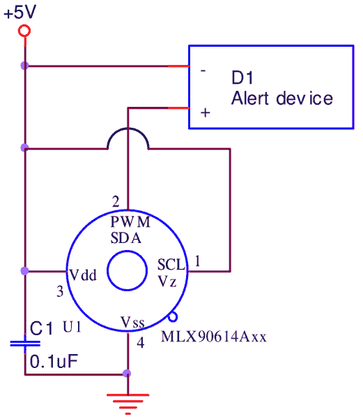
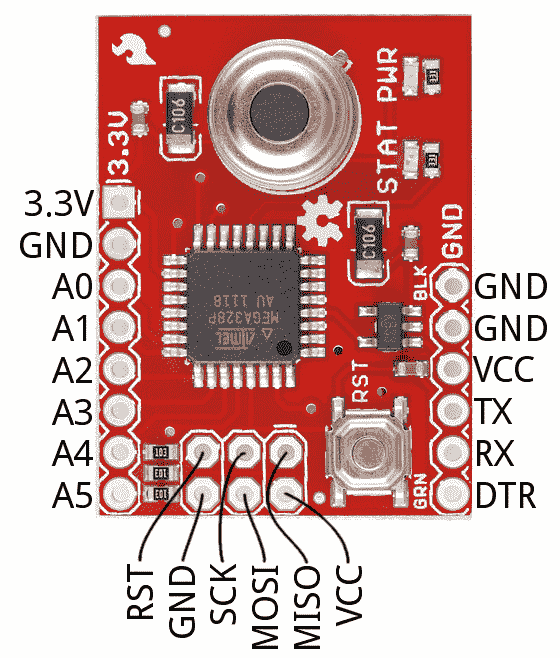

# MLX90614 红外温度计连接指南

> 原文：<https://learn.sparkfun.com/tutorials/mlx90614-ir-thermometer-hookup-guide>

## 介绍

你的 IC 是不是烫到不能碰？(太害怕了，甚至不敢冒险？)需要监控温度瞬变以便打开或关闭风扇？只是想创造自己的，可破解的[非接触式温度计](https://www.sparkfun.com/products/10830)？听起来像是 [Melexis MX90614 红外温度计](https://www.sparkfun.com/products/9570)的工作！

[](https://www.sparkfun.com/products/9570) 

将**添加到您的[购物车](https://www.sparkfun.com/cart)中！**

 **### [红外线温度计- MLX90614](https://www.sparkfun.com/products/9570)

[In stock](https://learn.sparkfun.com/static/bubbles/ "in stock") SEN-09570

Melexis 的 MLX90614ESF-BAA 是一款红外温度计，设计用于非接触式温度传感。一个内部 17 位 ADC 和…

$32.505[Favorited Favorite](# "Add to favorites") 38[Wish List](# "Add to wish list")** **或者，如果您想要将红外温度计集成到 Arduino 兼容评估板中，请查看 [SparkFun 红外温度计评估板](https://www.sparkfun.com/products/10740)。

[](https://www.sparkfun.com/products/10740) 

将**添加到您的[购物车](https://www.sparkfun.com/cart)中！**

 **### [SparkFun 红外温度计评估板- MLX90614](https://www.sparkfun.com/products/10740)

[18 available](https://learn.sparkfun.com/static/bubbles/ "18 available") SEN-10740

这是用于 MLX90614 红外温度计的评估板。该传感器连接到一个 ATmega328 运行在 3.3V 与一个 S…

$37.501[Favorited Favorite](# "Add to favorites") 19[Wish List](# "Add to wish list")** **IR 温度计评估板配有 mlx 90614-ABB——一款简单易用但功能强大的单区红外温度计，能够检测-70°C 至 380°C 之间的物体温度。使用 SMBus——一种类似 [I ² C](https://learn.sparkfun.com/tutorials/i2c) 的接口——与芯片通信，意味着您只需从微控制器中抽出两根电线与之接口。

### 本教程涵盖的内容

本教程旨在让您快速熟悉 MLX90614 红外温度计，并演示如何将其与 Arduino 接口。它包括裸传感器(到 Arduino)和 SparkFun MLX90614 评估板的连接。它深入理论，解释一些数据表，演示示例电路，并介绍一个新的 Arduino 库。

本教程分为以下几个部分:

*   [MLX90614 概述](https://learn.sparkfun.com/tutorials/mlx90614-ir-thermometer-hookup-guide#mlx90614-overview) -简要介绍红外温度计原理和 MLX90614 的规格和接口。
*   [评估板概述](https://learn.sparkfun.com/tutorials/mlx90614-ir-thermometer-hookup-guide#evaluation-board-overview) -快速概述评估板的特性。
*   [硬件连接](https://learn.sparkfun.com/tutorials/mlx90614-ir-thermometer-hookup-guide#hardware-hookup) -如何围绕裸传感器和/或与评估板的接口创建电路。
*   [MLX90614 Arduino 库](https://learn.sparkfun.com/tutorials/mlx90614-ir-thermometer-hookup-guide#mlx90614-arduino-library) -安装和使用 SparkFunMLX90614 红外温度计库。

### 推荐阅读

本教程建立在一些较低层次的概念之上。如果您不熟悉这些主题，请考虑先查看这些教程:

[](https://learn.sparkfun.com/tutorials/what-is-an-arduino) [### 什么是 Arduino？](https://learn.sparkfun.com/tutorials/what-is-an-arduino) What is this 'Arduino' thing anyway? This tutorials dives into what an Arduino is and along with Arduino projects and widgets.[Favorited Favorite](# "Add to favorites") 50[](https://learn.sparkfun.com/tutorials/pulse-width-modulation) [### 脉宽灯](https://learn.sparkfun.com/tutorials/pulse-width-modulation) An introduction to the concept of Pulse Width Modulation.[Favorited Favorite](# "Add to favorites") 46[](https://learn.sparkfun.com/tutorials/integrated-circuits) [### 集成电路](https://learn.sparkfun.com/tutorials/integrated-circuits) An introduction to integrated circuits (ICs). Electronics' ubiquitous black chips. Includes a focus on the variety of IC packages.[Favorited Favorite](# "Add to favorites") 46[](https://learn.sparkfun.com/tutorials/i2c) [### I2C](https://learn.sparkfun.com/tutorials/i2c) An introduction to I2C, one of the main embedded communications protocols in use today.[Favorited Favorite](# "Add to favorites") 128

## MLX90614 概述

在内部，MLX90614 是两个设备的配对:红外[热电堆探测器](https://en.wikipedia.org/wiki/Thermopile)和信号调节[应用处理器](https://en.wikipedia.org/wiki/Application-specific_standard_product)。

根据[斯蒂芬-玻尔兹曼定律](https://en.wikipedia.org/wiki/Stefan%E2%80%93Boltzmann_law)，任何不低于绝对零度(0 K)的物体都会发出与其温度成正比的红外光谱(非人眼可见)光。MLX90614 内部的特殊红外热电堆可以感应其视野内的材料发出的红外能量，并产生与之成比例的电信号。

[](https://cdn.sparkfun.com/assets/learn_tutorials/4/5/0/internal-block-diagram.png)*MLX90614 internal block digram showing the thermopile (MLX81101) and ASSP (MLX90302) (from datasheet page 10).*

热电堆产生的电压由应用处理器的 17 位 ADC 拾取，然后经过调理，再传递给微控制器。

### MLX90614 堆叠

MLX90614 采用 TO-39“can”封装，有四个引脚:两个用于电源，两个用于 SMBus 接口。包装上的“凹口”有助于指出哪个引脚是哪个引脚。

[](https://cdn.sparkfun.com/assets/learn_tutorials/4/5/0/mlx90614-pinout.png)*MLX90614 pinout -- note the notch to help indicate pin 1 (from datasheet page 5).*

### 能力

MLX90614 产生两个温度测量值:一个物体和一个环境读数。**物体温度**是传感器的非接触测量，而**环境温度**测量传感器芯片的温度。环境可能有助于校准数据，但我们读数的真正内容将来自对象温度测量。

物体温度测量值的范围从 **-70 到 382.2°C**(-94 到 719.96°F)，而环境温度读数的范围从-40 到 125°C。

环境温度和物体温度的**分辨率均为 0.02°C**。

### MLX90614 *BAA*

MLX90614 有很多种，每种都有三个字母作为后缀。不同的传感器选项因工作电压、红外热电堆数量以及它们是否在传感器内部或外部过滤而异。我们携带的是 MLX90614BAA，它的额定工作电压为**3V**，带有**单红外传感器**和**内部过滤器**。

[](https://cdn.sparkfun.com/assets/learn_tutorials/4/5/0/mlx90614-operating-voltage.png)

该变体还决定了视野，在 MLX90614BAA 上为 90°。

[](https://cdn.sparkfun.com/assets/learn_tutorials/4/5/0/mlx90614-fov-table2.png)

说到这个...

### 视野-距离与光斑直径

红外温度计的[视场](https://en.wikipedia.org/wiki/Angle_of_view) (FOV)是一个需要注意的重要属性。它决定了与物体的距离和被观察的空间面积之间的关系。MLX90614 的视野是锥形的——如果它靠近物体，它的感应区域非常窄，但随着它远离物体，它的感应区域越来越宽。

MLX90614BAA 拥有相对较宽的视角:90°。这意味着你每远离物体 1 厘米，感应区域就会增加 2 厘米。如果你离一个物体有一英尺远(30.48 厘米)，感应区域将是两英尺(60.96 厘米)。

### 输出接口

MLX90614 支持两个接口——尽管你需要一个来访问另一个。双线 SMBus 接口是与 IR 传感器通信的主要方式。一旦设置了 SMBus 接口，您可以稍后配置 MLX90614，以产生代表测量温度的脉宽调制(PWM)信号。

#### SMBus (I ² C)

传感器通过双线 SMBus 接口进行配置和读取——非常相似，功能上几乎等同于 I ² C。两个信号——SDA 和 SCL——分别承载数据和时钟信号。主设备控制时钟，而数据信号是双向控制的。

[](https://cdn.sparkfun.com/assets/learn_tutorials/4/5/0/mlx90614-i2c-circuit.png)

每个 MLX90614 都有一个默认的 **I ² C 地址**的 **0x5A** ，但该地址可以重写——这是该设备支持的主要功能之一。通过重新配置 MLX90614 的地址，您可以添加多个设备(最多 127 个！)到同一个总线，以获得更大的温度图。

关于 SMBus 接口需要注意的最后一点是——每次读或写传输都应使用 x⁸+x²+x¹+x⁰多项式的 [8 位 CRC (CRC-8-CCITT)检查](https://en.wikipedia.org/wiki/Cyclic_redundancy_check)来完成——便于获得额外的数据可信度。

#### 脉宽调制和“热继电器”

MLX90614 的数据也可以通过 PWM 接口读取。在这个用例中，只需要一根线来读取传感器:SDA。要使用 PWM 接口，MLX90614 必须通过 SMBus 进行配置以产生该接口。

PWM 输出可能难以与微控制器一起使用，但如果您想使用 MLX90614 直接控制继电器或其他外部触发设备，它就非常强大。

[](https://cdn.sparkfun.com/assets/learn_tutorials/4/5/0/mlx90614-pwm-circuit.png)

通过配置传感器的范围-设置最低和/或最高温度值 PWM 输出可以变成一个“热继电器”信号。除非物体温度超过设定的阈值，否则 PWM 信号将为低电平。

* * *

有关 MLX90614 的更详尽概述，请查看[数据表](http://www.sparkfun.com/datasheets/Sensors/Temperature/MLX90614_rev001.pdf)。

## 评估板概述

[SparkFun 红外温度计评估板](https://www.sparkfun.com/products/10740)将 MLX90614 连接到 ATmega328 微处理器，这样您就可以快速开始开发传感器，而不是纠结于电线和试验板。

[](https://cdn.sparkfun.com/assets/learn_tutorials/4/5/0/eval-product-crop.jpg)

评估板上的 ATmega328 预编程有基于 UART 的示例代码和一个 **Arduino 引导加载程序**。通过串行接口监控温度后，您可以使用同一个串行端口上传您自己的代码！

### 引脚排列

评估板相对两侧的一对接头分出少量微处理器信号和电源总线，ATmega 的 SPI 接口位于 ICSP 接头上:

[](https://cdn.sparkfun.com/assets/learn_tutorials/4/5/0/top-annotated.jpg)

如果你不想回头看这张图，这些针脚都标在电路板的底部。

| Pin Label | 等效 Arduino 引脚 | 笔记 |
| 串行编程/接口接头 |
| GND |  | 接地(0v) |
| GND |  | 接地(0v) |
| VCC |  | 电源电压输入 |
| 谢谢 | one | UART 输入 |
| 药方(prescription 的缩写) | Zero | UART 输出 |
| 负荷型定额(Duty Type Rating) |  | FTDI 编程器的自动复位控制 |
| GPIO/电源接头 |
| 3.3V | 3.3V | 3.3V 电源(由 VCC 输入调节) |
| GND | GND | 接地(0v) |
| PC0 | A0 | 模拟输入和/或数字输入/输出 |
| PC1 | 一流的 | 模拟输入和/或数字输入/输出 |
| PC2 | 主动脉第二声 | 模拟输入和/或数字输入/输出 |
| PC3 | A3 号 | 模拟输入和/或数字输入/输出 |
| 国家药品监督管理局 | A4 号 | MLX90614 的串行数据线–可以将更多器件添加到 I ² C 总线。 |
| SCL | A5 号 | MLX90614 的串行时钟–可以向 I ² C 总线添加更多器件。 |
| ICSP 头球 |
| 英特尔的快速储存技术 | 重置 | Arduino 低电平有效复位 |
| GND | GND | 接地(0v) |
| 血清肌酸激酶 | Thirteen | SPI 时钟和/或数字输入/输出 |
| MOSI | Eleven | SPI 主机输出/从机输入和/或数字输入/输出 |
| 军事情报部门组织(Military Intelligence Service Organization) | Twelve | SPI 主机输入/从机输出和/或数字输入/输出 |
| VCC | 3.3V | 3.3V 电源(由 VCC 输入调节) |

额外的 GPIO 允许您将“评估板”构建到项目中心。通过七个未使用的 GPIO，您可以连接[串行 7 段显示器](https://www.sparkfun.com/products/11442)、[液晶显示器](https://www.sparkfun.com/products/11708)或许多其他组件。此外，I ² C 可以扩展附加传感器——无论是[光传感器](https://www.sparkfun.com/products/12055)还是[运动传感器](https://www.sparkfun.com/products/13284)。

[](https://cdn.sparkfun.com/assets/learn_tutorials/4/5/0/example-use.jpg)*Wire the MLX90614 Evaluation Board up to a [Micro OLED Breakout](https://www.sparkfun.com/products/13003) to create a portable IR Thermometer.*

#### LED 指示灯

评估板有一个连接到**数字引脚 8** (PB0)的绿色 LED。LED 为低电平有效，因此将引脚写低电平将打开 LED，写高电平将关闭 LED。

只要主板通电，旁边的红色电源 LED 就会亮起。

## 硬件连接

### 连接 MLX90614

如果您没有使用 SparkFun 评估板，您可以将 MLX90614 连接到任何 Arduino 兼容的微控制器(或者，实际上，任何带有 I ² C 接口的 C)。使用 3.3V 供电轨为传感器供电，连接 SDA 至 SDA 和 SCL 至 SCL，并为两个 I ² C 信号添加 4.7kΩ上拉电阻。

[](https://cdn.sparkfun.com/assets/learn_tutorials/4/5/0/breadboard-mlx90614.jpg)

| MLX90614 引脚 | Arduino 引脚 | 注意 |
| VDD | 3.3V | 附近的 0.1 F 去耦电容 |
| 虚存系统 | 0V | 附近的 0.1 F 去耦电容 |
| SDA/PWM | SDA (A4) | 通过 4.7kΩ电阻上拉至 3.3V |
| SCL | SCL (A5) | 通过 4.7kΩ电阻上拉至 3.3V |

使用传感器上的“凹口”来帮助识别哪个针脚是哪个。

### 连接红外温度计评估板

要使用评估板，您需要将*焊接到至少 6 引脚串行接头上。为此，我们喜欢使用[直角公头](https://www.sparkfun.com/products/553)，但是[直头](https://www.sparkfun.com/products/116)也可能起作用。*

[](https://cdn.sparkfun.com/assets/learn_tutorials/4/5/0/hardware-soldered.jpg)

在此过程中，您可能还需要将接头焊接到 GPIO 接头和/或 ICSP 接头，以防您需要与 SPI 接口或模拟输入接口。

#### 连接 FTDI 基本

与 MLX90614 评估板交互的最简单方式是通过 [3.3V FTDI 基本分线点](https://www.sparkfun.com/products/9873)或 [3.3V I/O FTDI 电缆](https://www.sparkfun.com/products/9717)，它们都提供电源并在评估板和计算机之间设置串行接口。

[](https://cdn.sparkfun.com/assets/learn_tutorials/4/5/0/hardware-ftdi.jpg)

注意匹配两台设备之间的“GRN”和“BLK”标签(或 FTDI 电缆的绿色和黑色电线)!还要注意，FTDI 最多可以提供大约 50mA 的电流。这对于该板来说已经足够了，但是如果你在电路中增加更多的器件，你可能需要增加一个单独的电源。

FTDI 还设置了一个编程接口——使用预编程的串行引导程序和 Arduino IDE。

#### 使用预编程的固件

IR 温度计分线板附带简单的示例代码，允许您快速测试 MLX90614 的功能。演示代码通过串行接口以 **38400 bps** 输出环境和物体温度。

要查看输出，打开您选择的串行终端(如果您还没有，查看我们的[串行终端基础教程](https://learn.sparkfun.com/tutorials/terminal-basics)以获得建议)。并将波特率设置为 38400 bps (8 个数据位，无奇偶校验，1 个停止位)。你应该可以看到物体温度读数每秒左右流动一次。

[](https://cdn.sparkfun.com/assets/learn_tutorials/4/5/0/serial-terminal-example.png)

每次产生新数据时,“STAT”LED 也应该闪烁。

一旦掌握了这一点，请查看下一部分，开始编写自己的红外温度计接口代码！

## MLX90614 Arduino 库

由于我们的红外温度计 Arduino 库，使用 Arduino 与传感器交互几乎就像连接它一样简单。

### 下载并安装 Arduino 库

从我们的 [GitHub 库](https://github.com/sparkfun/SparkFun_MLX90614_Arduino_Library)下载这个库，或者点击下面的按钮下载一个 ZIP 文件。

[Download the SparkFun IR Thermometer Arduino Library!](https://github.com/sparkfun/SparkFun_MLX90614_Arduino_Library/archive/master.zip)

要将库添加到 Arduino sketchbook，请打开 IDE，导航到**Sketch**>**Include Library**>**Add。ZIP 库...**并选择您刚刚下载的 ZIP 文件夹。

如果你使用的是旧版本的 IDE，或者需要安装库的帮助，请查看我们的[如何安装 Arduino 库教程](https://learn.sparkfun.com/tutorials/installing-an-arduino-library)。

### 在 Arduino 中设置评估板

如果您使用 SparkFun IR 温度计评估板，请将 Arduino 板设置为 **Arduino Pro 或 Pro Mini，ATmega328 (3.3V，8MHz)** 。

[](https://cdn.sparkfun.com/assets/learn_tutorials/4/5/0/arduino-board-select.png)

首先，导航到**工具** > **板**，选择 **Arduino Pro 或 Pro Mini** 。然后进入**工具** > **处理器**选择 **ATmega328 (3.3V，8MHz)** 。

### 运行 MLX90614_Serial_Demo 示例

SparkFun MLX90614 Arduino 包括一些例子，演示了从读取传感器的值到调整发射率，再到修改 7 位地址的所有内容。

导航到**文件** > **例子**>**spark fun mlx 90614**>**mlx 90614 _ Serial _ Demo**打开最基本的例子。

[](https://cdn.sparkfun.com/assets/learn_tutorials/4/5/0/arduino-example-location.png)

上传草图，然后打开你的串口监视器，设置波特率为 **9600 bps** 。你应该看到环境温度和物体温度开始流动。

[](https://cdn.sparkfun.com/assets/learn_tutorials/4/5/0/arduino-serial.png)

试着将传感器对准你周围的物体。那个烙铁有多热？或者在耳朵里照一下，确定没有发烧！

[](https://cdn.sparkfun.com/assets/learn_tutorials/4/5/0/taking-my-temperature.jpg)*96.4°F. Uh oh. Either a doctor visit is in my future, or I need to fuss with emissivity settings.*

### 使用 MLX90614 库

在您将要编写的每个 MLX90614 接口代码中，都有几行代码。首先，包括 SparkFunMLX90614 库*和*线。在同一个全局区域中，您可能想要定义一个`IRTherm`对象用于草图的其余部分。

```
language:c
#include <Wire.h> // Include Wire.h - Arduino I2C library
#include <SparkFunMLX90614.h> // Include IR thermometer library

IRTherm temp; // Create an IRTherm object called temp 
```

然后，通常在`setup()`函数中，通过调用`begin()`来初始化传感器。该函数可选地接受一个参数——传感器的 7 位地址——但是如果留空，它假定地址设置为默认值(0x5A)。除非您想使用默认的摄氏单位，否则也可以考虑调用`setUnit()`函数将单位改为开尔文或费伦海特。

```
language:c
temp.begin(); // Initialize I2C library and the MLX90614
temp.setUnit(TEMP_F); // Set units to Farenheit (alternatively TEMP_C or TEMP_K) 
```

从传感器中获取值是一个两步过程:从传感器中读取值，然后获取更新的值。要从传感器读取数据，调用`read()`函数，如果成功将返回`1`(如果失败将返回`0`)。如果`read()`功能成功，您可以使用`ambient()`和`object()`功能获取更新的环境和物体温度:

```
language:c
if (temp.read()) // Read from the sensor
{ // If the read is successful:
  float ambientT = temp.ambient(); // Get updated ambient temperature
  float objectT = temp.object(); // Get updated object temperature
  Serial.println("Ambient: " + String(ambientT));
  Serial.println("Object: " + String(objectT));
  Serial.println();
} 
```

这些值已经被转换成您使用`setUnit()`功能设置的单位。

要了解关于 SparkFunMLX90614 库的更多信息，请查看库中的一些其他示例！或者通读[头文件](https://github.com/sparkfun/SparkFun_MLX90614_Arduino_Library/blob/master/src/SparkFunMLX90614.h)中的(详尽的)注释

## 资源和更进一步

在您继续构建基于 IR 温度计的项目时，以下几个资源可能会对您有所帮助:

*   [SparkFun 红外温度计评估板-mlx 90614 GitHub Repo](https://github.com/sparkfun/IR_Thermometer_Evaluation_Board-MLX90614/tree/V_1.6)-PCB 设计文件和我们编程到红外温度计评估板上的固件(注意此处存在 Arduino 之前的代码！).
*   [SparkFun MLX90614 Arduino 库 GitHub Repo](https://github.com/sparkfun/SparkFun_MLX90614_Arduino_Library) -我们 MLX90614 Arduino 库的 GitHub 之家。
*   [MLX90614 数据表](http://www.sparkfun.com/datasheets/Sensors/Temperature/MLX90614_rev001.pdf)
*   [Melexis 的 MLX90614 产品页面](http://www.melexis.com/Infrared-Thermometer-Sensors/Infrared-Thermometer-Sensors/MLX90614-615.aspx) -文档和其他产品信息的良好来源。
*   [红外温度测量理论和应用](http://www.omega.com/techref/iredtempmeasur.html) -红外温度计背后理论的精彩概述。

如果你想继续你的 SparkFun 教程阅读之旅，这里有几个相关教程你可能会喜欢:

[](https://learn.sparkfun.com/tutorials/weather-station-wirelessly-connected-to-wunderground) [### 无线连接到地下的气象站](https://learn.sparkfun.com/tutorials/weather-station-wirelessly-connected-to-wunderground) Build your own open-source, official Wunderground weather station that connects over WiFi via an Electric Imp.[Favorited Favorite](# "Add to favorites") 32

或者看看这篇博客:

[](https://www.sparkfun.com/news/3420 "October 22, 2020: Building a system that records temperature based on a user's unique RFID tag into an Excel spreadsheet for the world of COVID-19.") [### 基于 RFID 的 DIY 非接触式温度监控系统

October 22, 2020](https://www.sparkfun.com/news/3420 "October 22, 2020: Building a system that records temperature based on a user's unique RFID tag into an Excel spreadsheet for the world of COVID-19.")[Favorited Favorite](# "Add to favorites") 0****