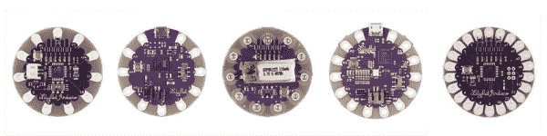
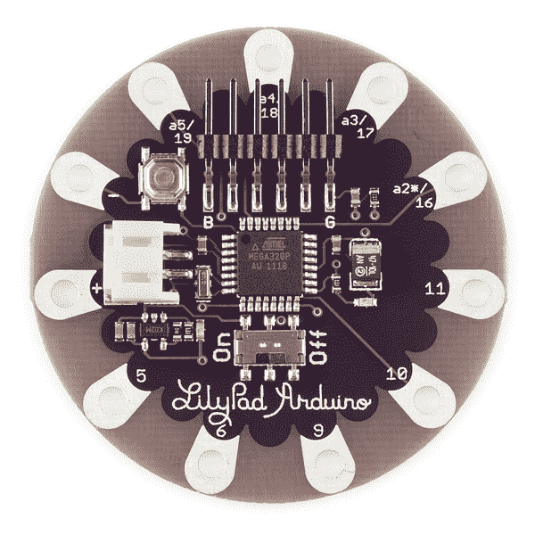
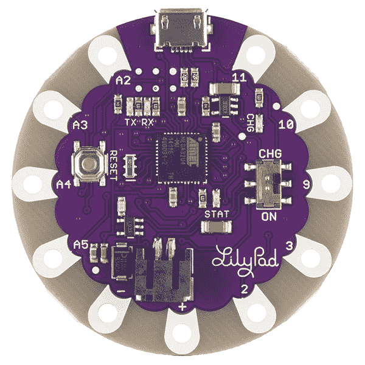
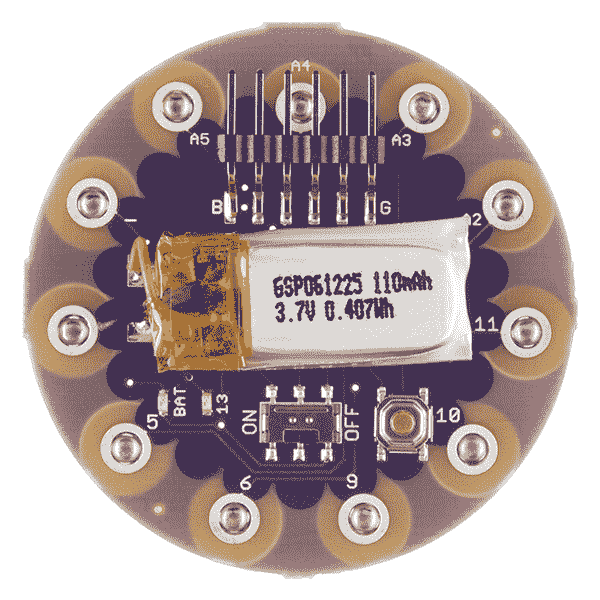
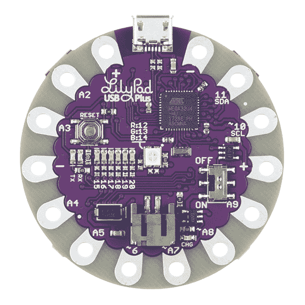
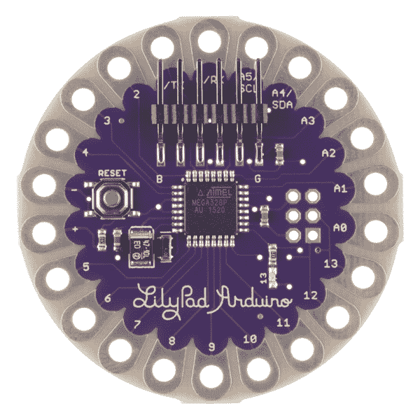
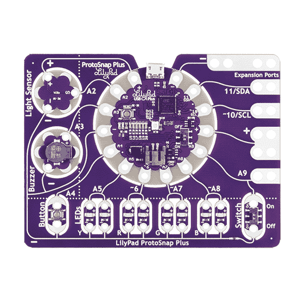
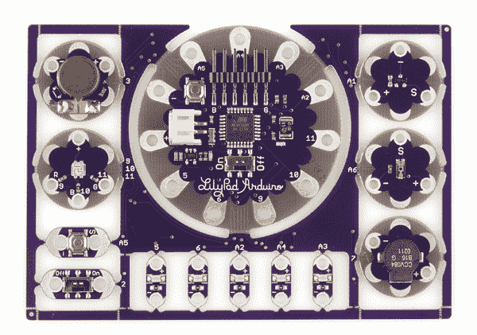
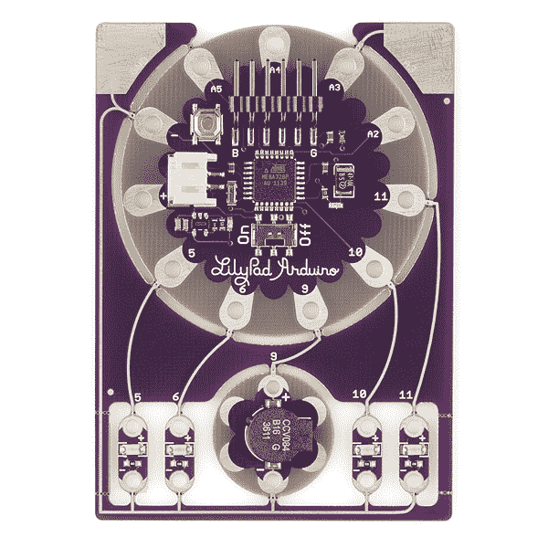

# 为您的项目选择 LilyPad Arduino

> 原文：<https://learn.sparkfun.com/tutorials/choosing-a-lilypad-arduino-for-your-project>

## 介绍

您已经准备好了您的第一个编程 LilyPad 项目，但是您选择哪个 LilyPad Arduino 呢？在本指南中，我们将介绍 LilyPad 系列中每一款 Arduinos 的特性及其优缺点。

We've put together a quick feature comparison chart below. For more detailed technical specs, check out our [Arduino Comparison Guide for LilyPad](https://www.sparkfun.com/etextile_arduino_comparison_guide).

| 板 | 微控制器 | 数字 I/O 引脚 | 模拟输入引脚 | 编程接口 | 电池附件 |
| LilyPad Arduino Simple | ATMega328 | nine | four | FTDI | JST 连接器 |
| LilyPad Arduino USB | ATmega32U4 | nine | four | 通用串行总线 | JST 连接器 |
| LilyPad Arduino SimpleSnap(消歧义) | ATMega328 | nine | four | FTDI | 内置脂肪 |
| LilyPad USB Plus | ATMega32U4 | Ten | seven | FTDI | 内置脂肪 |
| LilyPad Arduino 328 主板 | ATMega328 | Fourteen | six | FTDI | 缝合标签 |

### 推荐阅读

如果你以前从未使用过 LilyPad 或其他可穿戴技术，你可能会发现以下资源很有用。

*   [lily pad 入门](https://learn.sparkfun.com/tutorials/getting-started-with-lilypad)
*   [规划可穿戴电子产品项目](https://learn.sparkfun.com/tutorials/planning-a-wearable-electronics-project)
*   [电子纺织品的绝缘技术](https://learn.sparkfun.com/tutorials/insulation-techniques-for-e-textiles)

## LilyPad Arduino 简易板

**特性:**

*   5 个数字 I/O 引脚
*   4 个模拟引脚
*   ATmega328
*   内置开/关开关
*   内置电源插座(JST 连接器),用于 3.7V LiPo 电池和充电电路(无需额外的电池充电器)
*   简化布局，减少针脚，为缝纫或不太复杂的项目提供更多空间

LilyPad Arduino Simple Board 是我们最受 Arduino 项目初学者欢迎的产品之一，因为它布局宽敞。更容易识别引脚，并且具有更大的缝合空间，没有意外接触电路板上其他引脚的风险。内置电池端口使您可以轻松选择适合项目运行时间要求的 LiPo 电池，并通过简单地将电路板插入计算机上的 USB 端口或 [5V 壁式充电器](https://www.sparkfun.com/products/11456)为电池充电。

The LilyPad Arduino Simple Board needs a [LilyPad FTDI Basic Breakout](https://www.sparkfun.com/products/10275) and [USB Mini-B Cable](https://www.sparkfun.com/products/598) in order to connect to a computer and upload code.

## LilyPad Arduino USB - ATmega32U4 板

**特性:**

*   5 个数字 I/O 引脚
*   4 个模拟引脚
*   ATMega32U4
*   内置开/关开关
*   内置电源插座(JST 连接器),用于 3.7v LiPo 电池和充电电路(无需额外的电池充电器)
*   简化布局，减少针脚，为缝纫或不太复杂的项目提供更多空间
*   微型 USB 连接代替 FTDI 接头引脚

LilyPad Arduino USB 类似于 LilyPad Arduino Simple 板，但使用了不同的芯片——atmega 32 u 4，它内置了 USB 支持。如果其他 LilyPad Arduinos 上的 FTDI 头引脚感觉太笨重，或者 FTDI 板经常丢失或放错位置，这种板是一个很好的替代选择。

*注意:数字 I/O 引脚布局与 LilyPad Arduino Simple 略有不同 USB 使用引脚 2 和 3，而不是 5 和 6。*

The LilyPad Arduino USB needs a [Micro USB Cable](https://www.sparkfun.com/products/10215) in order to connect to a computer and upload code.

## LilyPad Arduino SimpleSnap(消歧义)

**特性:**

*   5 个数字 I/O 引脚
*   4 个模拟引脚
*   ATmega328
*   内置开/关开关
*   内置脂肪电池和充电电路
*   简化布局，减少针脚，为缝纫或不太复杂的项目提供更多空间
*   内置快照，可快速连接/分离多个项目

Because the battery is soldered to this LilyPad Arduino, it cannot be washed. Unsnap the LilyPad from its base before washing.

LilyPad Arduino SimpleSnap 与 LilyPad Simple 板类似，除了两个主要区别:内置可充电 110mAh LiPo 电池和母 Snap 连接器。该板需要连接到一个 [SimpleSnap 原型板](https://www.sparkfun.com/products/10940)或一组缝合织物按扣，以便该板可以从项目中移除。这使你能够更换 LilyPad Arduino 来重新编程并在多个项目中共享。

The LilyPad Arduino Simple Board needs a [LilyPad FTDI Basic Breakout](https://www.sparkfun.com/products/10275) and [USB Mini-B Cable](https://www.sparkfun.com/products/598) in order to connect to a computer and upload code.

## LilyPad USB Plus

**特性:**

*   10 个数字 I/O 引脚
*   7 个模拟引脚
*   ATMega32U4
*   内置开/关开关
*   内置电源插座(JST 连接器),用于 3.7v LiPo 电池和充电电路(无需额外的电池充电器)
*   电源和接地缝片位于电路板的相对侧，提供更多连接选项
*   微型 USB 连接

[LilyPad USB Plus](https://www.sparkfun.com/products/14631) 是对 LilyPad Arduino USB 的更新，增加了标签、标签和内置功能。USB Plus 包括一个位于中心的 RGB LED，用于快速原型制作，无需连接额外的部件，以及一排 6 个白色 LED，用于指示灯或简单的数据可视化。

*注意:Windows 7 操作系统目前不支持 USB Plus。*

The LilyPad Arduino USB needs a [Micro USB Cable](https://www.sparkfun.com/products/10215) in order to connect to a computer and upload code.

## LilyPad Arduino 328 主板

**特性:**

*   14 个数字 I/O 引脚
*   6 个模拟引脚
*   ATmega328

[LilyPad Arduino 328 主板](https://www.sparkfun.com/products/13342)拥有所有 ATmega 328 引脚，可用于连接可穿戴项目。如果您的项目需要比其他 LilyPad Arduino 产品更多的模拟输入引脚，建议使用此板。与其他产品不同，它没有电池端口——你需要将电源连接到板上的 **+** 和 **-** 引脚。我们推荐 [LilyPad Simple Power](https://www.sparkfun.com/products/11893) 板为您的项目提供 LiPo 连接和充电电路。

The LilyPad Arduino 328 Main Board needs a [LilyPad FTDI Basic Breakout](https://www.sparkfun.com/products/10275) and [USB Mini-B Cable](https://www.sparkfun.com/products/598) in order to connect to a computer and upload code.

## LilyPad ProtoSnap 系列

在开始缝纫之前，LilyPad ProtoSnap 板是开始学习创建交互式电子纺织品电路的好方法。所有东西都连接在一块电路板上，这使得在将组件拆开并使用导电线将各个部分构建到您的项目中之前，很容易探索组件的可能性。

### LilyPad ProtoSnap Plus

[LilyPad ProtoSnap Plus](https://www.sparkfun.com/products/14346) 是一种使用 LilyPad Arduino 和预先连接在一起的组件进行原型制作的方法。将代码上传到 LilyPad Arduino 后，您可以轻松地将组件分开，并将其缝合到一个项目中。

**特性:**

*   LilyPad USB Plus，内置 RGB 和六个白色 led

*   预连线组件:光传感器、蜂鸣器、按钮、4 对 led(黄色、红色、绿色和蓝色)、滑动开关和 5 个扩展端口，便于原型制作

The LilyPad ProtoSnap Plus needs a [USB Micro-B Cable](https://www.sparkfun.com/products/598) in order to connect to a computer and upload code.

### ProtoSnap - LilyPad 开发板

[ProtoSnap - LilyPad 开发板](https://www.sparkfun.com/products/retired/11262)是经典的 LilyPad Arduino ProtoSnap 套件，带有 LilyPad Simple Arduino 和一组预连接的 LilyPad 部件。它还包括针、导电线和电池，以快速开始原型制作和构建。

**特性:**

*   LilyPad Arduino 简易板
*   FTDI 基本突破
*   3.7v 脂肪电池
*   预连线组件:光传感器、温度传感器、蜂鸣器、振动电机、5 个发光二极管、三色发光二极管、滑动开关、按钮
*   导电线轴
*   针组

The ProtoSnap - LilyPad Development Board needs a [USB Mini-B Cable](https://www.sparkfun.com/products/598) in order to connect to a computer and upload code.

### ProtoSnap - LilyPad 开发板简单

[ProtoSnap - LilyPad 开发板 Simple](https://www.sparkfun.com/products/11201) 与开发板相似，但预连线到 Arduino 的组件较少。

**特性:**

*   LilyPad Arduino 简易板
*   FTDI 基本突破
*   3.7v 脂肪电池
*   预连线组件:蜂鸣器、4 个发光二极管
*   导电线轴
*   针组

The ProtoSnap - LilyPad Development Board Simple needs a [USB Mini-B Cable](https://www.sparkfun.com/products/598) in order to connect to a computer and upload code.

## 资源和更进一步

有关 LilyPad 产品的更多信息:

*   [LilyPad 登陆页面](https://www.sparkfun.com/lilypad_sewable_electronics)
*   [LilyPad for Education](http://www.sparkfuneducation.com/lilypad)

既然你已经决定了项目的“大脑”,这里有一些教程可以帮助你开始创作:

*   [规划可穿戴电子产品项目](https://learn.sparkfun.com/tutorials/planning-a-wearable-electronics-project)
*   [LilyPad 简易电源连接指南](https://learn.sparkfun.com/tutorials/lilypad-simple-power-hookup-guide)
*   [ProtoSnap LilyPad 开发简单连接指南](https://learn.sparkfun.com/tutorials/protosnap-lilypad-development-simple-hookup-guide)