# SparkFun 线追随者阵列连接指南

> 原文：<https://learn.sparkfun.com/tutorials/sparkfun-line-follower-array-hookup-guide>

## 介绍

[线跟随器阵列](https://www.sparkfun.com/products/13582)是一个由八个红外传感器组成的阵列，这些传感器被配置和读取为数字位！在我们的实验室里， [RedBot](https://www.sparkfun.com/products/13166) shadow 机箱被用作测试平台，但该产品被设计为任何机器人的附加产品。该阵列具有可见的 led，所以你可以看到机器人看到的东西，亮度控制就在板上，还有一个 I ² C 接口用于读取和电源控制。

[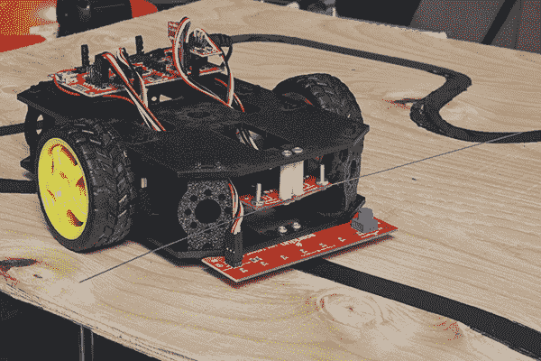](https://cdn.sparkfun.com/assets/parts/1/0/9/2/0/13582-05.jpg)

### 特征

*   8 个传感器眼(QRE1113，类似于我们的[线传感器分线点](https://www.sparkfun.com/products/9454)
*   I ² C 接口
*   使用旋钮动态调节红外亮度
*   用软件打开和关闭红外
*   用软件打开和关闭可视指示器
*   用软件改变黑暗/光明景象
*   基于 [SX1509 I/O 扩展器](https://www.sparkfun.com/products/13601)

### 本教程涵盖的内容

本教程将帮助您使用 Arduino IDE 通过 I ² C 将线路跟随器阵列连接到您的机器人。

*   [硬件概述](https://learn.sparkfun.com/tutorials/sparkfun-line-follower-array-hookup-guide#hardware-overview) -物理板和电气特性概述。
*   [硬件装配](https://learn.sparkfun.com/tutorials/sparkfun-line-follower-array-hookup-guide#assembly) -将传感器连接到基于 328p 的微处理器上。
    *   [设置跳线](https://learn.sparkfun.com/tutorials/sparkfun-line-follower-array-hookup-guide#setting-the-jumpers) -描述电路板的跳线配置。
*   [安装 SparkFun Line Follower 阵列 Arduino 库](https://learn.sparkfun.com/tutorials/sparkfun-line-follower-array-hookup-guide#installing-the-arduino-library) -从哪里获取阵列的库。
    *   [Arduino 库的核心功能](https://learn.sparkfun.com/tutorials/sparkfun-line-follower-array-hookup-guide#core-functions-of-the-arduino-library) -描述阵列的基本读取和配置。
    *   [额外的库函数:循环缓冲区](https://learn.sparkfun.com/tutorials/sparkfun-line-follower-array-hookup-guide#extra-library-function-the-circular-buffer) -这个库有一个隐藏的特性！使用循环缓冲区来记录计算数据。
*   [示例草图](https://learn.sparkfun.com/tutorials/sparkfun-line-follower-array-hookup-guide#example-sketches) -在你的桌子上测试传感器，或者在你的机器人上尝试一条线。

### 推荐阅读

该阵列可以很好地作为独立的器件。如果你想了解更多关于 I ² C 的知识或者正在使用 RedBot 工具包，请查看这些附加资料。

*   [I ² C 通讯](https://learn.sparkfun.com/tutorials/i2c) -通过 I ² C 接口控制阵列。了解这是什么。
*   [RedBot 实验指南](https://learn.sparkfun.com/tutorials/experiment-guide-for-redbot-with-shadow-chassis) -使用红色或黑色机箱的 RedBot？先做一些实验，然后再开始。
    *   [线跟踪实验](https://learn.sparkfun.com/tutorials/experiment-guide-for-redbot-with-shadow-chassis/experiment-6-line-following-with-ir-sensors)-red bot 的一个实验是只用三个传感器进行线跟踪。完成这个实验揭示了为什么八个传感器更好。
*   [计数并转换成二进制](https://learn.sparkfun.com/tutorials/binary?_ga=1.215727198.831177436.1424112780#counting-and-converting) -传感器对应于一个字节中的位位置。转换生疏了吗？看看这里。

## 硬件概述

阵列 PCB 有几点需要注意。

[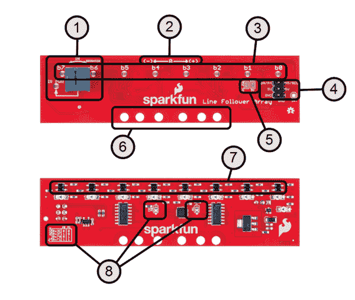](https://cdn.sparkfun.com/assets/learn_tutorials/4/1/0/HW_Overview_numbers.png)

1.  **红外亮度控制和指示器** -红外功率 led 显示红外 led 的强度。越亮意味着发出的红外线越多。
2.  **极性标记** -显示 getPosition()极性。
3.  **机器人视觉指示器** -查看红外传感器检测到什么。注意:这些不会被库的 set/clearInvertBits()函数反转。[中的用法设置亮度](https://learn.sparkfun.com/tutorials/sparkfun-line-follower-array-hookup-guide#setting-the-brightness)
4.  **数字接口** -在[装配](https://learn.sparkfun.com/tutorials/sparkfun-line-follower-array-hookup-guide#assembly)部分描述。
5.  **I2C 拉选项跳线** -默认为 3.3V 上拉。如有必要，可转换为 5V。参见[设置跳线](https://learn.sparkfun.com/tutorials/sparkfun-line-follower-array-hookup-guide#setting-the-jumpers)。
6.  **安装孔** -内部的两个孔适合影子底盘。其他都是通用的。
7.  红外传感器 -这些传感器发射并探测红外辐射。
8.  **I ² C 地址选择** -根据所需地址的表格设置跳线。

### 电气规格

| 参数 | 情况 | 福建话 | 典型。 | 最大 |  |
| 电源电流
 | Vcc = 5.0v
选通禁用
 | 25
 | 
 | 185
 | 妈 |
| Vcc = 5.0v
选通使能
运行‘最基本跟随器’
 | Sixteen | One hundred | One hundred and sixty | 妈 |
| 读取周期时间
 | Vcc = 5.0v
选通使能
 | 
 | 3.2
 |  | 毫秒
 |
| Vcc = 5.0v
选通禁用
 |  | Two hundred and fifty |  | 我们 |

## 设置跳线

该阵列有两个可配置选项:I ² C 地址和 I ² C 上拉电压。

### I ² C 地址

[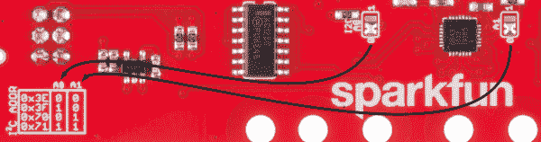](https://cdn.sparkfun.com/assets/learn_tutorials/4/1/0/addressconfig.png)

如果您需要更改阵列的地址，请移动跳线来设置 A0 和 A1。丝印表给出了参考。照片中看到，默认地址是 0x3E。例如，如果要使用地址 0x70，则将 A1 移至“1”位置，并将 A0 保留为“0”。

### I ² C 上拉电压

[](https://cdn.sparkfun.com/assets/learn_tutorials/4/1/0/pullconfig.png)

阵列的 I ² C 总线默认上拉至 3.3V。这应该适用于 3.3V 和 5V 电路板，但如果您需要将其明确更改为 5V，请切断铜桥，并在“5V”侧添加一个跳线。如果您需要将 I ² C 总线从上拉电阻上完全断开，则包括另一个跳线。这仅在特定情况下使用，例如，如果微控制器端具有强上拉电阻，并且阵列的电阻需要禁用。

## 装配

组装超级容易！使用微控制器进行以下连接。

| 信号/描述
 | 线跟随器
丝网印刷
 | RedBot 主板
丝网
 | 红纸板
丝印
 |
| 电源- 5v DC
 | 5V
 | 5V | 5V
 |
| 地面 | GND | GND | GND |
| I2C 数据
 | SDA/A4 | A4 号 | A4 或 SDA
 |
| I2C 时钟
 | A5/SCL
 | A5 号 | A5 或 SCL
 |
| INT(*) | 网络计算机 | 网络计算机 | 网络计算机 |

* *注意:如果中断功能被编程到 SX1509 扩展器中，INT 引脚不是必需的，但可以连接到任何输入。*

[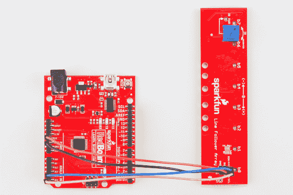](https://cdn.sparkfun.com/assets/learn_tutorials/4/1/0/Line_Follower_Array_Tutorial-04.jpg)*Using I²C via pins A4 and A5.*[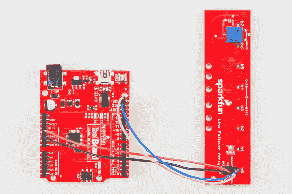](https://cdn.sparkfun.com/assets/learn_tutorials/4/1/0/Line_Follower_Array_Tutorial-05.jpg)*Using I²C via the dedicated SDA and SCL pins.*[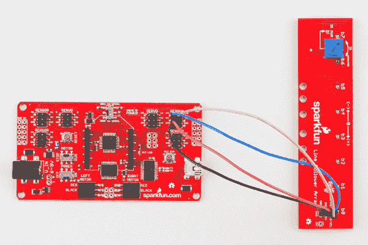](https://cdn.sparkfun.com/assets/learn_tutorials/4/1/0/Line_Follower_Array_Tutorial-06.jpg)*Connections are pin compatible with the RedBot Mainboard.*

### 影子底盘的机械附件

通过原来放置三个线跟踪传感器的插槽连接到影子机箱。将 4-40 个硬件放入阵列中，并用手指按住。将螺栓穿过影子机箱中的插槽，用拇指拧上 4-40 个螺母，然后进行电气连接。

[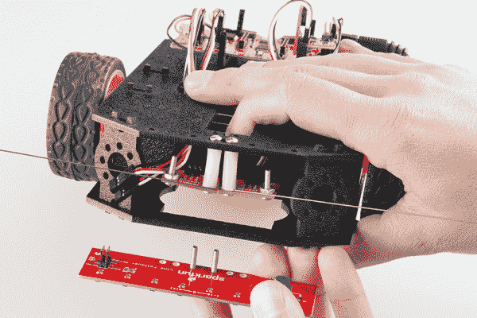](https://cdn.sparkfun.com/assets/learn_tutorials/4/1/0/Line_Follower_Array_Tutorial-01.jpg)*Hold the bolts in place with a finger*[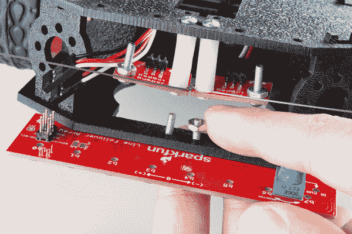](https://cdn.sparkfun.com/assets/learn_tutorials/4/1/0/Line_Follower_Array_Tutorial-02.jpg)*Thumb on the attaching nuts, then torque by hand or with a screwdriver*[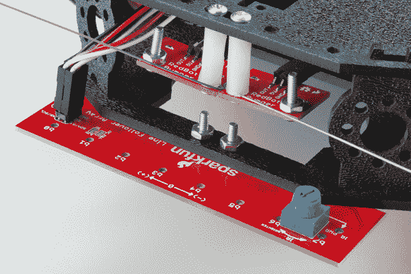](https://cdn.sparkfun.com/assets/learn_tutorials/4/1/0/Line_Follower_Array_Tutorial-03.jpg)*Make the electrical connections*

## 安装 Arduino 库

sensor bar 基本上是一个带传感器的 I ² C 扩展器，但是为了简化实现，我们创建了一组驱动程序来以方便的方式收集数据。访问 [GitHub 库](https://github.com/sparkfun/RedBot_Line_Follower_Bar_Arduino_Library)下载最新版本的库，或者点击下面的链接:

[Download the Line Follower Array Arduino Library](https://github.com/sparkfun/RedBot_Line_Follower_Bar_Arduino_Library/archive/master.zip)

要获得安装库的帮助，请查看我们的[如何安装 Arduino 库教程](https://learn.sparkfun.com/tutorials/installing-an-arduino-library)。你需要将*spark fun _ Line _ Follower _ Array _ Arduino _ Library*文件夹移动到 Arduino sketchbook 中的 *libraries* 文件夹。

### 运行测试示例

要验证您的连接是否有效，请通过进入**文件** > **示例**>**RedBot Line Follower Bar Arduino 库** > **ReadBarOnly** 加载“red bot Line Follower Bar Arduino 库”。

该草图设置的默认值应该适用于全新的开箱即用传感器。将波特率设置为 **9600** ，并运行草图。您应该可以看到 Arduino 每秒以几种不同的格式输出数据。如果草图只显示 IC 通信失败，请仔细检查您的接线。

## 设置亮度

传感器阵列上的旋钮用于设置红外发光二极管的亮度。因为愚蠢的人看不到红外，所以提供了“IR PWR”LED 来反馈 LED 的工作亮度，并指示调节器正在工作。这表示即使固件中禁用了红外照明器，亮度也是如此。

**Remember:** Brighter is not always better. Calibrate your robot in the field before running.

按照以下三个步骤配置红外亮度。

**步骤 1** :调暗亮度，直到亮区停止变亮。

[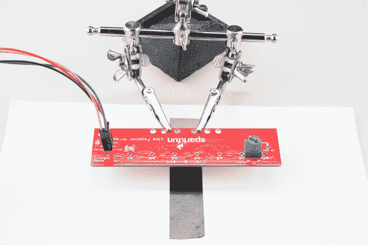](https://cdn.sparkfun.com/assets/learn_tutorials/4/1/0/Line_Follower_Array_Tutorial-07.jpg)*Vision indicators will show above light areas when the shouldn't. Notice B7 and B0 have illuminated.*

**步骤 2** :调高亮度，直到黑暗区域开始出现错误信号。

[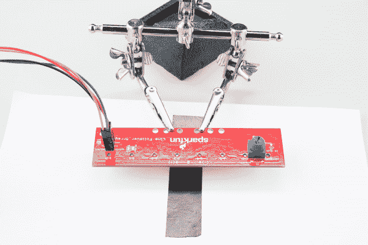](https://cdn.sparkfun.com/assets/learn_tutorials/4/1/0/Line_Follower_Array_Tutorial-08.jpg)*Vision indicators above dark areas will stop showing. Notice B3 has stopped illuminating*

**第三步**:将亮度设置在这两点之间。

[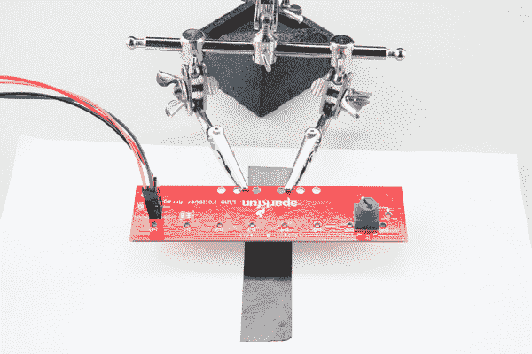](https://cdn.sparkfun.com/assets/learn_tutorials/4/1/0/Line_Follower_Array_Tutorial-09.jpg)*B3 and B4 are illuminated over the line and knob's arrow now shows a setting between the two limits. It's ready to follow!*

## Arduino 库的核心功能

*基本库有以下几个部分*

### 客体结构

需要在全局范围内构建 SensorBar 库的每个实例，以便所有人都能访问。

#### 参数:

以十六进制(无符号 8 位)传递设备地址。

#### 示例:

对于 0x3E 的默认地址:

`SensorBar mySensorBar( 0x3E );`

### 开始()

使用 begin 启动传感器条的 I2C 扩展器。引擎盖下使用 Wire.h。

begin()不接受任何参数。

#### 返回:

返回成功消息(无符号 8 位)。

如果能够与传感器条通信，则返回 1；如果有问题，则返回 0。在示例*中，如果传感器没有响应，草图被保留。*

运行`.begin();`后，传感条准备开始读取数据。将其放在 setup()部分运行一次。

#### 示例:

```
language:c
uint8_t returnStatus = mySensorBar.begin();
if(returnStatus)
{
  Serial.println("sx1509 IC communication OK");
}
else
{
  Serial.println("sx1509 IC communication FAILED!");
}
Serial.println(); 
```

### getRaw()

以单个 8 位字的形式从阵列中获取读数，其中每一位代表一个红外传感器。如果传感器的灯显示:开、开、开、开、关、开、开、开，此函数将返回 0xF7，与丝网上的位位置匹配。如果`InvertBits`已经被设置，结果将是 0x08。

请注意，丝网标签 b7 至 b0 代表该原始数据的相同位。

getRaw()不接受任何参数。

#### 返回:

以字节的位(无符号 8 位)形式返回 IR 检测器的状态。

#### 示例:

```
language:c
//Get the data from the sensor bar.
uint8_t rawValue = mySensorBar.getRaw(); 
```

获取状态并放入临时变量`rawValue`

### getPosition()

用于获取数据，作为检测点平均值的矢量。返回一个带符号的 8 位数，-127 到 127。

例如，如果中间两位(b4 和 b3)检测行，平均值将为 0，或居中。如果左边四条(b7 到 b4)检测线，结果将是左边的平均值(-79)。如果只有最左侧的传感器检测到线路 b7，结果将是-127。使用传感器条上的丝印轴来帮助解释。

请注意，如果`InvertBits`与行/场颜色不匹配，getPosition()的结果将没有意义。这是因为多个检测到的位置被平均以得到一个矢量，而反向设置意味着基本上所有的位置都被检测到并且在零(中心)附近被平均。

getPosition()不接受任何参数。

#### 返回:

位置为带符号的 8 位整数，范围为:-127 到 127。

#### 示例:

```
language:c
//Print the position
Serial.print("Position (-127 to 127): ");
Serial.println(mySensorBar.getPosition()); 
```

### getDensity()

用于获取正在检测线路的传感器数量。

这有助于检测感知线的有效性或检测停止条件，例如机器人是否已被拾起。

getDensity()不接受任何参数。

#### 返回:

返回范围从 0 到 8 的 8 位无符号整数。

#### 示例:

```
language:c
//Print the density
Serial.print("Density, bits detected (of 8): ");
Serial.println(mySensorBar.getDensity()); 
```

### setBarStrobe()和 clearBarStrobe()

用于打开和关闭酒吧的红外线频闪灯以省电。

**Note:** If BarStrobe is set, the feedback indicators only show the value during the time the robot is actively reading the line, but it can save a bunch of power.

setBarStrobe()和 clearBarStrobe 不接受参数并返回 void。

#### 示例:

```
language:c
//For this demo, the IR will only be turned on during reads.
mySensorBar.setBarStrobe();
//Other option: Command to run all the time
//mySensorBar.clearBarStrobe(); 
```

另请注意，在 BarStrobe 设置的情况下，读取操作需要 2-3 倍的时间，因为库必须启用和禁用 led。如果需要非常快速的读取，清除 BarStrobe。

### setInvertBits()和 clearInvertBits()

用于反转感知的线条/字段配色方案。清除反转后，传感器会在亮背景上寻找一条暗线。使用反转设置，它会在黑暗的背景上寻找一条亮线。

**Note:** The bar's vision indicators are NOT reversed by this function, only how the library uses the data.

setInvertBits()和 clearInvertBits()不接受参数并返回 void。

#### 示例:

```
language:c
//Default dark on light surface
mySensorBar.clearInvertBits();
//Other option: light line on dark
//mySensorBar.setInvertBits(); 
```

## 额外库函数:循环缓冲区

arduino 库实际上包含两个类。第一个(如上所述)完成实际传感器的所有读取和配置。第二个是用于创建和保存数据缓冲区的数据结构。

该结构是一个循环缓冲区，当缓冲区满时，新数据会覆盖最旧的数据，并且对数据的所有访问都是从最新的数据中引用的。

### 客体结构

在全局范围内构造缓冲区对象。

#### 参数:

传递要创建的缓冲区的最大大小。参数是无符号 16 位整数类型，但大小必须限制在可用内存的大小。

getPosition()不接受任何参数。

#### 示例:

```
language:c
#define CBUFFER_SIZE 100

//...

CircularBuffer positionHistory(CBUFFER_SIZE); 
```

### 获取元素()

从最新的数据中读取缓冲区中某个深度的数据。

#### 参数:

传递要获取的无符号 16 位整数的元素号。最新的元素被引用为 0。

#### 返回:

有符号整数形式的元素值。

### pushelemont_)

向缓冲区添加一条新数据。

#### 参数:

将要推入缓冲区的值作为带符号的 16 位整数进行传递。

pushelemont 返回 void。

#### 示例:

```
language:c
//Read data from the sensor and put it in the buffer.
positionHistory.pushElement( mySensorBar.getPosition()); 
```

### averageLast()

平均一些最近的条目。

#### 参数:

将元素数作为无符号 16 位整数进行平均。

#### 返回:

最新元素的数学平均值，为带符号的 16 位整数。

#### 示例:

```
language:c
//Get an average of the last 'n' readings
int16_t avePos = positionHistory.averageLast( 10 ); 
```

### 记录长度()

recordlengtht_)没有参数。

#### 返回:

缓冲区中当前的元素数。

当使用部分填充的缓冲区时，这将报告已经推入了多少个条目。当缓冲区已满时，这将报告缓冲区的总大小。

## 示例草图

### 慷慨地

这个例子展示了库可以完成的所有形式的数据收集。

要使用草图，从“示例”菜单中选择它，并将其加载到 Uno 兼容板上。以 9600 波特打开串行终端，应该会出现原始数据、位置和密度的文本。否则，它将宣告通信失败。

[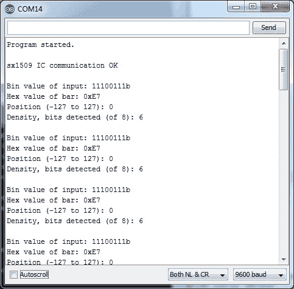](https://cdn.sparkfun.com/assets/learn_tutorials/4/1/0/initOK.jpg)*A properly running sketch reporting that the line is centered*[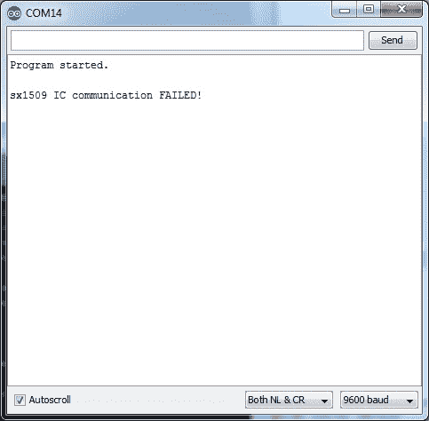](https://cdn.sparkfun.com/assets/learn_tutorials/4/1/0/initFAIL.jpg)*If the sensor did not connect properly, the example will let you know*

### 最基本的追随者

这是使用 RedBot 主板和任一机箱的线跟踪功能演示。它是为浅色背景上约 3/4 英寸宽的暗线(喷漆或电工胶带)而设计的。

草图可以通过弯曲的拐角，但不能通过 90 度的拐角！这取决于你找到一种方法让它导航。此外，这是设计来停止，如果线丢失。一定有办法求部分线段...

这个例子正在我们的演示视频中使用。

[https://www.youtube.com/embed/nJpEkAQbw-U/?autohide=1&border=0&wmode=opaque&enablejsapi=1](https://www.youtube.com/embed/nJpEkAQbw-U/?autohide=1&border=0&wmode=opaque&enablejsapi=1)

这个草图内部有一个小状态机，它读取行，然后根据某些条件进入调用驱动函数的状态。它被故意设计得很简单。制定更好的制度就看你自己了！

[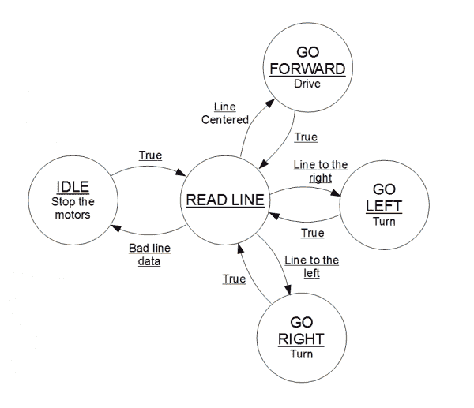](https://cdn.sparkfun.com/assets/learn_tutorials/4/1/0/State_Machine.png)*The basic state machine inside the sketch.*

这篇博文[状态机:blink.ino 学会打盹](https://www.sparkfun.com/news/1801)可能会对你有所帮助。

### 平均地

该草图旨在演示如何从阵列获得伪高分辨率输出。加载草图并打开一个波特率为 **115200** 的串行终端。在标尺上绘制“*”作为 getPosition()数据的滚动平均筛选器。

它还允许你及时回顾，看看机器人以前走过的路。

[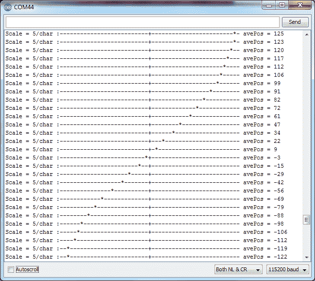](https://cdn.sparkfun.com/assets/learn_tutorials/4/1/0/AveragingOutput.png)*Output of the AveragingReadBarOnly sketch while the sensor was swept over a line. Notice the averaging has produced a output that has a resolution higher than the physical sensor resolution.*

其工作原理是创建一个循环缓冲区，定期存储新的 getPosition()数据，并对缓冲区中最新的 10 个条目进行平均。

缓冲类作为额外的一部分包含在库中。参见[环形缓冲器](https://learn.sparkfun.com/tutorials/sparkfun-line-follower-array-hookup-guide#extra-library-function-the-circular-buffer)部分。

## 资源和更进一步

下面是几行如下资源:

*   [SX1509 连接指南](https://learn.sparkfun.com/tutorials/sx1509-io-expander-breakout-hookup-guide) -您可以将阵列视为 SX1509 分线板，使用这些驱动程序并根据需要微调您的操作。
*   SX1509 数据表 -该数据表描述了 I2C 膨胀机的全部操作。
*   [PID 教程](http://letsmakerobots.com/node/39972) -我们教育工作者挑选的 PID(比例、积分、微分)算法。

快乐排队！