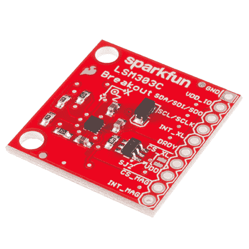

# LSM303C 6DoF 连接指南

> 原文：<https://learn.sparkfun.com/tutorials/lsm303c-6dof-hookup-guide>

## 介绍

[LSM303C](https://www.sparkfun.com/products/13303) 是一个封装在单个封装中的 6 个**d**e**o**f**f**自由(6 自由度) **i** 惯性 **m** 测量值 **u** 单位(IMU)。它装有一个三轴[加速计](https://learn.sparkfun.com/tutorials/accelerometer-basics)和一个三轴[磁力计](https://www.google.com/search?q=magnetometer&ie=utf-8&oe=utf-8)。每个传感器的范围都是可配置的:加速度计的量程可以设置为 2g、4g、6g 或 8g，磁力计的满量程范围为 16 高斯。

 

### [SparkFun 6 自由度突围- LSM303C](https://www.sparkfun.com/products/retired/13303)

[Retired](https://learn.sparkfun.com/static/bubbles/ "Retired") BOB-13303

LSM303C 是一款单封装的 6 自由度(6DOF)惯性测量单元(IMU ),专门开发用于…

**Retired**[Favorited Favorite](# "Add to favorites") 13[Wish List](# "Add to wish list")

[https://www.youtube.com/embed/ui4GW-wO2nk/?autohide=1&border=0&wmode=opaque&enablejsapi=1](https://www.youtube.com/embed/ui4GW-wO2nk/?autohide=1&border=0&wmode=opaque&enablejsapi=1)

LSM303C 支持 [I ² C](https://learn.sparkfun.com/tutorials/i2c) 和 [SPI](https://learn.sparkfun.com/tutorials/serial-peripheral-interface-spi) 。本教程重点介绍如何在 I ² C 模式下使用该器件，但也会简要介绍如何使用 SPI。

### 本教程涵盖的内容

首先，我们将向您介绍分组讨论板。然后，我们将切换到示例代码，向您展示如何使用 Arduino 和我们的 [SparkFun LSM303C 6 DOF IMU 分线 Arduino 库](https://github.com/sparkfun/SparkFun_LSM303C_6_DOF_IMU_Breakout_Arduino_Library)与电路板进行交互。

本教程分为以下几个部分:

*   [分线板概述](#hardware-overview) -本页研究 LSM303C 分线板-包括引脚排列、跳线和原理图等主题。
*   [硬件组装](#hardware-assembly)——如何组装硬件来运行一些示例代码。
*   [安装 Arduino 库](#installing-the-arduino-library) -如何安装 Arduino 库，并使用一个简单的示例草图来验证您的连接工作正常。
*   [资源&更进一步](#resources--going-further) -学习和使用 LSM303C 做更多事情的资源。

### 所需材料

本教程介绍如何将 LSM303C 分线板与 Arduino 配合使用。要跟进，您需要以下材料: