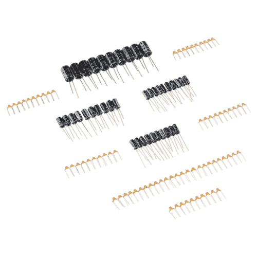
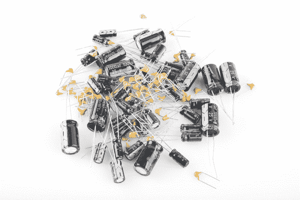
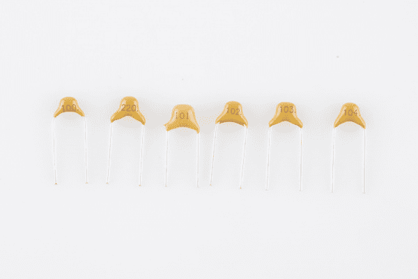
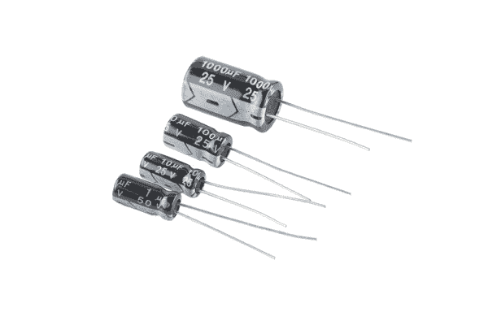
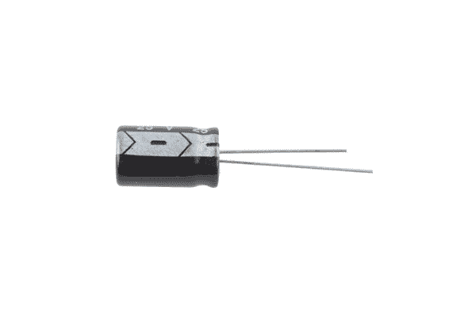
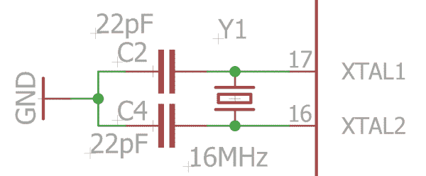
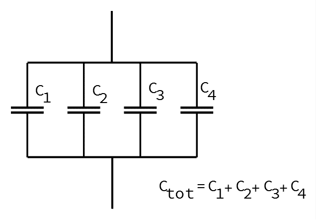
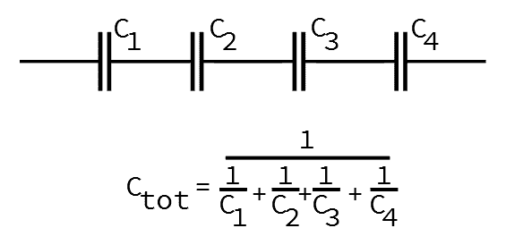

# 电容器套件识别指南

> 原文：<https://learn.sparkfun.com/tutorials/capacitor-kit-identification-guide>

## 介绍

你永远不知道什么时候你会需要一个电容器。有时，您需要多一点电源去耦、一个输出耦合电容，或者仔细调谐滤波电路，所有这些应用都需要电容。 [SparkFun 电容套件](https://www.sparkfun.com/products/13698)包含各种电容值，因此当您需要它们时，它们总是在您手边。

 

将**添加到您的[购物车](https://www.sparkfun.com/cart)中！**

### [SparkFun 电容套装](https://www.sparkfun.com/products/13698)

[In stock](https://learn.sparkfun.com/static/bubbles/ "in stock") KIT-13698

这是一个工具包，为您提供一个基本的电容器分类，开始或继续您的电子修补。不要…

$8.9512[Favorited Favorite](# "Add to favorites") 86[Wish List](# "Add to wish list")** **本教程将帮助您识别工具包的内容，并向您展示一些技巧来进一步扩展值的范围。

### 推荐阅读

*   如果你想了解更多关于电容的一般信息，可以从我们的[电容教程](https://learn.sparkfun.com/tutorials/capacitors)开始。
*   电容值用[公制前缀](https://learn.sparkfun.com/tutorials/metric-prefixes-and-si-units)表示
*   该套件中的电解电容器被[极化](https://learn.sparkfun.com/tutorials/polarity)。

## 套件内容

电容器套件包含从 10 皮法到 1000 微法的十倍间隔电容。

| **电容器套件内容** |
| **值** | **类型** | **标记** | **数量** | **额定电压** |
| 10pF | 陶器的 | One hundred | Ten | 50V |
| 22pF | 陶器的 | Two hundred and twenty | Ten | 50V |
| 100pF | 陶器的 | One hundred and one | Ten | 50V |
| 1nF | 陶器的 | One hundred and two | Ten | 50V |
| 10nF | 陶器的 | One hundred and three | Ten | 50V |
| 100nF | 陶器的 | One hundred and four | Twenty-five | 50V |
| 1 层 | 电解的 | 1 F/50V | Ten | 50V |
| 10 层 | 电解的 | 10 华氏度/25 伏 | Ten | 25V |
| 100 华氏度 | 电解的 | 100 华氏度/25 伏 | Ten | 25V |
| 1000 华氏度 | 电解的 | 1000 华氏度/25 伏 | Ten | 25V |

大部分值有十块，但是 100 纳法的有 25 块，常用于 [ICs](https://learn.sparkfun.com/tutorials/integrated-circuits) 附近的局部电源去耦。还有十片 22pf，在搭建晶体振荡器时经常用作负载电容。

## 电容器识别

### 电容器标记审查

面对现实吧，一法拉是很大的电容。电容值通常很小，通常在百万分之一法拉或十亿分之一法拉。为了简洁地表达这些小值，我们使用了[公制](https://learn.sparkfun.com/tutorials/metric-prefixes-and-si-units/the-prefixes)。以下前缀为现代约定 ^(*****) 。

| **电容公制前缀** |
| **前缀** | 如果符号 | **分数** | **符号** |
| 微法 | 10 ^(-6) | 百万分之一 | f |
| 纳法拉 | 10 ^(-9) | 十亿分之一 | 法国标准 |
| 微微法拉 | 10 ^(-12) | 万亿分之一 | 脉波频率（Pulse Frequency 的缩写） |

***** These units are the modern convention, and mostly follow the guidelines for applying the metric system, but it isn't universally consistent.

Mu (µ), the symbol for micro, can be an issue for typesetting. It's hard to type, and not every font has the symbol. At SparkFun, we often use the letter 'u' as a substitute. Sometimes the letter 'm' is used instead, resuiting in micro-Farads being abbreviated as 'mF.' Technically, there's also a "milli-Farad," but in practice, milli-Farads are almost never seen, with thousands of micro-Farads being much more common.

Time and geography have an influence as well. In older [North American](http://www.eevblog.com/forum/chat/why-do-americans-not-use-nanofarads/) designs, nano-Farads are uncommon, with BOMs and schematics instead using only µF and pF, padded with leading or trailing zeros.

### 陶瓷帽

套件中较小的值是 50V 额定陶瓷电容器。这些是小的，非极化的帽子，身体上有黄色的斑点。

*From Left to Right: 10 pF, 22 pF, 100 pF, 1 nF, 10 nF, 100 nF*

该值以三位数代码打印在每个标签上。该代码类似于电阻器上的[颜色代码](https://learn.sparkfun.com/tutorials/resistors/decoding-resistor-markings)，但使用数字而不是颜色。前两位是该值的两位最高有效数字，第三位是 10 的指数。该值用皮法表示。

要解码该值，取前两位数字，然后跟随第三位数字表示的零的数目。104 变成“10”，后跟“0000”，或 100000 pF，更简洁地写成 100 nF。

### 电解电容

电解帽有更大的圆柱体，看起来像小汽水罐。它们通常比陶瓷电容具有更高的电容。与陶瓷不同，它们是极化的。

*From Left to Right: 1µF, 10µF, 100µF, 1000µF*

溶解瓶盖上的标记很容易辨认——数值和单位就印在瓶体上。

该值后面是额定电压，表示电容器可以承受而不损坏的最大 DC 电势。在此套件中，1 F 额定为 50V，其他额定为 25V。

#### 极化的

电解质的高电容伴随着一个有些乏味的细节——它们被极化了。正极引线需要保持比负极引线更高的 DC 电势。如果它们装反了，很容易爆炸。

值得庆幸的是，这些线索被清晰地标记出来。

电解盖上有两个极性指示器:

1.  车身上画的条纹通常表示负极铅。
2.  正极引线比负极引线长。

## 巧妙的应用

### 晶体振荡器

该套件特别包括 22 pF 陶瓷电容，用于构建微控制器 ic 通常需要的晶体振荡器。

*The crystal oscillator circuit from the [ProMicro](https://www.sparkfun.com/products/12640)*

### 值组合

该套件提供了大量的值，但逐十年的选择在其间留下了一些空白。有几个技巧可以用来弥补这些差距，通过组合[串联或并联](https://learn.sparkfun.com/tutorials/capacitors/capacitors-in-seriesparallel)的电容。

#### 平行的

并联连接的电容值相加。您可以将较小的瓶盖组合起来，形成一个较大的瓶盖。

#### 系列

串联的电容器组合成一个倒数和-取每个值的倒数，并将它们相加，然后取该和的倒数。

* * *

当你在你的工作台时，重申为一个简化的指导方针:

*   如果你想要一顶帽子一半的价值，把两个这样的价值串联起来。
*   如果你想让一顶帽子的价值翻倍，那就把两顶帽子放在一起。

## 资源和更进一步

*   我们的[电阻器套件](https://www.sparkfun.com/products/10969)与电容器套件完美搭配。
*   如果您想测量电容值，可以构建[电容计套件](https://www.sparkfun.com/products/9485)。
*   [Harry Bissell 的 Cap FAQ](http://www.muzique.com/cap_faq.htm) 是一份非常详细的电容选择指南。
*   我们的工程师 Shawn 通过[爆炸电容器](https://www.youtube.com/watch?v=sW0a9d_vWoc)给出了极性和电压额定值的视频演示。**