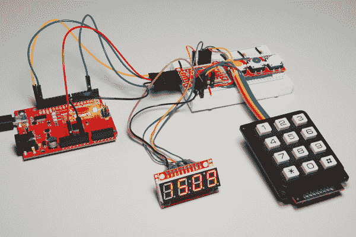

# SX1509 I/O 扩展器转接连接指南

> 原文：<https://learn.sparkfun.com/tutorials/sx1509-io-expander-breakout-hookup-guide>

## 介绍

你的 Arduino 在 GPIO 上运行的低吗？想单独控制 16 个 led 的亮度吗？也许眨眼或自主呼吸几下？想要将扫描 64 个按钮的 8x8 矩阵的任务委托给另一个控制器吗？这些都是制造 [SX1509 16-IO 扩展器](https://www.sparkfun.com/products/13601)的任务！

[](https://www.sparkfun.com/products/13601) 

将**添加到您的[购物车](https://www.sparkfun.com/cart)中！**

 **### [SparkFun 16 输出 I/O 扩展器分线点- SX1509](https://www.sparkfun.com/products/13601)

[In stock](https://learn.sparkfun.com/static/bubbles/ "in stock") BOB-13601

您的 I/O 资源不足吗？没问题！SX1509 分线点是一个带 I2C 接口的 16 通道 GPIO 扩展器，这意味着使用 j…

$6.9510[Favorited Favorite](# "Add to favorites") 37[Wish List](# "Add to wish list")** **SX1509 是一个带有 **I ² C 接口**的 **16 通道** GPIO 扩展器——这意味着只需两根线，您的微控制器就可以与 16 个完全可配置的数字输入/输出引脚接口。

但是，SX1509 能做的远不止简单的数字引脚控制。它可以产生 **PWM** 信号，所以可以调光 led。它可以设置成**眨眼**甚至**呼吸**的不同速率。此外，通过内置的键盘引擎，它可以与 8x8 矩阵中设置的多达 64 个按钮进行交互。

[](https://cdn.sparkfun.com/assets/learn_tutorials/4/3/4/example-circuit-demo.jpg)*An SX1509 controlling three LEDs, monitoring three buttons and a 12-button keypad, and producing SPI signals to drive a Serial 7-Segment Display.*

这是一个非常酷的芯片，也是一个扩展 Arduino 或任何其他支持 I ² C 的微控制器能力的伟大工具。

### 本教程涵盖的内容

本教程将帮助您熟悉 SX1509 和 SparkFun Breakout 的所有内容。然后，我们将演示如何使用 Arduino 兼容微控制器和我们的 [SX1509 Arduino 库](https://github.com/sparkfun/SparkFun_SX1509_Arduino_Library)来利用 I/O 扩展器的所有功能。

本教程分为以下几个部分:

*   [SX1509 分线板概述](https://learn.sparkfun.com/tutorials/sx1509-io-expander-breakout-hookup-guide#sx1509-breakout-board-overview)-sx 1509 和 SparkFun 分线板的特点概述。
*   [硬件装配](https://learn.sparkfun.com/tutorials/sx1509-io-expander-breakout-hookup-guide#hardware-assembly) -将接头或电线焊接到 SX1509 分接头的技巧和窍门。
*   安装 SparkFun SX1509 Arduino 库——我们已经编写了一个 Arduino 库来抽象所有难看的寄存器位操作。
    *   [示例:数字输入/输出和 PWM](https://learn.sparkfun.com/tutorials/sx1509-io-expander-breakout-hookup-guide#-example-digital-inout-and-pwm) -一个示例电路和 Arduino 草图，展示了一些更简单的 I/O 扩展器特性。
    *   [示例:LED 驱动](https://learn.sparkfun.com/tutorials/sx1509-io-expander-breakout-hookup-guide#example-led-driving) -演示如何自主闪烁和呼吸 LED 的示例。
    *   [示例:按钮矩阵](https://learn.sparkfun.com/tutorials/sx1509-io-expander-breakout-hookup-guide#example-button-matrices)——如何使用 SX1509 的键盘引擎来监控一个 [12 按钮键盘](https://www.sparkfun.com/products/8653)。

### 推荐阅读

在深入学习本教程之前，有几个概念您应该已经比较熟悉了。查看这些相关教程:

*   I ² C 通讯-sx 1509 通过 I ² C 接口控制。了解这款强大的双线式接口。
*   [逻辑电平](https://learn.sparkfun.com/tutorials/logic-levels) -虽然大多数 Arduino 的工作电压为 5V，但 SX1509 的工作电压为 3.3v。GPIO 至少可以耐受 5V 电压！
*   [脉宽调制(PWM)](https://learn.sparkfun.com/tutorials/pulse-width-modulation)-sx 1509 的所有输出引脚都能够产生 PWM 信号。这意味着你可以控制[led](https://learn.sparkfun.com/tutorials/light-emitting-diodes-leds)的亮度！

[](https://learn.sparkfun.com/tutorials/pulse-width-modulation) [### 脉宽灯](https://learn.sparkfun.com/tutorials/pulse-width-modulation) An introduction to the concept of Pulse Width Modulation.[Favorited Favorite](# "Add to favorites") 46[](https://learn.sparkfun.com/tutorials/logic-levels) [### 逻辑电平](https://learn.sparkfun.com/tutorials/logic-levels) Learn the difference between 3.3V and 5V devices and logic levels.[Favorited Favorite](# "Add to favorites") 82[](https://learn.sparkfun.com/tutorials/light-emitting-diodes-leds) [### 发光二极管](https://learn.sparkfun.com/tutorials/light-emitting-diodes-leds) Learn the basics about LEDs as well as some more advanced topics to help you calculate requirements for projects containing many LEDs.[Favorited Favorite](# "Add to favorites") 67[](https://learn.sparkfun.com/tutorials/i2c) [### I2C](https://learn.sparkfun.com/tutorials/i2c) An introduction to I2C, one of the main embedded communications protocols in use today.[Favorited Favorite](# "Add to favorites") 128

## SX1509 分线板概述

SX1509 突破发生了很多事情。GPIO 和电源总线在各个方向上断开，可配置跳线覆盖了电路板的大部分其余部分。

[](https://cdn.sparkfun.com/assets/learn_tutorials/4/3/4/hardware-top.jpg)

本节将涵盖 SX1509 分线点的所有内容，因此您可以充分利用该板的特性。

### I ² C 和电源输入接头

分线板顶部和底部的两个接头是板的**输入和控制**接头。这是你可以向 SX1509 供电的地方，也是你的 I ² C 信号——SDA 和 SCL——将终止的地方。

[](https://cdn.sparkfun.com/assets/learn_tutorials/4/3/4/hardware-input-headers-2.jpg)

这些接头断开了以下引脚:

| Pin Label | 类型 | 描述 |
| INT | 输出 | 低电平有效可编程中断 |
| RST | 投入 | 低电平有效复位(拉高片上) |
| GND | 力量 | 接地(0V) |
| 3V3 | 力量 | 主电源电压(1.425-3.6V) |
| 国家药品监督管理局 | I ² C | I ² C 串行数据线 |
| SCL | I ² C | I ² C 串行时钟线 |
| OSC | 打卡上班/下班 | 可选时钟输入或可编程时钟信号输出 |

SDA 和 SCL 引脚各有一个 10kΩ电阻，用于将引脚拉高至 3.3V，可以通过切断 SJ1 跳线来断开这些电阻。

RST-sx 1509 的**低电平有效复位输入** -就像 Arduino 复位引脚一样工作。如果引脚被拉低，SX1509 将关断。当 RST 上升时，SX1509 将重新开启，但其所有设置将被清除。分线板包括一个将 RST 拉高的 10kΩ电阻，因此如果不需要复位功能，可以忽略此引脚。

INT 是一个非常方便的**中断输出**，特别是如果你使用任何 SX1509 引脚作为输入。它可以配置为每当引脚状态改变时变为低电平。分线板包括一个将 INT 拉高的 10kΩ电阻。

最后，OSC 断开 SX1509 的 **OSCIO** 引脚——即**振荡器输入/输出**。这个高度可配置的引脚可以用作 SX1509 的时钟输入(如果不想使用其内部 2MHz 时钟)、时钟输出(产生最高 2MHz 方波信号)或简单的数字 I/O。

**Required and optional pins:** The pairs of power and I²C pins are the only ones *required* for interfacing with the SX1509\. RST, INT, and OSC are all **optional**, they can be left disconnected if you don't need the feature they provide.

### I/O 和 GND/VCC 分组讨论

分线板的真正核心是分出所有 16 个 I/O 引脚和电源轨的成双成对的行。

[](https://cdn.sparkfun.com/assets/learn_tutorials/4/3/4/hardware-gpio-headers-3.jpg)

SX1509 将其 16 个 I/O 分成两个**组**-A 组和 B 组。每个组都可以使用独立的电源，但默认情况下，它们都设置为 3.3V 组由 VCC1 供电，B 组由 VCC2 供电。如果需要外部电源，VCC1 和 VCC2 的范围可以是 1.2V 至 3.6V。查看“跳线”部分以了解更多信息。

每个 I/O 引脚都有**PWM 和闪烁**输出的能力，但只有一半可以设置为“呼吸”(从开到关平滑过渡的闪烁)。此外，如果您计划使用 SX1509 键盘驱动程序，每个 I/O 将被归入行或列接口。

|  | LED 驱动器 | 小键盘 |
| 输入－输出 | 脉宽调制（pulse-width modulating 的缩写） | 眨眼 | 呼吸 | 排 | 圆柱 |
| Zero | &check; | &check; |  | &check; |  |
| one | &check; | &check; |  | &check; |  |
| Two | &check; | &check; |  | &check; |  |
| three | &check; | &check; |  | &check; |  |
| four | &check; | &check; | &check; | &check; |  |
| five | &check; | &check; | &check; | &check; |  |
| six | &check; | &check; | &check; | &check; |  |
| seven | &check; | &check; | &check; | &check; |  |
| eight | &check; | &check; |  |  | &check; |
| nine | &check; | &check; |  |  | &check; |
| Ten | &check; | &check; |  |  | &check; |
| Eleven | &check; | &check; |  |  | &check; |
| Twelve | &check; | &check; | &check; |  | &check; |
| Thirteen | &check; | &check; | &check; |  | &check; |
| Fourteen | &check; | &check; | &check; |  | &check; |
| Fifteen | &check; | &check; | &check; |  | &check; |

### 接地(或电源)轨

I/O 分线点旁边是一对电源轨。这些轨道可以通过在每个焊盘之间运行的白色丝网的**条来区分。**

[](https://cdn.sparkfun.com/assets/learn_tutorials/4/3/4/hardware-gnd-vcc-jumper.jpg)

默认情况下，这些轨道都设置为**地** -如果你想扇出一些低电平有效按钮或电流源 led，这很方便。背面的跳线允许您将轨道从 GND 切换到 VCC1 或 VCC2。你需要切断 GND 和轨道之间的跳线，然后在轨道和 VCC 之间滴焊料。

这辆公共汽车是完全可选的。如果您打算在试验板上使用分线点，就不要将公引脚焊接到两排接头上！

### 地址选择跳线

通过将它们配置到不同的地址，最多可以将四个 SX1509 连接到一条 I ² C 总线上。SX1509 有两个引脚专用于 I ² C 地址选择:ADD0 和 ADD1。这些引脚中的每一个都连接到电路板底部的跳线。

[](https://cdn.sparkfun.com/assets/learn_tutorials/4/3/4/hardware-addr-jumper.jpg)

电路板将这些引脚默认为 GND，这将 I ² C 地址设置为 **0x3E** 。要将任一跳线设置为“1”(高)，抓住一把[业余爱好刀](https://www.sparkfun.com/products/9200)，切断连接到“0”的迹线，并在中心焊盘和“1”之间滴上一些焊料。

电路板背面列出了四个可配置的地址，但为了便于快速参考，它们是:

| ADD1 | ADD0 | I ² C 地址 |
| Zero | Zero | 0x3E |
| Zero | one | 0x3F |
| one | Zero | 0x70 |
| one | one | 0x71 |

### VCC1 和 VCC2 跳线

电路板背面的 SJ2 和 SJ3 分别将 VCC2 和 VCC1 连接到 3V3 电源输入。因此，如果向电路板提供 3.3V 电压，每个 I/O 组都将以 3.3V 电压工作。

如果你想利用 SX1509 的**电平转换**功能，以 VCC 以外的方式为这些存储体供电，请切断跳线，并将 1.2V 和 3.6V 之间的任何电压插入 VCC1 和/或 VCC2 引脚。

这些供电总线是完全独立的，因此它们可以在不同的电压下工作。

## 硬件装配

你需要将*某种东西*焊接到 SX1509 分接头上才能使用，这种东西是[公](https://www.sparkfun.com/products/116)还是[母](https://www.sparkfun.com/products/115)接头还是[电线](https://www.sparkfun.com/products/11367)完全取决于你和你的预期应用。如果你以前从未焊接过，看看我们的 [PTH 焊接教程](https://learn.sparkfun.com/tutorials/how-to-solder-through-hole-soldering)。

我们喜欢的一个选项是，在 I/O 排上焊接公接头，在 power/I ² C 接头中的一个(或两个)上焊接母接头，这可以保持电路板尽可能与试验板兼容。

[](https://cdn.sparkfun.com/assets/learn_tutorials/4/3/4/headers-soldered.jpg)

然后，您可以使用[凸到凸跳线](https://www.sparkfun.com/products/12795)连接您的微控制器和分线点，并试验其余的 I/O。

## 安装 SparkFun SX1509 Arduino 库

**Note:** This example assumes you are using the latest version of the Arduino IDE on your desktop. If this is your first time using Arduino, please review our tutorial on [installing the Arduino IDE.](https://learn.sparkfun.com/tutorials/installing-arduino-ide) If you have not previously installed an Arduino library, please check out our [installation guide.](https://learn.sparkfun.com/tutorials/installing-an-arduino-library)

现在你已经基本上弄清楚了硬件，是时候开始编程了！为了帮助尽可能轻松地使用 SX1509，我们编写了一个 Arduino 库来帮助与它交互。打开 Arduino 库管理器，搜索 **SparkFun SX1509** 。您也可以通过点击下面的按钮下载最新版本的库，从 GitHub 资源库手动安装 [SparkFun SX1509 Arduino 库](https://github.com/sparkfun/SparkFun_SX1509_Arduino_Library)。

[Download the SparkFun SX1509 Arduino Library!](https://github.com/sparkfun/SparkFun_SX1509_Arduino_Library/archive/master.zip)

要获得安装库的帮助，请查看我们的[安装 Arduino 库](https://learn.sparkfun.com/tutorials/installing-an-arduino-library)教程。如果你下载了 ZIP 格式的库，可以使用 Arduino 的**草图** > **包含库** > **添加。ZIP 库**工具自动将其添加到您的 Arduino sketchbook。

SparkFun SX1509 Arduino 库包括各种示例，展示了 I/O 扩展器的特定功能。导航到**文件** > **示例** > **SparkFun SX1509 IO 扩展器**查看它们。

[](https://cdn.sparkfun.com/assets/learn_tutorials/4/3/4/library-examples.png)

很快，我们将带您浏览几个展示 I/O 扩展器功能范围的快速示例。

## 示例:数字输入/输出和 PWM

与几乎所有 I/O 扩展器一样，SX1509 的每个 GPIO 都可以配置为简单的数字输入或输出。因此，您可以打开或关闭 led，监控按钮按压，甚至 bit-bang 更高级的数字接口，如 SPI(可能没有与时序相关的功能)。

这里有一个简单的例子，说明如何使用 SX1509 进行`digitalWrite`或`digitalRead`操作。如果你想跟随，连接一个电路如下:

[](https://cdn.sparkfun.com/assets/learn_tutorials/4/3/4/fritzing-example-1_bb.png)

在您的 Arduino 和 SX1509 分线点之间匹配 3.3V、GND、SDA 和 SCL。然后将 LED 连接到 I/O 15——您可以将其配置为源电流或吸电流。并将低电平有效按钮连接到 I/O 0。

然后把这段代码扔到你的 Arduino 上:

```
language:c
/*************************************************************
  digitalReadWrite_Combined.ino
  SparkFun SX1509 I/O Expander Example: digital I/O (digitalRead/digitalWrite)
  Jim Lindblom @ SparkFun Electronics
  Original Creation Date: September 21, 2015
  https://github.com/sparkfun/SparkFun_SX1509_Arduino_Library

  This example demonstrates the SX1509's digitalRead and digitalWrite
  functionality. We'll attach an active-low button to an
  INPUT_PULLUP input and attach an LED to a pin set as an OUTPUT.
  Then whenever the button read's LOW, we'll toggle the LED.
  Note that the code will wait until the button is released
  before reading the SX1509 pins again.

  After uploading the sketch, open your serial monitor and set
  it to 115200 baud.

  Hardware Hookup:
  SX1509 Breakout ------ Arduino -------- Breadboard
        GND -------------- GND
        3V3 -------------- 3.3V
        SDA ------------ SDA (A4)
        SCL ------------ SCL (A5)
        0 ---------------------------------]BTN[----GND
        15 -------------------------------- LED+
                                       LED- -/\/\/\- GND
                                               330
  Development environment specifics:
  IDE: Arduino 1.6.5
  Hardware Platform: Arduino Uno
  SX1509 Breakout Version: v2.0

  This code is beerware; if you see me (or any other SparkFun
  employee) at the local, and you've found our code helpful,
  please buy us a round!

  Distributed as-is; no warranty is given.
*************************************************************/

#include <Wire.h>           // Include the I2C library (required)
#include <SparkFunSX1509.h> //Click here for the library: http://librarymanager/All#SparkFun_SX1509

// SX1509 I2C address (set by ADDR1 and ADDR0 (00 by default):
const byte SX1509_ADDRESS = 0x3E; // SX1509 I2C address
SX1509 io;                        // Create an SX1509 object to be used throughout

// SX1509 pin definitions:
// Note: these aren't Arduino pins. They're the SX1509 I/O:
const byte SX1509_LED_PIN = 15; // LED connected to 15 (source ing current)
const byte SX1509_BUTTON_PIN = 0; // Button connected to 0 (Active-low button)

bool ledState = false;

void setup()
{
  // Serial is used in this example to display the input value
  // of the SX1509_INPUT_PIN input:
  Serial.begin(115200);
  Serial.println("SX1509 Example");

  Wire.begin(); //Initialize I2C bus

  pinMode(13, OUTPUT); // Use pin 13 LED as debug output
  digitalWrite(13, LOW); // Start it as low

  // Call io.begin(<address>) to initialize the SX1509\. If it
  // successfully communicates, it'll return 1.
  if (io.begin(SX1509_ADDRESS) == false)
  {
    Serial.println("Failed to communicate. Check wiring and address of SX1509.");
    digitalWrite(13, HIGH); // If we failed to communicate, turn the pin 13 LED on
    while (1)
      ; // If we fail to communicate, loop forever.
  }

  // Call io.pinMode(<pin>, <mode>) to set any SX1509 pin as
  // either an INPUT, OUTPUT, INPUT_PULLUP, or ANALOG_OUTPUT
  // Set output for LED:
  io.pinMode(SX1509_LED_PIN, OUTPUT);
  // Use a pull-up resistor on the button's input pin. When
  // the button is pressed, the pin will be read as LOW:
  io.pinMode(SX1509_BUTTON_PIN, INPUT_PULLUP);

  // Blink the LED a few times before we start:
  for (int i = 0; i < 5; i++)
  {
    // Use io.digitalWrite(<pin>, <LOW | HIGH>) to set an
    // SX1509 pin either HIGH or LOW:
    io.digitalWrite(SX1509_LED_PIN, HIGH);
    delay(100);
    io.digitalWrite(SX1509_LED_PIN, LOW);
    delay(100);
  }
}

void loop()
{
  // Use io.digitalRead() to check if an SX1509 input I/O is
  // either LOW or HIGH.
  if (io.digitalRead(SX1509_BUTTON_PIN) == LOW)
  {
    // Print the status of the other pin:
    Serial.print("SX1509_BUTTON_PIN status: ");
    // Read the pin to print either 0 or 1
    Serial.println(io.digitalRead(SX1509_BUTTON_PIN));

    // If the button is pressed toggle the LED:
    ledState = !ledState;
    io.digitalWrite(SX1509_LED_PIN, ledState);

    // Print the status of the other pin:
    Serial.print("SX1509_LED_PIN status: ");
    // Read the pin to print either 0 or 1
    Serial.println(ledState);

    Serial.print("Waiting for button to release...");
    while (io.digitalRead(SX1509_BUTTON_PIN) == LOW)
      ; // Wait for button to release
    Serial.println("Button released!");

    //delay(200); //uncomment to add a small delay for  button debouncing
  }
} 
```

当您按下按钮时，LED 状态应该会切换。在 **115200** 处打开 [Arduino 串行监视器](https://learn.sparkfun.com/tutorials/terminal-basics/arduino-serial-monitor-windows-mac-linux)也会给你串行输出。检查代码，看看有多简单！与您可能已经熟悉的 Arduino 代码并没有太大的不同。

[](https://cdn.sparkfun.com/assets/learn_tutorials/4/3/4/SX1509_Example_Digital_IO_Blink_Button_Arduino_Serial_Output.jpg)

#### SX1509 库入门

首先，包含“SparkFunSX1509.h”库(以及“Wire.h”库)，并在全局区域中创建一个`SX1509`对象:

```
language:c
#include <Wire.h>           // Include the I2C library (required)
#include <SparkFunSX1509.h> //Click here for the library: http://librarymanager/All#SparkFun_SX1509

// SX1509 I2C address (set by ADDR1 and ADDR0 (00 by default):
const byte SX1509_ADDRESS = 0x3E; // SX1509 I2C address
SX1509 io;                        // Create an SX1509 object to be used throughout 
```

从现在开始，您将使用那个`io`对象。在`setup()`中，确保使用`Wire.begin()`连接 I ² C 总线。为了初始化 I/O 扩展器——并确保它正确通信——您需要调用`io.begin(<address>)`,其中`<address>`是扩展器的 I ² C 地址(默认为 0x3E)。在这种情况下，我们在代码的前面定义了 SX1509_ADDRESS。检查`begin()`的返回值，确保一切正常。

```
language:c
  Wire.begin(); //Initialize I2C bus

  pinMode(13, OUTPUT); // Use pin 13 LED as debug output
  digitalWrite(13, LOW); // Start it as low

  // Call io.begin(<address>) to initialize the SX1509\. If it
  // successfully communicates, it'll return 1.
  if (io.begin(SX1509_ADDRESS) == false)
  {
    Serial.println("Failed to communicate. Check wiring and address of SX1509.");
    digitalWrite(13, HIGH); // If we failed to communicate, turn the pin 13 LED on
    while (1)
      ; // If we fail to communicate, loop forever.
  } 
```

**Note:** Please be aware that v3 of the library breaks previous version compatiblity on a few things:

*   在调用`io.begin()`之前，必须在 Arduino 草图中显式调用`Wire.begin()`。这可能会破坏没有`Wire.begin()`的代码。
*   `io.begin()`已扩展至包括`io.begin(deviceAddress, wirePort, resetPin)`。这可能会破坏第二个参数为`resetPin`的代码。

然后你可以使用你已经非常熟悉的函数来控制 I/O。只需将`io`对象标记到`pinMode`、`digitalWrite`和`digitalRead`的开头，然后像平常一样处理你的 Arduino 事务！

### 模拟输出(PWM)

您还可以通过使用`analogWrite(<pin>, <0-255>)`功能将任何 I/O 用作“模拟”(PWM)输出——就像 Arduino 模拟输出一样！需要注意的只是一些差异:

*   **ANALOG_OUTPUT** :如果你想让一个管脚产生 PWM 信号，在你的设置中调用`pinMode(<pin>, ANALOG_OUTPUT)`。这将告诉 SX1509 将引脚初始化为“LED 驱动器”。
*   **吸收电流** : `analogWrite(<pin>, <0-255>)`假设 LED 以吸收电流的方式连接，这意味着 LED 的阴极(负极引脚)端接至 SX1509。因此，`analogWrite` ing 到 255 实际上会将引脚拉低，0 会将其拉高。

下面是一些示例代码:

```
language:c
/*************************************************************
  analogWrite.ino
  SparkFun SX1509 I/O Expander Example: pwm output (analogWrite)
  Jim Lindblom @ SparkFun Electronics
  Original Creation Date: September 21, 2015
  https://github.com/sparkfun/SparkFun_SX1509_Arduino_Library

  This example demonstrates the SX1509's analogWrite function.
  Connect an LED to the SX1509's pin 15 (or any other pin, they
  can all PWM!). The SX1509 can either sink or source current,
  just don't forget your limiting resistor!

  Hardware Hookup:
  SX1509 Breakout ------ Arduino -------- Breadboard
        GND -------------- GND
        3V3 -------------- 3.3V
      SDA ------------ SDA (A4)
      SCL ------------ SCL (A5)
      15 -------------------------------- LED+
                                     LED- -/\/\/\- GND
                                                330

  Development environment specifics:
  IDE: Arduino 1.6.5
  Hardware Platform: Arduino Uno
  SX1509 Breakout Version: v2.0

  This code is beerware; if you see me (or any other SparkFun
  employee) at the local, and you've found our code helpful,
  please buy us a round!

  Distributed as-is; no warranty is given.
*************************************************************/

#include <Wire.h>           // Include the I2C library (required)
#include <SparkFunSX1509.h> //Click here for the library: http://librarymanager/All#SparkFun_SX1509

// SX1509 I2C address (set by ADDR1 and ADDR0 (00 by default):
const byte SX1509_ADDRESS = 0x3E; // SX1509 I2C address
SX1509 io;                        // Create an SX1509 object to be used throughout

// SX1509 Pin definition:
const byte SX1509_LED_PIN = 15; // LED to SX1509's pin 15

void setup()
{
  Serial.begin(115200);
  Serial.println("SX1509 Example");

  Wire.begin();

  // Call io.begin(<address>) to initialize the SX1509\. If it
  // successfully communicates, it'll return 1.
  if (io.begin(SX1509_ADDRESS) == false)
  {
    Serial.println("Failed to communicate. Check wiring and address of SX1509.");
    while (1)
      ; // If we fail to communicate, loop forever.
  }

  // Use the pinMode(<pin>, <mode>) function to set our led
  // pin as an ANALOG_OUTPUT, which is required for PWM output
  io.pinMode(SX1509_LED_PIN, ANALOG_OUTPUT);
}

void loop()
{
  // Ramp brightness up, from 0-255, delay 2ms in between
  // analogWrite's
  for (int brightness = 0; brightness < 256; brightness++)
  {
    // Call io.analogWrite(<pin>, <0-255>) to configure the
    // PWM duty cycle
    io.analogWrite(SX1509_LED_PIN, brightness);
    delay(2); // Delay 2 milliseconds
  }
  delay(500); // Delay half-a-second

  // Ramp brightness down, from 255-0, delay 2ms in between
  // analogWrite's
  for (int brightness = 255; brightness >= 0; brightness--)
  {
    io.analogWrite(SX1509_LED_PIN, brightness);
    delay(2); // Delay 2 milliseconds
  }
  delay(500); // Delay half-a-second
} 
```

这是一个真正的好呼吸 LED！但是 SX1509 不仅仅是一个简单的数字 I/O 扩展器。它的 LED 驱动功能意味着您可以将所有的呼吸卸载到 SX1509，将您的`loop()`留给更重要的任务！

## 示例:LED 驱动

SX1509 最酷的功能之一是其内置的 LED 驱动支持。除了数字甚至 PWM 输出，SX1509 还可以自主闪烁或呼吸 led！只要告诉它眨眼的时间，或者上升/下降的速度，它就会帮你完成剩下的工作。

[](https://cdn.sparkfun.com/assets/learn_tutorials/4/3/4/example-circuit-led.jpg)

对于这个例子，抓住四个发光二极管，将它们连接到引脚 8、13、14 和 15。

**Source vs. Sink:** The SX1509 can either source or sink current, but it has a much higher capacity for *sinking* current. It can source up to 8mA per I/O, or sink up to 15mA. If you're driving LEDs, we recommend hooking them up to sink current.

[](https://cdn.sparkfun.com/assets/learn_tutorials/4/3/4/source-vs-sink.png)

下面是一个将连接到引脚 15 的 LED 设置为闪烁的示例:

```
language:c
/*************************************************************
blink.ino
SparkFun SX1509 I/O Expander Example: blink output
Jim Lindblom @ SparkFun Electronics
Original Creation Date: September 21, 2015
https://github.com/sparkfun/SparkFun_SX1509_Arduino_Library

This example demonstrates the SX1509's set-it-and-forget-it
blink function. We'll set the pin up as an OUTPUT, and call
io.blink() all in setup(), then watch the LED blink by itself
in loop().

Hardware Hookup:
    SX1509 Breakout ------ Arduino -------- Breadboard
          GND -------------- GND
          3V3 -------------- 3.3V
          SDA ------------ SDA (A4)
          SCL ------------ SCL (A5)
          15 -------------------------------- LED+
                                         LED- -/\/\/\- GND
                                                330

Development environment specifics:
    IDE: Arduino 1.6.5
    Hardware Platform: Arduino Uno
    SX1509 Breakout Version: v2.0

This code is beerware; if you see me (or any other SparkFun 
employee) at the local, and you've found our code helpful, 
please buy us a round!

Distributed as-is; no warranty is given.
*************************************************************/

#include <Wire.h>           // Include the I2C library (required)
#include <SparkFunSX1509.h> //Click here for the library: http://librarymanager/All#SparkFun_SX1509

// SX1509 I2C address (set by ADDR1 and ADDR0 (00 by default):
const byte SX1509_ADDRESS = 0x3E; // SX1509 I2C address
SX1509 io;                        // Create an SX1509 object to be used throughout

// SX1509 Pin definition:
const byte SX1509_LED_PIN = 15; // LED to SX1509's pin 15

void setup()
{
  Serial.begin(115200);
  Serial.println("SX1509 Example");

  Wire.begin();

  // Call io.begin(<address>) to initialize the SX1509\. If it
  // successfully communicates, it'll return 1.
  if (io.begin(SX1509_ADDRESS) == false)
  {
    Serial.println("Failed to communicate. Check wiring and address of SX1509.");
    while (1)
      ; // If we fail to communicate, loop forever.
  }

  // Set up the SX1509's clock to use the internal 2MHz
  // oscillator. The second parameter divides the oscillator
  // clock to generate a slower LED clock. 4 divides the 2MHz
  // clock by 2 ^ (4-1) (8, ie. 250kHz). The divider parameter
  // can be anywhere between 1-7.
  io.clock(INTERNAL_CLOCK_2MHZ, 4);

  io.pinMode(SX1509_LED_PIN, OUTPUT); // Set LED pin to OUTPUT

  // Blink the LED pin -- ~1000 ms LOW, ~500 ms HIGH:
  io.blink(SX1509_LED_PIN, 1000, 500);
  // The timing parameters are in milliseconds, but they
  // aren't 100% exact. The library will estimate to try to
  // get them as close as possible. Play with the clock
  // divider to maybe get more accurate timing.
}

void loop()
{
  // Relax! The SX1509's got this...
} 
```

`io.blink(<pin>, <low_ms>, <high_ms>)`函数在这个例子中发挥了最大的作用——将 LED 引脚设置为低电平闪烁 1000 毫秒，高电平闪烁 500 毫秒。这些计时值将不会是精确的。SX1509 的定时机制依赖于分频时钟(我们使用内部 2MHz 振荡器)，并不总是完美地分频。

在配置引脚闪烁之前，我们调用`io.clock(<source>, <divider>)`来设置驱动 led 的时钟。在本例中，我们使用 SX1509 的内部 2MHz 时钟作为时钟源，并将其分频至 250kHz 作为 LED 时钟。试试第二个参数，看看眨眼时间在多大程度上取决于它。

尝试使用`blink`功能使其他 led 闪烁！

### LED 呼吸

SX1509 的 I/O 引脚中有一半能够产生“呼吸”输出，即引脚以设定的速率渐强渐弱。引脚 4-7 和 12-15 具有此功能。

使用与之前相同的电路，这里有一个展示 SX1509 呼吸功能的快速示例:

```
language:c
/*************************************************************
breathe.ino
SparkFun SX1509 I/O Expander Example: breathe output
Jim Lindblom @ SparkFun Electronics
Original Creation Date: September 21, 2015
https://github.com/sparkfun/SparkFun_SX1509_Arduino_Library

This example demonstrates the SX1509's set-it-and-forget-it
breathe function. The SX1509 will pulse an LED, smoothly
ramping its brightness up-then-down. We'll set the pin up as
an ANALOG_OUTPUT, and call io.breathe() all in setup(), then
watch the LED pulse by itself in loop().

Hardware Hookup:
    SX1509 Breakout ------ Arduino -------- Breadboard
          GND -------------- GND
          3V3 -------------- 3.3V
          SDA ------------ SDA (A4)
          SCL ------------ SCL (A5)
          15 --------------------------------- LED+
                                         LED- -/\/\/\- GND
                                                330

Development environment specifics:
    IDE: Arduino 1.6.5
    Hardware Platform: Arduino Uno
    SX1509 Breakout Version: v2.0

This code is beerware; if you see me (or any other SparkFun 
employee) at the local, and you've found our code helpful, 
please buy us a round!

Distributed as-is; no warranty is given.
*************************************************************/

#include <Wire.h>           // Include the I2C library (required)
#include <SparkFunSX1509.h> //Click here for the library: http://librarymanager/All#SparkFun_SX1509

// SX1509 I2C address (set by ADDR1 and ADDR0 (00 by default):
const byte SX1509_ADDRESS = 0x3E; // SX1509 I2C address
SX1509 io;                        // Create an SX1509 object to be used throughout

// SX1509 Pin definition:
const byte SX1509_LED_PIN = 15; // LED to SX1509's pin 15

void setup()
{
  Serial.begin(115200);
  Serial.println("SX1509 Example");

  Wire.begin();

  // Call io.begin(<address>) to initialize the SX1509\. If it
  // successfully communicates, it'll return 1.
  if (io.begin(SX1509_ADDRESS) == false)
  {
    Serial.println("Failed to communicate. Check wiring and address of SX1509.");
    while (1)
      ; // If we fail to communicate, loop forever.
  }

  // Use the internal 2MHz oscillator.
  // Set LED clock to 500kHz (2MHz / (2^(3-1)):
  io.clock(INTERNAL_CLOCK_2MHZ, 3);

  // To breathe an LED, make sure you set it as an
  // ANALOG_OUTPUT, so we can PWM the pin:
  io.pinMode(SX1509_LED_PIN, ANALOG_OUTPUT);

  // Breathe an LED: 1000ms LOW, 500ms HIGH,
  // 500ms to rise from low to high
  // 250ms to fall from high to low
  io.breathe(SX1509_LED_PIN, 1000, 500, 500, 250);
  // The timing parameters are in milliseconds, but they
  // aren't 100% exact. The library will estimate to try to
  // get them as close as possible. Play with the clock
  // divider to maybe get more accurate timing.
}

void loop()
{
  // Enjoy your hypnotically breathing LED!
} 
```

确保使用`pinMode()`功能将 pin 设置为`ANALOG_OUTPUT`。然后调用`io.breathe(<pin>, <low_ms>, <high_ms>, <rise_ms>, <fall_ms)`来设置高低时间以及从低到高上升和从高到低下降所需的毫秒数。

很简单！现在你有空去做更重要的任务。(好像！没有什么比闪烁的 led 更重要了。)

## 示例:按钮矩阵

闪烁和呼吸的 led 可能很有趣，但 SX1509 的真正力量在于它的键盘引擎。通过在行/列矩阵中连接按钮，您可以将多达 64 个按钮连接到 SX1509。

键盘矩阵是非常常见的——它们可以让你在 GPIO 上节省很多。您可以监控一个带有 8 个 I/O 的 [16 按钮 4x4 小键盘](https://www.sparkfun.com/products/7835)，或者四个只有 16 个 I/O 的小键盘(64 按钮/8×8 矩阵)。

在这个例子中，我们将使用**七个 SX1509 I/O** 来监控一个 [12 按钮键盘](https://www.sparkfun.com/products/8653)——这是一个四行三列的矩阵。我们还将使用 SX1509 的**中断**输出，因此我们不需要经常轮询 I/O 扩展器。电路是这样的:

[](https://cdn.sparkfun.com/assets/learn_tutorials/4/3/4/fritzing-example-3_bb.png)

SX1509 的键盘引擎没有太多的灵活性。矩阵的行必须按顺序连接到引脚 0-7，列连接到引脚 8-15。我们的四行总线必须路由到引脚 0-3，三列连接到 8-10。这仍然为 LED 驱动留下了大量引脚！

下面是示例代码:

```
language:c
/*************************************************************
keypadInterrupt.ino
SparkFun SX1509 I/O Expander Example: keypad matrix with int
Jim Lindblom @ SparkFun Electronics
Original Creation Date: September 21, 2015
https://github.com/sparkfun/SparkFun_SX1509_Arduino_Library

This example demonstrates how to use the SX1509's keypad
engine to monitor a matrix of button inputs. The SX1509's
interrupt output is monitored to check for button presses.

For this example, we use the 12-button keypad
  (https://www.sparkfun.com/products/8653).

After uploading the sketch, open your serial monitor and 
set it to 115200 baud.

Hardware Hookup:
    SX1509 Breakout ------ Arduino -------- Keypad Pin
          INT --------------- D2
          GND -------------- GND
          3V3 -------------- 3.3V
          SDA ------------ SDA (A4)
          SCL ------------ SCL (A5)
          0 ---------------------------------- 2 (row 1)
          1 ---------------------------------- 7 (row 2)
          2 ---------------------------------- 6 (row 3)
          3 ---------------------------------- 4 (row 4)
          8 ---------------------------------- 3 (col 1)
          9 ---------------------------------- 1 (col 2)
          10 --------------------------------- 5 (col 3)

Development environment specifics:
    IDE: Arduino 1.6.5
    Hardware Platform: Arduino Uno
    SX1509 Breakout Version: v2.0

This code is beerware; if you see me (or any other SparkFun 
employee) at the local, and you've found our code helpful, 
please buy us a round!

Distributed as-is; no warranty is given.
*************************************************************/

#include <Wire.h>           // Include the I2C library (required)
#include <SparkFunSX1509.h> //Click here for the library: http://librarymanager/All#SparkFun_SX1509

// SX1509 I2C address (set by ADDR1 and ADDR0 (00 by default):
const byte SX1509_ADDRESS = 0x3E; // SX1509 I2C address
SX1509 io;                        // Create an SX1509 object to be used throughout

#define KEY_ROWS 4 // Number of rows in the keypad matrix
#define KEY_COLS 3 // Number of columns in the keypad matrix

// keyMap maps row/column combinations to characters:
char keyMap[KEY_ROWS][KEY_COLS] = {
    {'1', '2', '3'},
    {'4', '5', '6'},
    {'7', '8', '9'},
    {'*', '0', '#'}};

const byte ARDUINO_INTERRUPT_PIN = 2;

void setup()
{
  Serial.begin(115200);
  Serial.println("SX1509 Example");

  Wire.begin();

  // Call io.begin(<address>) to initialize the SX1509\. If it
  // successfully communicates, it'll return 1.
  if (io.begin(SX1509_ADDRESS) == false)
  {
    Serial.println("Failed to communicate. Check wiring and address of SX1509.");
    while (1)
      ; // If we fail to communicate, loop forever.
  }

  // Scan time range: 1-128 ms, powers of 2
  byte scanTime = 8; // Scan time per row, in ms
  // Debounce time range: 0.5 - 64 ms (powers of 2)
  byte debounceTime = 1; // Debounce time
  // Sleep time range: 128 ms - 8192 ms (powers of 2) 0=OFF
  byte sleepTime = 0;
  // Scan time must be greater than debounce time!
  io.keypad(KEY_ROWS, KEY_COLS,
            sleepTime, scanTime, debounceTime);

  // Set up the Arduino interrupt pin as an input w/
  // internal pull-up. (The SX1509 interrupt is active-low.)
  pinMode(ARDUINO_INTERRUPT_PIN, INPUT_PULLUP);
}

// Compared to the keypad in keypad.ino, this keypad example
// is a bit more advanced. We'll use these varaibles to check
// if a key is being held down, or has been released. Then we
// can kind of emulate the operation of a computer keyboard.
unsigned int previousKeyData = 0;         // Stores last key pressed
unsigned int holdCount, releaseCount = 0; // Count durations
const unsigned int holdCountMax = 15;     // Key hold limit
const unsigned int releaseCountMax = 100; // Release limit

void loop()
{
  // If the SX1509 INT pin goes low, a keypad button has
  // been pressed:
  if (digitalRead(ARDUINO_INTERRUPT_PIN) == LOW)
  {
    // Use io.readKeypad() to get the raw keypad row/column
    unsigned int keyData = io.readKeypad();
    // Then use io.getRow() and io.getCol() to parse that
    // data into row and column values.
    byte row = io.getRow(keyData);
    byte col = io.getCol(keyData);
    // Then plug row and column into keyMap to get which
    // key was pressed.
    char key = keyMap[row][col];

    // If it's a new key pressed
    if (keyData != previousKeyData)
    {
      holdCount = 0;               // Reset hold-down count
      Serial.println(String(key)); // Print the key
    }
    else // If the button's beging held down:
    {
      holdCount++;                  // Increment holdCount
      if (holdCount > holdCountMax) // If it exceeds threshold
        Serial.println(key);        // Print the key
    }
    releaseCount = 0;          // Clear the releaseCount variable
    previousKeyData = keyData; // Update previousKeyData
  }

  // If no keys have been pressed we'll continuously increment
  //  releaseCount. Eventually creating a release, once the
  // count hits the max.
  releaseCount++;
  if (releaseCount >= releaseCountMax)
  {
    releaseCount = 0;
    previousKeyData = 0;
  }
  delay(1); // Gives releaseCountMax a more intuitive unit
} 
```

上传完代码，打开串口显示器，按几个键！

[](https://cdn.sparkfun.com/assets/learn_tutorials/4/3/4/SX1509_Example_Keypad_Button_Arduino_Serial_Output.jpg)

现在只要挂上一个手机屏蔽罩就可以打一些恶作剧电话了！

* * *

请记住，SX1509 的任何功能都可以组合，只要你不耗尽 I/O(然后只需级联另一个扩展器！).查看该库的示例，了解其他特性的演示——如时钟输出或输入去抖。

[SparkFun SX1509 Arduino Library Examples](https://github.com/sparkfun/SparkFun_SX1509_Arduino_Library/tree/master/examples)

## 资源和更进一步

下面是一些 SX1509 和 SX1509 Breakout 相关的资源，在您开始构建 I/O 扩展项目时，您可能会觉得很方便:

*   [示意图](https://cdn.sparkfun.com/assets/learn_tutorials/4/3/4/sx1509-breakout-schematic.pdf) -分线板示意图的 PDF。
*   [Eagle 文件](https://cdn.sparkfun.com/datasheets/BreakoutBoards/SparkFun-SX1509-Breakout-v20.zip) -分线板 Eagle 设计文件的压缩文件。
*   [数据手册](https://cdn.sparkfun.com/assets/learn_tutorials/4/3/4/sx150x_789.pdf) (SX1509) -如果您想修改 SX1509 的寄存器数据，或者将 SX1509 构建到您自己的 PCB 设计中，该数据手册将提供您所需的一切。
*   Arduino 库 -这是你可以找到最新版本的 SX1509 Arduino 库的地方。
*   GitHub 仓库 -这里是我们存放 SX1509 分线点所有设计文件的地方。

你打算用 SX1509 I/O 扩展器构建什么？任何需要 16 个或更多输出的项目都是值得写博客的。让我们知道你用它做了什么！如果你需要任何灵感，这里有几个教程可能会对你有所启发:

*   [使用串行 7 段显示器](https://learn.sparkfun.com/tutorials/using-the-serial-7-segment-display) -您可以使用 SX1509 对 SPI 接口进行位触发，并使用它来驱动这个 7 段 LED。或者！使用 SX1509 驱动一个[基本 7 段显示器](https://www.sparkfun.com/products/11408)。
*   [使用 Arduino Pro Mini 3.3V](https://learn.sparkfun.com/tutorials/using-the-arduino-pro-mini-33v)-Arduino Pro Mini 与 SX1059 配合得非常好！
*   [气泡显示器连接指南](https://learn.sparkfun.com/tutorials/bubble-display-hookup-guide) -这些令人敬畏的小气泡显示器与 SX1509 接口的时机已经成熟。**