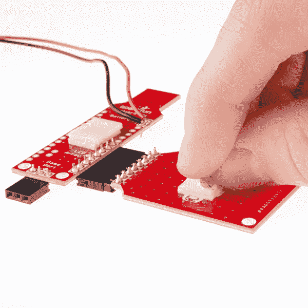

# 巴杰哈克

> 原文：<https://learn.sparkfun.com/tutorials/badgerhack>

## 介绍

[](https://cdn.sparkfun.com/assets/learn_tutorials/3/4/9/badgerboard-02_tag.png)

你手里拿着的是一项强大的技术。好吧，它不是三录仪，但是它可以做一些很酷的东西。你可以对 BadgerStick(薄板)编程来控制无数的电子设备，比如按钮、灯和液晶显示器。LED 板可用于显示图案或显示文本。

在本指南的第一部分，我们将向您展示如何将接头焊接到 BadgerStick 和 LED 板上，以制作一个完整的徽章。

[](https://cdn.sparkfun.com/assets/learn_tutorials/3/4/9/Badgerhack_Hookup_Guide-33.jpg)

除了甜蜜的徽章，你还可以获得一个开发平台，可以在许多其他项目中使用。一旦你把你的徽章放在一起，自豪地佩戴它，并向每个人展示，你就可以重新组合它，制作你自己的项目！

指南的其余部分将专注于破解你的徽章:你如何创建自己的图形或添加其他电子设备，让它做一些很酷的事情。

[](https://cdn.sparkfun.com/assets/learn_tutorials/3/4/9/Badgerhack_Hookup_Guide-42.jpg)

### 推荐阅读

如果您是焊接或电子产品的新手，我们强烈建议您查看以下内容:

*   [如何焊接](https://learn.sparkfun.com/tutorials/how-to-solder-through-hole-soldering)
*   [什么是电](https://learn.sparkfun.com/tutorials/what-is-electricity)
*   [什么是电路](https://learn.sparkfun.com/tutorials/what-is-a-circuit)
*   [电压、电流、电阻和欧姆定律](https://learn.sparkfun.com/tutorials/voltage-current-resistance-and-ohms-law)

当你准备好开始黑你的徽章时，我们绝对推荐你阅读:

*   [如何使用试验板](https://learn.sparkfun.com/tutorials/how-to-use-a-breadboard)
*   什么是 Arduino？

## 制作您的徽章

现在你有了獾装备，让我们做一个徽章吧！当我们要求您焊接引脚时，您需要记住一些提示(单击查看大图):

[](https://cdn.sparkfun.com/assets/learn_tutorials/3/4/9/Soldering_Tips_lg.png)

如果你需要复习如何焊接，我们推荐[如何焊接指南](https://learn.sparkfun.com/tutorials/how-to-solder-through-hole-soldering)。

### 1.将 8 针插头焊接到 LED 板上

将 8 针插头插入 LED 板，针端朝外。请注意，针脚从电路板的顶部伸出(带 led 的一侧)。

[](https://cdn.sparkfun.com/assets/learn_tutorials/3/4/9/Badgerhack_Hookup_Guide-02.jpg)

翻转电路板，焊接所有引脚。

[](https://cdn.sparkfun.com/assets/learn_tutorials/3/4/9/Badgerhack_Hookup_Guide-03.jpg)

### 2.将 8 针母接头焊接到 BadgerStick 上的 2-9 针

将 8 针母接头插入 BadgerStick 上标有 **2、3、4、5、6、7、8、9** 的孔中。确保引脚从电路板的顶部(有所有电子元件的一侧)伸出。

[](https://cdn.sparkfun.com/assets/learn_tutorials/3/4/9/Badgerhack_Hookup_Guide-04.jpg)

翻转电路板，确保只使用标有“led 阵列”的白色盒子中的孔。焊接所有 8 个引脚。

[](https://cdn.sparkfun.com/assets/learn_tutorials/3/4/9/Badgerhack_Hookup_Guide-05.jpg)

### 3.将 3 针母接头焊接到 BadgerStick 上的游戏端口

将 3 针母接头插入电路板底部标有 **TX** 、 **GND** 、 **RX** 的孔中。标题应该从板的顶部出来。

[](https://cdn.sparkfun.com/assets/learn_tutorials/3/4/9/Badgerhack_Hookup_Guide-06.jpg)

翻转电路板，焊接所有 3 个引脚。

[](https://cdn.sparkfun.com/assets/learn_tutorials/3/4/9/Badgerhack_Hookup_Guide-07.jpg)

### 4.将红色电池线焊接到蓄电池正极针脚(VBAT)

将红色电池线穿过 BadgerStick 背面标有 VBAT 的针脚(背面标有“+”)。

[](https://cdn.sparkfun.com/assets/learn_tutorials/3/4/9/Badgerhack_Hookup_Guide-08.jpg)

将红线焊接到孔上。

[](https://cdn.sparkfun.com/assets/learn_tutorials/3/4/9/Badgerhack_Hookup_Guide-09.jpg)

### 5.将黑色电池导线焊接到蓄电池负极针脚上(GND)

将黑色电池线穿过标有 GND(背面为“-”号)的插销的背面。

[](https://cdn.sparkfun.com/assets/learn_tutorials/3/4/9/Badgerhack_Hookup_Guide-10.jpg)

将黑线焊接到孔上。

[](https://cdn.sparkfun.com/assets/learn_tutorials/3/4/9/Badgerhack_Hookup_Guide-11.jpg)

将 BadgerStick 翻转过来，并确认红色导线将进入底部标有“+”的孔，黑色导线将进入标有“-”的孔。

[](https://cdn.sparkfun.com/assets/learn_tutorials/3/4/9/Badgerhack_Hookup_Guide-13.jpg)

### 6.添加电池

使用十字螺丝刀，从电池组上取下螺丝。

[](https://cdn.sparkfun.com/assets/learn_tutorials/3/4/9/Badgerhack_Hookup_Guide-14.jpg)

打开电池组盖，注意电池组上的电池标记。

[](https://cdn.sparkfun.com/assets/learn_tutorials/3/4/9/Badgerhack_Hookup_Guide-16_annotated.jpg)

根据标记将电池放入包装中。电池凸起的一端是+,平的一端是-。

[](https://cdn.sparkfun.com/assets/learn_tutorials/3/4/9/Badgerhack_Hookup_Guide-17.jpg)

重新盖上电池组盖，并用螺丝固定。

[](https://cdn.sparkfun.com/assets/learn_tutorials/3/4/9/Badgerhack_Hookup_Guide-18.jpg)

### 7.将 LED 板连接到 BadgerStick

将接头滑动到一起，连接 LED 板和 BadgerStick。确保 BadgerStick 上的 led 和电子设备面向同一方向。

[](https://cdn.sparkfun.com/assets/learn_tutorials/3/4/9/Badgerhack_Hookup_Guide-19.jpg)

翻转电路板，并仔细检查焊接点:

*   8 引脚插头焊接到 LED 板上白盒中的引脚上
*   8 针母接头焊接到标有“led 阵列”的 BadgerStick 上的白盒中的引脚上
*   3 针母接头焊接到标有“游戏端口”的 BadgerStick 上的白盒中的引脚上
*   焊接到蓄电池正极针脚的红色蓄电池导线
*   焊接到蓄电池负极针脚的黑色蓄电池电线

[](https://cdn.sparkfun.com/assets/learn_tutorials/3/4/9/Badgerhack_Hookup_Guide-20.jpg)

在你把电子产品贴在徽章上之前，打开电池组，确保一切正常。如果您的主板没有贴在徽章上，对其进行故障诊断将会容易得多。

### 8.将组件粘贴到徽章上

在 LED 板上贴上一条双面胶，在 BadgerStick 上贴上另一条。

[](https://cdn.sparkfun.com/assets/learn_tutorials/3/4/9/Badgerhack_Hookup_Guide-21.jpg)

在现有泡沫胶带的顶部添加另外两条泡沫胶带。

[](https://cdn.sparkfun.com/assets/learn_tutorials/3/4/9/Badgerhack_Hookup_Guide-22.jpg)

将 LED 板和徽章粘贴到塑料徽章的正面。

[](https://cdn.sparkfun.com/assets/learn_tutorials/3/4/9/Badgerhack_Hookup_Guide-23.jpg)

在电池组有螺丝的一侧再贴上一块泡沫胶带。

[](https://cdn.sparkfun.com/assets/learn_tutorials/3/4/9/Badgerhack_Hookup_Guide-24.jpg)

将电池组贴在塑料徽章的背面。为防止电线伸出，如图所示，将电线缠绕在徽章的侧面。

[](https://cdn.sparkfun.com/assets/learn_tutorials/3/4/9/Badgerhack_Hookup_Guide-25.jpg)

### 9.打开它

把你的徽章翻过来，找到电池组上的小开关。把它调到“开”

[](https://cdn.sparkfun.com/assets/learn_tutorials/3/4/9/Badgerhack_Hookup_Guide-26.jpg)

把你的徽章翻过来。等待大约 3 秒钟，您应该会看到 LED 矩阵激活！

[](https://cdn.sparkfun.com/assets/learn_tutorials/3/4/9/Badgerhack_Hookup_Guide-33.jpg)

### 10.纠缠它！

你现在是 SparkFun 獾徽章的骄傲拥有者！系上绳索...

[](https://cdn.sparkfun.com/assets/learn_tutorials/3/4/9/Badgerhack_Hookup_Guide-27.jpg)

...自豪地戴上它。

[](https://cdn.sparkfun.com/assets/learn_tutorials/3/4/9/Badgerhack_Hookup_Guide-39.jpg)

## 黑掉你的徽章

活动结束后你会怎么处理你的徽章？好吧，你可以黑它！

**IMPORTANT:** If you received your BadgerHack kit on or before **September 1, 2015**, you likely have an old bootloader that needs to be updated in order to follow the steps below. You can either: **A)** Follow [this tutorial](https://www.hackster.io/tzikis/programming-an-old-badgderstick) to program your old BadgerStick or **B)** Follow the directions [here](https://www.hackster.io/tzikis/programming-a-badgerstick) to connect another Arduino (Arduino as ISP) to the BadgerStick (Arduino to be programmed) and burn the new bootloader

### 将 BadgerStick 驱动程序安装到 Arduino IDE 中

安装 Arduino IDE，并下载 BadgerStick 库。

解压文件，并将“badgerstick”目录复制到`$Arduino Installation Directory/hardware`中。重启 Arduino，你应该在“工具- >板”下看到“BadgerStick”作为可用板。

### 示例 1: Hello World

为了使用以下示例，您需要将 LED 阵列 8x7 Arduino 库安装到您的 IDE 中。

[Download SparkFun LED Array 8x7 Arduino Library](https://github.com/sparkfun/SparkFun_LED_Array_8x7_Arduino_Library/archive/master.zip)

**注意:**此示例假设您在桌面上使用的是最新版本的 Arduino IDE。如果这是你第一次使用 Arduino，请回顾我们关于[安装 Arduino IDE 的教程。](https://learn.sparkfun.com/tutorials/installing-arduino-ide)

If you have not previously installed an Arduino library, please check out our [installation guide.](https://learn.sparkfun.com/tutorials/installing-an-arduino-library)

将 BadgerStick 插入可用的 USB 端口。确保在 Arduino IDE 中选择了“BadgerStick”和相关的 COM 端口。将下面的`ScrollText.ino`草图上传到你的 BadgerStick。

```
language:c
    /****************************************************************
ScrollText.ino
LED Array 8x7 Charlieplex
Shawn Hymel @ SparkFun Electronics
February 3, 2015
https://github.com/sparkfun/LED_Array_8x7_Charlieplex

Scrolls text across the LED array for 10 seconds.

Hardware Connections:

IMPORTANT:  The Charlieplex LED board is designed for 2.0 - 5.2V!
            Higher voltages can damage the LEDs.

 Arduino Pin | Charlieplex Board
 ------------|------------------
      2      |         A
      3      |         B
      4      |         C
      5      |         D
      6      |         E
      7      |         F
      8      |         G
      9      |         H

Resources:
Include Chaplex.h, SparkFun_LED_8x7.h
The Chaplex library can be found at: 
http://playground.arduino.cc/Code/Chaplex

Development environment specifics:
Written in Arduino 1.6.7
Tested with SparkFun RedBoard and BadgerStick (Interactive Badge)

This code is released under the [MIT License](http://opensource.org/licenses/MIT).

Please review the LICENSE.md file included with this example. If you have any questions 
or concerns with licensing, please contact techsupport@sparkfun.com.

Distributed as-is; no warranty is given.
****************************************************************/

#include <SparkFun_LED_8x7.h>
#include <Chaplex.h>

// Global variables
static byte led_pins[] = {2, 3, 4, 5, 6, 7, 8, 9}; // Pins for LEDs

void setup() {

  // Initialize LED array
  Plex.init(led_pins);

  // Clear display
  Plex.clear();
  Plex.display();
}

void loop() {

  // Scroll text 2 times (blocking)
  Plex.scrollText("Hello. :)", 2, true);

  // Scroll text until we stop it
  Plex.scrollText("Let's scroll!");
  delay(10000);
  Plex.stopScrolling();
  delay(1000);
} 
```

你的徽章应该滚动“你好:让我们滚动！."

[](https://cdn.sparkfun.com/assets/learn_tutorials/4/3/6/Badgerhack_Hookup_Guide-35.jpg)

现在好戏开始了！编辑字符串“让我们滚动！”在第 65 行说出你的名字(别忘了引号！).在 BadgerStick 上运行它，看着你的名字在 led 上滚动。

### 示例 2:形状

一旦你有了足够的滚动文本，试着做一些形状。将“DrawShapes.ino”草图上传到 BadgerStick。

```
language:c
    /****************************************************************
DrawShapes.ino
LED Array 8x7 Charlieplex
Shawn Hymel @ SparkFun Electronics
February 9, 2015
https://github.com/sparkfun/LED_Array_8x7_Charlieplex

Draws lines, rectangles, and circles on the LEDs.

Hardware Connections:

IMPORTANT:  The Charlieplex LED board is designed for 2.0 - 5.2V!
            Higher voltages can damage the LEDs.

 Arduino Pin | Charlieplex Board
 ------------|------------------
      2      |         A
      3      |         B
      4      |         C
      5      |         D
      6      |         E
      7      |         F
      8      |         G
      9      |         H

Resources:
Include Chaplex.h, SparkFun_LED_8x7.h
The Chaplex library can be found at: 
http://playground.arduino.cc/Code/Chaplex

Development environment specifics:
Written in Arduino 1.6.7
Tested with SparkFun RedBoard and BadgerStick (Interactive Badge)

This code is released under the [MIT License](http://opensource.org/licenses/MIT).

Please review the LICENSE.md file included with this example. If you have any questions 
or concerns with licensing, please contact techsupport@sparkfun.com.

Distributed as-is; no warranty is given.
****************************************************************/

#include <SparkFun_LED_8x7.h>
#include <Chaplex.h>

// Global variables
byte led_pins[] = {2, 3, 4, 5, 6, 7, 8, 9}; // Pins for LEDs
byte i;

void setup() {

  // Initialize and clear display
  Plex.init(led_pins);
  Plex.clear();
  Plex.display();
}

void loop() {

  // Draw a dot (x, y)
  Plex.clear();
  Plex.pixel(1, 2);
  Plex.display();
  delay(1000);

  // Draw a line (x0, y0, y1, y1)
  Plex.clear();
  Plex.line(1, 2, 5, 5);
  Plex.display();
  delay(1000);

  // Draw a rectangle (x, y, width, height)
  Plex.clear();
  Plex.rect(1, 2, 5, 4);
  Plex.display();
  delay(1000);

  // Draw a filled rectangle (x, y, width, height)
  Plex.clear();
  Plex.rectFill(1, 2, 5, 4);
  Plex.display();
  delay(1000);

  // Draw a circle (x, y, radius)
  Plex.clear();
  Plex.circle(3, 3, 3);
  Plex.display();
  delay(1000);

  // Draw a filled circle (x, y, radius)
  Plex.clear();
  Plex.circleFill(3, 3, 3);
  Plex.display();
  delay(1000);
} 
```

您应该会在 led 阵列上看到一个基本的正方形、线条和实心圆。你还能做出什么好玩的形状和图片？

## 资源和更进一步

您已经制作了徽章，并用一些新图形对其进行了编程。现在怎么办？BadgerHack 的冒险还在继续，就是这样。

如果你有一些额外的电子产品或挑选了一个附加套件，你可以将你的 Badger 变成其他项目:

[](https://learn.sparkfun.com/tutorials/badgerhack-gaming-add-on-kit) [### BadgerHack:游戏附加套件](https://learn.sparkfun.com/tutorials/badgerhack-gaming-add-on-kit) Make a Breakout clone with the BadgerHack Gaming Add-On Kit.[Favorited Favorite](# "Add to favorites") 1[](https://learn.sparkfun.com/tutorials/badgerhack-sensor-add-on-kit) [### BadgerHack:传感器附加套件](https://learn.sparkfun.com/tutorials/badgerhack-sensor-add-on-kit) Turn your Badger or Redstick into a temperature and soil moisture sensing display with the BadgerHack Sensor Add-On Kit[Favorited Favorite](# "Add to favorites") 4[](https://learn.sparkfun.com/tutorials/badgerhack-synth-add-on-kit) [### BadgerHack: Synth 附加套件](https://learn.sparkfun.com/tutorials/badgerhack-synth-add-on-kit) Make a tiny synth with BadgerStick.[Favorited Favorite](# "Add to favorites") 2

如果你想更进一步，这里有一些其他的建议:

*   寻找创意？教程见[learn.sparkfun.com](https://learn.sparkfun.com/)。
*   想要更多传感器？看看[我们提供的传感器](https://www.sparkfun.com/categories/23)。
*   需要更多的 led？我们也有一些这样的东西。
*   想看看别人在做什么？在 hackster.io 上查看[我们标记的页面。](http://www.hackster.io/sparkfun)

继续吧，创作者们。

如果你用你的徽章制作了一些很酷的东西，与 [#BadgerHack](https://twitter.com/search?q=%23BadgerHack&src=typd) 分享，或者在 [hackster.io](http://www.hackster.io/) 上创建一个教程。

### 资源

*   [BadgerStick GitHub 库](https://github.com/sparkfun/BadgerStick)
*   [BadgerArray GitHub 库](https://github.com/sparkfun/BadgerArray)
*   [BadgerHack 演示 GitHub 库](https://github.com/sparkfun/BadgerHack_Demos)

你一路走到了最后！恭喜你。吃一只獾。

[](https://cdn.sparkfun.com/assets/learn_tutorials/3/4/9/badger_vector.png)