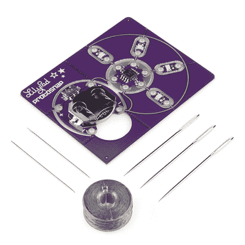

# 用电子纺织品点亮三角旗

> 原文：<https://learn.sparkfun.com/tutorials/light-up-pennant-with-e-textiles>

## 介绍

这里有一种装饰游戏室、教室或办公室的有趣方式——一面闪闪发光的三角旗。我们不是一步一步地指导您完成一个项目，而是向您展示一些通用技巧，让您使用一些不同类型的 LilyPad 组件创建自己独特的三角旗。

### 推荐阅读

这是一个初级到中级的项目，取决于你选择的硬件类型。使用导电线缝制 [LilyPad LED](https://www.sparkfun.com/products/10081) 应该会很舒服。

我们建议您在开始之前阅读以下几个教程:

*   [用导电线缝制](https://learn.sparkfun.com/tutorials/sewing-with-conductive-thread)
*   [电子纺织品基础知识](https://learn.sparkfun.com/tutorials/e-textile-basics)
*   [LDK 实验二:多个 LED 电路](https://learn.sparkfun.com/tutorials/ldk-experiment-2-multiple-led-circuits)
*   [电子纺织品的绝缘技术](https://learn.sparkfun.com/tutorials/insulation-techniques-for-e-textiles)
*   [短路](https://learn.sparkfun.com/tutorials/what-is-a-circuit/short-and-open-circuits)
*   [ProtoSnap LilyPad 开发简单连接指南](https://learn.sparkfun.com/tutorials/protosnap-lilypad-development-simple-hookup-guide)

## 材料和工具

这个项目是相当开放的-就像一个选择你自己的冒险！如果你想进行一个非编程项目，我们建议使用 [LilyTwinkle](https://www.sparkfun.com/products/11364) 或 [LilyTiny](https://www.sparkfun.com/products/10899) (你可以随时[重新编程](https://learn.sparkfun.com/tutorials/re-programming-the-lilytiny--lilytwinkle))。你也可以使用一个[LilyPad Arduino Simple Board](https://www.sparkfun.com/products/10274)和 led(或者任何你喜欢的附加 lily pad 组件)来创建这个项目。为您的项目选择以下选项之一:

### 选项 A: Protosnap LilyTwinkle

如果你想要一种闪烁的效果，并且想要在缝纫之前测试电路的能力，Protosnap LilyTwinkle 是一个很好的选择。

 

将**添加到您的[购物车](https://www.sparkfun.com/cart)中！**

### 

[In stock](https://learn.sparkfun.com/static/bubbles/ "in stock") DEV-11590

ProtoSnap 系列是一种无需试验板即可构建项目原型的新方法。所有东西都连接在一个单独的业务对象上…

$19.501[Favorited Favorite](# "Add to favorites") 18[Wish List](# "Add to wish list")** **### 选项 B: LilyTiny

[LilyTiny](https://www.sparkfun.com/products/10899) 预编程有四种不同的模式可供选择——闪烁、心跳、呼吸和随机渐变，这取决于你将 led 缝到哪个编号的花瓣上。**