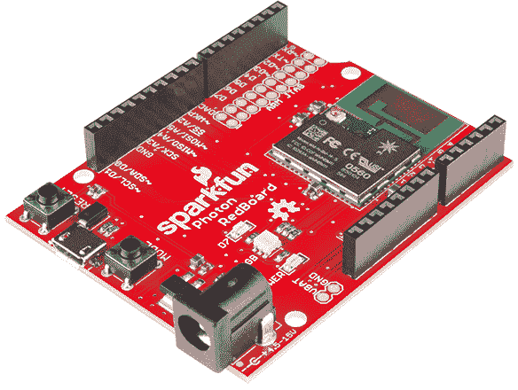
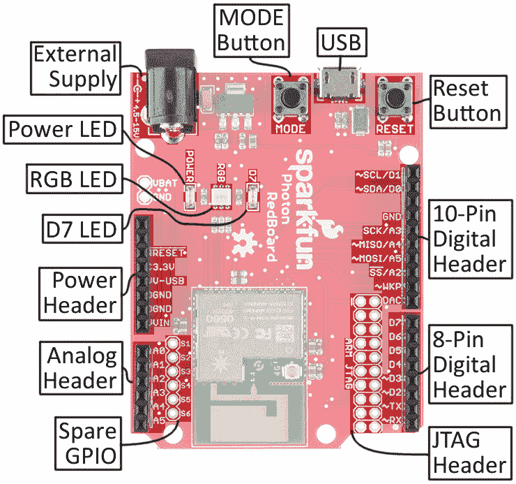
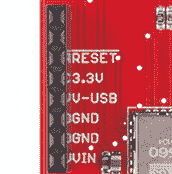
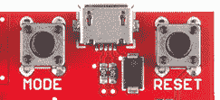

# 光子 RedBoard 连接指南

> 原文：<https://learn.sparkfun.com/tutorials/photon-redboard-hookup-guide>

## 介绍

[SparkFun Photon RedBoard](https://www.sparkfun.com/products/13321) 是一款无线可编程 WiFi 开发板，兼容[粒子](https://particle.io)云。光子红板的核心是粒子的 [P1 模块](https://store.particle.io/?product=p1-particle-module-x10-)，它将 ARM Cortex M3 处理器和 Broadcom WiFi 控制器集成到一个芯片中。I/O、USB 和电源连接器都被分解成熟悉的 Arduino 形状。

[](https://www.sparkfun.com/products/13321)*SparkFun Photon RedBoard*

除了外形因素，Photon RedBoard 几乎与[粒子光子](https://www.sparkfun.com/products/13345)相同:相同的微处理器，指示连接或其他状态的 RGB LED，以及帮助配置芯片的*重置*和*模式*按钮。

### 本教程涵盖的内容

本教程的目的是让你熟悉 Photon RedBoard 的所有方面——包括硬件和软件——并帮助你开始 Photon 的开发。本教程分为几个部分，包括:

*   [电路板概述](https://learn.sparkfun.com/tutorials/photon-redboard-hookup-guide#board-overview) -这一部分介绍了 Photon 的一些硬件组件和特性。
*   [入门](https://learn.sparkfun.com/tutorials/photon-redboard-hookup-guide#getting-started) -将光子连接到 WiFi 和粒子云的分步指南。
*   Arduino Shield (In)兼容性 -尽管尺寸熟悉，但 Photon RedBoard 并不完全兼容 Arduino。如果你打算把它和盾牌一起使用，请先通读这一节。

使用右边的导航条找到您的路径。

### 推荐阅读

本教程建立在一些你应该熟悉的电子学概念之上。如果下面的任何主题听起来对你来说很陌生，在继续之前，请考虑查看这些教程。

*   [逻辑电平](https://learn.sparkfun.com/tutorials/logic-levels)-Photon red board 工作在 3.3V。本教程将解释 3.3V 和 5V 器件之间的区别。
*   [模数转换](https://learn.sparkfun.com/tutorials/analog-to-digital-conversion)-Photon red board 具有多个 12 位 ADC 输入。ADC 帮助我们将模拟世界转换成微控制器可以理解的数字值。
*   [发光二极管](https://learn.sparkfun.com/tutorials/light-emitting-diodes-leds) -发光二极管是光子红板上的关键。它们有助于传递连通性或诊断状态。

## 主板概述

光子红板是由[粒子光子](https://www.sparkfun.com/products/13345)和[火花红板](https://www.sparkfun.com/products/12757)混合而成。布局中的每种板都有一些特性:

[](https://cdn.sparkfun.com/assets/learn_tutorials/4/2/1/annotated-top.jpg)

有关主板组件的快速摘要:

*   **外接电源**:可以使用筒状插孔电源，电压在 4.5-15V 之间。
*   **发光二极管**
    *   **电源**:红色 LED 表示板卡正在通电。
    *   **RGB** :该 LED 显示 Photon RedBoard 的 P1 模块的状态——是否已连接、正在连接或处于 DFU 模式。
    *   **D7** :该 LED 附在光子的 D7 引脚上。这是一个方便的调试工具。
*   **标题**
    *   **电源**:电源接头提供 GND、3.3V、USB 电压(~4.8V)和外部电源电压(VIN)。
    *   **模拟**:光子的[模数(ADC)](https://learn.sparkfun.com/tutorials/analog-to-digital-conversion) 引脚中有 6 个在这里断开。
    *   **8 针数字**:光子的硬件 UART (RX & TX)和数字针 D2-D7。
    *   **10 引脚数字**:独特引脚的大杂烩——像数模输出(DAC)——加上 SPI 和 I ² C 接口。
    *   **备用**:加成 GPIO！这些“备用”引脚还没有在粒子固件中启用，但它即将到来。
*   **按钮**
    *   **复位**:复位按钮可用于重启光子模块。
    *   **模式**:在运行、安全、监听、DFU 模式之间切换。
*   **USB 连接器** : USB 可以用来给 Photon RedBoard 供电，但也可以用作串行数据接口。
*   **JTAG 接头**:20 针 JTAG 接头匹配 [ST-Link/v2 JTAG](http://www.st.com/web/en/catalog/tools/PF251168) 在线调试器/编程器的引脚排列。

### 光子 I/O 引脚

光子引出线与 Arduino 并不完全匹配——只是没有足够的引脚。但是*和*分开的引脚有各种额外的功能。下面是每个引脚及其功能的总结:

| **引脚标签** | **名称–功能**
(备用名加粗) | **模拟输出(PWM)？** | **5V 容差数字输入？** |
| A0 | 

&#124;  &#124;

 |  | ✔ |
| 一流的 | 

&#124; **A1** &#124;

 |  | ✔ |
| 主动脉第二声 | 

&#124; **A2** &#124; **SS**(SPI 1) &#124;

 |  | ✔ |
| A3 号 | 

&#124; **A3** &#124; **SCK**(SPI 1) &#124; **da C2** &#124;

 |  |
| A4 号 | 

&#124; **A4** &#124; **MISO**(SPI 1) &#124;

 | ✔ | ✔ |
| A5 号 | 

&#124; **A5** &#124; **MOSI**(SPI 1) &#124;

 | ✔ | ✔ |
|  |
| 药方(prescription 的缩写) | 

&#124; RX(UART 1) &#124;

 | ✔ | ✔ |
| 谢谢 | 

&#124; TX(UART 1) &#124;

 | ✔ | ✔ |
| D2 | 

&#124; 【SPI 3】 &#124; CAN RX &#124; i2s SD &#124;

 | ✔ | ✔ |
| D3 | 

&#124; 大酱(SPI 3) &#124; JTAG TRST &#124;

 | ✔ | ✔ |
| D4 | 

&#124; 【SPI 3】 &#124; i2s SCK &#124; JTAG TDO &#124;

 |  | ✔ |
| D5 | 

&#124; SS(SPI 3) &#124; i2s WS &#124; JTAG TDI &#124;

 |  | ✔ |
| D6 | 

&#124; JTAG &#124;

 |  | ✔ |
| D7 | 

&#124; JTAG TMS &#124;

 |  | ✔ |
|  |
| 数（字）－模（拟）转换器 | 

&#124; **A6** &#124; **da C1** &#124;

 |  |  |
| WKP | 

&#124; **A7** &#124;

 | ✔ | ✔ |
| SS /A2 | 

&#124; **A2** &#124; **SS**(SPI 1) &#124;

 |  | ✔ |
| MOSI/A5 | 

&#124; **A5** &#124; **MOSI**(SPI 1) &#124;

 | ✔ | ✔ |
| MISO/A4 | 

&#124; **A4** &#124; **MISO**(SPI 1) &#124;

 | ✔ | ✔ |
| SCK/A3 高速公路 | 

&#124; **A3** &#124; **SCK**(SPI 1) &#124; **da C2** &#124;

 |  |  |
|  |
| SDA/D0 | 

&#124; **(I2C 1)** &#124;

 | ✔ | ✔ |
| SCL/D1 | 

&#124; **SCL**(I2C 1) &#124; 能 TX &#124;

 | ✔ | ✔ |
|  |
| 

&#124;  &#124; SPI 1 &#124; SPI 3 &#124; DAC &#124; I2C &#124; CAN &#124; JTAG &#124; i2s &#124;

 |

#### Photon RedBoard 和 Arduino 引脚排列的区别

Photon RedBoard 将大多数数字、模拟和串行接口映射到它的 Arduino 对等接口，但也有一些显著的差异。

除了 D7，没有明确的数字光子引脚，所以你不会找到 D8，D9，D10，D11，D12 或 D13。光子红板分解出 DAC、WKP、SS/A2、MOSI/A5、MISO/A4 和 SCK/A3。

**Double vision**: A2, A3, A4, and A5 are broken out twice on the Photon RedBoard! They can be found, obviously, on the analog input header. But those pins also serve as the Photon's hardware SPI port, so they're also broken out on the 10-pin digital header (and labeled with their SPI purpose). More on that in the [Arduino Shield (In)Compatibility section](https://learn.sparkfun.com/tutorials/photon-redboard-hookup-guide#compatibility-SPI).

标记为 RX 和 TX 的硬件 UART 引脚在你期望看到 D0 和 D1 的地方断开。这些引脚可用于 Photon 的`Serial1`类，或作为数字输入或输出。例如...

```
language:c
pinMode(RX, OUTPUT); // Set RX pin as a digital output
digitalWrite(RX, HIGH); // Write RX pin HIGH 
```

...会将 RX 引脚设为高电平。

**DAC** 和 **WKP** 引脚分别作为 Photon 的主要数模输出和唤醒输入。但是它们也可以用作模拟输入或数字输入/输出。要将 DAC 引脚用作模拟或数字 I/O，将其作为 A6 参考；WKP 引脚可以用 A7 作为参考。

| Pin Label | 备用模拟引脚 |
| WKP | A6 |
| 数（字）－模（拟）转换器 | A7 |

10 针接头顶部的 [I ² C](https://learn.sparkfun.com/tutorials/i2c) 引脚- **SDA/D0** 和 **SCL/D1** -是你在任何 Arduino 板上都会看到的引脚(除非它是一个非常旧的 Arduino)。这些引脚也可以用 D0 和 D1 作为数字参考，但不要与 RX 和 TX 引脚混淆！

还要注意，光子红板上没有 **AREF** 引脚——该引脚保持未连接状态(也未标记)。

### 电源接头

8 针电源接头提供三种可能的电源，加上接地和复位 -光子的低电平有效复位信号。

[](https://cdn.sparkfun.com/assets/learn_tutorials/4/2/1/power-header.jpg)

下面是接头上三个电源的快速参考:

| Pin Label | 标称电压 | 电压源 | 电流输出极限 |
| 3.3V | 3.3V | 3.3V 调节器输出 | 800 毫安 |
| V-USB | 4.8V (5V 减去二极管压降) | 通用串行总线 | 500 毫安(带保险丝) |
| 车辆识别号码 | 4.5-15V | 桶形千斤顶 | 取决于外部供应 |

**3.3V!** The Photon operates at 3.3V -- it is not capable of running at 5V! Most digital pins are 5V tolerant, when configured as inputs, but the analog pins are not!

### RGB LED

光子红板上的 RGB LED 识别 P1 模块的连接状态或其他状态信息。光子红板的颜色到模式映射在[粒子的设备模式文档](https://docs.particle.io/guide/getting-started/modes/photon/)中有详细描述。简单总结一下:

| LED 颜色 | LED 活动 | 设备模式 |
| 蓝绿色 | ● | 呼吸 | 连接到 WiFi 和粒子云 |
| 蓝绿色 | ● | 讨厌的 | 连接 WiFi，连接粒子云 |
| 格林（姓氏）；绿色的 | ● | 讨厌的 | 连接到 WiFi |
| 蓝色 | ● | 讨厌的 | 收听模式(等待 WiFi 信息) |
| 粉红色 | ● | 讨厌的 | 通过无线方式接收新应用程序 |
| 粉红色 | ● | 呼吸 | 在安全模式下连接 |
| 怀特（姓氏） | ● | 呼吸 | 应用程序运行，WiFi 关闭 |
| 橙黄色 | ● | 讨厌的 | DFU 模式 |

### *模式*和*复位*按钮

*复位*按钮——和你可能已经熟悉的*复位*按钮一样——可以用来重启 Photon RedBoard 的应用程序。按下并释放按钮后，光子将开始从头启动，这意味着它必须重新连接到 WiFi。

[](https://cdn.sparkfun.com/assets/learn_tutorials/4/2/1/mode-reset-buttons.jpg)

*模式*按钮可用于将光子置于任意数量的诊断模式，如光子[设备模式文档](https://docs.particle.io/guide/getting-started/modes/photon/)中所述。它可以用于引导进入**安全模式**(连接到 WiFi/云，但没有应用程序运行)、DFU 模式，或者将设备重置为出厂设置。

要将光子置于任何一种模式，首先按住*重置*和*模式*。然后松开*复位*，同时仍然保持*模式*。松开*模式*按钮，使光子红板处于所需状态。

[https://vine.co/v/eZUXpd2hUqa/embed/simple](https://vine.co/v/eZUXpd2hUqa/embed/simple)