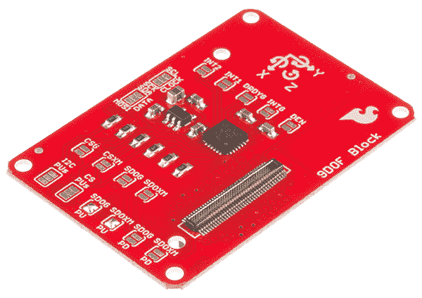
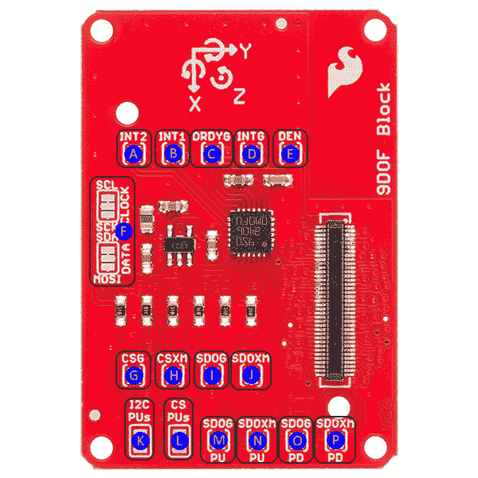
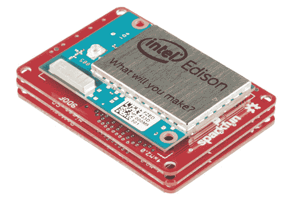

# 英特尔 Edison 的 SparkFun 模块- 9 自由度模块

> 原文：<https://learn.sparkfun.com/tutorials/sparkfun-blocks-for-intel-edison---9-degrees-of-freedom-block->

## 介绍

英特尔 Edison 的 [9 自由度模块使用 LSM9DS0 9DOF IMU 进行全范围运动检测。使用此模块来确定方向、加速度和指南针方向。LSM9DS0 集成了一个三轴加速度计、一个三轴陀螺仪和一个三轴磁力计。IMU 通过 I2C 总线连接到 Edison。](https://www.sparkfun.com/products/13033)

[](https://cdn.sparkfun.com/assets/learn_tutorials/2/8/1/9DoFBlock-01.jpg)*9 Degree of Freedom Block*

### 推荐阅读

如果你不熟悉积木，看看英特尔爱迪生的[spark fun 积木通用指南。](https://learn.sparkfun.com/tutorials/general-guide-to-sparkfun-blocks-for-intel-edison)

其他可能对您的爱迪生之旅有所帮助的教程包括:

*   [为您的项目提供动力](https://learn.sparkfun.com/tutorials/how-to-power-a-project)
*   [电池技术](https://learn.sparkfun.com/tutorials/battery-technologies)
*   [连接器基础知识](https://learn.sparkfun.com/tutorials/connector-basics)

## 主板概述

[](https://cdn.sparkfun.com/assets/learn_tutorials/2/8/1/13033-02.png)

9DOF 块上有许多跳线，但您可以在不理解或更改任何跳线的情况下使用它。下面是对每一个的描述:

**A (INT2)** -加速计/磁力计中断 2。此引脚可以配置为在多种不同条件下发生变化。有关配置器件的更多信息，请参见数据手册第 58 页和第 65-67 页。用焊料滴封闭该跳线，将 LSM9DS0 上的 INT2 引脚连接到 Edison 上的 GPIO 49。

**B (INT1)** -加速计/磁力计中断 1。此引脚可以配置为在多种不同条件下发生变化。有关配置器件的更多信息，请参见数据表第 58 页和第 63-65 页。用焊料滴封闭该跳线，将 LSM9DS0 上的 INT2 引脚连接到 Edison 上的 GPIO 48。

**C (DRDYG)** -数据就绪，陀螺仪。闭合此跳线将引脚连接到 GPIO 47。有关配置此引脚的信息，请参见第 43 页的数据手册。

**D (INTG)** -陀螺仪中断。此引脚可以配置为在多种不同条件下发生变化。闭合此跳线会将引脚连接到 GPIO 46。有关配置此引脚的信息，请参见数据手册第 43 页和第 47-50 页。

**E (DEN)** -数据使能，陀螺仪。启用或！暂停数据收集。可以安全地忽略此引脚。关闭此跳线允许处理器通过 GPIO 165 控制数据采集。

**F(时钟/数据)** - I/O 接口选择跳线。默认设置为 I ² C1，但切割每个跳线的两个上部焊盘之间可见的小走线，并用焊料块封闭底部的两个焊盘，允许用户将控制路由至 SPIDEV2。 **SPI 目前是一个不受支持的特性，可能会在未来的版本中删除。**

**G (CSG)** - SPI 片选，陀螺仪。闭合此跳线将信号连接到 Edison 上的 GPIO 111，即 SPIDEV2 上的 FS0。CS 引脚可以手动处理，也可以由驱动器处理。 **SPI 目前是一个不受支持的特性，可能会在未来的版本中删除。**

**H (CSXM)** - SPI 芯片选择，加速度计/磁力计。闭合此跳线将信号连接到 Edison 上的 GPIO 110，即 SPIDEV2 上的 FS1。CS 引脚可以手动处理，也可以由驱动器处理。 **SPI 目前是一个不受支持的特性，可能会在未来的版本中删除。**

**I (SDOG)** - SPI 串行数据输出(MISO)，陀螺仪。 **SPI 目前是一个不受支持的特性，可能会在未来的版本中删除。**

**J (SDOXM)** -串行数据输出(MISO)，加速度计/磁力计。 **SPI 目前是一个不受支持的特性，可能会在未来的版本中删除。**

**K(I2C PUs)**-I²C SDA 和 SCL 线的上拉电阻移除。最有可能的是，您不想从系统中移除这些电阻；但是，如果 I ² C 总线上有很多器件，您可能需要从线路上移除一些上拉电阻，以降低上拉强度。(无焊料表示禁用上拉电阻。用一个焊料滴连接所有三个焊盘，以使能上拉。)

**L(CS PUs)**-SPI 片选线的上拉电阻移除。正常情况下，上拉电阻应该留在原位。 **SPI 目前是一个不受支持的特性，可能会在未来的版本中删除。**

**M (SDOG PU)** -默认关闭，此引脚设置陀螺仪使用的 I ² C 地址。关闭时，陀螺仪的地址是 0x6b。当打开时，跳线 SDOG PD(上面标有‘O’)**必须**关闭。

**N (SDOXM PU)** -默认关闭，此引脚设置磁力计/加速度计使用的 I ² C 地址。关闭时，它们的集体地址是 0x1d。当打开时，跳线 SDOXM PD(上面标有‘P’)**必须**关闭。

**O (SDOG PD)** -默认打开，此引脚设置陀螺仪使用的 I ² C 地址。关闭时，陀螺仪的地址是 0x6a。

**P (SDOXM PD)** -默认打开，此引脚设置磁力计/加速度计使用的 I ² C 地址。关闭时，它们的集体地址是 0x1e。

## 连接 9 自由度模块

要使用 9 DOF 模块，只需在主板背面安装一个英特尔 Edison 或将其添加到您当前的堆栈中。块可以不用硬件堆叠，但是它使扩展连接器不受机械应力的保护。

[](https://cdn.sparkfun.com/assets/learn_tutorials/2/8/1/SparkFun_Edison_Boards_1.jpg)*9 DOF Block Installed*

我们有一个很好的[硬件包](https://www.sparkfun.com/products/13187)可以提供足够的硬件来保护三个街区和一个爱迪生。

[](https://cdn.sparkfun.com/assets/learn_tutorials/2/8/6/EdisonHardware_1.jpg)[*Intel Edison Hardware Pack*](https://www.sparkfun.com/products/13187)

注意:9 DOF 模块没有控制台入口或电压调节器。建议将控制台通信模块与该模块结合使用，就像在[英特尔 Edison](https://learn.sparkfun.com/tutorials/general-guide-to-sparkfun-blocks-for-intel-edison#console-communication-blocks)spark fun 模块通用指南中找到的模块一样。

## C++代码示例

我们假设您正在使用 Eclipse IDE，详见我们的[超越 Arduino](https://learn.sparkfun.com/tutorials/programming-the-intel-edison-beyond-the-arduino-ide) 教程。如果你不是，你需要通读该教程来跟上速度。

#### 入门指南

按照[编程教程](https://learn.sparkfun.com/tutorials/programming-the-intel-edison-beyond-the-arduino-ide#hello-world)中的说明创建一个名为“spark fun _ 9 DOF _ Edison _ Block _ Example”的新项目。一旦你创建了项目，打开磁盘上的项目文件(提示:你可以通过从项目菜单中选择“属性”来找到项目的路径)，并将在[Edison 9 DOF Block CPP library GitHub repository](https://github.com/sparkfun/SparkFun_9DOF_Block_for_Edison_CPP_Library)中找到的三个源文件复制到“src”目录中。

[Download a zip file of the repository](https://github.com/sparkfun/SparkFun_9DOF_Block_for_Edison_CPP_Library/archive/master.zip)

#### 密码

你需要知道的一切都在评论里。

```
language:c
#include "mraa.hpp"
#include <iostream>
#include <unistd.h>
#include "SFE_LSM9DS0.h"
using namespace std;

int main()
{
  LSM9DS0 *imu;
  imu = new LSM9DS0(0x6B, 0x1D);
  // The begin() function sets up some basic parameters and turns the device
  //  on; you may not need to do more than call it. It also returns the "whoami"
  //  registers from the chip. If all is good, the return value here should be
  //  0x49d4\. Here are the initial settings from this function:
  //  Gyro scale:        245 deg/sec max
  //  Xl scale:          4g max
  //  Mag scale:         2 Gauss max
  //  Gyro sample rate:  95Hz
  //  Xl sample rate:    100Hz
  //  Mag sample rate:   100Hz
  // These can be changed either by calling appropriate functions or by
  //  pasing parameters to the begin() function. There are named constants in
  //  the .h file for all scales and data rates; I won't reproduce them here.
  //  Here's the list of fuctions to set the rates/scale:
  //  setMagScale(mag_scale mScl)      setMagODR(mag_odr mRate)
  //  setGyroScale(gyro_scale gScl)    setGyroODR(gyro_odr gRate)
  //  setAccelScale(accel_scale aScl)  setGyroODR(accel_odr aRate)
  // If you want to make these changes at the point of calling begin, here's
  //  the prototype for that function showing the order to pass things:
  //  begin(gyro_scale gScl, accel_scale aScl, mag_scale mScl, 
  //                gyro_odr gODR, accel_odr aODR, mag_odr mODR)
  uint16_t imuResult = imu->begin();
  cout<<hex<<"Chip ID: 0x"<<imuResult<<dec<<" (should be 0x49d4)"<<endl;

  bool newAccelData = false;
  bool newMagData = false;
  bool newGyroData = false;
  bool overflow = false;

  // Loop and report data
  while (1)
  {
    // First, let's make sure we're collecting up-to-date information. The
    //  sensors are sampling at 100Hz (for the accelerometer, magnetometer, and
    //  temp) and 95Hz (for the gyro), and we could easily do a bunch of
    //  crap within that ~10ms sampling period.
    while ((newGyroData & newAccelData & newMagData) != true)
    {
      if (newAccelData != true)
      {
        newAccelData = imu->newXData();
      }
      if (newGyroData != true)
      {
        newGyroData = imu->newGData();
      }
      if (newMagData != true)
      {
        newMagData = imu->newMData(); // Temp data is collected at the same
                                      //  rate as magnetometer data.
      } 
    }

    newAccelData = false;
    newMagData = false;
    newGyroData = false;

    // Of course, we may care if an overflow occurred; we can check that
    //  easily enough from an internal register on the part. There are functions
    //  to check for overflow per device.
    overflow = imu->xDataOverflow() | 
               imu->gDataOverflow() | 
               imu->mDataOverflow();

    if (overflow)
    {
      cout<<"WARNING: DATA OVERFLOW!!!"<<endl;
    }

    // Calling these functions causes the data to be read from the IMU into
    //  10 16-bit signed integer public variables, as seen below. There is no
    //  automated check on whether the data is new; you need to do that
    //  manually as above. Also, there's no check on overflow, so you may miss
    //  a sample and not know it.
    imu->readAccel();
    imu->readMag();
    imu->readGyro();
    imu->readTemp();

    // Print the unscaled 16-bit signed values.
    cout<<"-------------------------------------"<<endl;
    cout<<"Gyro x: "<<imu->gx<<endl;
    cout<<"Gyro y: "<<imu->gy<<endl;
    cout<<"Gyro z: "<<imu->gz<<endl;
    cout<<"Accel x: "<<imu->ax<<endl;
    cout<<"Accel y: "<<imu->ay<<endl;
    cout<<"Accel z: "<<imu->az<<endl;
    cout<<"Mag x: "<<imu->mx<<endl;
    cout<<"Mag y: "<<imu->my<<endl;
    cout<<"Mag z: "<<imu->mz<<endl;
    cout<<"Temp: "<<imu->temperature<<endl;
    cout<<"-------------------------------------"<<endl;

    // Print the "real" values in more human comprehensible units.
    cout<<"-------------------------------------"<<endl;
    cout<<"Gyro x: "<<imu->calcGyro(imu->gx)<<" deg/s"<<endl;
    cout<<"Gyro y: "<<imu->calcGyro(imu->gy)<<" deg/s"<<endl;
    cout<<"Gyro z: "<<imu->calcGyro(imu->gz)<<" deg/s"<<endl;
    cout<<"Accel x: "<<imu->calcAccel(imu->ax)<<" g"<<endl;
    cout<<"Accel y: "<<imu->calcAccel(imu->ay)<<" g"<<endl;
    cout<<"Accel z: "<<imu->calcAccel(imu->az)<<" g"<<endl;
    cout<<"Mag x: "<<imu->calcMag(imu->mx)<<" Gauss"<<endl;
    cout<<"Mag y: "<<imu->calcMag(imu->my)<<" Gauss"<<endl;
    cout<<"Mag z: "<<imu->calcMag(imu->mz)<<" Gauss"<<endl;
    // Temp conversion is left as an example to the reader, as it requires a
    //  good deal of device- and system-specific calibration. The on-board
    //  temp sensor is probably best not used if local temp data is required!
    cout<<"-------------------------------------"<<endl;
    sleep(1);
  }

  return MRAA_SUCCESS;
} 
```

## 资源和更进一步

现在你已经对 9 DOF 块有了一个简要的概述，看看其他的一些教程。这些教程涵盖编程、模块堆叠以及与英特尔 Edison 生态系统的接口。

## 爱迪生通用主题:

*   [英特尔爱迪生 Sparkfun 模块通用指南](https://learn.sparkfun.com/tutorials/general-guide-to-sparkfun-blocks-for-intel-edison)
*   [爱迪生入门指南](https://learn.sparkfun.com/tutorials/edison-getting-started-guide)
*   [在 Edison 上加载 Debian(Ubilinix)](https://learn.sparkfun.com/tutorials/loading-debian-ubilinux-on-the-edison)

## 阻止特定主题:

*   [9DOF 块 Git 回购](https://github.com/sparkfun/Edison_9DOF_Block)
*   [9DOF C++库报告](https://github.com/sparkfun/SparkFun_9DOF_Block_for_Edison_CPP_Library)
*   [LSM9DSO 连接指南](/tutorials/lsm9ds0-hookup-guide)

查看 SparkFun 的其他爱迪生相关教程:

[](https://learn.sparkfun.com/tutorials/sparkfun-blocks-for-intel-edison---uart-block) [### 英特尔 Edison - UART 模块的 SparkFun 模块](https://learn.sparkfun.com/tutorials/sparkfun-blocks-for-intel-edison---uart-block) A quick overview of the features of the UART Block.[Favorited Favorite](# "Add to favorites") 1[](https://learn.sparkfun.com/tutorials/sparkfun-blocks-for-intel-edison---battery-block) [### 英特尔爱迪生公司的 SparkFun 模块-电池模块](https://learn.sparkfun.com/tutorials/sparkfun-blocks-for-intel-edison---battery-block) A quick overview of the features of the Battery Block.[Favorited Favorite](# "Add to favorites") 7[](https://learn.sparkfun.com/tutorials/sparkfun-blocks-for-intel-edison---console-block) [### 英特尔 Edison 的 SparkFun 模块-控制台模块](https://learn.sparkfun.com/tutorials/sparkfun-blocks-for-intel-edison---console-block) A quick overview of the features of the Console Block.[Favorited Favorite](# "Add to favorites") 2[](https://learn.sparkfun.com/tutorials/using-an-lcd-on-the-edison) [### 在爱迪生上使用液晶显示器](https://learn.sparkfun.com/tutorials/using-an-lcd-on-the-edison) How to connect an LCD controlled by an ILI9341 driver to the Intel® Edison.[Favorited Favorite](# "Add to favorites") 5