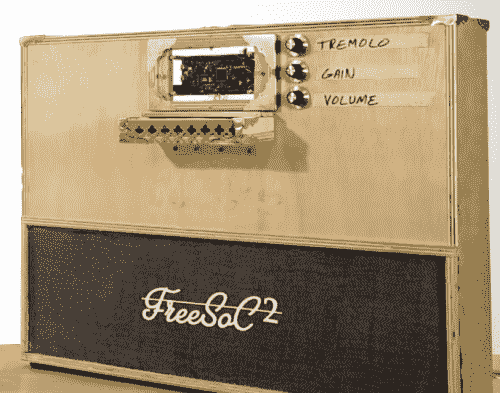

# 用自由足球制作音乐 2

> 原文：<https://learn.sparkfun.com/tutorials/making-music-with-the-freesoc2>

## 介绍

FreeSoC2 是一个很好的平台，可以发挥 Cypress PSoC 设备的功能。在这个项目之前，我从来没有接触过 PSoC，所以我不确定我到底在做什么。事实证明，和他们一起工作很愉快。每当我有机会使用新技术时，我都喜欢制作一个简单的乐器。为什么？因为即使是最基本的键盘合成器也包含了按钮输入和输出、信号生成、信号切换和定时等重要概念。制作这个键盘给了我一个很好的了解 FreeSoC2 的窗口，帮助我掌握了使用 PSoC Creator 软件的窍门。

### 所需材料

要完成本教程，您需要以下内容: