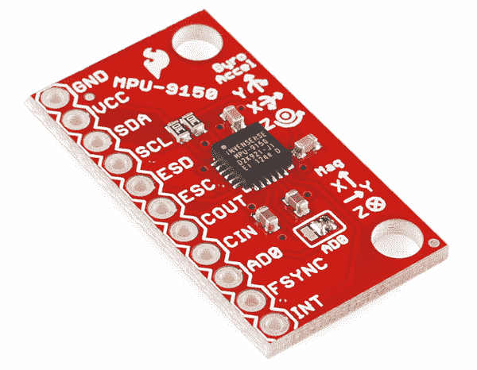

# MPU-9150 连接指南

> 原文：<https://learn.sparkfun.com/tutorials/mpu-9150-hookup-guide>

## 介绍

[MPU-9150](https://www.sparkfun.com/products/11486) 是在单个封装中的九个**d**e**o**f**f**自由(9 自由度) **i** 惯性 **m** 尺寸 **u** 单元(IMU)。它包含一个三轴[加速度计](/tutorials/63)，三轴[陀螺仪](/tutorials/24)，三轴[磁力计](https://www.google.com/search?q=magnetometer&ie=utf-8&oe=utf-8)和一个数字运动处理器(DMP)硬件加速器引擎。每个传感器的范围都是可配置的:加速度计的刻度可以设置为 2g、4g、6g、8g 或 16g，陀螺仪支持 250、500 和 2000 /s，磁力计的满量程范围为 1200 T ( 12 高斯)。

MPU-9150 支持 [I ² C](/tutorials/82) 。数据手册中只提到了 [SPI](/tutorials/16) 的，但所有其他证据都指向相反的方向。我们只使用 I ² C 进行测试，为了本教程的目的，我们将只讨论如何在 I ² C 模式下使用该器件。

### 本教程涵盖的内容

本教程致力于所有 MPU-9150 的事情。首先，我们将向您介绍分组讨论板。然后，我们将切换到示例代码，向您展示如何使用 Arduino 和我们的[SFE_MPU-9150 Arduino 库](https://cdn . spark fun . com/assets/learn _ tutorials/3/9/7/MPU-9150 _ libraries . zip)与主板进行交互。

本教程分为以下几个部分:

*   [分线板概述](#hardware-overview) -本页检查 MPU-9150 分线板-主题包括引脚排列、跳线和原理图。
*   [硬件组装](#hardware-assembly)——如何组装硬件来运行一些示例代码。
*   [安装 Arduino 库](#installing-the-arduino-library)——如何安装 **Arduino 库**，并使用一个简单的示例草图来验证你的连接工作正常。
*   [资源&更进一步](#resources--going-further) -学习和使用 MPU-9150 做更多事情的资源。

### 所需材料

本教程解释了如何使用 MPU-9150 分线板和 Arduino。要跟进，您需要以下材料: