# LSM6DS3 分线连接指南

> 原文：<https://learn.sparkfun.com/tutorials/lsm6ds3-breakout-hookup-guide>

## 介绍

LSM6DS3 是一款加速度计和陀螺仪传感器，具有 8k 字节的巨型缓冲区和嵌入式处理中断功能，专门针对手机市场。该传感器非常灵活，可以根据具体应用进行配置。我们已经整理了一个驱动因素和大量示例，以帮助您探索各种可能性。

[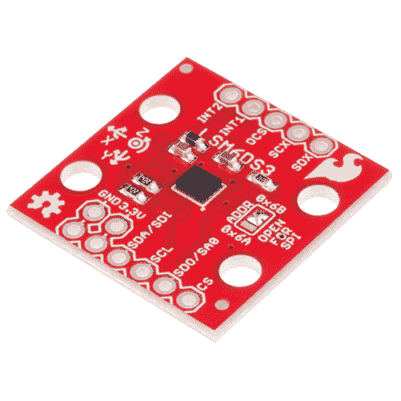](https://www.sparkfun.com/products/retired/13339) 

### [SparkFun 6 自由度突围- LSM6DS3](https://www.sparkfun.com/products/retired/13339)

[Retired](https://learn.sparkfun.com/static/bubbles/ "Retired") SEN-13339

LSM6DS3 是一款加速度计和陀螺仪传感器，内置 8kb FIFO 缓冲器和嵌入式处理中断功能……

1 **Retired**[Favorited Favorite](# "Add to favorites") 16[Wish List](# "Add to wish list")

LSM6DS3 可以做的一些事情:

*   每秒读取高达 6.7 千个样本的加速度计数据，实现超精确的运动检测
*   读取陀螺仪数据的速度高达每秒 1.7 千个样本
*   最高 1.7 ksps 模式下工作电流为 1.25mA
*   读取温度
*   读取之间最多可缓冲 8k 字节的数据(内置 FIFO)
*   计算步数(计步器)
*   检测震动、倾斜、移动、点击、双击
*   将其他传感器放入其 FIFO
*   通过嵌入式功能或 FIFO 低容量/溢出警告驱动中断引脚。

### 本教程涵盖的内容

本教程为您提供了开始使用 LSM6DS3 所需的全部内容。我们将向您介绍芯片本身，然后是分线板。然后，我们将切换到示例代码，向您展示如何使用 Arduino 和我们的 [SparkFun LSM6DS3 Arduino 库](https://github.com/sparkfun/SparkFun_LSM6DS3_Arduino_Library)与主板进行交互。

本教程分为以下几页:

*   [LSM6DS3 概述](https://learn.sparkfun.com/tutorials/lsm6ds3-breakout-hookup-guide#introduction) -基本信息
*   [硬件概述](https://learn.sparkfun.com/tutorials/lsm6ds3-breakout-hookup-guide#hardware-overview) -硬件连接
*   [组件](https://learn.sparkfun.com/tutorials/lsm6ds3-breakout-hookup-guide#assembly) -通过 I2C 或 SPI 连接到 LSM6DS3
*   [安装 Arduino 库](https://learn.sparkfun.com/tutorials/lsm6ds3-breakout-hookup-guide#installing-the-arduino-library) -包括示例概述
*   [使用 Arduino 库](https://learn.sparkfun.com/tutorials/lsm6ds3-breakout-hookup-guide#using-the-arduino-library) -解释用户 API
*   [理论和示例数据](https://learn.sparkfun.com/tutorials/lsm6ds3-breakout-hookup-guide#theory-and-example-data) -高级驾驶员图表和记录数据图表
*   [资源和进一步发展](https://learn.sparkfun.com/tutorials/lsm6ds3-breakout-hookup-guide#resources-and-going-further) -数据手册和应用笔记的链接，以及灵感项目

### 所需材料

立即获取数据手册和应用笔记。在可以在窗格中显示索引/目录的非浏览器查看器中打开它们。有这么多的信息，paned 查看是必须的！

*   [LSM6DS3 **数据表**](https://cdn.sparkfun.com/assets/learn_tutorials/4/1/6/DM00133076.pdf)
*   [LSM6DS3 **应用笔记**](https://cdn.sparkfun.com/assets/learn_tutorials/4/1/6/AN4650_DM00157511.pdf)

本教程介绍如何将 LSM6DS3 分线板与 Arduino 配合使用。要跟进，您需要以下材料:

*   [LSM6DS3 分线板](https://www.sparkfun.com/products/13339)
*   [Arduino UNO](https://www.sparkfun.com/products/11021) 、 [RedBoard](https://www.sparkfun.com/products/11575) 或另一个 [Arduino 兼容板](https://learn.sparkfun.com/tutorials/arduino-comparison-guide)
*   [直阳接头](https://www.sparkfun.com/products/116) -或电线。用来连接 breakout 和试验板的东西。
*   任何尺寸(即使是迷你)都可以。
*   [M/M 跳线](https://www.sparkfun.com/products/11026) -连接 Arduino 和试验板。

**The LSM6DS3 is a 3.3V device!** Supplying voltages greater than ~3.6V can permanently damage the IC. As long as your Arduino has a 3.3V supply output, and you're OK with using I²C, you shouldn't need any extra level shifting. But if you want to use SPI, you may need a [level shifter](https://www.sparkfun.com/products/12009).

任何 5V 操作的 Arduino (UNO、RedBoard、Leonardo 等)都需要逻辑电平转换器。如果你使用基于 3.3V 的“duino”，如 Arduino Pro 3.3V 或 T2 3.3V Pro Mini，就没有必要进行电平转换。

### 推荐阅读

如果您不熟悉下面的一些概念，我们建议您在继续学习之前先阅读该教程。

*   [加速度计基础知识](https://learn.sparkfun.com/tutorials/accelerometer-basics)
*   [陀螺仪](https://learn.sparkfun.com/tutorials/gyroscope)
*   [串行外设接口(SPI)](https://learn.sparkfun.com/tutorials/serial-peripheral-interface-spi)
*   [IC 间通信(I ² C)](https://learn.sparkfun.com/tutorials/i2c)
*   [逻辑电平](https://learn.sparkfun.com/tutorials/logic-levels)
*   [双向变速杆连接指南](https://learn.sparkfun.com/tutorials/bi-directional-logic-level-converter-hookup-guide)

## 硬件概述

### 引脚排列

LSM9DS0 分线点总共有 11 个引脚。

[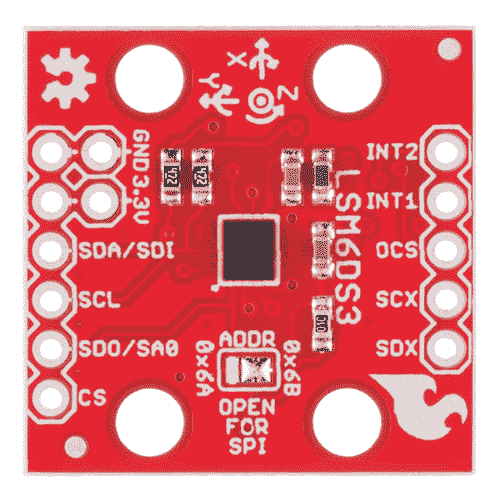](https://cdn.sparkfun.com/assets/learn_tutorials/4/1/6/top.jpg)*Top side. The jumper is solderable to easily change options.*

所需的最少连接在电路板的左侧断开。这些是电源和 I ² C 引脚(电路板默认的通信接口)。这些引脚也可以用于 SPI 接口:

| Pin Label | 引脚功能 | 笔记 |
| GND | 地面 | 0V 电源电压。备用 GND 引脚连接更多的东西！ |
| VDD | 电源 | 芯片的电源电压。应在 **1.8V 和 3.6V** 之间调节。备用 VDD 也提供一般用途。 |
| SDA/SDI | I ² C:串行数据
SPI: MOSI | I ² C:串行数据(双向)
SPI:设备数据输入(MOSI) |
| SCL | 串行时钟 | I ² C 和 SPI 串行时钟。 |
| SDO/SA0 | I ² C:地址
SPI: MISO | I ² C:地址 LSB
SPI:器件数据输出(MISO) |
| 特许测量员 | I ² C:模式
SPI: CS | I ² C:选择 I ² C(断开)
SPI:片选(从机选择) |

其余的引脚在另一侧断开。这些引脚提供 SPI 功能并中断输出:

| Pin Label | 引脚功能 | 笔记 |
| INT2 | 加速度/陀螺仪中断 2 | INT1 和 INT2 是加速度计和陀螺仪的可编程中断。它们可以设置为在超过/低于阈值、数据就绪或 FIFO 溢出时发出警报。确保这些引脚连接到输入引脚，以防止将 5v 驱动回 LSM6DS3。 |
| INT1 | 加速度/陀螺仪中断 1 |
| (美国)候补军官学校(Officer Candidate School) | aux spi 3 导线 | 这些引脚用于连接从机 I ² C 和三线式器件，以便收集 FIFO 数据。本教程不介绍这个函数。 |
| SCX | 在时钟上 |
| SDX | 截止日期 |

[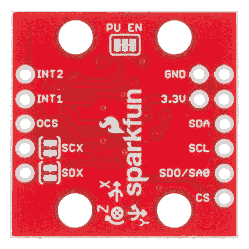](https://cdn.sparkfun.com/assets/learn_tutorials/4/1/6/bottom.jpg)*Bottom side. For most use cases, these jumpers will stay as is.*

#### 电源

VDD 和 GND 引脚是向 IC 提供电压和 0V 参考的地方。分线板不调节该电压，因此确保该电压在 LSM9DS0 的允许电源电压范围内: **1.8V 至 3.6V** 。下面是数据表中的电气特性表。

[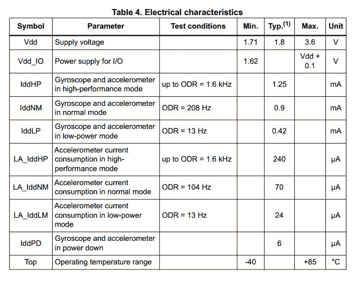](https://cdn.sparkfun.com/assets/learn_tutorials/4/1/6/ps_spec_1.jpg)

通信引脚不支持 5V 电压，因此需要调整到 VDD 的几 mV 范围内。

#### 中断

LSM6DS3 上有多种中断。虽然连接这些引脚不像通信或电源引脚那样重要，但使用它们将有助于充分利用芯片。

中断引脚是 **INT1** 和 **INT2** 。一个或两个引脚可以通过软件配置，并映射到以下条件:

*   检测到步骤
*   增量时间后检测到步长
*   步进计数器溢出
*   重大运动(震动、跌落)
*   FIFO 已满
*   FIFO 溢出
*   达到 FIFO 阈值(数据手册称之为“水印”
*   启动状态
*   陀螺仪数据就绪
*   加速度计数据就绪
*   静止
*   单抽头
*   唤醒
*   自由落体
*   双击
*   6D(方向)
*   倾斜
*   计时器
*   唤醒
*   熨烫中断

仅提供了几个中断示例。有关高级中断特性的使用，请参见数据手册和应用指南。

### 跳楼者

| 跳线标签 | 跳线功能 |
| 地址 | 用于选择 I ² C 通信的地址 0x6A 或 0x6B(默认)。该跳线必须为 SPI 模式打开**，否则 MISO 线不会提供数据** |
| 普恩 | 这种走线连接跳线使能 SDA 和 SCL 上的 4.7k 电阻，用于 I²c。SPI 在这些连接的情况下工作，但实际上它们应该分开，以便在高速下获得更好的信号形状并降低功耗 |
| SCX 和 SDX | ST 建议在不使用时将不用的 SCX 和 SDX 拉至电源或接地。如果连接从设备，切断这些走线。 |

ADDR 跳线通常重新配置为 I ² C 地址和 SPI 模式，因此它是焊接跳线。

其他跳线可能不适合大多数用户，但如果有必要，就拿出你的[得心应手的业余爱好刀](https://www.sparkfun.com/products/9200)，小心翼翼地切割焊盘之间的小痕迹。即使你使用的是 SPI，跳线也不应该妨碍你与芯片的通信能力。

## 装配

将 LSM6DS3 连接到 arduino 兼容板的最简单方法是使用 I ² C 接口。展示的试验板仅供参考，但电线可以直接焊接到 LSM6DS3 分线点并插入 arduino。

[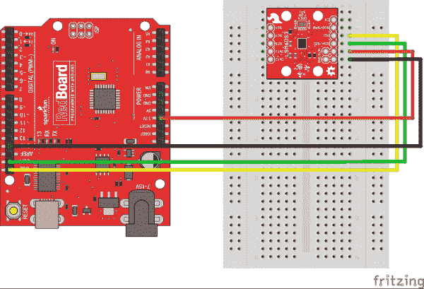](https://cdn.sparkfun.com/assets/learn_tutorials/4/1/6/I2C_circuit.jpg)

下面介绍如何使用 [SparkFun 逻辑电平转换器](https://www.sparkfun.com/products/12009)将 SPI 线连接到 5V 系统。确保转换器的低端朝向 LSM6DS3。如果使用 teensy 或其他 3.3V 微控制器，SPI 线可以直接连接。

[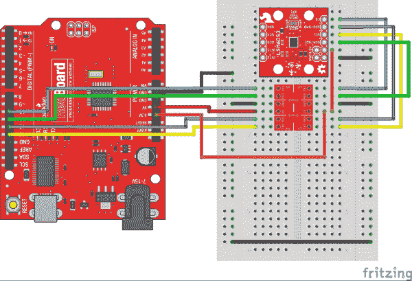](https://cdn.sparkfun.com/assets/learn_tutorials/4/1/6/SPI_circuit.jpg)

使用 4 个安装孔将 LSM6DS3 牢牢固定在被测物体上！这里，1x4 被用作过滤运动噪声的测试平台。此处还显示了与 INT1 引脚(UNO 和 RedBoard 上的 D3 引脚)的连接。电线的另一端直接插入红板。

[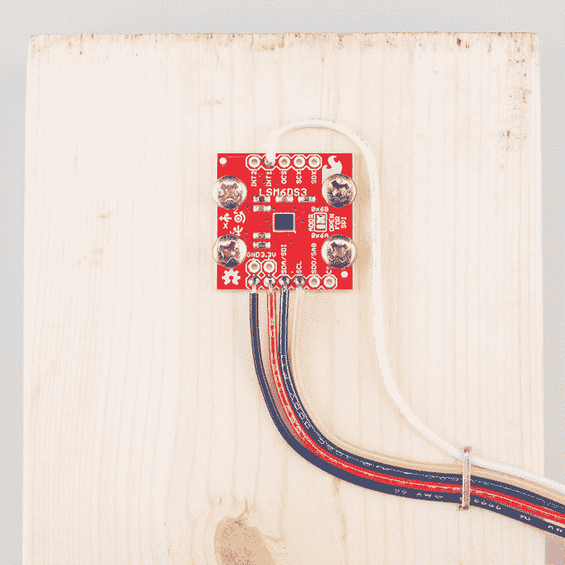](https://cdn.sparkfun.com/assets/learn_tutorials/4/1/6/LSM6DS3_Hookup_Guide-01.jpg)

## 安装 Arduino 库

我们编写了一个 Arduino 库，以帮助尽可能轻松地与 LSM6DS3 的陀螺仪、加速度计和温度传感器接口。访问 [GitHub 库](https://github.com/sparkfun/SparkFun_LSM6DS3_Arduino_Library)下载最新版本的库，或者点击下面的链接:

[Download the SparkFun LSM6DS3 Arduino Library](https://github.com/sparkfun/SparkFun_LSM6DS3_Arduino_Library/archive/master.zip)

要获得安装库的帮助，请查看我们的[如何安装 Arduino 库教程](https://learn.sparkfun.com/tutorials/installing-an-arduino-library)。您需要将*spark fun _ LSM 6 ds 3 _ Arduino _ Library*文件夹移动到 Arduino sketchbook 中的 *libraries* 文件夹。

或者，如果您运行的是相对较新的 Arduino IDE 版本(1.6.2 或更高版本)，您可以在库管理器中搜索“LSM6DS3”来找到该库。更多细节请参见官方 Arduino [库管理器文档](https://www.arduino.cc/en/guide/libraries#toc3)。

## 使用 Arduino 库

### 测试库

*   极简示例-最简单的配置

将 LSM6DS3 连接到 I ² C 总线，点击“文件- >示例- > Sparkfun LSM6DS3 分线点- >极简示例”。这个例子展示了最高级的用法。驱动程序中的默认设置是 I ² C，默认地址为 0x6B，所以您所要做的就是创建一个“LSM6DS3”类型的变量并`.begin();`它。

关键零件:

```
language:c
LSM6DS3 myIMU; //Default constructor is I2C, addr 0x6B 
```

这一行创建了 LSM6DS3 类型的变量 myIMU。正如评论所说，默认参数是我们想要的。

```
language:c
//Call .begin() to configure the IMU
myIMU.begin(); 
```

调用`.begin();`使驱动程序初始化 IMU。。begin 可以传回一些诊断信息，但是对于这个基本示例来说，这不是必需的。

```
language:c
  Serial.println(myIMU.readFloatAccelX(), 4); 
```

调用`.readFloatAccelX()`使驱动程序从 IMU 获取数据。在这一行中，数据也被传递给打印函数。

### 配置更多设置

*   FifoExample -演示使用内置缓冲区突发收集数据- **很好的设置演示**

为了充分利用 LSM6DS3，您可能需要对其进行配置。这个草图是作为一个模板放在一起的，它显示了驱动程序支持的所有设置，你可以删除不需要的线条。

米姆的创造有一个黑暗的秘密。如果你没有使用 I ² C，地址 0x6B(默认)，你可以在构造的时候指定你的端口。从这个例子来看，

```
language:c
LSM6DS3 myIMU( SPI_MODE, 10 ); 
```

...我们指定 SPI_MODE(自定义关键字)和引脚 10。这利用了 SPI 接口，并将引脚 10 用于 CS 线路。由于逻辑不是 arduino 专用的，**任何引脚都可以是 CS** 。

下面是可以使用的论据的内幕。

```
language:c
LSM6DS3 <your variable name>( SPI_MODE, <CS PIN NUMBER> ); 
```

...或者...

```
language:c
LSM6DS3 <your variable name>( I2C_MODE, <address> ); 
```

...其中地址可以是 0x6A 或 0x6B。

**注意:**这个例子从 IMU 中提取了大量数据。SPI 用于提高性能。

其他设置:

```
language:c
//Over-ride default settings if desired
myIMU.settings.gyroEnabled = 1;  //Can be 0 or 1
myIMU.settings.gyroRange = 2000;   //Max deg/s.  Can be: 125, 245, 500, 1000, 2000
myIMU.settings.gyroSampleRate = 833;   //Hz.  Can be: 13, 26, 52, 104, 208, 416, 833, 1666
myIMU.settings.gyroBandWidth = 200;  //Hz.  Can be: 50, 100, 200, 400;
myIMU.settings.gyroFifoEnabled = 1;  //Set to include gyro in FIFO
myIMU.settings.gyroFifoDecimation = 1;  //set 1 for on /1

myIMU.settings.accelEnabled = 1;
myIMU.settings.accelRange = 16;      //Max G force readable.  Can be: 2, 4, 8, 16
myIMU.settings.accelSampleRate = 833;  //Hz.  Can be: 13, 26, 52, 104, 208, 416, 833, 1666, 3332, 6664, 13330
myIMU.settings.accelBandWidth = 200;  //Hz.  Can be: 50, 100, 200, 400;
myIMU.settings.accelFifoEnabled = 1;  //Set to include accelerometer in the FIFO
myIMU.settings.accelFifoDecimation = 1;  //set 1 for on /1
myIMU.settings.tempEnabled = 1;

//Non-basic mode settings
myIMU.settings.commMode = 1;

//FIFO control settings
myIMU.settings.fifoThreshold = 100;  //Can be 0 to 4096 (16 bit bytes)
myIMU.settings.fifoSampleRate = 50;  //Hz.  Can be: 10, 25, 50, 100, 200, 400, 800, 1600, 3300, 6600
myIMU.settings.fifoModeWord = 6;  //FIFO mode.
//FIFO mode.  Can be:
//  0 (Bypass mode, FIFO off)
//  1 (Stop when full)
//  3 (Continuous during trigger)
//  4 (Bypass until trigger)
//  6 (Continous mode) 
```

阅读数据手册，选择符合您需求的参数。它们只能采用列出的值，否则将使用默认值。如果你不在乎一个设置，就省略那一行。

### 一个低级的例子

*   演示了在没有数学和设置开销的情况下只使用核心驱动程序

这个小例子是为了向您展示如何使用传感器，而不需要所有疯狂的浮点运算。它节省了处理器中的内存(大约一半)，但是您将无法访问所有复杂的数学函数。

```
language:c
myIMU.writeRegister(LSM6DS3_ACC_GYRO_CTRL1_XL, dataToWrite) 
```

和

```
language:c
myIMU.readRegister(&dataToWrite, LSM6DS3_ACC_GYRO_CTRL4_C); 
```

显示对任意寄存器的读写

### 其他的例子

*   演示自由落体检测的嵌入式函数
*   演示点击和双击检测的嵌入式函数
*   演示在内存页面之间切换
*   多 I2C——在 I ² C 上使用两个 LSM6DS3s
*   MultiSPI——通过 SPI 使用两个 LSM 6 ds 3
*   嵌入式计步器功能演示计步功能

### 用户 API 函数

下面是对用户可能调用的常规函数的解释

建筑:

```
language:c
LSM6DS3( uint8_t busType, uint8_t inputArg ); 
```

总线类型可以是 SPI_MODE 或 I2C_MODE。

对于 SPI_MODE，inputArg 指定 I2C_MODE 的引脚编号，inputArg 指定地址 0x6A 或 0x6B

```
language:c
status_t begin(void); 
```

**在使用以下功能之前，请务必调用`.begin();`！**

```
language:c
int16_t readRawAccelX( void );
int16_t readRawAccelY( void );
int16_t readRawAccelZ( void );
int16_t readRawGyroX( void );
int16_t readRawGyroY( void );
int16_t readRawGyroZ( void ); 
```

这些函数从 LSM6DS3 返回 16 位原始值。

```
language:c
float readFloatAccelX( void );
float readFloatAccelY( void );
float readFloatAccelZ( void );
float readFloatGyroX( void );
float readFloatGyroY( void );
float readFloatGyroZ( void ); 
```

这些函数返回浮点实际值。加速度功能返回单位为 g，陀螺仪返回单位为度/秒。

```
language:c
int16_t readRawTemp( void ); 
```

获取原始温度值

```
language:c
float readTempC( void );
float readTempF( void ); 
```

获得你最喜欢的温度(对不起，没有开尔文)

#### 下面这些函数操作 FIFO。使用 FIFO 更高级，肯定需要查阅 LSM6DS3 的数据手册

```
language:c
void fifoBegin( void ); 
```

配置 FIFO。这将使 fifo 开始监听加速度计数据和/或陀螺仪数据，具体取决于设置(`settings.accelFifoEnabled = 1;`将包括 FIFO 中的加速度)。

```
language:c
void fifoClear( void ); 
```

这通过读出所有数据并将其转储来清除 FIFO。如果 FIFO 已满且总线速度较慢，这可能需要一些时间。

```
language:c
int16_t fifoRead( void ); 
```

获取下一个数据的 16 位输出。这可能是加速度计数据或陀螺仪数据，您可以使用状态位来确定是哪种数据(或者通过完全清空 FIFO 并从已知参考开始)。

```
language:c
uint16_t fifoGetStatus( void ); 
```

获取状态字的 16 位。

```
language:c
void fifoEnd( void ); 
```

禁用 FIFO。

#### 功能“引擎盖下”

```
language:c
float calcGyro( int16_t );
float calcAccel( int16_t ); 
```

这将原始值转换成实数。在内部，它使用。进行数学计算的设置。当使用返回浮点数的高级函数时，这些函数在内部调用。

用户可以使用它们的唯一原因是，它们可以用来将来自 FIFO 的原始数据转换为实数。但是，如果需要更快的处理速度(走捷径或停留在原始整数数学中)，就不必使用它们。

## 理论和实例数据

从示例的性质来看，LSM6DS3 可以非常简单地用于更复杂的事情(例如检测“向下”)，例如识别空间中的任意运动。我们希望在玩完这些例子之后，你能把这个库拆开，用它做一些真正令人惊奇的事情。这一部分将为您提供更多关于内部情况的信息。

### 数据

当然，读取单点数据很容易，但如果你真的想要良好的运动检测，你必须提取时间同步的数据并进行数学运算。第一步是看看数据会是什么样子，在你尝试调试 arduino 之前，练习算法看看你的数学是否好。

让我们来看看一些实际数据。理想情况下，我们会使用机器人通过一些测试动作完美地连接 IMU，但我们使用的是工程师的手臂。在接下来的测试中，IMU 保持静止，然后在大约半秒钟内向下移动大约 1 英尺，然后再次保持静止。下面是一组精选的图表。

[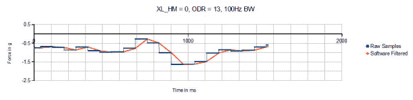](https://cdn.sparkfun.com/assets/learn_tutorials/4/1/6/graph1.jpg)[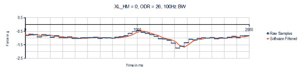](https://cdn.sparkfun.com/assets/learn_tutorials/4/1/6/graph2.jpg)[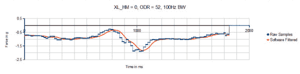](https://cdn.sparkfun.com/assets/learn_tutorials/4/1/6/graph3.jpg)[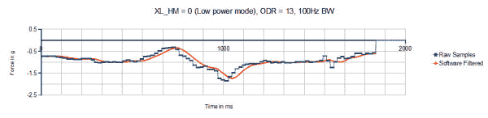](https://cdn.sparkfun.com/assets/learn_tutorials/4/1/6/graph4.jpg)

这些图表显示了几种不同设置下的相同运动。请注意，以这些低频采样率收集的原始数据由多个步骤组成。数据速率越高，步长越小。还要注意的是，在平滑向下运动期间，有时会出现非单调斜率，即步长之间的幅度变化并不总是具有相同的符号。

图中还显示了第二条轨迹——但不要太兴奋。该轨迹是通过实现最近 20 个样本的滚动平均值而创建的软件过滤器。这是用 teensy 3.1 完成的，而不是用基于 328 的微控制器尝试的。

一旦收集并过滤了数据，就可以实施更高级的阈值和斜率检测器来获得定制的运动响应。这类似于 LSM6DS3 的“嵌入式功能”实际提供易于使用的中断输出。

## 资源和更进一步

IMU 的使用方式多种多样，从简单的重力感应到先进的运动跟踪。LSM6DS3 的配置方式非常多！在您使用 arduino 和示例掌握诀窍后，使用以下过程:

1.  **阅读数据手册和应用笔记！**
2.  **设计一个实验来尝试一个想法**
3.  **测量结果**

只有这样，才是改善的途径。

### 资源

*   LSM6DS3 产品 GitHub 库 -所有 LSM6DS3 的版本控制源。在这里，您可以找到我们最新的硬件布局和代码。
*   [LSM6DS3 数据手册](https://cdn.sparkfun.com/assets/learn_tutorials/4/1/6/DM00133076.pdf) -该数据手册涵盖从 IC 的硬件和引脚排列到陀螺仪和加速度计的寄存器映射的所有内容。
*   [LSM6DS3 应用笔记](https://cdn.sparkfun.com/assets/learn_tutorials/4/1/6/AN4650_DM00157511.pdf) -本应用笔记包含与数据手册相同的信息，但加入了真实的英语单词，以帮助人们。在索引窗口打开的情况下，在带选项卡的 PDF 查看器中同时使用此工具和数据表工具，以获得最高效率。

### 更进一步

需要一点灵感吗？看看这些教程吧！

[](https://learn.sparkfun.com/tutorials/electret-mic-breakout-board-hookup-guide) [### 驻极体话筒分线板连接指南](https://learn.sparkfun.com/tutorials/electret-mic-breakout-board-hookup-guide) An introduction to working with the Electret Mic Breakout Board.[Favorited Favorite](# "Add to favorites") 3[](https://learn.sparkfun.com/tutorials/h3lis331dl-accelerometer-breakout-hookup-guide) [### H3LIS331DL 加速度计分线连接指南](https://learn.sparkfun.com/tutorials/h3lis331dl-accelerometer-breakout-hookup-guide) Hookup guide and library usage details for the triple axis accelerometer H3LIS331DL high-g accelerometer.[Favorited Favorite](# "Add to favorites") 4[](https://learn.sparkfun.com/tutorials/sparkfun-inventors-kit-experiment-guide---v40) [### SparkFun 发明家套件实验指南-4.0 版](https://learn.sparkfun.com/tutorials/sparkfun-inventors-kit-experiment-guide---v40) The SparkFun Inventor's Kit (SIK) Experiment Guide contains all of the information needed to build all five projects, encompassing 16 circuits, in the latest version of the kit, v4.0a.[Favorited Favorite](# "Add to favorites") 8[](https://learn.sparkfun.com/tutorials/qwiic-micro-magnetometer---mmc5983ma-hookup-guide) [### Qwiic 微型磁力计- MMC5983MA 连接指南](https://learn.sparkfun.com/tutorials/qwiic-micro-magnetometer---mmc5983ma-hookup-guide) Let's figure out where we're going with the SparkFun Qwiic Micro Magnetometer - MMC5983MA 1