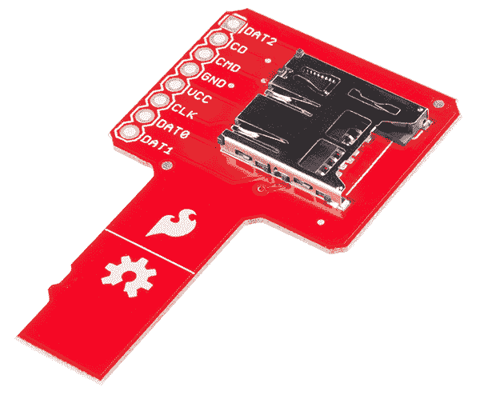

# microSD 嗅探器连接指南

> 原文：<https://learn.sparkfun.com/tutorials/microsd-sniffer-hookup-guide>

## 介绍

[microSD 嗅探器](https://www.sparkfun.com/products/9419)是一个有用的工具，用于破解或调试具有 microSD 功能的电路。

嗅探器允许您查看从 microSD 卡到微控制器或项目来回传递的 SPI 信号。

### 本教程涵盖的内容

本教程将向您展示如何设置嗅探器，以及如何使用它来“嗅探”传输到 microSD 卡和从 micro SD 卡接收的数据。

### 所需材料

为了跟随本教程，我们建议您访问以下资料。