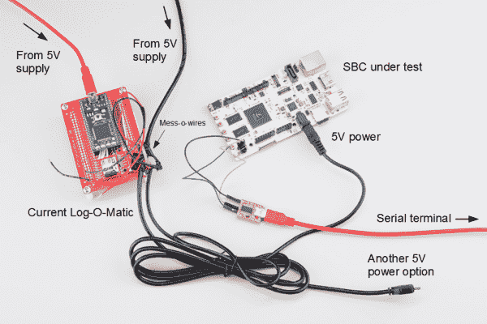

# 单板计算机基准

> 原文：<https://learn.sparkfun.com/tutorials/single-board-computer-benchmarks>

## 介绍

基准测试是用来判断一组相似事物质量的测试，至少韦氏词典是这么认为的。

[](https://cdn.sparkfun.com/assets/learn_tutorials/3/6/7/Pi_Bench.png)*We want to see how various SBCs perform*

许多计算机爱好者使用各种基准测试工具来将他们的计算机推向极限并比较结果。尤其是 PC 游戏爱好者，他们青睐 3D 图形基准，如测试他们计算机游戏能力的 3DMark。单板计算机(SBC)可能没有现代游戏台式机的计算能力，但在适当的情况下，它仍然非常有用和强大。

SBC 用户对他们的微型计算机有无数的用途，所以让他们只接受一个基准，比如图形，如果我们不考虑功耗、CPU、RAM 等，那就是失职。考虑进去。因此，我们进行了一系列测试，涵盖了各种 SBC 的广泛特征。

注意，基准测试工具通常不能准确地表示用户可能如何与计算机交互，而是只测试计算机的一个或两个方面。此外，有几个因素可能会影响性能指标评测的表现，例如特定版本的库(例如 [X11 库](http://www.x.org/wiki/))、使用的编译器选项，甚至是使用的性能指标评测工具的版本。

我们希望测试几个 SBC 的开箱即用性能，因此，我们尽量保持所有软件的默认设置(从制造商的网站进行普通安装或预装在 SBC 上)。我们还将尝试列出我们使用的操作系统(OS)和基准测试工具的版本，这样您就可以知道可能会有什么不同。

这些测试的目的是让您了解几个 SBC 之间的相对性能。因此，我们[不需要非常精确，但我们希望尽可能精确](http://www.mathsisfun.com/accuracy-precision.html)，这样我们就可以比较相对性能。这些测试更广泛而非深入。此外，我们可以选择省去像 Edison 这样的模块需要图形用户界面(GUI)的测试。

[](https://cdn.sparkfun.com/assets/learn_tutorials/3/6/7/Edison_module_1.jpg)*The Intel® Edison runs Linux but does not have a default GUI*

在测试部分，我们将介绍所使用的各种基准测试工具，它们测试什么，以及如何安装它们(如果您希望复制我们的结果)。

我们偶尔会对一组 SBC 进行基准测试。每个“回合”将理想地覆盖一代内 SBC 的子集(例如，“回合 1”可能具有树莓 Pi 2，而“回合 2”可能具有树莓 Pi 3)。

### 推荐阅读

在深入研究基准测试之前，我们建议您熟悉 Linux 和一些命令行工具。此外，我们还将关注功耗，因此复习一下电力可能会有所帮助。

*   [Linux 简介](http://www.tldp.org/LDP/intro-linux/html/)
*   [Linux 命令行](http://linuxcommand.org/index.php)
*   [电力](https://learn.sparkfun.com/tutorials/electric-power)

## 测试

对于大多数基准测试，我们依赖于 Phoronix 测试套件 (PTS)中的一些测试，这是一个免费的开源 Linux 基准测试工具(支持其他操作系统)。PTS 的巧妙之处在于，它可以自动将结果上传到[公开基准测试](http://openbenchmarking.org/)，我们将自由使用。开放基准测试是一个在线平台，用户可以公开或私下存储他们从 PTS 获得的结果。功率测试不是 PTS 的一部分，因此我们将单独执行它。

### Phoronix 测试套件

PTS 将处理我们的大部分测试。我们首先需要确保安装了 PHP 5 命令解释器。在 Debian 系统上，使用:

```
sudo apt-get update
sudo apt-get install php5-cli 
```

然后，我们可以下载并安装 PTS 5 . 8 . 1 版:

```
git clone https://github.com/phoronix-test-suite/phoronix-test-suite/
cd phoronix-test-suite
git checkout v5.8.1
./install-sh 
```

**NOTE:** You can specify a different install directory by calling `./install-sh NEW_DIR`.

要运行任何测试，首先使用带有测试名称的`install`命令安装它，然后调用`benchmark`和测试名称。

```
phoronix-test-suite install pts/<TEST>
phoronix-test-suite benchmark pts/<TEST> 
```

可以从[开放基准测试配置文件页面](https://openbenchmarking.org/tests/pts)上列出的任何配置文件中选择测试。我们将只使用其中的一些测试。

**NOTE:** Unless it is a graphics test, the GUI (e.g. [X server](http://askubuntu.com/questions/66058/how-to-shut-down-x)) should be shut down. For most SBCs, this can be accomplished by pressing Ctrl+Alt+F1 to get to a different console and entering `sudo service lightdm stop`.

例如，我们可以在 BeagleBone Black Rev C (BBBrC)上运行 Himeno 测试。一旦完成，它将提供结果的文本输出，我们可以选择上传到[openbenchmarking.org](https://openbenchmarking.org/)。控制台上会出现一个链接，告诉你在哪里可以找到你的结果(下面的例子中是【http://openbenchmarking.org/result/1507305-BE-BBBRCDEMO13】T2)。

[](https://cdn.sparkfun.com/assets/learn_tutorials/3/6/7/bbbrc_demo_himeno.png)

#### CPU(单核)

任何计算机的支柱是执行指令和运算的能力。我们将通过 [encode-flac](http://openbenchmarking.org/test/pts/encode-flac) 测试来测试简单的数字处理能力。这个简单的测试记录了 CPU 将样本 WAV 文件编码成 [FLAC](https://en.wikipedia.org/wiki/FLAC) 格式需要多长时间。

此时，默认的 [FLAC 编码器](https://xiph.org/flac/)仅使用一个线程，这意味着我们能够比较单核速度。

使用以下代码运行 encode-flac 测试:

```
phoronix-test-suite install pts/encode-flac
phoronix-test-suite benchmark pts/encode-flac 
```

**PRO TIP:** If you choose to upload the results to openbenchmarking.org, you can use the unique ID string to run a comparison on another machine with the same test parameters. For example: `phoronix-test-suite benchmark 1507085-BE-SFEEDISON70`

#### CPU(多核)

虽然测试单核非常适合测量原始速度，但许多新的计算机(包括 SBC)都采用了[多核处理器](https://en.wikipedia.org/wiki/Multi-core_processor)。拥有多个内核允许计算机同时运行[线程](https://en.wikipedia.org/wiki/Thread_(computing))。如果一个程序被编写成多线程的，它就可以利用多个内核的优势，并显著加快执行时间。

我们可以使用 [Himeno](http://openbenchmarking.org/test/pts/himeno) 基准测试来衡量多核性能。根据公开基准测试:

> Himeno 基准是使用点雅可比方法的压力泊松的线性解算器。

如果你很好奇压强泊松方程是什么，请看[这个](https://en.wikipedia.org/wiki/Discrete_Poisson_equation)。

使用以下代码运行 Himeno 基准测试:

```
phoronix-test-suite install pts/himeno
phoronix-test-suite benchmark pts/himeno 
```

#### 随机存取存储

计算机的另一个重要特征是它读写随机存取存储器(RAM)的速度。RAM 非常适合存储短期或易失性数据。我们访问的速度是系统性能的另一个有用指标。

对于 RAM，我们将使用 [RAMspeed](http://openbenchmarking.org/test/pts/ramspeed) 基准测试。这个测试可以在各种参数下运行，但是我们将使用最简单的一个:从 RAM 复制一堆整数。这应该有望给我们一个组合读写速度的概念。

```
phoronix-test-suite install pts/ramspeed
phoronix-test-suite benchmark pts/ramspeed 
```

#### 闪存

RAM 非常适合存储需要较短访问时间的数据，但[硬盘驱动器(HDD)](https://en.wikipedia.org/wiki/Hard_disk_drive)允许非易失性存储(即断电时我们不会丢失数据)。大多数单板机并不使用真正的“硬盘”，而是依靠 [SD 卡](https://en.wikipedia.org/wiki/Secure_Digital)或板载 [eMMC](https://en.wikipedia.org/wiki/MultiMediaCard#eMMC) 进行非易失性存储，我们称之为“闪存”

像 RAM 一样，我们可以测试文件系统和闪存的性能。 [IOzone](http://openbenchmarking.org/test/pts/iozone) 测试向非易失性存储器读取或写入大量数据。我们将使用 1 MB 的数据块和 2 GB 的测试文件分别测试读取和写入(我们希望测试文件比 RAM 大，这样我们的操作系统就不会将它缓存在 RAM 中)。

```
phoronix-test-suite install pts/iozone
phoronix-test-suite benchmark pts/iozone 
```

#### 图形(2D)

随着单板机变得更加强大，它们被用作家庭影院电脑，甚至是 T2 的低端游戏机。许多单板机都带有一个版本的 [OpenGL](https://www.opengl.org/) 或 [OpenGL ES](https://www.khronos.org/opengles/) 来处理图形。

虽然我们无法找到一个在 SBCs 上运行良好的 3D 基准，但我们可以测试计算机绘制简单 2D 形状的能力。我们使用 PTS 中的 [GtkPerf](https://openbenchmarking.org/test/pts/gtkperf) 来完成这个任务。具体来说，我们使用圆圈绘制测试，它计算在一个窗口中绘制一组数量(以千计)的实心圆圈所需的时间。这个相当快速的测试允许我们比较 SBC 的相对 2D 图形速度。

```
phoronix-test-suite install pts/gtkperf
phoronix-test-suite benchmark pts/gtkperf 
```

### 动力试验

SBCs 的另一个重要因素是功耗。许多用户希望让他们的单板机持续运行，并想知道单板机将消耗多少电流。例如，它与开着灯泡相比如何？

为了测试功耗，我们使用一个 [mbed LPC1768](https://www.sparkfun.com/products/9564) 、一个 [INA169 分线点](https://www.sparkfun.com/products/12040)和一个 [microSD 卡分线点](https://www.sparkfun.com/products/544)创建了一个电流记录设备，亲切地命名为“Current Log-O-Matic”。

[](https://cdn.sparkfun.com/assets/learn_tutorials/3/6/7/Current_Logomatic_1.png)*The Current Log-O-Matic*

当前 Log-O-Matic 的原理图可以在下面找到，代码可以在 mbed 的网站上找到[。](https://developer.mbed.org/users/ShawnHymel/code/current_logomatic/)

[](https://cdn.sparkfun.com/assets/learn_tutorials/3/6/7/Current_Logomatic_schematic.png)*Schematic for logging current draw with an mbed*

电流 Log-O-Matic 在启动时以大约 20 ms 的增量记录 10 秒的测量电流使用(流经 INA169 分线点的检测电阻)。这些信息被输入到一个电子表格中，然后计算出这 10 秒内的平均电流。

**NOTE:** We removed the INA169's default RS and replaced it with 2x 1 Ω power resistors in parallel (giving us a total of 0.5 Ω).

我们想要计算空闲和负载功耗。为了做到这一点，我们启动了测试中的 SBC，并使用一个[串行终端](https://learn.sparkfun.com/tutorials/terminal-basics)登录到控制台。我们禁用了任何无关的功能，例如 GUI(例如 X Windows)、 [WiFi](https://www.linux.com/community/blogs/133-general-linux/727195-disable-a-enable-usb-from-terminal) 和[蓝牙](http://askubuntu.com/questions/383442/bluetooth-not-turning-on)。当空闲时(在控制台中什么也不做)，我们在 SBC 的输入端进行电压测量(我们想要测试整个板的功率使用情况)并运行电流 Log-O-Matic。我们使用测量的电压(假设电压变化不大)和平均电流计算了`P = V x I`的平均空闲功耗。

我们在 SBC 运行 Himeno 多核 CPU 测试时重复了测试，以测量负载下的平均电流使用情况。还使用`P = V x I`计算了平均功耗。

## 第一轮

### 竞争者

#### 树莓 Pi 2(B 型)

[](https://cdn.sparkfun.com/assets/learn_tutorials/3/6/7/Raspberry_Pi_2.jpg)

Raspberry Pi 是作为一个向学生教授计算机科学基础知识的廉价平台而创建的。这是最便宜和最受欢迎的单板机。在这一轮中，我们测试了一款 [Raspberry Pi 2 - Model B](https://www.sparkfun.com/products/13297) 对抗其他 SBC。运行`uname -a`给出了 Linux 的版本:

```
Linux raspberrypi 3.18.11-v7+ #781 SMP PREEMPT Tue Apr 21 18:07:59 BST 2015 armv7l GNU/Linux 
```

#### 比格犬骨黑-版本 C

[](https://cdn.sparkfun.com/assets/learn_tutorials/3/6/7/BeagleBone_Black_-_Rev_C.jpg)

BeagleBone Black 是由德州仪器(ti)开发的面向大众的开源单板计算机。[修订版 C](https://www.sparkfun.com/products/12857) 将板载存储增加到 4 GB，并预装了 Debian Linux 映像。测试中使用的 Linux 版本是:

```
Linux beaglebone 3.8.13-bone47 #1 SMP Fri Apr 11 01:36:09 UTC 2014 armv7l GNU/Linux 
```

#### 英特尔爱迪生公司

[](https://cdn.sparkfun.com/assets/learn_tutorials/3/6/7/Edison_2.jpg)

英特尔爱迪生公司是一款用于可穿戴设备的微型计算机模块。如果没有视频输出端口，它可能不符合“单板计算机”的定义然而，由于它能够运行 Linux，我们可以将其性能与其他 SBC 进行比较，但图形测试除外。我们测试的版本正在运行:

```
Linux edison 3.10.17-poky-edison+ #1 SMP PREEMPT Wed Apr 29 03:54:01 CEST 2015 i686 GNU/Linux 
```

#### pcDuino3

[](https://cdn.sparkfun.com/assets/learn_tutorials/3/6/7/pcDuino3.jpg)

pcDuino 是 LinkSprite 的版本，是 Raspberry Pi 和 Arduino 混搭的版本。pcDuino 能够同时运行 Linux 和模拟 Arduino。请注意，我们是从 microSD 卡运行操作系统，而不是从连接到 SATA 端口的磁盘驱动器运行操作系统。我们测试了[版本 3](https://www.sparkfun.com/products/12856) ，它正在运行:

```
Linux ubuntu 3.4.79+ #12 SMP PREEMPT Mon Jul 21 13:05:42 CST 2014 armv7l armv7l armv7l GNU/Linux 
```

#### 阿卡迪亚

[](https://cdn.sparkfun.com/assets/learn_tutorials/3/6/7/Acadia.jpg)

LinkSprite 创建了 [Acadia](https://www.sparkfun.com/products/13610) 来为 SBC 市场带来更高性能的 ARM CPUs。Acadia 是围绕强大的 Freescale i.MX6 处理器构建的。请注意，我们是从 microSD 卡运行操作系统，而不是从连接到 SATA 端口的磁盘驱动器运行操作系统。Linux 版本是:

```
Linux Acadia 3.0.35-2666-gbdde708 #76 SMP PREEMPT Tue Feb 10 23:03:49 PST 2015 armv7l armv7l armv7l GNU/Linux 
```

### 规范

为了快速比较，我们提供了一些表格，显示了测试中 SBC 的各种特性。

Table: CPU and GPU

| 设备 | 处理器 | 体系结构 | CPU 速度 | 核心 | 国家政治保卫局。参见 OGPU |
| 树莓 Pi 2 | Broadcom BCM2836 | 手臂皮层-A7 | 900 兆赫 | four | 博通公司（美国公司） |
| 比格犬骨黑版本 C | TI Sitara AM335x | 手臂皮层-A8 | 1 千兆赫 | one | PowerVR SGX530 |
| 英特尔爱迪生公司 | 英特尔凌动 Z34XX | Silvermont x86 | 500 兆赫 | Two | 没有人 |
| pcDuino3 | 冠军 A20 | 手臂皮层-A7 | 1 千兆赫 | Two | 马里-400MP2 |
| 阿卡迪亚 | 飞思卡尔 i.MX6 | 手臂皮层-A9 | 1.2 千兆赫 | four | 活 GC2000 |

Table: RAM and Storage

| 设备 | RAM 大小 | 柱塞泵 | 车载存储 | 闪光灯插槽 |
| 树莓 Pi 2 | 1 GB | LPDDR2 | 没有人 | microSD |
| 比格犬骨黑版本 C | 512 兆字节 | DDR3 | 4 GB | microSD |
| 英特尔爱迪生公司 | 1 GB | LPDDR3 | 4 GB | 没有人 |
| pcDuino3 | 1 GB | DDR3 | 4 GB | microSD |
| 阿卡迪亚 | 1 GB | DDR3 | 没有人 | microSD |

Table: Ports, Connectivity, and Price

| 设备 | 通用串行总线 | 萨塔（人名） | 音频输出 | 高清晰度多媒体接口 | 以太网 | 无线局域网（wireless fidelity 的缩写） | 蓝牙 | GPIO | 价格 |
| 树莓 Pi 2 | 是 | 不 | 是 | 是 | 是 | 不 | 不 | Seventeen | $39.95 |
| 比格犬骨黑版本 C | 是 | 不 | 不 | 是 | 是 | 不 | 不 | Sixty-six | $54.95 |
| 英特尔爱迪生公司 | 是 | 不 | 不 | 不 | 不 | 是 | 是 | Forty | $49.95 |
| pcDuino3 | 是 | 是 | 是 | 是 | 是 | 是 | 不 | Twenty-two | $59.95 |
| 阿卡迪亚 | 是 | 是 | 是 | 是 | 是 | 不 | 不 | Twenty-two | $119.95 |

### 结果呢

现在是你们期待已久的时候了:结果！我们将为每个测试提供一个比较图表。如果你需要更多的细节，你也可以在每个部分找到原始测试结果的链接。

#### CPU(单核)

乘以将. WAV 音频文件转换为 FLAC 文件所需的时间。原始测试结果可以在[这里](http://openbenchmarking.org/result/1507229-BE-1507225BE81)找到。

[](https://cdn.sparkfun.com/assets/learn_tutorials/3/6/7/Round_1_-_encode-FLAC.png)

#### CPU(多核)

通过计时求解压力泊松方程所需的时间，计算每秒浮点运算次数(以 MFLOPS 为单位)。原始测试结果可以在[这里](http://openbenchmarking.org/result/1507223-BE-1507228BE82)找到。

[](https://cdn.sparkfun.com/assets/learn_tutorials/3/6/7/Round_1_-_Himeno.png)

#### 随机存取存储

测试聚合 RAM 读写速度。原始测试结果可以在[这里](http://openbenchmarking.org/result/1507231-BE-1507100BE18)找到。

[](https://cdn.sparkfun.com/assets/learn_tutorials/3/6/7/Round_1_-_RAMspeed.png)

#### 闪存

将文件传入和传出闪存，以计算读写速率。原始测试结果可以在[这里](http://openbenchmarking.org/result/1507109-BE-1507095BE70)和[这里](http://openbenchmarking.org/result/1507106-BE-SFEBBBRCI70)找到。

注意，BeagleBone Black Rev C 测试略有不同，因为我们必须使用 512 MB 的测试文件(而不是其他测试使用的 2 GB 文件)。比格伯恩·布莱克的 eMMC 号上没有足够的空间。

[](https://cdn.sparkfun.com/assets/learn_tutorials/3/6/7/Round_1_-_IOzone.png)

#### 图形(2D)

乘以在一个窗口中绘制一组数量(数千个)的实心圆所需的时间。原始测试结果可以在[这里](http://openbenchmarking.org/result/1507231-BE-1507227BE69)找到。

注意，我们忽略了 Edison，因为它没有视频输出端口，因此没有默认的 GUI。

[](https://cdn.sparkfun.com/assets/learn_tutorials/3/6/7/Round_1_-_GtkPerf.png)

#### 力量

根据测量的电流消耗(10 秒内的平均值)和测量的 DC 电压计算平均功耗。原始测试结果可以在[这里](https://cdn.sparkfun.com/assets/learn_tutorials/3/6/7/Round_1_-_Power_1.ods)找到。

[](https://cdn.sparkfun.com/assets/learn_tutorials/3/6/7/Round_1_-_Power.png)

## 结论

哪个 SBC 是“最好的”真的取决于你想用它做什么。RAM 速度在某些应用中可能很重要，而图形能力在其他应用中可能更重要。在考虑购买单板计算机时，不要忽视物理主板尺寸和社区支持的重要性，这些测试中没有涉及到。

如果您对测试有任何问题或意见(或者只是想谈谈单板计算机！)，请在[评论区](https://learn.sparkfun.com/tutorials/single-board-computer-benchmarks/discuss)留下。

### 资源

*   [当前日志自动嵌入页面](https://developer.mbed.org/users/ShawnHymel/code/current_logomatic/)
*   [当前 Log-O-Matic mbed 代码](https://cdn.sparkfun.com/assets/learn_tutorials/3/6/7/current_logomatic_zip_lpc1768.zip)