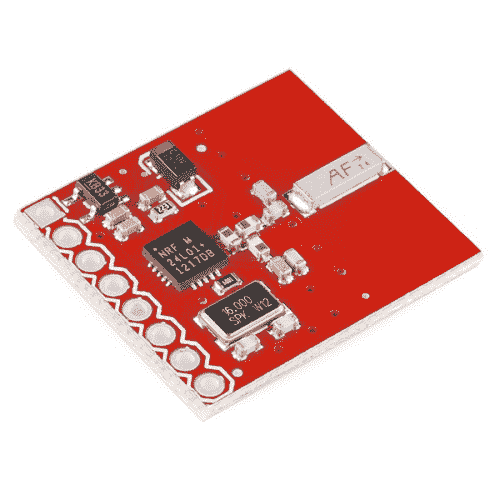
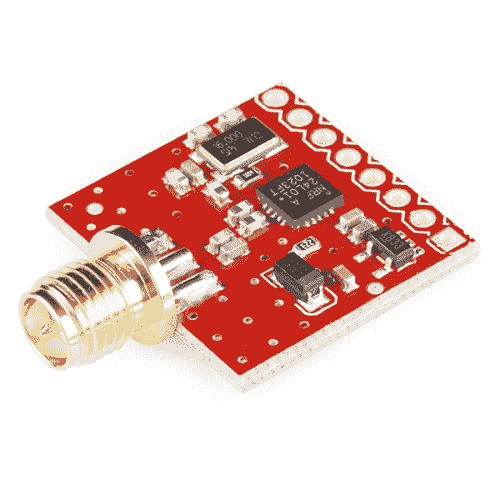

# nRF24L01+收发器连接指南

> 原文：<https://learn.sparkfun.com/tutorials/nrf24l01-transceiver-hookup-guide>

## 介绍

这些分线板提供对来自 [Nordic Semiconductor](http://www.nordicsemi.com/) 的 nRF24L01+收发器模块的 SPI 访问。收发器工作频率为 2.4 GHz，电源电压为 3.3V-5V。它具有 250kbps、1Mbps 和 2Mbps 空中数据速率选项，适用于低功耗应用。分线板有一个[机载天线](https://www.sparkfun.com/products/691)或一个将外部天线添加到 [RP-SMA 连接器](https://www.sparkfun.com/products/705)的选项。

 

将**添加到您的[购物车](https://www.sparkfun.com/cart)中！**

 **### [SparkFun 收发分线点- nRF24L01+](https://www.sparkfun.com/products/691)

[In stock](https://learn.sparkfun.com/static/bubbles/ "in stock") WRL-00691

该模块使用 Nordic Semiconductor 最新的 2.4GHz 收发器 nRF24L01+。该收发器 IC 工作在…

$20.955[Favorited Favorite](# "Add to favorites") 13[Wish List](# "Add to wish list")**** 

将**添加到您的[购物车](https://www.sparkfun.com/cart)中！**

 **### [【spark fun 收发器分线点- nRF24L01+ (RP-SMA)](https://www.sparkfun.com/products/705)

[In stock](https://learn.sparkfun.com/static/bubbles/ "in stock") WRL-00705

nRF24L01 模块是 SparkFun 的最新射频模块。该模块使用北欧半导体公司的 2.4GHz 收发器

$22.953[Favorited Favorite](# "Add to favorites") 20[Wish List](# "Add to wish list")**** ****### 所需材料

为了跟随本教程，我们建议您访问以下资料。你可能不需要所有的东西，这取决于你已经拥有的东西。将它添加到您的购物车，通读指南，并根据需要调整购物车。****