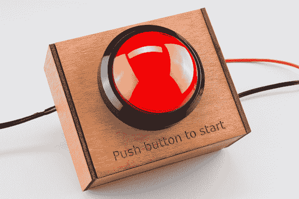

# 将定时按钮添加到项目

> 原文：<https://learn.sparkfun.com/tutorials/adding-a-timed-button-to-a-project>

## 介绍

在本教程中，您将学习如何添加一个 on 按钮，该按钮将为您的项目提供一段时间的电源，然后再次关闭。我们将使用一个[固态继电器(SSR)](https://www.sparkfun.com/products/10636) 来处理交流电压，就像你在家里看到的从墙上发出的电压一样。

**PLEASE DON'T HURT YOURSELF!** When dealing with high voltages, and high currents, please be extra careful and take any and all precautions.

### 所需材料

如果您想跟随本教程，您将需要以下内容: