# ESP8266 WiFi 屏蔽连接指南

> 原文：<https://learn.sparkfun.com/tutorials/esp8266-wifi-shield-hookup-guide>

## 介绍

ESP8266 是一款受欢迎的廉价 WiFi/微控制器片上系统(SoC)。虽然它可以像任何微控制器一样进行编程，但 ESP8266 的流行是因为它是一个简单的、**串行控制的 WiFi 网关**。使用 AT 命令集，任何具有 UART 的微控制器都可以使用 ESP8266 连接到 WiFi 网络，并通过 TCP 或 UDP 与互联网世界的其他部分进行交互。这是一个简单(而且便宜！)让您的 Arduino 上网的方法！

[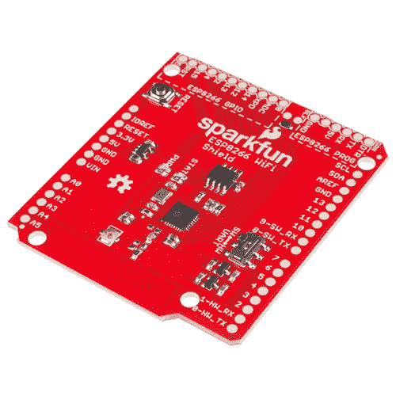](https://www.sparkfun.com/products/13287) 

将**添加到您的[购物车](https://www.sparkfun.com/cart)中！**

 **### [SparkFun WiFi 盾- ESP8266](https://www.sparkfun.com/products/13287)

[In stock](https://learn.sparkfun.com/static/bubbles/ "in stock") WRL-13287

SparkFun ESP8266 WiFi Shield 是适用于 ESP8266 WiFi SoC 的 Arduino 兼容盾，是物联网或无线网络的领先平台

$18.5035[Favorited Favorite](# "Add to favorites") 61[Wish List](# "Add to wish list")** **围绕 ESP8266 有各种各样的设计，包括[微型模块化板](https://www.sparkfun.com/products/13252)和更容易使用的开发板，如 [SparkFun ESP8266 东西](https://www.sparkfun.com/products/13231)。 [ESP8266 WiFi Shield](https://www.sparkfun.com/products/13287) 在模块和事物之间找到了一个中间点——它预闪了 AT-command 固件，因此它可以由任何 UART 控制，但它也突破并提供对 ESP8266 的所有 I/O 的命令访问。它采用熟悉的 Arduino Shield 形状，应该可以与任何类似大小的 Arduino 兼容开发板一起工作。

无论您是想要了解 ESP8266(无需离开 Arduino 舒适的硬件限制),还是只是想要一个廉价的互联网网关，ESP8266 WiFi Shield 都可以满足您的需求。

### 本教程涵盖的内容

本教程详细介绍了 ESP8266 WiFi 屏蔽背后的硬件和固件设计。它还解释了如何将 Shield 与 Arduino 兼容的开发板和 Arduino IDE 配合使用。该指南分为几个部分，您可以使用右侧的栏来浏览。这些部分包括:

*   [硬件概述](https://learn.sparkfun.com/tutorials/esp8266-wifi-shield-hookup-guide#hardware-overview) -本节涵盖了防护罩的主要组件和硬件特征。
*   [AT 固件概述](https://learn.sparkfun.com/tutorials/esp8266-wifi-shield-hookup-guide#at-firmware-overview) -文档链接，以及运行在 ESP8266 WiFi Shield 上的固件的快速介绍。
*   [硬件组装](https://learn.sparkfun.com/tutorials/esp8266-wifi-shield-hookup-guide#hardware-assembly) -组装 WiFi 屏蔽的技巧和窍门。
*   [在库](https://learn.sparkfun.com/tutorials/esp8266-wifi-shield-hookup-guide#installing-the-esp8266-at-library)安装 ESP8266-在 Arduino 库安装 ESP8266 所需的一切。
*   [在库](https://learn.sparkfun.com/tutorials/esp8266-wifi-shield-hookup-guide#using-the-esp8266-at-library)中使用 ESP8266-帮助您开始编写自己的 ESP8266 Arduino 草图的指针。
*   [(重新)编程 ESP8266](https://learn.sparkfun.com/tutorials/esp8266-wifi-shield-hookup-guide#re-programming-the-esp8266) -将您自己的代码加载到盾上，让 ESP8266 WiFi 盾更进一步！ESP8266 甚至与 Arduino 兼容。

### 所需材料

ESP8266 保护罩围绕着 WiFi SoC，提供运行和连接到 WiFi 网络所需的一切。所有你需要添加到它是头，一些焊料，和一个 Arduino。以下是我们在教程中使用的部分列表，如果你想跟着做的话:

[](https://www.sparkfun.com/products/13975) 

将**添加到您的[购物车](https://www.sparkfun.com/cart)中！**

 **### [spark fun red board——用 Arduino 编程 T3](https://www.sparkfun.com/products/13975)

[In stock](https://learn.sparkfun.com/static/bubbles/ "in stock") DEV-13975

SparkFun RedBoard 结合了 UNO 的 Optiboot 引导程序的简单性、FTDI 的稳定性和 shield com…

$21.5049[Favorited Favorite](# "Add to favorites") 89[Wish List](# "Add to wish list")****[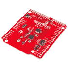](https://www.sparkfun.com/products/13287) 

将**添加到您的[购物车](https://www.sparkfun.com/cart)中！**

 **### [SparkFun WiFi 盾- ESP8266](https://www.sparkfun.com/products/13287)

[In stock](https://learn.sparkfun.com/static/bubbles/ "in stock") WRL-13287

SparkFun ESP8266 WiFi Shield 是适用于 ESP8266 WiFi SoC 的 Arduino 兼容盾，是物联网或无线网络的领先平台

$18.5035[Favorited Favorite](# "Add to favorites") 61[Wish List](# "Add to wish list")****[](https://www.sparkfun.com/products/11417) 

将**添加到您的[购物车](https://www.sparkfun.com/cart)中！**

 **### [Arduino 可堆叠接头套件- R3](https://www.sparkfun.com/products/11417)

[In stock](https://learn.sparkfun.com/static/bubbles/ "in stock") PRT-11417

这些接头适用于 Arduino Uno R3、Leonardo 和新的 Arduino 板。他们是完美的 h…

$1.7512[Favorited Favorite](# "Add to favorites") 68[Wish List](# "Add to wish list")****** ******除了 RedBoard，你应该可以使用几乎任何其他兼容 Arduino 的开发板——例如 [Uno](https://www.sparkfun.com/products/11021) 或 [Leonardo](https://www.sparkfun.com/products/11286) 。

如果你还没有的话，你还需要一套焊接工具。一根简单的铁和一些 T2 焊料应该就够了。

### 推荐阅读

在一头扎进本教程之前，有几个概念您应该熟悉。如果您对这些相关教程的内容感到陌生，请查看它们:

*   什么是 Arduino？这个“Arduino”到底是什么？
*   Arduino 盾牌 -所有 Arduino 盾牌。它们是什么以及如何组装它们。
*   [串行通信](https://learn.sparkfun.com/tutorials/serial-communication) -异步串行通信概念:数据包、信号电平、波特率、UARTs 等等！
*   [如何焊接——通孔焊接](https://learn.sparkfun.com/tutorials/how-to-solder-through-hole-soldering)——你是电子和焊接新手吗？你以前焊接过，但需要更新吗？你每天都焊接，但仍然觉得你可以使用一些技巧和窍门吗？本教程涵盖了你需要知道的关于通孔焊接的一切。

## 硬件概述

本节介绍 ESP8266 WiFi 屏蔽的硬件功能。棋盘的大部分动作都发生在顶部，看起来应该是这样的:

[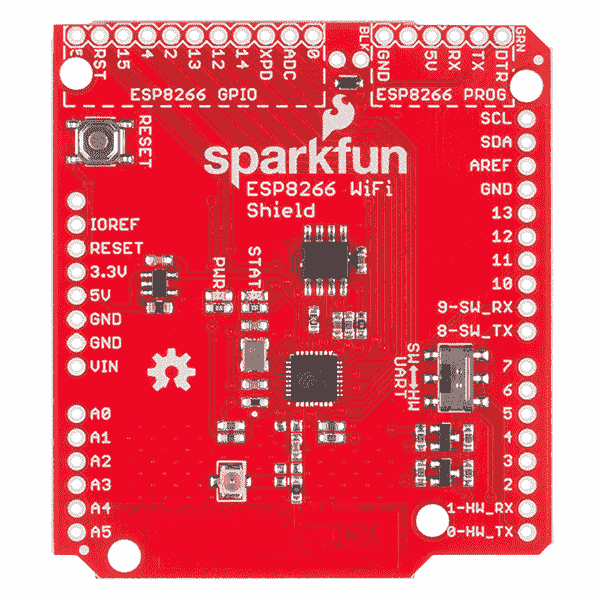](https://cdn.sparkfun.com/assets/learn_tutorials/4/0/3/top.jpg)

在给盾牌装备头部并把它放在你的 Arduino 上之前，有几个特性你应该熟悉。

### 串行端口-可选和电平转换

ESP8266 WiFi Shield 具有可选串行线路，可将 RX 和 TX 信号路由至 Arduino 的专用硬件串行端口(引脚 0 和 1)或引脚 8 和 9 上的软件串行端口。活动端口由板载交换机选择。

[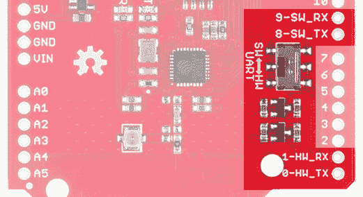](https://cdn.sparkfun.com/assets/learn_tutorials/4/0/3/top-serial-ports-cropped.jpg)

对于“软件”和“硬件”，开关的位置标有“SW”和“HW”；它们应该是直观的——滑向“硬件”的硬件端口，滑向“软件”的引脚 8 和 9。

**Watch out!** When you're programming your Arduino (assuming it's an ATmeg328P-based 'duino), **make sure the UART select switch is slid over towards the "SW" position**. If it's set to "HW", all of those bits and bytes being programmed into the Arduino will also be sent over towards the ESP8266 — there's a chance the spurious data might put the ESP8266 into an unknown (though recoverable) state.

ESP8266 的默认波特率设置为 9600，因此，对于大多数草图，软件串行工作正常，并允许硬件端口用于调试。**我们建议将此开关设置为“SW”**，除非您需要这些引脚用于其他用途，或者只是*有*来使用硬件串行。

还需要注意的是，ESP8266 的最大输入电压约为 3.3V。为了避免 5V Arduino 和 ESP8266 之间的任何电压冲突， **RX 和 TX 信号在 5V 和 3.3V 之间进行电平转换**。

### Arduino 复位按钮

盾牌的重置按钮只与 Arduino 的相关联。按下并释放按钮将重启 Arduino，从 setup()函数的顶部运行它的 sketch。

[](https://cdn.sparkfun.com/assets/learn_tutorials/4/0/3/reset-cropped.jpg)

按下复位按钮不会对 ESP8266 产生直接影响。

### LED 指示灯

WiFi 盾包括两个 LED 指示灯:一个简单的红色电源指示灯和一个蓝色“状态”LED。每当 Arduino 向 ESP8266 屏蔽层供电时，红色电源 LED 应亮起。如果您需要调试任何东西，检查这个 LED 应该是您的第一步。

[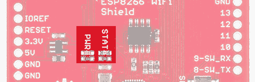](https://cdn.sparkfun.com/assets/learn_tutorials/4/0/3/top-leds-cropped.jpg)

蓝色状态 LED 被绑定到 ESP8266 的固件中。它会闪烁、稳定或关闭，这取决于它所处的状态。

| LED 状态 | ESP8266 状态 |
| 离开 | WiFi 断开。未配置。 |
| 讨厌的 | 站模式:ESP8266 尝试连接到接入点。
AP 模式:ESP8266 等待传入连接 |
| 在 | 站模式:ESP8266 连接到接入点。
AP 模式:连接到 ESP8266 AP 的设备。 |

状态 LED 与 ESP8266 的 GPIO 5 相连。

### ESP8266 GPIO 和编程端口

ESP8266 不仅仅是一个简单的串行到 WiFi 网关。它有十几个可以配置为数字输入或输出的 I/O，甚至还有一个(相对有限的)ADC！这些 GPIO 都朝着屏蔽的左上方散开。

[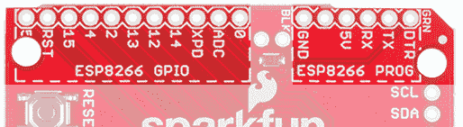](https://cdn.sparkfun.com/assets/learn_tutorials/4/0/3/gpio-cropped.jpg)

shield 的固件配备了自定义命令，允许您的 Arduino 设置、写入和读取这些引脚。稍后会详细介绍。

ESP8266 WiFi Shield 还可以通过编程端口重新调整用途和重新编程。无论您是想添加自己的 AT 命令，还是想在 ESP8266 上闪存定制固件，这个端口以后都可能会非常方便。

编程端口的引脚排列与我们的 [FTDI 基本](https://www.sparkfun.com/products/9716)分线点相匹配。焊接一些公接头，将两块电路板连接在一起，以设置编程接口。稍后还会有更多内容！

## AT 固件概述

虽然硬件显然很重要，但真正让 WiFi 盾与 Arduino 完美配合的是其基于串行的 at 命令集固件。

ESP8266 WiFi Shield 随附 Espressif(ESP8266 的制造商)最新发布的 AT 命令集固件。我们调整了基础固件，以添加对状态 LED 和 ESP8266 未使用 I/O 的串行控制的支持。我们的固件尽可能开源(Espressif 的一些源代码仅作为 blobs 提供)-您可以在我们的 [ESP8266 WiFi Shield GitHub 资源库](https://github.com/sparkfun/ESP8266_WiFi_Shield)中查看。

### 使用 AT 命令集

在本教程的后面部分，我们将介绍一个 Arduino 库，它为您处理所有这些“AT”的东西。但是至少熟悉一下用于配置 ESP8266 的命令也无妨。

The ESP8266's default serial baud rate is **9600 bps**. This communication speed can be configured, but slower speeds are recommended if software serial is used.

有关 ESP8266 AT 命令的完整列表，请查看本文档[。有各种各样的命令，可以配置从接入点名称/密码到 TCP 连接，再到设备的波特率。](https://cdn.sparkfun.com/assets/learn_tutorials/4/0/3/4A-ESP8266__AT_Instruction_Set__EN_v0.30.pdf)

[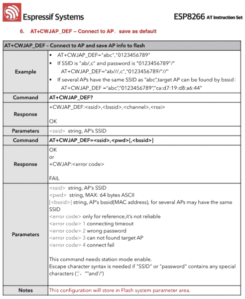](https://cdn.sparkfun.com/assets/learn_tutorials/4/0/3/at-command-example.png)*Example page from the AT command set guide -- this one demonstrates how to connect to a WiFi access point.*

如果您正在手动输入这些命令，请记住，每个命令的结尾应该先用回车符表示，然后用换行符表示(" \r\n ")。

作为一个示例练习，您可以键入一系列命令来连接 WiFi 接入点并获取您的 IP 地址:

```
> AT+CWOMDE=1
    OK
> AT+CWJAP="MySSID","MyPSK"
    WIFI CONNECTED
    WIFI GOT IP
    OK
> AT+CIFSR
    +CIFSR:STAIP,"192.168.0.101"
    +CIFSR:STAMAC,"18:fe:34:9d:b7:d9" 
```

### 自定义 GPIO 命令

我们采用了 Espressif 的 AT 命令固件，并添加了一些额外的功能，让您可以控制 ESP8266 未使用的数字 GPIO。总共有 9 个 GPIO 需要数字控制:0、2、4、5、12、13、14、15 和 16 (XPD)。

自定义命令允许您将引脚设置为输入或输出(或带上拉电阻的输入)，以数字方式写入高电平或低电平，或读取引脚状态:

| 功能 | 命令 | 例子 | 笔记 |
| 引脚模式 | AT+PINMODE= <pin>，</pin> | AT+PINMODE=5，o | 模式:

*   `o`: Output
*   `i`: Input
*   `p`: Input _ Pull-up

 |
| 数字写入 | AT+PINWRITE= <pin>，<state></state></pin> | AT+PINWRITE=5，h | 状态:

*   `h`: High
*   `l`: Low

 |
| 数字阅读 | AT+PINREAD= | AT+PINREAD=0 | 响应:`0`或`1`为低或高。 |

## 硬件装配

在您可以使用 ESP8266 Shield 之前，您需要焊接一些接头，以便它可以与您的 Arduino 接口。

可堆叠接头总是屏蔽的好选择，尤其是如果你计划堆叠更多屏蔽或插入[跳线](https://www.sparkfun.com/products/11026)。

[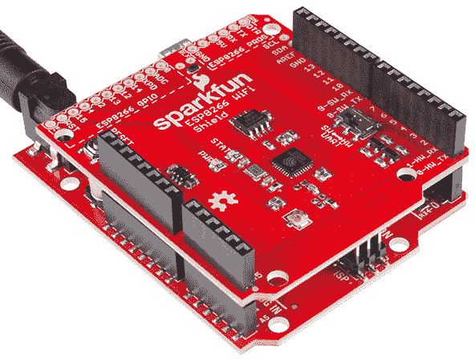](https://cdn.sparkfun.com/assets/learn_tutorials/4/0/3/angled-action.jpg)

如果堆叠对你来说不那么重要，你也可以选择外形更友好的[公接头](https://www.sparkfun.com/products/116)。

根据您如何使用屏蔽，您也可以将接头焊接到 ESP8266 GPIO 和程序接头中。编程头可能会干扰 Arduino Uno 上较大的 USB-B 连接器，所以在焊接时要记住它们的间隙。

[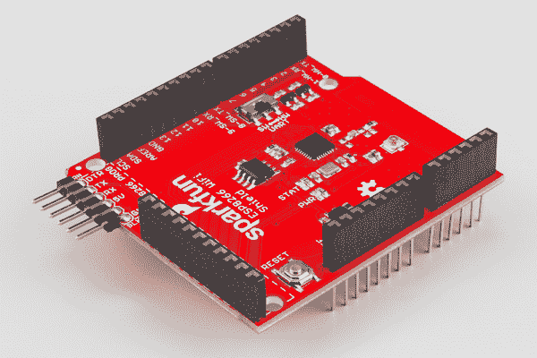](https://cdn.sparkfun.com/assets/learn_tutorials/4/0/3/gpio-headers.jpg)

[母接头](https://www.sparkfun.com/products/115)可能是 GPIO 接头的一个好选择，而[直角公接头](https://www.sparkfun.com/products/553)使编程接头与 FTDI 分线点的接口变得容易。

### 天线间隙

不幸的是，ESP8266 WiFi Shield 的印刷 PCB 天线可能会与 Arduino ISP 接头发生干扰问题。在 Arduino 上安装屏蔽板后，您可能需要稍微向上推动屏蔽板，以避免电路板碰到 2x3 ISP 接头。

[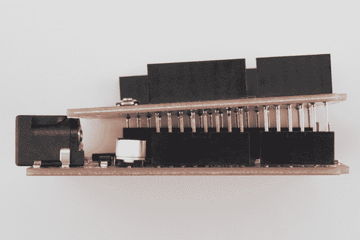](https://cdn.sparkfun.com/assets/learn_tutorials/4/0/3/tilt-isp-side.jpg)

割台会干扰防护罩的 WiFi 信号，并导致信号灵敏度低于预期。如果你的盾牌在连接网络时有问题，确保这里有一些空间。

[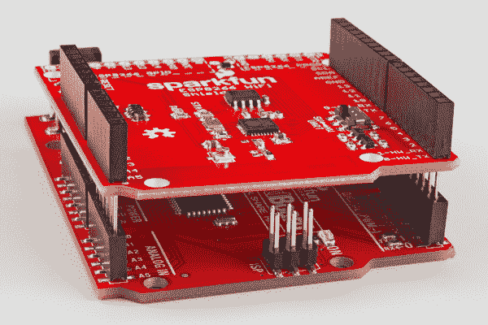](https://cdn.sparkfun.com/assets/learn_tutorials/4/0/3/tilt-isp-front.jpg)

## 在图书馆安装 ESP8266

让我们开始编程吧！为了尽可能轻松地与 shield 的 AT 命令集交互，我们编写了一个简单的 Arduino 库。你可以从我们的 [GitHub 库](https://github.com/sparkfun/SparkFun_ESP8266_AT_Arduino_Library)获得这个库，或者点击下面的按钮下载。

[Download the SparkFun ESP8266 AT Library](https://github.com/sparkfun/SparkFun_ESP8266_AT_Arduino_Library/archive/master.zip)

我们建议对这个库使用最新版本的 Arduino(目前是 1.6.5)。要获得安装库的帮助，请查看我们的[安装 Arduino 库教程](https://learn.sparkfun.com/tutorials/installing-an-arduino-library)。

### 运行 ESP8266_Shield_Demo 示例

图书馆的 SparkFun ESP8266 包括一些示例草图，它们演示了从连接到接入点，到提供网页，到设置聊天服务器的一切。为了测试一切，加载“ESP8266_Shield_Demo”示例，方法是转到**文件** > **示例**>**spark fun ESP8266 AT**>**ESP8266 _ Shield _ Demo**。

要为您的本地 WiFi 网络配置 ESP8266，您需要修改草图顶部附近的一对字符串。

```
language:c
const char mySSID[] = "mySSID";
const char myPSK[] = "myPassword"; 
```

最后，在上传草图之前，**确保 UART 开关设置为 SW** -每当你上传新的东西时，它应该总是处于这种状态。确认开关处于正确位置后，上传！

本例介绍了 ESP8266 AT library 的一些基本功能。它连接到一个接入点，找到它的本地 IP 地址，试图连接到一个远程服务器(example.com)来获得一个网页，最后建立一个自己的服务器。

打开串行监视器(设置为 9600 波特)，按照说明进行操作(您需要发送几个字符来触发事件)，这将让您了解屏蔽是如何工作的。

[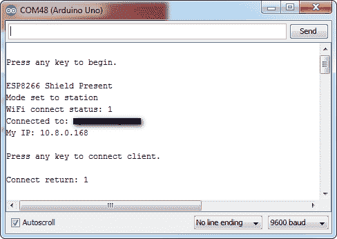](https://cdn.sparkfun.com/assets/learn_tutorials/4/0/3/serial-example.png)

一旦你得到了草图的最终服务器示例，试着加载一个网络浏览器并导航到显示的网址。ESP8266 应该会提供这样的网页:

[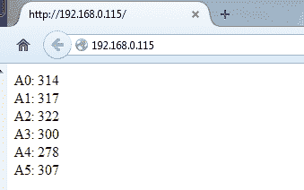](https://cdn.sparkfun.com/assets/learn_tutorials/4/0/3/browser-screenshot.png)

您需要在同一个网络上才能工作。

## 在图书馆使用 ESP8266

上一节中的示例以及库中包含的其他示例应该对演示 SparkFun ESP8266 在库中的用法大有帮助。本节将记录一些更常用的函数。更多文档请查看该库的 [GitHub 库](https://github.com/sparkfun/SparkFun_ESP8266_AT_Arduino_Library)。

### 初始化

您需要在任何 ESP8266 的顶部包含两个库——使用 Arduino sketch: `<SparkFunESP8266WiFi.h>`和`<SoftwareSerial.h>`:

```
language:c
#include <SoftwareSerial.h> // Include software serial library, ESP8266 library dependency
#include <SparkFunESP8266WiFi.h> // Include the ESP8266 AT library 
```

在您的`setup()`中，要初始化 ESP8266 并确保其正常工作，请调用`esp8266.begin()`。该函数将返回 true 或 false，表明与 ESP8266 的通信是否成功。

```
language:c
if (esp8266.begin()) // Initialize the ESP8266 and check it's return status
    Serial.println("ESP8266 ready to go!"); // Communication and setup successful
else
    Serial.println("Unable to communicate with the ESP8266 :("); 
```

`esp8266.begin()`必须在任何其他 ESP8266 函数之前被调用。

### 设置 WiFi

要将您的 ESP8266 连接到本地 WiFi 网络，请拨打`esp8266.connect()`。这个函数有两个参数:网络 SSID 和密码。例如:

```
language:c
int retVal;
retVal = esp8266.connect("myNetwork", "myNetworkPassword");
if (retVal < 0)
{
    Serial.print(F("Error connecting: "));
    Serial.println(retVal);
} 
```

`connect()`函数也将返回一个值，表明它成功了。任何大于 0 的值都表示成功。任何小于 0 的值都意味着连接有问题。

此功能可能需要一些时间来完成-库中的超时设置为 30 秒。

连接后，您可以通过调用`esp8266.localIP()`来检查您的本地 IP 地址。这个函数将返回一个类型为`IPAddress`的变量。

```
language:c
IPAddress myIP = esp8266.localIP(); // Get the ESP8266's local IP
Serial.print(F("My IP is: ")); Serial.println(myIP); 
```

### TCP 客户端

一旦你连接到网络，你可能想与互联网互动！要将 ESP8266 用作 TCP 客户端，请使用`ESP8266Client`类。首先，创建一个对象。您最多可以同时拥有五个客户端:

```
language:c
ESP8266Client client; // Create a client object 
```

一旦创建了客户端，您就可以调用`connect()`成员函数来连接到目标服务器。这个函数需要两个参数:目的服务器(IPAddress 或 String)和目的端口。

例如，要在端口 80 上连接到 sparkfun.com，在创建客户端对象后调用:

```
language:c
retVal = client.connect("sparkfun.com", 80); // Connect to sparkfun (HTTP port)
if (retVal > 0)
    Serial.println("Successfully connected!"); 
```

如果成功，将返回一个大于 0 的数字，如果失败，将返回一个负值。

一旦连接到服务器，就可以使用标准的流函数来发送和接收数据。例如，要发送 HTTP 请求，请使用`client.print()`

```
language:c
client.print("GET / HTTP/1.1\nHost: example.com\nConnection: close\n\n"); 
```

或者要读取服务器发回的内容，使用`client.available()`和`client.read()`:

```
language:c
while (client.available()) // While there's data available
    Serial.write(client.read()); // Read it and print to serial 
```

最后，要关闭一个客户端连接，调用`client.stop()`。

* * *

ESP8266 AT Library 的功能甚至更多:例如，您可以设置一个 TCP 服务器，将 ESP8266 变成一个接入点。加载库中的其他示例，尝试一下这些其他特性。

## 对 ESP8266 进行(重新)编程

ESP8266 功能强大且价格低廉，但它不仅仅是一个简单的 at 命令驱动的串行到 WiFi 网关！它可以像任何微控制器一样重新编程，你甚至可以在上面加载 Arduino 草图。

**危险地带！**向 ESP8266 上传新代码将会覆盖其随附的 AT 命令固件。您可以随时重新安装固件，但是 at 库可能无法处理您加载到 ESP8266 上的任何自定义代码。

如果有人想将 ESP8266 WiFi Shield 用作更多用途的 ESP8266 开发板，本教程将包含这一部分。如果你打算把这个盾牌当作真正的 Arduino 盾牌使用，你可以跳过它。

### 硬件编程

要将代码加载到 ESP8266 WiFi Shield 上，你需要几个额外的硬件:一个 [5V FTDI Basic](https://www.sparkfun.com/products/9716) 和一根电线。

实际上，任何可以将计算机语言(USB 或 RS-232)转换为 TTL 串行的设备都可以工作(见旧的 [RS232 移位器](https://www.sparkfun.com/products/449))，但 FTDI Basic 和它的 [FTDI 电缆](https://www.sparkfun.com/products/9718)对应物工作得最好，因为它们直接与 ESP8266 WiFi Shield 的编程头匹配。

[](https://www.sparkfun.com/products/9716) 

将**添加到您的[购物车](https://www.sparkfun.com/cart)中！**

 **### [SparkFun FTDI 基础突破- 5V](https://www.sparkfun.com/products/9716)

[In stock](https://learn.sparkfun.com/static/bubbles/ "in stock") DEV-09716

这是 FTDI FT232RL USB 转串行 ic 的基本分线板。此板的引脚匹配 FTDI 电缆工作…

$16.50122[Favorited Favorite](# "Add to favorites") 78[Wish List](# "Add to wish list")****[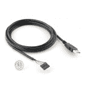](https://www.sparkfun.com/products/9718) 

将**添加到您的[购物车](https://www.sparkfun.com/cart)中！**

 **### [FTDI 电缆 5V](https://www.sparkfun.com/products/9718)

[In stock](https://learn.sparkfun.com/static/bubbles/ "in stock") DEV-09718

FTDI 电缆是一种 USB 到串行(TTL 级别)转换器，它允许以简单的方式将 TTL 接口设备连接到 USB…

$19.5031[Favorited Favorite](# "Add to favorites") 32[Wish List](# "Add to wish list")**** ****你还需要一根跳线来方便地连接和断开 GPIO0 与 GND 的连接。GPIO0 控制 ESP8266 的运行模式——如果芯片启动时为低电平(0V，GND ),它将启动其引导加载程序。如果 GPIO0 在启动时处于高位，它将开始运行它的应用程序代码。

| GPIO0 值 | ESP8266 模式 |
| 高(3.3V) | 运行程序 |
| 低电平(0V) | 引导装载程序 |

GPIO0 连接有一个上拉电阻，因此上传代码时只需将它拉至 GND，否则让它悬空。有多种方法可以实现这种连接，最简单的方法可能是在[母接头](https://www.sparkfun.com/products/115)之间运行[公对公跳线](https://www.sparkfun.com/products/8431)。

[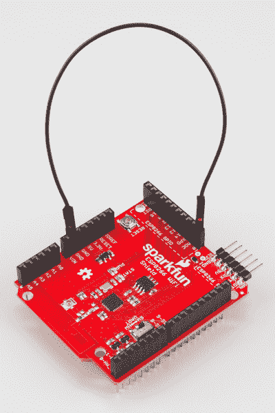](https://cdn.sparkfun.com/assets/learn_tutorials/4/0/3/program-jumper.jpg)

如果你要进行大量的代码上传，也许你需要在 GND 和浮动之间设置一个开关。

### 用 Arduino 板管理器安装插件

随着 Arduino 1.6.4 的发布，向 Arduino IDE 添加第三方电路板可以通过新的电路板管理器轻松实现。如果您运行的是旧版本的 Arduino (1.6.3 或更早版本)，我们建议您现在升级。和往常一样，你可以从 [arduino.cc](http://www.arduino.cc/en/Main/Software) 下载 Arduino 的最新版本。

这款面向 Arduino 的 ESP8266 插件基于 Ivan Grokhotkov 和 ESP8266 社区其他成员的出色工作。查看 [ESP8266 Arduino GitHub 库](https://github.com/esp8266/Arduino)了解更多信息。

首先，我们需要用一个定制的 URL 来更新 board manager。打开 Arduino，然后进入首选项(**文件** > **首选项**)。然后，将此 URL 复制到窗口底部的“附加 Board Manager URLs”文本框中:

```
https://raw.githubusercontent.com/sparkfun/Arduino_Boards/master/IDE_Board_Manager/package_sparkfun_index.json 
```

如果您已经有一个 URL，并且想要保留它，您可以通过在它们之间放置逗号来分隔多个 URL。

[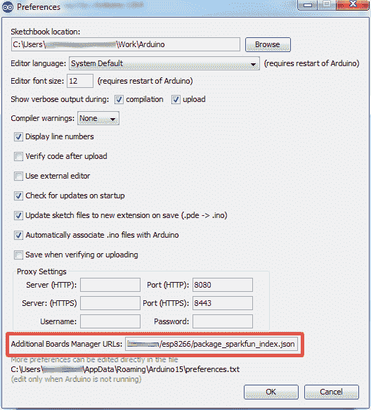](https://cdn.sparkfun.com/assets/learn_tutorials/3/6/5/arduino-preferences-board.png)

点击确定。然后转到**工具** > **电路板** > **电路板管理器**，导航到电路板管理器。除了标准的 Arduino 板之外，还应该有一些新的条目。寻找 **SparkFun ESP8266 开发板**。点击该条目，然后选择**安装**。

[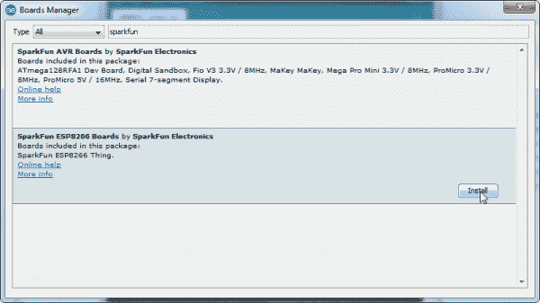](https://cdn.sparkfun.com/assets/learn_tutorials/3/6/5/board-manager-install.png)

ESP8266 的板定义和工具包括一套全新的 gcc、g++和其他相当大的编译二进制文件，因此下载和安装可能需要几分钟时间(存档文件大约为 110MB)。安装完成后，Arduino-blue“已安装”将出现在条目旁边。

### 选择 ESP8266 板

安装好插件板后，剩下要做的就是从**工具** > **插件板**菜单中选择合适的插件板。在该菜单下，找到“SparkFun ESP8266 Thing”并选择它。

[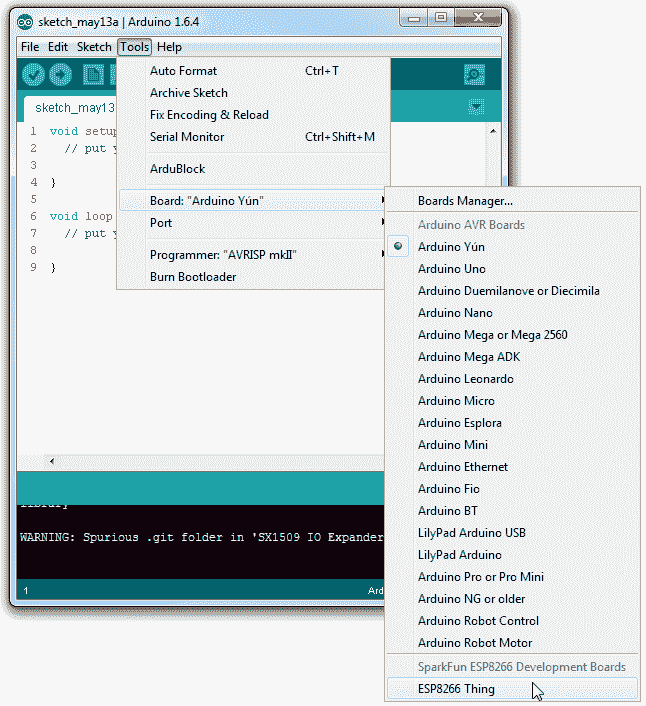](https://cdn.sparkfun.com/assets/learn_tutorials/3/6/5/board-selection.png)

然后在**工具** > **端口**菜单下选择你的 FTDI 的端口号。

### 上传和运行草图

现在您已经设置好了环境，是时候上传一些代码了。如果你用 FTDI Basic 上传代码，你也可以用那个板给 WiFi 盾供电。移除 Arduino 的保护罩，插入 FTDI 电缆，电源 LED 应该会亮起。

[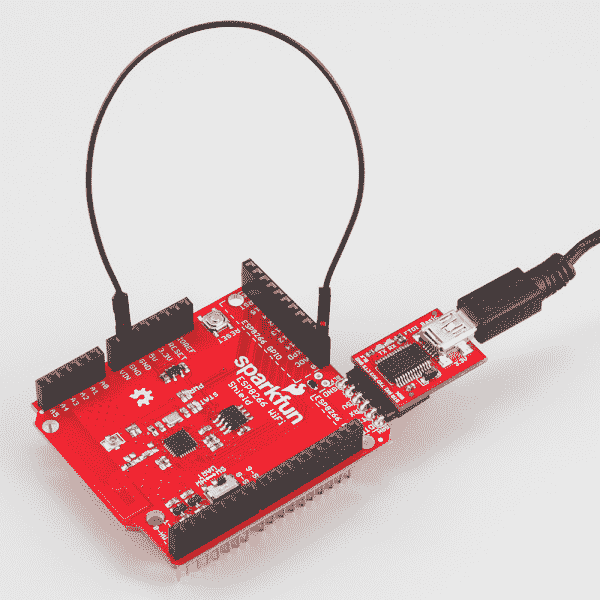](https://cdn.sparkfun.com/assets/learn_tutorials/4/0/3/program-ftdi.jpg)

加载一个简单的闪烁草图——将闪烁引脚设置为 5(附在盾牌的状态 LED 上)。

```
language:c
#define ESP8266_LED 5

void setup() 
{
  pinMode(ESP8266_LED, OUTPUT);
}

void loop() 
{
  digitalWrite(ESP8266_LED, HIGH);
  delay(500);
  digitalWrite(ESP8266_LED, LOW);
  delay(500);
} 
```

别忘了，当你上传草图到 ESP8266 时，要确保 GPIO0 连接到 GND。维奥拉。您正在成为一名 ESP8266 开发人员！有关 ESP8266 开发的更多指导，请查看我们的 [ESP8266 东西连接指南](https://learn.sparkfun.com/tutorials/esp8266-thing-hookup-guide)，特别是围绕[示例草图](https://learn.sparkfun.com/tutorials/esp8266-thing-hookup-guide/example-sketch-posting-to-phant)开始的部分。

## 资源和更进一步

ESP8266 WiFi Shield 是开源硬件，您可以在我们的 [ESP8266 WiFi Shield GitHub 资源库](https://github.com/sparkfun/ESP8266_WiFi_Shield)中找到我们所有的设计文档。除此之外，这些资源可能会派上用场:

*   [ESP8266 WiFi 屏蔽示意图](https://cdn.sparkfun.com/assets/learn_tutorials/4/0/3/SparkFun-ESP8266-WiFi-Shield.pdf)
*   [ESP8266 AT 命令集](https://cdn.sparkfun.com/assets/learn_tutorials/4/0/3/4A-ESP8266__AT_Instruction_Set__EN_v0.30.pdf)
*   [Arduino 图书馆的 spark fun ESP8266](https://github.com/sparkfun/SparkFun_ESP8266_AT_Arduino_Library)

### ESP8266 资源

一个令人敬畏的社区已经围绕着 ESP8266 成长起来。我们欠他们一个很大的时间，因为他们已经合作建立了惊人的 Arduino 插件。对于您所有的 ESP8266 需求，我们建议查看[esp8266.com 社区论坛](http://www.esp8266.com/)。除此之外，我们发现以下几个与 ESP8266 相关的资源非常有用:

*   [ESP8266 GitHub 用户回复](https://github.com/esp8266) -在这里可以找到大量令人难以置信的工具。来自 [Crosstool](https://github.com/esp8266/crosstool-NG) (自己编译 Xtensa GCC，G++等。)到 [ESP8266 Arduino GitHub 回购](https://github.com/esp8266/Arduino)
*   [ESP8266 社区 Wiki](http://www.esp8266.com/wiki/doku.php) -与社区论坛相关，在这个 Wiki 中有大量可用的信息。
*   [NodeMCU 固件](https://github.com/nodemcu/nodemcu-firmware)和 [NodeMCU 闪光器](https://github.com/nodemcu/nodemcu-flasher) - NodeMCU 是 ESP8266 的常用固件。它在 ESP8266 MCU 上实现了一个基于 LUA 的解释器。
*   Espressif 板论坛-ESP8266 的制造商 Espressif 有自己的论坛。有时，您可以在这里找到更新的软件开发工具包下载或其他有用的链接。
*   Espressif GitHub Repos-Espressif 在 GitHub 上也有些活跃。他们在这里托管了几个版本的 SDK。

ESP8266 这个东西是开源硬件！如果你需要，或者只是想看看，PCB 设计文件，你可以在我们的 [ESP8266 Thing GitHub 资源库](https://github.com/sparkfun/ESP8266_Thing)中找到。

### 更进一步

既然您已经启动并运行了您的 ESP8266，还需要一些项目灵感吗？也许这些相关的 SparkFun 教程会有助于激发一些想法:

[](https://learn.sparkfun.com/tutorials/weather-station-wirelessly-connected-to-wunderground) [### 无线连接到地下的气象站](https://learn.sparkfun.com/tutorials/weather-station-wirelessly-connected-to-wunderground) Build your own open-source, official Wunderground weather station that connects over WiFi via an Electric Imp.[Favorited Favorite](# "Add to favorites") 32[](https://learn.sparkfun.com/tutorials/are-you-okay-widget) [### 你还好吗？小部件](https://learn.sparkfun.com/tutorials/are-you-okay-widget) Use an Electric Imp and accelerometer to create an "Are You OK" widget. A cozy piece of technology your friend or loved one can nudge to let you know they're OK from half-a-world away.[Favorited Favorite](# "Add to favorites") 6

凭借其深度睡眠能力，这款设备是基于 WiFi 的气象站(T1)或友好、舒适的 T2 互动(T3)的良好基础。************