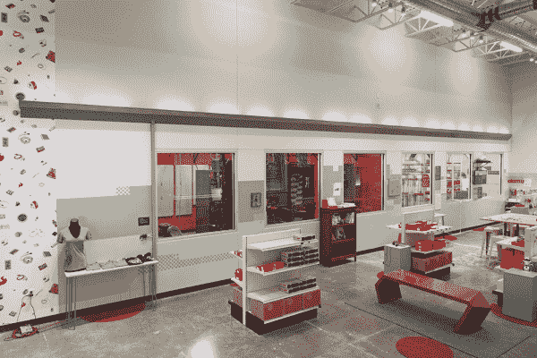

# 建造大型 LED 装置

> 原文：<https://learn.sparkfun.com/tutorials/building-large-led-installations>

## 介绍

在设计新的 [SparkFun 商场](http://blogs.denverpost.com/tech/2015/06/19/sparkfun-to-open-first-offline-store-host-driver-less-vehicle-race/17649/)的布局时，我有机会设计一个大型 LED 艺术装置。在之前，我曾帮助建造过 LED 装置[，但从未有机会从头开始设计。由此诞生了*糖果棒*，一个 46 英尺长的 led 棒，由 8 米长的可寻址 LED 条(总共 480 个 LED)组成，所有这些都通过连接到运行](https://www.sparkfun.com/news/1561) [FadeCandy 服务器](https://github.com/scanlime/fadecandy/tree/master/server)的树莓 Pi 的 [FadeCandy](https://www.sparkfun.com/products/12821) 来控制。

### 本教程涵盖的内容

控制 led 是嵌入式电子产品中最基本的任务之一，对于许多在新平台上起步的初学者来说，这通常是“Hello World”。然而，基于 LED 的项目增加很快，可能会变得非常复杂。本教程旨在为您提供指导，帮助您设计和建造自己的大型 LED 装置，同时分享从此次建造中学到的一些经验。

我们将讨论规划阶段，指出设计时需要考虑的事项。本节将介绍您计划如何控制 led，以及电源考虑事项。接下来，我们将介绍构建过程。本节将介绍如何为大型项目分阶段建造，以及如何在需要时使您的安装可运输。最后，我们将展示安装过程，并讨论使您的安装具有交互性的后续步骤。

### 使用的材料

这是这个项目中使用的所有 SparkFun 部件的列表。