# 光子电池屏蔽连接指南

> 原文：<https://learn.sparkfun.com/tutorials/photon-battery-shield-hookup-guide>

## 介绍

通过[光子电池保护罩](https://www.sparkfun.com/products/13626)给你的[光子](https://www.sparkfun.com/products/13774)供电，让它脱离 USB 电缆。电池护罩拥有光子运行、充电和监控脂肪电池所需的一切。

[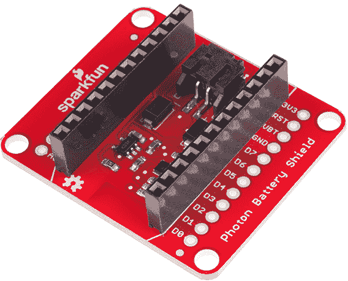](https://www.sparkfun.com/products/13626)

该盾牌具有两个独特的集成电路:一个 [MCP73831 充电控制器](https://www.sparkfun.com/products/12711)和一个 [MAX17043 脂肪燃料计](https://www.sparkfun.com/products/10617)。有了它们，你就可以通过 USB 给电池充电，并监控其电压和充电状态。

**Please Note:** All SparkFun shields for the Photon are also compatible with the [Core](https://store.particle.io/?product=spark-core) from Particle. The WKP, DAC and VBT pins on the Photon will be labeled A7, A6 and 3V3*, respectively, on the Core, but will not alter the functionality of any of the Shields.

### 本教程涵盖的内容

本连接指南的目的是让您熟悉光子电池屏蔽的硬件和软件。它分为以下几个部分:

*   [电池屏蔽概述](https://learn.sparkfun.com/tutorials/photon-battery-shield-hookup-guide#battery-shield-overview) -快速概述光子电池屏蔽的组件和特性。
*   [使用和充电一个脂肪电池](https://learn.sparkfun.com/tutorials/photon-battery-shield-hookup-guide#using-and-charging-a-lipo-battery) -一些运行的提示和技巧，以及用盾牌充电一个脂肪电池。
*   [使用 MAX17043 LiPo 燃料计](https://learn.sparkfun.com/tutorials/photon-battery-shield-hookup-guide#using-the-max17043-lipo-fuel-gauge) -示例代码-包括粒子库-演示如何读取电压和充电状态输出，以及 MAX17043 IC 的其他功能。

### 所需材料

光子电池保护罩为你的光子配备了使用脂肪电池所需的一切，甚至包括头部！当然你需要电池保护罩和一个光子。

[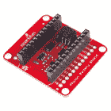](https://www.sparkfun.com/products/13626) 

将**添加到您的[购物车](https://www.sparkfun.com/cart)中！**

### [SparkFun 光子电池盾](https://www.sparkfun.com/products/13626)

[In stock](https://learn.sparkfun.com/static/bubbles/ "in stock") DEV-13626

SparkFun 光子电池保护罩为您提供了一种使用锂聚合物(LiPo)电池为光子模块供电的简单方法

$16.50 $9.907[Favorited Favorite](# "Add to favorites") 24[Wish List](# "Add to wish list")****[](https://www.sparkfun.com/products/13774) 

将**添加到您的[购物车](https://www.sparkfun.com/cart)中！**

### [【粒子光子】](https://www.sparkfun.com/products/13774)

[Out of stock](https://learn.sparkfun.com/static/bubbles/ "out of stock") WRL-13774

Particle 的 IoT(物联网)硬件开发板 Photon 提供了构建互联网络所需的一切…

$19.0032[Favorited Favorite](# "Add to favorites") 51[Wish List](# "Add to wish list")**** ****电池保护罩不包括的一件东西是电池。我们的兼容 LiPo 电池有多种形状和容量，电池越大，使用时间越长。以下任何一种都可以:

[](https://www.sparkfun.com/products/13856) 

将**添加到您的[购物车](https://www.sparkfun.com/cart)中！**

### [锂离子电池- 6Ah](https://www.sparkfun.com/products/13856)

[In stock](https://learn.sparkfun.com/static/bubbles/ "in stock") PRT-13856

如果你需要一些果汁，这 6Ah 锂离子电池是给你的。这些是基于锂离子化学电池的非常紧凑的电池…

$32.507[Favorited Favorite](# "Add to favorites") 40[Wish List](# "Add to wish list")****[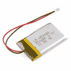](https://www.sparkfun.com/products/retired/341) 

### [锂离子电池- 850mAh](https://www.sparkfun.com/products/retired/341)

[Retired](https://learn.sparkfun.com/static/bubbles/ "Retired") PRT-00341

这些电池非常纤薄，重量极轻，基于新的聚合物锂离子化学。这是最高的烯…

11 **Retired**[Favorited Favorite](# "Add to favorites") 13[Wish List](# "Add to wish list")[](https://www.sparkfun.com/products/retired/8483) 

### [锂离子电池——2000 mah](https://www.sparkfun.com/products/retired/8483)

[Retired](https://learn.sparkfun.com/static/bubbles/ "Retired") PRT-08483

这些电池非常纤薄，重量极轻，基于新的聚合物锂离子化学。这是最高的烯…

26 **Retired**[Favorited Favorite](# "Add to favorites") 45[Wish List](# "Add to wish list")[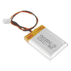](https://www.sparkfun.com/products/retired/10718) 

### [聚合物锂离子电池- 400mAh](https://www.sparkfun.com/products/retired/10718)

[Retired](https://learn.sparkfun.com/static/bubbles/ "Retired") PRT-10718

这是一种基于新型聚合物锂离子化学的非常小、非常轻的电池。这是最高的能量…

19 **Retired**[Favorited Favorite](# "Add to favorites") 18[Wish List](# "Add to wish list")** **如果你想使用自己的电池，只需确保它是一个**单电池**(标称 3.7V，最大 4.2V)锂聚合物(LiPo)或锂离子(Li+)。最理想的是，选择一个带有 [2 针 PH 系列 JST 连接器](https://www.sparkfun.com/products/9914)的终端，否则你可能需要做一些电线拼接。

如果你还没有(或者只是想备货)，你可能还需要一根 [Micro-B USB 线](https://www.sparkfun.com/products/10215)，当你需要给电池充电的时候就派上用场了。如果你不想把那根线插到电脑上，手边有一个 [USB 壁式充电器](https://www.sparkfun.com/products/12890)会很有用。

### 推荐阅读

使用光子电池护盾不需要太多已有的知识。如果你想了解更多关于本教程的基本概念，这里有一些我们推荐的指南:

*   [如何为一个项目供电](https://learn.sparkfun.com/tutorials/how-to-power-a-project)——希望你已经明白了这一点，因为你正在阅读电池屏蔽教程。本教程确实有一个关于[电池电量](https://learn.sparkfun.com/tutorials/how-to-power-a-project#remotemobile-power)的启发性章节。
*   [电池技术](https://learn.sparkfun.com/tutorials/battery-technologies)——具体来说，查看关于[锂聚合物电池](https://learn.sparkfun.com/tutorials/battery-technologies#lithium-polymer)的部分。
*   [锂聚合物电池是如何制造的](https://learn.sparkfun.com/tutorials/how-lithium-polymer-batteries-are-made) -了解你一直想知道的电池工厂幕后发生的一切。
*   [I ² C 通信](https://learn.sparkfun.com/tutorials/i2c) - I ² C 是一种流行的低层双线通信标准。这是我们用来与 MAX17043 燃油表 IC 通信的。

[](https://learn.sparkfun.com/tutorials/battery-technologies) [### 电池技术](https://learn.sparkfun.com/tutorials/battery-technologies) The basics behind the batteries used in portable electronic devices: LiPo, NiMH, coin cells, and alkaline.[Favorited Favorite](# "Add to favorites") 50[](https://learn.sparkfun.com/tutorials/how-to-power-a-project) [### 如何为项目提供动力](https://learn.sparkfun.com/tutorials/how-to-power-a-project) A tutorial to help figure out the power requirements of your project.[Favorited Favorite](# "Add to favorites") 67[](https://learn.sparkfun.com/tutorials/i2c) [### I2C](https://learn.sparkfun.com/tutorials/i2c) An introduction to I2C, one of the main embedded communications protocols in use today.[Favorited Favorite](# "Add to favorites") 128[](https://learn.sparkfun.com/tutorials/how-lithium-polymer-batteries-are-made) [### 锂聚合物电池是如何制造的](https://learn.sparkfun.com/tutorials/how-lithium-polymer-batteries-are-made) We got the opportunity to tour the Great Power Battery factory. Checkout how LiPos are made 7

## 电池保护罩概述

让我们快速概括一下光子电池护盾的硬件特性。以下是主板主要组件的一些亮点:

[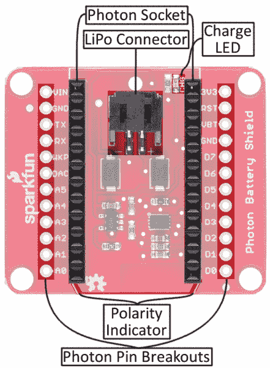](https://cdn.sparkfun.com/assets/learn_tutorials/3/9/2/top-annotated.jpg)

*   **LiPo 连接器(PH 系列 JST)** -电池放在这里。这个连接器是极化的，所以只能以正确的方式插入。
*   **光子插座** -每个光子都预焊有公接头，因此我们所有的屏蔽罩都在顶部预装了母接头。
*   **光子引脚突破** -需要更多访问光子的 I/O？这些引脚突破已涵盖这一点。这些爆发点在我们每个[光子护盾](https://www.sparkfun.com/categories/278)的同一个地方——如果你需要那样把它们连接在一起的话。
*   光子极性指示器 -如果你的光子没有正确插入，什么都不会工作。这些有角度的边缘应该与光子的 PCB 上的边缘相匹配。
*   **充电 LED 指示灯** -只要 LiPo 电池正在充电，这个红色 LED 就会亮起。

翻转护板会显示出一些不常用的功能:

[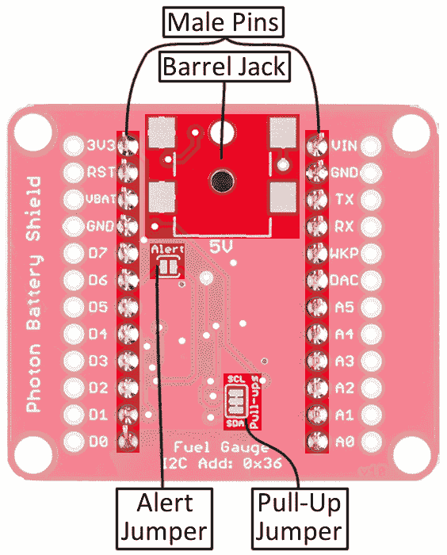](https://cdn.sparkfun.com/assets/learn_tutorials/3/9/2/bottom-annotated.jpg)

*   **“可堆叠的”公插脚** -无论你想把电池屏蔽插入更多的光子屏蔽，还是在试验板上使用它，这些公插脚应该可以完成工作。如果你不需要这个功能，可以用一些[平刃刀具](https://www.sparkfun.com/products/11952)快速将所有的大头针砍头。
*   **SMD 桶形插孔覆盖区** -该覆盖区允许您将一个 [SMD 桶形插孔](https://www.sparkfun.com/products/12748)添加到电池屏蔽的下侧。这将允许你用一个 [5V 墙壁适配器](https://www.sparkfun.com/products/12889)或者甚至一个[小太阳能电池板](https://www.sparkfun.com/products/7845)给电池充电。只要确保你的电源不高于 **5.5V** 即可。
*   **I ² C 上拉电阻启用/禁用**——光子电池屏蔽包括 SDA 和 SCL 线上的一对 10kΩ上拉电阻(D0 和 D1)。如果你有更多的 I ² C 设备要连接，你可能需要禁用它们。这些跳线默认是关闭的，但可以用一把[业余爱好刀](https://www.sparkfun.com/products/9200)的几片打开。
*   **警报中断跳线**-max 17043 具有可编程中断输出，每当电池电量低于设定的百分比时，它就会触发。通过在这两个焊盘之间添加一滴焊料，这个引脚可以连接到光子的 **D6 引脚**。请注意，这个跳线是默认打开的，因为其他屏蔽使用 D6。

## 使用 LiPo 电池并为其充电

在插入电池之前，抓住你的光子，并将其插入电池护罩。确保你**将光子的倾斜边缘**与盾上匹配的白色丝网对齐。光子的 USB 连接器应该与黑色 JST 连接器指向相同的方向。

接下来，拿起你的 LiPo 电池，将它的白色 JST 连接器与屏蔽上的黑色连接器配对。这些连接器是极化的，所以你只能以正确的方式插入。

[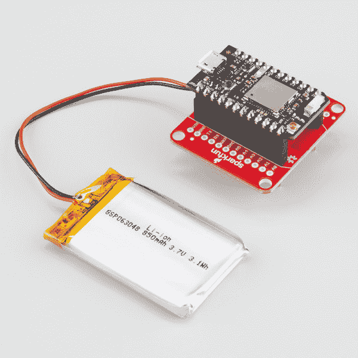](https://cdn.sparkfun.com/assets/learn_tutorials/3/9/2/battery-photon.jpg)*Running your Photon off a LiPo is as simple as plugging in a battery and the Photon.*

如果电池有任何电荷，你的光子应该打开，它的 RGB LED 应该开始变得丰富多彩。如果它已经被委托，你的光子应该连接到你的 WiFi 网络。你甚至可以加载[粒子构建 IDE](https://build.particle.io/build) ，真正开始空中加载代码。

### 通过 USB 给电池充电

最终你的脂肪能量会被耗尽，是时候给它充电了。为了避免任何额外的 USB 连接器，光子电池屏蔽被设计成使用**光子的 USB 连接器**作为电荷源。

在 LiPo 和 Photon 仍然连接到电池保护罩的情况下，只需将 Micro-B USB 电缆插入您的 Photon(USB 电缆的另一端可以插入计算机或 USB 墙壁适配器)。

[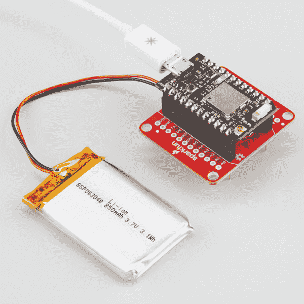](https://cdn.sparkfun.com/assets/learn_tutorials/3/9/2/battery-photon-usb.jpg)*To charge the LiPo, just plug a USB cable into the Photon's USB port.*

一旦连接了 USB，红色充电 LED 指示灯应该会亮起-它会一直亮着，直到电池充满电。

### (可选)通过桶形插孔给电池充电

电池屏蔽提供了额外的选择，为您的脂肪充电在一个无人居住的桶插孔足迹。如果你需要充电，这可能是你最好的选择。

为了增加这个功能，你将需要我们的[表面贴装桶形插孔](https://www.sparkfun.com/products/12748)，和一些[焊接工具](https://www.sparkfun.com/categories/49)。如果你是一个初学焊接的人，不要被“SMD”焊接吓到——这些接头非常简单。检查或[焊接教程](https://learn.sparkfun.com/tutorials/how-to-solder-through-hole-soldering)的一些指导。

桶形插孔的输入端应朝向电路板边缘。确保焊接所有四个焊盘:

[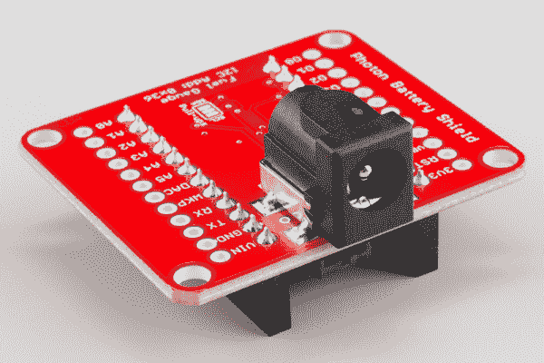](https://cdn.sparkfun.com/assets/learn_tutorials/3/9/2/battery-barrel-jack.jpg)

要通过这个插孔给 LiPo 充电，你需要一个 **5V 电源** -我们的 [5V 墙壁适配器](https://www.sparkfun.com/products/12889)应该可以做到这一点。或者，如果你真的想避免电线，你可以使用我们的[小型 0.45 瓦太阳能电池板](https://www.sparkfun.com/products/7845)，当天气晴朗时，它将提供高达 5V 的电源。

[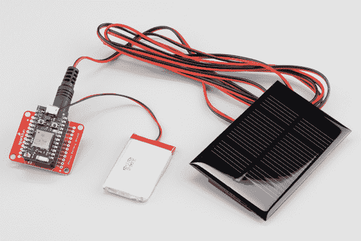](https://cdn.sparkfun.com/assets/learn_tutorials/3/9/2/battery-barrel-solar.jpg)

* * *

如果你不想焊接桶插孔，但仍然有一个 5V 的电源可用，你可以提供该电压的“VIN”和“GND”引脚屏蔽的头部。这是一种更高级的充电技术，仅推荐给更有经验的用户。

## 使用 MAX17043 LiPo 燃油表

光子电池屏蔽的最独特的功能之一是集成的 MAX17043 LiPo 燃料表。MAX17043 位于电池和光子之间，它使用校准的 ADC 来测量电池电压。将测得的电压与他们的“ModelGauge”算法进行比较，IC 可以产生一个充电状态(SOC)估计值，让您知道电池剩余电量的百分比。

### 正在加载 SparkFunMAX17043 库

MAX17043 通过 [I ² C](https://learn.sparkfun.com/tutorials/i2c) 进行通信，因此编写光子和燃料表之间的接口可能有点棘手。幸运的是，我们已经为你做了艰苦的工作！我们为 MAX17043 编写了一个粒子库。你可以通过进入“库”标签，并搜索 **SparkFunMAX17043** ，在粒子 IDE 中加载它。

[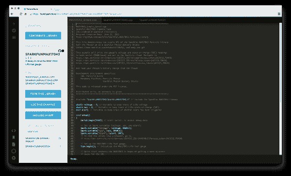](https://cdn.sparkfun.com/assets/learn_tutorials/3/9/2/particle-build-max17043-2.png)*Search the "Libraries" tab for "SparkFunMAX17043" to find the Fuel Gauge library.*

如果你正在使用桌面版本的 IDE，Particle Dev，并且仍然想使用这个库，你可以从我们的 [GitHub 库](https://github.com/sparkfun/SparkFun_MAX17043_Particle_Library)中获取最新版本。

### 运行 MAX17043_Simple 示例

找到这个库后，导航到“MAX17043_Simple.cpp”并单击**使用这个例子** -构建 IDE 将在您的“代码”选项卡中创建这个草图的克隆。

你不需要改变任何东西，只要确保你的光子在“设备”标签中被选中，然后点击“闪光”。

一旦你的光子运行代码，有两种方法来查看它的数据。一个是打开一个串行终端(如果你需要这方面的帮助，参见我们的[串行终端基础教程](https://learn.sparkfun.com/tutorials/terminal-basics))。找到你的光子的串口号(Windows 上的“COM #”/Mac 上的 dev/tty.usbmodemXXXX)，设置波特率为 9600。电池的电压，充电状态，和警报状态将流过。

[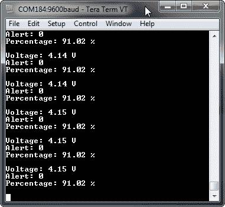](https://cdn.sparkfun.com/assets/learn_tutorials/3/9/2/serial-monitor.png)*Using [TeraTerm](https://learn.sparkfun.com/tutorials/terminal-basics/tera-term-windows) to view the Photon's Serial.print debug output.*

由于插入了 USB，随着电池充电，电压和百分比应该会稳步增加。

或者，如果你想监测电池*放电*，你可以使用光子的互联网连接来查看电池电压和充电状态。不过首先，你需要识别你的光子的**设备 ID** 以及你的账户的**访问令牌**。通过单击设备名称旁边的“>”，可以在粒子构建中找到设备 ID。

[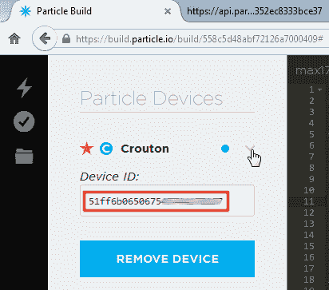](https://cdn.sparkfun.com/assets/learn_tutorials/3/9/2/particle-device-id.png)*Find your Device ID under the "Devices" tab, by clicking the carrot next to your Photon.*

您的访问令牌可以在“设置”选项卡下找到。

[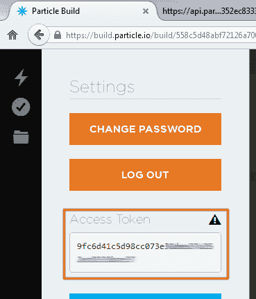](https://cdn.sparkfun.com/assets/learn_tutorials/3/9/2/particle-access-token-2.png)*Find your access token under the "Settings" tab.*

有了这些长的十六进制字符串，打开一个新的浏览器选项卡并导航到:

```
https://api.particle.io/v1/devices/DEVICE_ID/voltage?access_token=ACCESS_TOKEN 
```

确保代入`DEVICE_ID`和`ACCESS_TOKEN`的正确值。如果所有内容都输入正确，您应该会看到如下内容:

[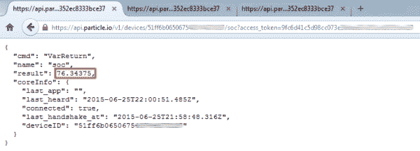](https://cdn.sparkfun.com/assets/learn_tutorials/3/9/2/spark-variable-screenshot.png)*The Spark variable responds with a JSON string including a "result" key and value.*

JSON 响应中的数据包括一个“result”键，它显示当前的电压读数。您还可以通过导航到以下位置来查看充电状态和警报状态:

```
https://api.particle.io/v1/devices/DEVICE_ID/soc?access_token=ACCESS_TOKEN 
```

和

```
https://api.particle.io/v1/devices/DEVICE_ID/alert?access_token=ACCESS_TOKEN 
```

耶[火花变量](http://docs.particle.io/photon/firmware/#spark-variable)！

### 使用 SparkFunMAX17043 库

SparkFunMAX17043 库很简单。需要进行一些初始化。确保包含库，并在您的`setup()`中调用`lipo.begin()`。

```
language:c
#include "SparkFunMAX17043/SparkFunMAX17043.h" // Include the SparkFun MAX17043 library

void setup()
{
    // Set up the MAX17043 LiPo fuel gauge:
    lipo.begin(); // Initialize the MAX17043 LiPo fuel gauge

    // Quick start restarts the MAX17043 in hopes of getting a more accurate
    // guess for the SOC.
    lipo.quickStart();
} 
```

调用`lipo.quickStart()`将重新校准 MAX17043 的 ADC，通常会得到更准确的读数。

如果您正在使用 Particle Build 中的库，请确保在“库”选项卡中转到 SPARKFUNMAX17043 库，选择**包含在应用程序**中，并将其添加到您想要的代码文件中。

[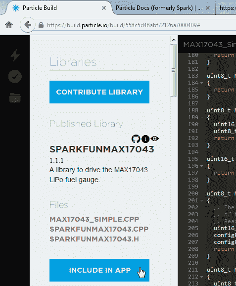](https://cdn.sparkfun.com/assets/learn_tutorials/3/9/2/particle-include-in-app.png)*Any sketch using the SparkFunMAX17043 library needs to have it "included" first.*

#### 读取电压和 SoC

两个函数用于读取 MAX17043 的电压和充电状态值:

```
language:c
// lipo.getVoltage() returns a voltage value (e.g. 3.93)
voltage = lipo.getVoltage();
// lipo.getSOC() returns the estimated state of charge (e.g. 79%)
soc = lipo.getSOC(); 
```

两个函数都返回一个`float`变量。`lipo.getVoltage()`通常应该在 0.0 到 4.2 左右。`lipo.getSOC()`应该在 0.0 到 100.0 之间。

#### 使用报警中断

MAX17043 的出色特性之一是可编程报警中断。你可以让它在充电状态低于某个阈值时触发一个标志。

要设置警报，请使用`lipo.setThreshold([percentage])`。例如:

```
language:c
lipo.setThreshold(15); // Set Alert threshold to 15% 
```

...会将警报阈值设置为 15%。

警报状态可以在软件和硬件中读取。要获得软件中的报警状态，调用`lipo.getAlert()`。如果警报未被触发，该函数将返回`0`，如果被触发，则返回`1`。

如“电池屏蔽概述”部分所述，电路板底部的跳线可以闭合，将 MAX17043 的 alert 引脚连接到光子引脚 D6。此警报为**低电平有效** -意味着当它未被触发时为高电平，当 SoC 降至阈值以下时为低电平。

一旦警报被触发，您需要在它再次触发之前清除它。这就是`lipo.clearAlert()`会为你做的。即使 SoC 上升到阈值以上，您仍然需要手动清除警报。

## 资源和更进一步

如果您需要任何详细介绍光子电池屏蔽的资源，这里有一些原理图、数据表和其他链接，您可能会觉得很方便:

*   [光子电池屏蔽 GitHub Repo](https://github.com/sparkfun/Photon_Battery_Shield)
*   [光子电池屏蔽示意图](https://cdn.sparkfun.com/assets/learn_tutorials/3/9/2/Photon_Battery_Shield.pdf)
*   粒子文档页面 -到这里来设置和配置你的光子(或其他粒子设备)
*   粒子社区论坛(Particle Community Forum)-任何你在文档中找不到的东西都可以在社区论坛中找到。如果你有困难，首先搜索这个论坛，因为许多答案已经在那里了。
*   [MAX17043 LiPo 燃油表数据表](http://cdn.sparkfun.com/datasheets/Prototyping/MAX17043-MAX17044.pdf)
*   [MCP73831 充电控制器数据表](http://cdn.sparkfun.com/datasheets/Components/General%20IC/33244_SPCN.pdf)

如果你有兴趣让你的光子进入睡眠模式以节省更多的电池电量，请查看下面的粒子文档链接:

*   [光子系统模式](http://docs.particle.io/photon/firmware/#system-system-modes) -玩不同的模式可以让你控制光子何时连接或不连接网络。
*   [光子系统睡眠功能](http://docs.particle.io/photon/firmware/#system-system-sleep) -睡眠功能使光子进入睡眠状态，而它不执行任何动作来保存能量。

现在你已经熟悉了光子电池屏蔽，你打算用它做什么项目？需要一些灵感吗？查看以下 SparkFun 教程，了解一些想法:

[](https://learn.sparkfun.com/tutorials/hid-control-of-a-web-page) [### 网页的隐藏控件](https://learn.sparkfun.com/tutorials/hid-control-of-a-web-page) Learn how to move a slider on a webpage and make a motor spin. We connect HTML and HID to read sensors and interface with the physical world.[Favorited Favorite](# "Add to favorites") 14[](https://learn.sparkfun.com/tutorials/are-you-okay-widget) [### 你还好吗？小部件](https://learn.sparkfun.com/tutorials/are-you-okay-widget) Use an Electric Imp and accelerometer to create an "Are You OK" widget. A cozy piece of technology your friend or loved one can nudge to let you know they're OK from half-a-world away.[Favorited Favorite](# "Add to favorites") 6[](https://learn.sparkfun.com/tutorials/esp8266-thing-hookup-guide) [### ESP8266 事物连接指南](https://learn.sparkfun.com/tutorials/esp8266-thing-hookup-guide) An overview of SparkFun's ESP8266 Thing - a development board for the Internet of...Things. This tutorial explains the circuitry driving the board, and how to get it up and running in an Arduino environment.[Favorited Favorite](# "Add to favorites") 34

电池护盾与我们其他的[光子护盾](https://www.sparkfun.com/categories/278)配合得非常好；查看我们的屏蔽连接指南:

[](https://learn.sparkfun.com/tutorials/photon-oled-shield-hookup-guide) [### 光子有机发光二极管屏蔽连接指南](https://learn.sparkfun.com/tutorials/photon-oled-shield-hookup-guide) The Photon OLED Shield has everything you need to add a small yet crisp OLED screen to your Photon projects. This hookup guide will show you how to get started.[Favorited Favorite](# "Add to favorites") 10[](https://learn.sparkfun.com/tutorials/photon-imu-shield-hookup-guide) [### 光子 IMU 屏蔽连接指南](https://learn.sparkfun.com/tutorials/photon-imu-shield-hookup-guide) Learn how to use the SparkFun Photon IMU Shield for your Photon device which houses an on-board LSM9DS1 system-in-a-chip that houses a 3-axis accelerometer, 3-axis gyroscope, and 3-axis magnetometer.[Favorited Favorite](# "Add to favorites") 5******