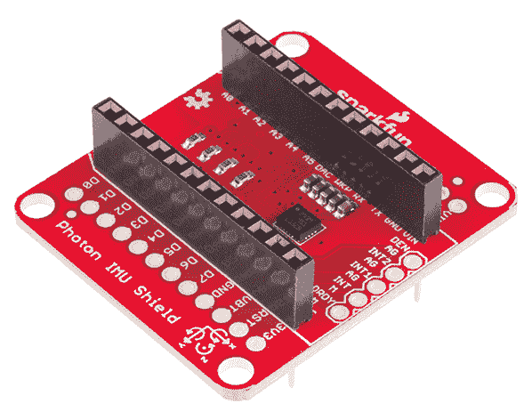
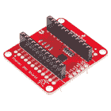
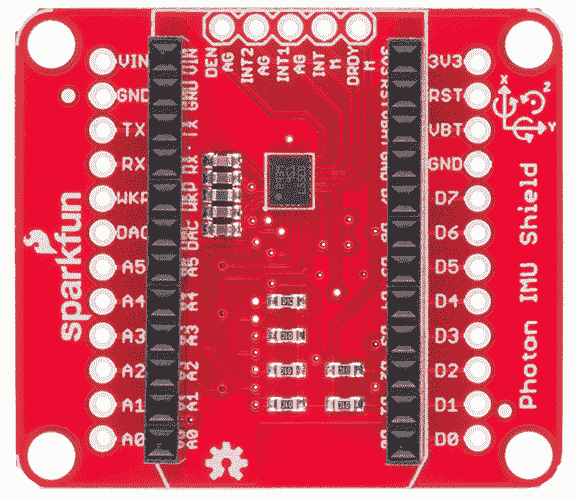
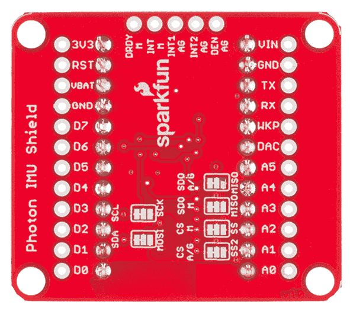

# 光子 IMU 屏蔽连接指南

> 原文：<https://learn.sparkfun.com/tutorials/photon-imu-shield-hookup-guide>

## 介绍

你的[光子](https://www.sparkfun.com/products/13774)项目需要加速度计吗？陀螺仪或磁力计呢？有了 [SparkFun 光子 IMU 盾](https://www.sparkfun.com/products/13629?_ga=1.205770074.890988720.1429644996)，你就可以得到*全部三个*，这要归功于 LSM9DS1 IC 模块。

[](https://cdn.sparkfun.com/assets/learn_tutorials/3/9/9/Screen_Shot_2015-06-30_at_3.54.19_PM.png)

SparkFun Photon IMU(惯性测量单元)Shield 是一款多功能运动检测附加板，适用于光子设备，内置 3 轴加速度计、3 轴陀螺仪和 3 轴磁力计。没错，来自单个 IC 的 9 个自由度(9DOF)！

LSM9DS1 中的每个传感器支持各种范围:加速度计的量程可以设置为 2、4、6、8 或 16 g，陀螺仪支持 245、500 和 2000 /s，磁力计的满量程范围为 2、4、8 或 12 高斯。作为奖励，SparkFun Photon IMU Shield 附带已经焊接的接头，因此您可以插入您的 Photon(或 Core)并开始使用！

**Please Note:** All SparkFun shields for the Photon are also compatible with the [Core](https://store.particle.io/?product=spark-core) from Particle. The WKP, DAC and VBT pins on the Photon will be labeled A7, A6 and 3V3*, respectively, on the Core, but will not alter the functionality of any of the Shields.

### 本教程涵盖的内容

本教程将介绍 IMU shield 的功能，如何将其连接到您的项目中，以及如何使用在线粒子构建环境中的 SparkFun LSM9DS1 库进行编程。

### 所需材料

要开始使用光子 IMU 盾，你需要一个光子，一个微型 USB 电缆，当然还有盾本身。你还需要在 [particle.io](http://particle.io) 上注册一个账户，并注册你的光子。关于如何做到这一点的说明可以在 [docs.particle.io](http://docs.particle.io/photon/) 找到。

[](https://www.sparkfun.com/products/13629) 

将**添加到您的[购物车](https://www.sparkfun.com/cart)中！**

 **### [SparkFun 光子 IMU 盾](https://www.sparkfun.com/products/13629)

[Only 3 left!](https://learn.sparkfun.com/static/bubbles/ "only 3 left!") DEV-13629

这是 SparkFun Photon IMU Shield，一款适用于光子设备的多功能运动感应附加板。每个 IMU 屏蔽都是等效的…

$20.95 $10.482[Favorited Favorite](# "Add to favorites") 6[Wish List](# "Add to wish list")****[](https://www.sparkfun.com/products/13774) 

将**添加到您的[购物车](https://www.sparkfun.com/cart)中！**

 **### [【粒子光子】](https://www.sparkfun.com/products/13774)

[Out of stock](https://learn.sparkfun.com/static/bubbles/ "out of stock") WRL-13774

Particle 的 IoT(物联网)硬件开发板 Photon 提供了构建互联网络所需的一切…

$19.0032[Favorited Favorite](# "Add to favorites") 51[Wish List](# "Add to wish list")**** ****### 推荐阅读

如果你打算充分利用你的 IMU 护盾，这里有一些你可能想温习或深入了解的事情。

*   [加速度计基础知识](https://learn.sparkfun.com/tutorials/accelerometer-basics) -知道你在测量什么，什么是可能的，什么是不可能的，这总是一个好主意。
*   [陀螺仪！](https://learn.sparkfun.com/tutorials/gyroscope) -了解陀螺仪的工作原理...呃，旋转。
*   [磁力仪](http://en.wikipedia.org/wiki/Magnetometer) -磁力仪...它们是如何工作的！？
*   I ² C - I ² C 是控制 IMU 的首选方法。它使用的导线更少，但速度比 SPI 慢很多。
*   [串行外设接口(SPI)](https://learn.sparkfun.com/tutorials/serial-peripheral-interface-spi) - SPI 是与 IMU 通信的另一种方法。如果您想在 SPI 模式下使用该板，请参考跳线部分。

## IMU 屏蔽概述

### 引脚描述

因为 shield 为您做了所有的工作，所以实际上没有必要连接这些连接——但是如果您正在查看数据表或代码示例，该表将为您提供 shield 正在做什么的线索。一如既往，您可以查看原理图了解更多信息。

[](https://cdn.sparkfun.com/assets/learn_tutorials/3/9/9/Screen_Shot_2015-06-30_at_3.55.41_PM.png)

| IMU 屏蔽引脚 | 光子针 | 功能 |
| GND | GND | 地面 |
| VDD | 3.3V | 稳压 3.3V 输入 |
| SCL | D1 | SCL 串行时钟 |
| 国家药品监督管理局 | D0 | 串行数据输入 |

我们还在电路板的顶部开出了几个图钉，你们中的一些人可能会想要使用。在上图中，从左到右依次是:

| IMU 屏蔽引脚 | 功能 |
| 那一天 | 数据使能加速度/陀螺仪 |
| INT2 AG | 可编程中断加速度/陀螺仪 |
| INT1 AG | 可编程中断加速度/陀螺仪 |
| INT M | 可编程中断磁力仪 |
| drdy m 型 | 磁性传感器数据就绪 |

### 设置跳线

把板子翻过来，你会发现有六个跳线。这些跳线的大部分用于在 SPI 和 I ² C 模式之间**切换。当电路板发货时，这些跳线被设置为将 IMU 配置为 **I ² C 模式**。**

[](https://cdn.sparkfun.com/assets/learn_tutorials/3/9/9/Screen_Shot_2015-06-30_at_3.54.48_PM.png)

SDO M-MISO 和 SDO A/G-MISO 跳线可用于设置 I ² C 地址(在 I ² C 模式下),或者如果断开，可用于设置 I ² C 地址或用于 SPI 控制。默认情况下，对于 I ² C 模式，两个跳线都被拉高。

I²C Address Table

| SDOM /AG | AG 地址 | m 地址。 |
| Zero | 0x6A | 0x1C |
| one | 0x6B | 0x1E |

CS A/G-SS2 和 CS M-SS 分别是加速度计/陀螺仪和磁力计的片选跳线。它们的主板都被拉高，以启用 I ² C 模式。关闭跳线并切断之前的走线，以使能 SPI 模式。

同样的故事也适用于 SDA-MOSI 和 SCL-SCK 跳线。它们被拉高以启用 I ² C 通信。关闭另一个方向的跳线，切断之前的走线，以使能 SPI 模式。

## 使用 LSM9DS1 库

现在我们了解了 IMU 硬件，让我们在这个东西上放一些代码，看看它能做什么。使用我们编写的粒子库，您将能够轻松捕捉加速度、角度旋转和磁场强度！

### 获取粒子 LSM9DS1 库

在这一页，我们将使用[在线粒子环境](https://build.particle.io)。如果你使用的是粒子开发环境，你可以从 [GitHub 库](https://github.com/sparkfun/SparkFun_LSM9DS1_Particle_Library)获得库和代码示例。

[Download the Particle IMU Library](https://github.com/sparkfun/SparkFun_LSM9DS1_Particle_Library/archive/master.zip)

### 加载演示示例

如果你还没有创建一个粒子用户帐户，并要求你的董事会，你现在需要这样做。如果你有困难，从这里开始是个好主意。

一旦你登录到 build.particle.io 并选择了一个设备(所有这些都包含在上面的链接中)，你会想要点击侧边栏中的`create new app`按钮——它是蓝色的大按钮，你不会错过的。把你的应用叫做‘IMU _ test’之类的东西。

接下来——这是重要的部分——我们包括了`LSM9DS1`库。为此:

*   点击看起来像书签的图标(它在黑色窄边栏的最左边，从底部数第四个)
*   在“社区图书馆”下的文本框中，搜索“SparkFunLSM”，您会看到“SparkFunLSM9DS1”出现(虽然它可能会被剪掉一点，但不要担心)。

它应该是这样的:

[](https://cdn.sparkfun.com/assets/learn_tutorials/3/9/9/Screen_Shot_2015-06-30_at_4.03.06_PM.png)

*   点击库名，会弹出一堆东西，包括所有的库文件以及一些如何处理库的选项。
*   在这种情况下，我们只想在我们的应用程序中使用该库，因此单击“包含在应用程序中”按钮。
*   这将引导你列出你所有的应用程序——点击你刚刚创建的应用程序的名称，你应该在你的应用程序顶部看到类似`#include "SparkFunLSM9DS1/SparkFunLSM9DS1.h"`的声明。

现在我们已经在应用中包含了这个库，让我们给它一些代码——只需复制下面的演示代码并**粘贴到你的应用中，在 include 语句**下面。注意:这个例子使用 I ² C -检查“LSM9DS1_BASIC_SPI。CPP”文件中的粒子库和 SPI 示例。

```
language:cpp
/*****************************************************************
LSM9DS1_Basic_I2C.ino
SFE_LSM9DS1 Library Simple Example Code - I2C Interface
Jim Lindblom @ SparkFun Electronics
Original Creation Date: April 30, 2015
https://github.com/sparkfun/SparkFun_LSM9DS1_Particle_Library

The LSM9DS1 is a versatile 9DOF sensor. It has a built-in
accelerometer, gyroscope, and magnetometer. Very cool! Plus it
functions over either SPI or I2C.

This Photon sketch is a demo of the simple side of the
SFE_LSM9DS1 library. It'll demo the following:
* How to create a LSM9DS1 object, using a constructor (global
  variables section).
* How to use the begin() function of the LSM9DS1 class.
* How to read the gyroscope, accelerometer, and magnetometer
  using the readGryo(), readAccel(), readMag() functions and 
  the gx, gy, gz, ax, ay, az, mx, my, and mz variables.
* How to calculate actual acceleration, rotation speed, 
  magnetic field strength using the calcAccel(), calcGyro() 
  and calcMag() functions.
* How to use the data from the LSM9DS1 to calculate 
  orientation and heading.

Hardware setup: This library supports communicating with the
LSM9DS1 over either I2C or SPI. This example demonstrates how
to use I2C. 

If you have the Photon IMU shield, no extra wiring is required.
If you're using a breakout, the pin-out is as follows:
    LSM9DS1 --------- Photon
     SCL -------------- D1 (SCL)
     SDA -------------- D0 (SDA)
     VDD ------------- 3.3V
     GND ------------- GND
(CSG, CSXM, SDOG, and SDOXM should all be pulled high. 
Jumpers on the breakout board will do this for you.)

Development environment specifics:
    IDE: Particle Build
    Hardware Platform: Particle Photon
                       SparkFun Photon IMU Shield

This code is released under the MIT license.

Distributed as-is; no warranty is given.
*****************************************************************/
#include "SparkFunLSM9DS1/SparkFunLSM9DS1.h"
#include "math.h"

//////////////////////////
// LSM9DS1 Library Init //
//////////////////////////
// Use the LSM9DS1 class to create an object. [imu] can be
// named anything, we'll refer to that throught the sketch.
LSM9DS1 imu;

///////////////////////
// Example I2C Setup //
///////////////////////
// SDO_XM and SDO_G are both pulled high, so our addresses are:
#define LSM9DS1_M   0x1E // Would be 0x1C if SDO_M is LOW
#define LSM9DS1_AG  0x6B // Would be 0x6A if SDO_AG is LOW

////////////////////////////
// Sketch Output Settings //
////////////////////////////
#define PRINT_CALCULATED
//#define PRINT_RAW
#define PRINT_SPEED 250 // 250 ms between prints

// Earth's magnetic field varies by location. Add or subtract 
// a declination to get a more accurate heading. Calculate 
// your's here:
// http://www.ngdc.noaa.gov/geomag-web/#declination
#define DECLINATION -8.58 // Declination (degrees) in Boulder, CO.

void setup() 
{

  Serial.begin(115200);

  // Before initializing the IMU, there are a few settings
  // we may need to adjust. Use the settings struct to set
  // the device's communication mode and addresses:
  imu.settings.device.commInterface = IMU_MODE_I2C;
  imu.settings.device.mAddress = LSM9DS1_M;
  imu.settings.device.agAddress = LSM9DS1_AG;
  // The above lines will only take effect AFTER calling
  // imu.begin(), which verifies communication with the IMU
  // and turns it on.
  if (!imu.begin())
  {
    Serial.println("Failed to communicate with LSM9DS1.");
    Serial.println("Double-check wiring.");
    Serial.println("Default settings in this sketch will " \
                  "work for an out of the box LSM9DS1 " \
                  "Breakout, but may need to be modified " \
                  "if the board jumpers are.");
    while (1)
      ;
  }
}

void loop()
{
  printGyro();  // Print "G: gx, gy, gz"
  printAccel(); // Print "A: ax, ay, az"
  printMag();   // Print "M: mx, my, mz"

  // Print the heading and orientation for fun!
  // Call print attitude. The LSM9DS1's magnetometer x and y
  // axes are opposite to the accelerometer, so my and mx are
  // substituted for each other.
  printAttitude(imu.ax, imu.ay, imu.az, -imu.my, -imu.mx, imu.mz);
  Serial.println();

  delay(PRINT_SPEED);
}

void printGyro()
{
  // To read from the gyroscope, you must first call the
  // readGyro() function. When this exits, it'll update the
  // gx, gy, and gz variables with the most current data.
  imu.readGyro();

  // Now we can use the gx, gy, and gz variables as we please.
  // Either print them as raw ADC values, or calculated in DPS.
  Serial.print("G: ");
#ifdef PRINT_CALCULATED
  // If you want to print calculated values, you can use the
  // calcGyro helper function to convert a raw ADC value to
  // DPS. Give the function the value that you want to convert.
  Serial.print(imu.calcGyro(imu.gx), 2);
  Serial.print(", ");
  Serial.print(imu.calcGyro(imu.gy), 2);
  Serial.print(", ");
  Serial.print(imu.calcGyro(imu.gz), 2);
  Serial.println(" deg/s");
#elif defined PRINT_RAW
  Serial.print(imu.gx);
  Serial.print(", ");
  Serial.print(imu.gy);
  Serial.print(", ");
  Serial.println(imu.gz);
#endif
}

void printAccel()
{
  // To read from the accelerometer, you must first call the
  // readAccel() function. When this exits, it'll update the
  // ax, ay, and az variables with the most current data.
  imu.readAccel();

  // Now we can use the ax, ay, and az variables as we please.
  // Either print them as raw ADC values, or calculated in g's.
  Serial.print("A: ");
#ifdef PRINT_CALCULATED
  // If you want to print calculated values, you can use the
  // calcAccel helper function to convert a raw ADC value to
  // g's. Give the function the value that you want to convert.
  Serial.print(imu.calcAccel(imu.ax), 2);
  Serial.print(", ");
  Serial.print(imu.calcAccel(imu.ay), 2);
  Serial.print(", ");
  Serial.print(imu.calcAccel(imu.az), 2);
  Serial.println(" g");
#elif defined PRINT_RAW 
  Serial.print(imu.ax);
  Serial.print(", ");
  Serial.print(imu.ay);
  Serial.print(", ");
  Serial.println(imu.az);
#endif

}

void printMag()
{
  // To read from the magnetometer, you must first call the
  // readMag() function. When this exits, it'll update the
  // mx, my, and mz variables with the most current data.
  imu.readMag();

  // Now we can use the mx, my, and mz variables as we please.
  // Either print them as raw ADC values, or calculated in Gauss.
  Serial.print("M: ");
#ifdef PRINT_CALCULATED
  // If you want to print calculated values, you can use the
  // calcMag helper function to convert a raw ADC value to
  // Gauss. Give the function the value that you want to convert.
  Serial.print(imu.calcMag(imu.mx), 2);
  Serial.print(", ");
  Serial.print(imu.calcMag(imu.my), 2);
  Serial.print(", ");
  Serial.print(imu.calcMag(imu.mz), 2);
  Serial.println(" gauss");
#elif defined PRINT_RAW
  Serial.print(imu.mx);
  Serial.print(", ");
  Serial.print(imu.my);
  Serial.print(", ");
  Serial.println(imu.mz);
#endif
}

// Calculate pitch, roll, and heading.
// Pitch/roll calculations take from this app note:
// http://cache.freescale.com/files/sensors/doc/app_note/AN3461.pdf?fpsp=1
// Heading calculations taken from this app note:
// http://www51.honeywell.com/aero/common/documents/myaerospacecatalog-documents/Defense_Brochures-documents/Magnetic__Literature_Application_notes-documents/AN203_Compass_Heading_Using_Magnetometers.pdf
void printAttitude(
float ax, float ay, float az, float mx, float my, float mz)
{
  float roll = atan2(ay, az);
  float pitch = atan2(-ax, sqrt(ay * ay + az * az));

  float heading;
  if (my == 0)
    heading = (mx < 0) ? 180.0 : 0;
  else
    heading = atan2(mx, my);

  heading -= DECLINATION * M_PI / 180;

  if (heading > M_PI) heading -= (2 * M_PI);
  else if (heading < -M_PI) heading += (2 * M_PI);
  else if (heading < 0) heading += 2 * M_PI;

  // Convert everything from radians to degrees:
  heading *= 180.0 / M_PI;
  pitch *= 180.0 / M_PI;
  roll  *= 180.0 / M_PI;

  Serial.print("Pitch, Roll: ");
  Serial.print(pitch, 2);
  Serial.print(", ");
  Serial.println(roll, 2);
  Serial.print("Heading: "); Serial.println(heading, 2);
} 
```

现在点击“闪光”按钮(看起来像闪电的那个)，等待魔法开始！

## 资源和更进一步

这里有几个链接，应该有助于任何进一步的问题，你可能有关于光子 IMU 盾:

*   [Photon IMU Shield Github](https://github.com/sparkfun/Photon_IMU_Shield) -用于原理图和电路板设计文件
*   SparkFun LSM9DS1 粒子库 -这是固件库和示例代码的位置
*   粒子文档页面 -到这里来设置和配置你的光子(或其他粒子设备)
*   粒子社区论坛(Particle Community Forum)-任何你在文档中找不到的东西都可以在社区论坛中找到。如果你有困难，首先搜索这个论坛，因为许多答案已经在那里了。

### 更进一步

现在你已经熟悉了光子 IMU 盾和它的粒子库，你打算用它做什么呢？需要一些灵感吗？查看这些相关教程:

[](https://learn.sparkfun.com/tutorials/hackers-in-residence---sound-and-motion-reactivity-for-wearables) [### 住宅黑客——可穿戴设备的声音和运动反应](https://learn.sparkfun.com/tutorials/hackers-in-residence---sound-and-motion-reactivity-for-wearables) How to consciously wear light-up and and sound reactive clothing.[Favorited Favorite](# "Add to favorites") 15[](https://learn.sparkfun.com/tutorials/gyroscope) [### 陀螺仪](https://learn.sparkfun.com/tutorials/gyroscope) Gyroscopes measure the speed of rotation around an axis and are an essential part in determines ones orientation in space.[Favorited Favorite](# "Add to favorites") 22[](https://learn.sparkfun.com/tutorials/lsm9ds0-hookup-guide) [### LSM9DS0 连接指南](https://learn.sparkfun.com/tutorials/lsm9ds0-hookup-guide) How to assemble, connect to, and use the LSM9DS0 -- an accelerometer, gyroscope, and magnetometer all-in-one.[Favorited Favorite](# "Add to favorites") 6[](https://learn.sparkfun.com/tutorials/esp8266-thing-hookup-guide) [### ESP8266 事物连接指南](https://learn.sparkfun.com/tutorials/esp8266-thing-hookup-guide) An overview of SparkFun's ESP8266 Thing - a development board for the Internet of...Things. This tutorial explains the circuitry driving the board, and how to get it up and running in an Arduino environment.[Favorited Favorite](# "Add to favorites") 34

IMU 护盾与我们的其他[光子护盾](https://www.sparkfun.com/categories/278)配合得非常好；查看我们的屏蔽连接指南:

[](https://learn.sparkfun.com/tutorials/photon-battery-shield-hookup-guide) [### 光子电池屏蔽连接指南](https://learn.sparkfun.com/tutorials/photon-battery-shield-hookup-guide) The Photon Battery Shield has everything your Photon needs to run off, charge, and monitor a LiPo battery. Read through this hookup guide to get started using it.[Favorited Favorite](# "Add to favorites") 11[](https://learn.sparkfun.com/tutorials/photon-oled-shield-hookup-guide) [### 光子有机发光二极管屏蔽连接指南](https://learn.sparkfun.com/tutorials/photon-oled-shield-hookup-guide) The Photon OLED Shield has everything you need to add a small yet crisp OLED screen to your Photon projects. This hookup guide will show you how to get started.[Favorited Favorite](# "Add to favorites") 10

或者看看这篇博客:

[](https://www.sparkfun.com/news/2814 "November 5, 2018: A little shaky on IMU selection? This might smooth it out for you.") [### 据皮特称:IMU 101

November 5, 2018](https://www.sparkfun.com/news/2814 "November 5, 2018: A little shaky on IMU selection? This might smooth it out for you.")[Favorited Favorite](# "Add to favorites") 1****