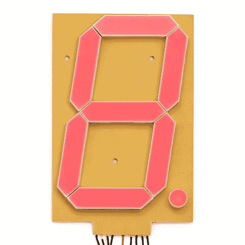
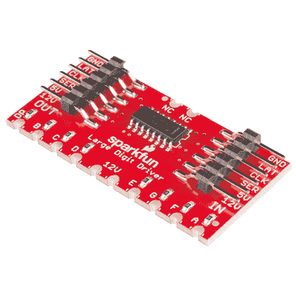
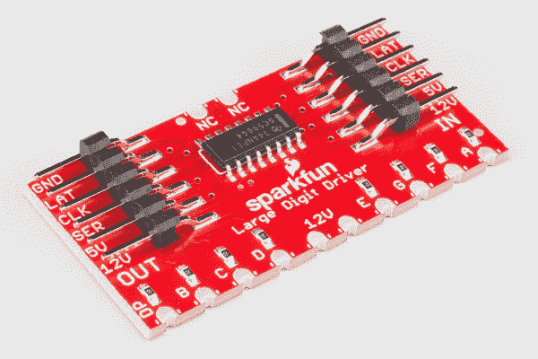
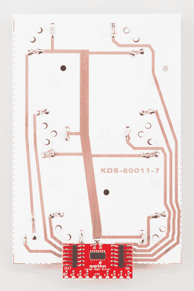
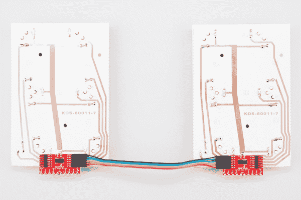

# 大数字驱动器连接指南

> 原文：<https://learn.sparkfun.com/tutorials/large-digit-driver-hookup-guide>

## 介绍

大型数字显示器是一个伟大的除了任何项目，你想能够看到远处的信息。记分员和圈计时器将是一个巨大的 7 段 LED 显示屏的应用。[超大 7 段显示屏(6.5 英寸)](https://www.sparkfun.com/products/8530)正好符合这个要求。同时驱动几个显示器会很方便，这就是[大数字驱动板](https://www.sparkfun.com/products/13279)的用武之地。

 

将**添加到您的[购物车](https://www.sparkfun.com/cart)中！**

 **### [【7 段显示- 6.5”(红色)](https://www.sparkfun.com/products/8530)

[In stock](https://learn.sparkfun.com/static/bubbles/ "in stock") COM-08530

不是真的——它有 6 英寸(153 毫米)高！这个非常大的 7 段显示器可以从一百英尺外看到。这么多项目…

$20.5021[Favorited Favorite](# "Add to favorites") 33[Wish List](# "Add to wish list")**** 

将**添加到您的[购物车](https://www.sparkfun.com/cart)中！**

 **### [SparkFun 大数字驱动](https://www.sparkfun.com/products/13279)

[In stock](https://learn.sparkfun.com/static/bubbles/ "in stock") WIG-13279

SparkFun 大数字驱动程序是一个可链接的控制器背包，可以直接焊接到我们的大[6]的背面。…

$9.507[Favorited Favorite](# "Add to favorites") 19[Wish List](# "Add to wish list")********

大数字驱动器可以直接焊接到 7 段显示器的底部。

几个大数字驱动器可以链接在一起，以创建一个多数字显示。

### 本教程涵盖的内容

在本教程中，我们将向您概述大数字驱动程序，并提供一个将驱动程序连接到 Arduino:

*   [电路板概述](https://learn.sparkfun.com/tutorials/large-digit-driver-hookup-guide#board-overview) -首先，我们将讨论分线板上的每个引脚及其功能。
*   [硬件连接](https://learn.sparkfun.com/tutorials/large-digit-driver-hookup-guide#hardware-hookup) -在这一节中，我们将向您展示如何将大数字驱动程序连接到 Arduino。
*   [示例:一个大数字](https://learn.sparkfun.com/tutorials/large-digit-driver-hookup-guide#example-one-large-digit)——这里，我们给出一个 Arduino 草图的示例，通过大数字驱动程序控制一个大的 7 段显示器。
*   [示例:两个大数字](https://learn.sparkfun.com/tutorials/large-digit-driver-hookup-guide#example-two-large-digits)——我们展示如何将两个大的 7 段显示器菊花链在一起，并用两个大数字驱动器控制它们。
*   [资源和进一步发展](https://learn.sparkfun.com/tutorials/large-digit-driver-hookup-guide#resources-and-going-further) -本节给出了一些额外的资源，用于更好地利用大数字驱动器。

### 使用的材料

要跟随本教程，您将需要以下材料。你可能不需要所有的东西，这取决于你拥有什么。将它添加到您的购物车，通读指南，并根据需要调整购物车。您将需要一些组件和工具来完成本教程。这里是一个 7 段显示器所需的最少零件。****