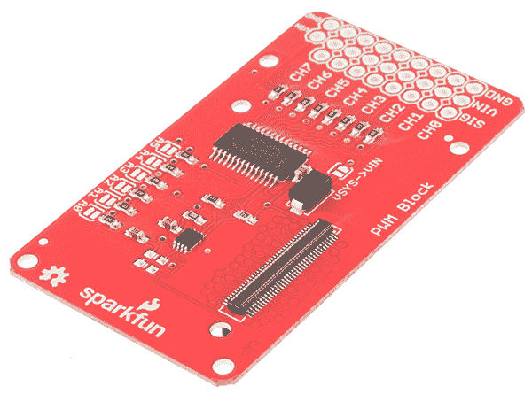
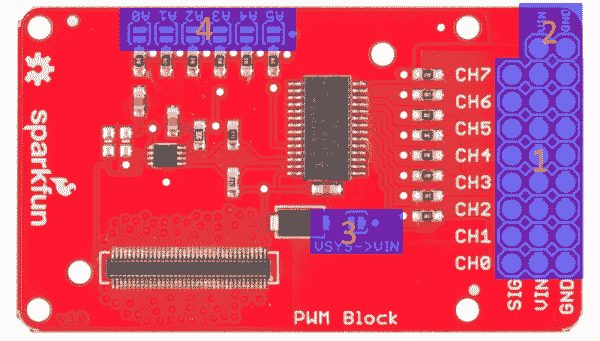
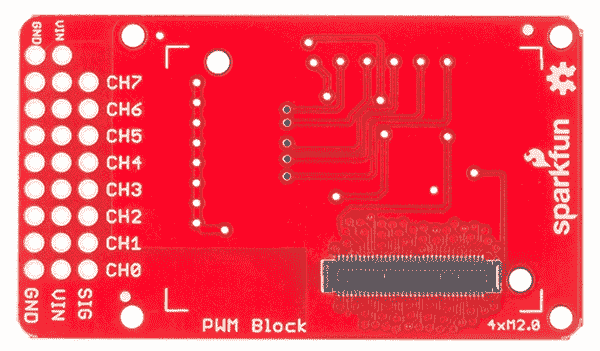
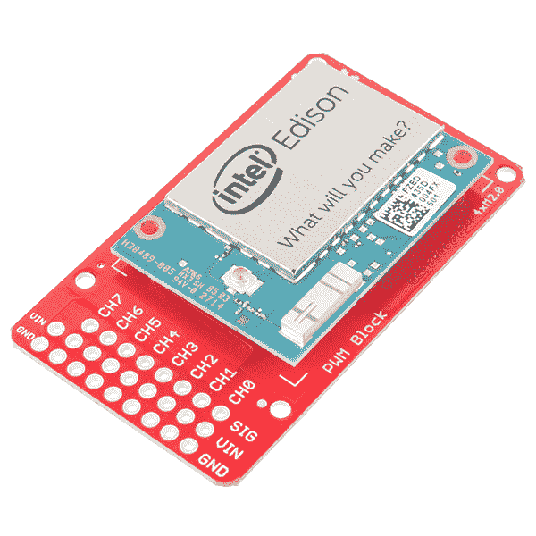
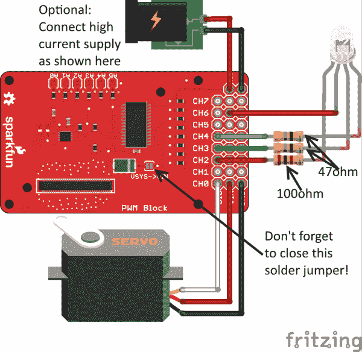

# 英特尔 Edison - PWM 火花模块

> 原文：<https://learn.sparkfun.com/tutorials/sparkfun-blocks-for-intel-edison---pwm>

## 介绍

SparkFun 为英特尔 Edison 开发的 [PWM 模块允许您向 Edison 堆栈添加 8 个 I ² C 控制的 PWM 输出通道。接头的间距允许您直接将伺服电机连接到模块，接头上的辅助隔离电源输入允许输入电压和电流高于 Edison 的其余部分可以使用或提供的电压和电流。](https://www.sparkfun.com/products/13042)

[](https://cdn.sparkfun.com/assets/learn_tutorials/2/8/4/PWMBlock-iso-crop.jpg)*PWM Block*

### 推荐阅读

如果你不熟悉积木，看看英特尔爱迪生的[spark fun 积木通用指南。](https://learn.sparkfun.com/tutorials/general-guide-to-sparkfun-blocks-for-intel-edison)

其他可能对您的爱迪生之旅有所帮助的教程包括:

*   本教程假设你是使用 Arduino IDE 的**而不是**，所以你需要熟悉 Edison 上的 C++开发。
*   [为您的项目提供动力](https://learn.sparkfun.com/tutorials/how-to-power-a-project)
*   [连接器基础知识](https://learn.sparkfun.com/tutorials/connector-basics)
*   [PWM 基础知识](https://learn.sparkfun.com/tutorials/pulse-width-modulation)
*   [LED 基础知识](https://learn.sparkfun.com/tutorials/light-emitting-diodes-leds)

## 主板概述

棋盘的“顶”面是最有趣的，所以我们先来看看。

[](https://cdn.sparkfun.com/assets/learn_tutorials/2/8/4/pwm_block_labeled.png)

1.  **PWM 输出** -每个 PWM 通道都有一个三引脚、0.1 英寸间距的接头封装。输出顺序适用于大多数伺服电机。所有你需要做的是添加公头引脚，你可以直接连接伺服块。**默认情况下，VIN 引脚是浮动的。**在你能驱动一个伺服系统之前，你需要给它供电。
2.  **辅助电源输入** -这些焊盘允许您将外部电源连接到 PWM 通道。这允许您使用更高电压、更高电流的电源(例如 7.2V 2S LiPo 电池)为连接到 PWM 输出的器件供电，而不会损坏 Edison。
3.  **VSYS- > VIN 跳线** -如果你不需要额外的外部电源(可能是因为你在驱动小型发光二极管或小型伺服系统)，你可以用一个焊点桥接这个跳线，从 Edison VSYS 供电轨获取电源。从 USB 运行时，该供电轨约为 4.0V。
4.  **地址跳线** -这些跳线允许您设置该板上 PCA9685 PWM 芯片将使用的地址。每个跳线对应一个地址位；关闭跳线使该位为“1”。默认地址是 0x40。因此，关闭 A0 将使地址为 0x41，A1 使地址为 0x42，A0 和 A1 使地址为 0x43，依此类推。

[](https://cdn.sparkfun.com/assets/learn_tutorials/2/8/4/board_back.jpg)

电路板的“背面”更无聊，没有跳线或元件。这是爱迪生模块将与之配合的一面，因此您将能够在不拆卸爱迪生模块的情况下更换跳线。

## 使用 PWM 模块

要使用 PWM 模块，只需将 Intel Edison 连接到主板背面，或者将其添加到您当前的堆栈中。块可以在没有硬件的情况下堆叠，但是这使得扩展连接器不受机械应力的保护。

[](https://cdn.sparkfun.com/assets/learn_tutorials/2/8/4/PWMBlockEdison-installed.jpg)*PWM Block Installed*

我们有一个很好的[硬件包](https://www.sparkfun.com/products/13187)可以提供足够的硬件来保护三个街区和一个爱迪生。

[](https://cdn.sparkfun.com/assets/learn_tutorials/2/8/6/EdisonHardware_1.jpg)[*Intel Edison Hardware Pack*](https://www.sparkfun.com/products/13187)

注意:PWM 模块没有控制台入口或电压调节器。建议将控制台通信模块与该模块结合使用，就像在[英特尔 Edison](https://learn.sparkfun.com/tutorials/general-guide-to-sparkfun-blocks-for-intel-edison#console-communication-blocks)spark fun 模块通用指南中找到的模块一样。

## C++代码示例

我们假设您正在使用 Eclipse IDE，详见我们的[超越 Arduino](https://learn.sparkfun.com/tutorials/programming-the-intel-edison-beyond-the-arduino-ide) 教程。如果你不是，你需要阅读该教程来跟上速度。

#### 入门指南

按照[编程教程](https://learn.sparkfun.com/tutorials/programming-the-intel-edison-beyond-the-arduino-ide#hello-world)中的说明创建一个名为“spark fun _ PWM _ Edison _ Block _ Example”的新项目。一旦你创建了项目，打开磁盘上的项目文件(提示:你可以通过从项目菜单中选择“属性”来找到项目的路径)，并将在 [SparkFun PWM 块 for Edison C++库](https://github.com/sparkfun/SparkFun_PWM_Block_for_Edison_CPP_Library)中找到的源文件直接复制到“src”目录中。

[Download a zip file of the repository](https://github.com/sparkfun/SparkFun_PWM_Block_for_Edison_CPP_Library/archive/master.zip)

#### 硬件连接

对于这个例子，我们有一个[亚微型伺服电机](https://www.sparkfun.com/products/9065)和一个[公共阳极 RGB LED](https://www.sparkfun.com/products/10821) 连接到 PWM 模块输出。我们已经用一个焊料滴封闭了 VSYS- > VIN 跳线，所以我们从 Edison 的电源中汲取能量。对于更大的伺服电机或更多的 led，您应该打开该跳线，并将外部电源连接到接头末端的 VIN 和 GND 焊盘。

[](https://cdn.sparkfun.com/assets/learn_tutorials/2/8/4/pwm_block_bb.png)

当然，您可以将任何其它器件连接到这里的输出端——电机驱动器的 PWM 输入端、蜂鸣器等等。我们只想展示这个模块的核心功能，即提供伺服驱动和视觉归一化 LED 输出。

#### 密码

你需要知道的一切都在评论里。

```
/****************************************************************************
 * SparkFun_PWM_Edison_Block_Example.cpp
 * Example code showing how to use the SparkFun PWM Edison Block
 * Mike Hord @ SparkFun Electronics
 * 9 June 2015
 * https://github.com/sparkfun/SparkFun_PWM_Block_for_Edison_CPP_Library
 *
 * This file is a demonstration program showing the various functions that we've
 * provided for working with the PCA9685 IC on the SparkFun PWM Edison Block.
 * It uses an RGB LED and a small servo motor to show what the library can do.
 *
 * Resources:
 * Requires Intel's MRAA framework. This can be downloaded from either the
 * GitHub site (https://github.com/intel-iot-devkit/mraa) or in pre-built form
 * from http://iotdk.intel.com/sdk/mraa-update/.
 *
 * Development environment specifics:
 * Developed in the Intel iot-ide-dk Eclipse on Win 7 (v1.0.0.201502201135)
 * Using lib-mraa v0.6.2
 * On Edison poky-linux image build ww18-15
 *
 * This code is beerware; if you see me (or any other SparkFun employee) at the
 * local, and you've found our code helpful, please buy us a round!
 * ****************************************************************************/

#include "mraa.hpp"
#include "SparkFun_pca9685_Edison.h"
#include <iostream>
#include <unistd.h>

using namespace std;

// These channel definitions mirror the ones used in the PWM Block hookup guide.
#define SERVO 0
#define RED 2
#define GREEN 3
#define BLUE 4

// Uncomment one or both of these defines to enable the appropriate demo. Do
//  note servo motors and LEDs are best used at different frequencies and
//  polarities, so hooking both at once will give you bad results.
#define SERVO_DEMO
//#define LED_DEMO

// main() runs once and completes; there's no infinite loop here. Do note,
//  though, that whatever settings you write to the PWM module will persist
//  after the code has completed.
int main()
{
  // Variables to be used elsewhere in the program.
  uint16_t startTime, stopTime;

  mraa::I2c* pwm_i2c;   // We need to create an I2c object that we can pass to
                        //  the pca9685 constructor. If you have more than one
                        //  PCA9685 device on your bus (either by stacking more
                        //  than one PWM block or by adding external boards via
                        //  the I2C Expansion Block), you'll need to create a
                        //  different I2c object for each one!
  pwm_i2c = new mraa::I2c(1); // Tell the I2c object which bus it's on.

  pca9685 pwm(pwm_i2c, 0x40); // 0x40 is the default address for the PCA9685.

  // In general usage, you don't need to worry about getting or setting the
  //  mode registers or the prescaler register. I'm including these lines here
  //  just for example completeness purposes.
  cout<<"Current mode register values: 0x"<<hex<<pwm.readModeRegisters()<<endl;
  cout<<"Current prescaler: "<<dec<<static_cast<int16_t>(pwm.getPrescaler())<<endl;
  pwm.setPrescaler(121);

  // There are four generic functions allowing the user to change the start and
  //  stop times of the various channels. Generally, however, you shouldn't ever
  //  have to or want to use these, since there are more useful functions
  //  available which will be covered below.
  pwm.setChlTime(RED, 0, 0);
  pwm.setChlDuty(BLUE, 0);
  pwm.setChlStart(GREEN, 0);
  pwm.setChlStop(GREEN, 0);

  pwm.setChlDuty(SERVO, 0);

#ifdef LED_DEMO
  // When you call enableLEDMode(), you set the output to be approximately 400Hz
  //  and inverted. Thus, a 0 output will be a 100% high output. This allows us
  //  to use the output to drive common anode LEDs. See the tutorial for an
  //  example circuit.
  pwm.enableLEDMode();
  // Back to this, just so you can compare the settings in LED mode with the
  //  default (which is actually LED mode).
  cout<<"Current mode register values: "<<hex<<pwm.readModeRegisters()<<endl;
  cout<<"Current prescaler: "<<dec<<static_cast<int16_t>(pwm.getPrescaler())<<endl;
  for (uint8_t i = 0; i <= 100; i++)
  {
    // Check and print the start and stop times for the RED channel, then set
    //  all three to one percentage point higher. You'll note that the start
    //  time is always 0, and that the stop times increase logarithmically. This
    //  lets us get a visually linear brightness out of the LEDs.
    pwm.getChlTime(RED, &startTime, &stopTime);
    cout<<"Start time: "<<dec<<startTime<<endl;
    cout<<"Stop time: "<<dec<<stopTime<<endl;
    pwm.setChlLEDPercent(BLUE, i);
    pwm.setChlLEDPercent(GREEN, i);
    pwm.setChlLEDPercent(RED, i);
    usleep(100000);
  }
  sleep(4);
  pwm.setChlTime(RED, 0, 0);
  pwm.setChlTime(GREEN, 0, 0);
  pwm.setChlTime(BLUE, 0, 0);
  cout<<"LED demo complete!"<<endl;
#endif

#ifdef SERVO_DEMO
  // We can set or get the minimum and maximum angles the angle set function
  //  expects to see.
  int16_t servoMinAngle, servoMaxAngle;
  pwm.getServoAngleLimits(&servoMinAngle, &servoMaxAngle);
  cout<<"Current servo min angle: "<<dec<<servoMinAngle<<endl;
  cout<<"Current servo max angle: "<<dec<<servoMaxAngle<<endl;

  // Likewise, we can set the min and max of pulse widths. Each count here is
  //  about 4.5us, depending on the clock's accuracy.
  uint16_t minServoPL, maxServoPL;
  pwm.getServoAnglePulseLimits(&minServoPL, &maxServoPL);
  cout<<"Current servo min pulse length: "<<dec<<minServoPL<<endl;
  cout<<"Current servo max pulse length: "<<dec<<maxServoPL<<endl;

  // These numbers are based on experimentation with SparkFun's generic
  //  sub-micro servo motor. You may find that they are too high or too low for
  //  your particular motor. The generic settings are fairly conservative and
  //  there is no need to use these functions unless you feel like you can get
  //  a wider range of motion by doing so.
  servoMinAngle = 0;
  servoMaxAngle = 160;
  minServoPL = 108;
  maxServoPL = 450;
  pwm.setServoAnglePulseLimits(minServoPL, maxServoPL);
  pwm.setServoAngleLimits(servoMinAngle, servoMaxAngle);

  // enabling servo mode makes the output active high and sets the frequency to
  //  approximately 50Hz.
  pwm.enableServoMode();

  // For comparison against default values or LED mode values.
  cout<<"Current mode register values: 0x"<<hex<<pwm.readModeRegisters()<<endl;
  cout<<"Current prescaler: "<<dec<<static_cast<int16_t>(pwm.getPrescaler())<<endl;

  // This steps through the full range of your servo's rotation. It also shows
  //  the start and stop time of the pulses, so you can see how those correspond
  //  to different positions.
  for (int16_t i = servoMinAngle; i <= servoMaxAngle; i++)
  {
    pwm.getChlTime(SERVO, &startTime, &stopTime);
    pwm.setChlAngle(SERVO, i);
    cout<<"Start time: "<<dec<<startTime<<endl;
    cout<<"Stop time: "<<dec<<stopTime<<endl;
    usleep(100000);
  }
  cout<<"Servo demo complete!"<<endl;
#endif

  return MRAA_SUCCESS;
} 
```

## 资源和更进一步

现在，您已经对 PWM 模块有了一个简单的概述，让我们来看看其他一些教程。这些教程涵盖编程、模块堆叠以及与英特尔 Edison 生态系统的接口。

## 爱迪生通用主题:

*   [英特尔爱迪生 Sparkfun 模块通用指南](https://learn.sparkfun.com/tutorials/general-guide-to-sparkfun-blocks-for-intel-edison)
*   [爱迪生入门指南](https://learn.sparkfun.com/tutorials/edison-getting-started-guide)
*   [在 Edison 上加载 Debian(Ubilinix)](https://learn.sparkfun.com/tutorials/loading-debian-ubilinux-on-the-edison)

## 阻止特定主题:

*   [PWM 模块 Git Repo](https://github.com/sparkfun/Edison_PWM_Block)
*   [PWM 模块 C++库报告](https://github.com/sparkfun/SparkFun_PWM_Block_for_Edison_CPP_Library)

查看 SparkFun 的其他爱迪生相关教程:

[](https://learn.sparkfun.com/tutorials/sparkfun-blocks-for-intel-edison---arduino-block) [### 英特尔 Edison - Arduino 模块的 SparkFun 模块](https://learn.sparkfun.com/tutorials/sparkfun-blocks-for-intel-edison---arduino-block) A quick overview of the features of the Arduino Block.[Favorited Favorite](# "Add to favorites") 2[](https://learn.sparkfun.com/tutorials/sparkfun-blocks-for-intel-edison---battery-block) [### 英特尔爱迪生公司的 SparkFun 模块-电池模块](https://learn.sparkfun.com/tutorials/sparkfun-blocks-for-intel-edison---battery-block) A quick overview of the features of the Battery Block.[Favorited Favorite](# "Add to favorites") 7[](https://learn.sparkfun.com/tutorials/sparkfun-blocks-for-intel-edison---console-block) [### 英特尔 Edison 的 SparkFun 模块-控制台模块](https://learn.sparkfun.com/tutorials/sparkfun-blocks-for-intel-edison---console-block) A quick overview of the features of the Console Block.[Favorited Favorite](# "Add to favorites") 2[](https://learn.sparkfun.com/tutorials/sparkfun-blocks-for-intel-edison---pi-block) [### 英特尔 Edison - Pi 模块的 SparkFun 模块](https://learn.sparkfun.com/tutorials/sparkfun-blocks-for-intel-edison---pi-block) Tutorial on setting up and using the Pi Block for Intel Edison.[Favorited Favorite](# "Add to favorites") 2