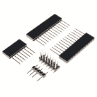

# 青少年入门

> 原文：<https://learn.sparkfun.com/tutorials/getting-started-with-the-teensy>

## 介绍

[Teensy 系列](https://www.sparkfun.com/categories/267)是来自 [PJRC](https://www.pjrc.com/) 的基于几种不同的强大集成电路的微控制器集合。这个基本的入门指南将帮助你开始使用最适合你的项目的 Teensy。

*The Teensy 3.1, the Teensy++ 2.0, and the Teensy LC.*

### 所需材料

要跟随本教程，您将需要以下材料。你可能不需要所有的东西，这取决于你拥有什么。将它添加到您的购物车，通读指南，并根据需要调整购物车。您将需要合适的 USB 电缆用于您正在使用的 Teensy 板。以下主板支持 micro-USB 电缆:

 

将**添加到您的[购物车](https://www.sparkfun.com/cart)中！**

 **### [Teensy 4.1](https://www.sparkfun.com/products/16771)

[Out of stock](https://learn.sparkfun.com/static/bubbles/ "out of stock") DEV-16771

Teensy 4.1 采用 600MHz 的 ARM Cortex-M7 处理器，比 4.0 大 4 倍的闪存，以及可选的 local…

$31.507[Favorited Favorite](# "Add to favorites") 25[Wish List](# "Add to wish list")**** 

将**添加到您的[购物车](https://www.sparkfun.com/cart)中！**

 **### [Teensy 4.0](https://www.sparkfun.com/products/15583)

[Out of stock](https://learn.sparkfun.com/static/bubbles/ "out of stock") DEV-15583

Teensy 4.0 是最新的 Teensy，在 1.4×0.7 英寸的 Teensy 中提供了最快的微控制器和强大的外设…

$23.8012[Favorited Favorite](# "Add to favorites") 48[Wish List](# "Add to wish list")**** 

将**添加到您的[购物车](https://www.sparkfun.com/cart)中！**

 **### [少女 LC](https://www.sparkfun.com/products/13305)

[Out of stock](https://learn.sparkfun.com/static/bubbles/ "out of stock") DEV-13305

Teensy LC 是一个 32 位微控制器板，为您提供了一个简单的选择，开始与 Teensy 的智慧…

$12.9517[Favorited Favorite](# "Add to favorites") 35[Wish List](# "Add to wish list")**** 

将**添加到您的[购物车](https://www.sparkfun.com/cart)中！**

 **### [USB micro-B 线- 6 脚](https://www.sparkfun.com/products/10215)

[In stock](https://learn.sparkfun.com/static/bubbles/ "in stock") CAB-10215

USB 2.0 型到微型 USB 5 针。这是一种新的、更小的 USB 设备连接器。微型 USB 连接器大约是…

$5.5014[Favorited Favorite](# "Add to favorites") 21[Wish List](# "Add to wish list")**** 

### [Teensy 3.6](https://www.sparkfun.com/products/14057)

[Out of stock](https://learn.sparkfun.com/static/bubbles/ "out of stock") DEV-14057

Teensy 3.6 更大，更快，能够进行更复杂的项目，特别是其板载微型 SD 卡端口和升级…

15[Favorited Favorite](# "Add to favorites") 39[Wish List](# "Add to wish list") 

### [Teensy 3.5](https://www.sparkfun.com/products/14055)

[Out of stock](https://learn.sparkfun.com/static/bubbles/ "out of stock") DEV-14055

Teensy 3.5 更大，更快，能够进行更多的项目，特别是其板载微型 SD 卡端口。

8[Favorited Favorite](# "Add to favorites") 20[Wish List](# "Add to wish list") 

### [Teensy 3.2](https://www.sparkfun.com/products/13736)

[Out of stock](https://learn.sparkfun.com/static/bubbles/ "out of stock") DEV-13736

Teensy 3.2 是一款试验板友好型开发板，在一个小小的封装中提供了大量功能。

68[Favorited Favorite](# "Add to favorites") 83[Wish List](# "Add to wish list")******** ********Teensy++ 2.0 可与迷你 USB 线缆配合使用:

 

将**添加到您的[购物车](https://www.sparkfun.com/cart)中！**

 **### [SparkFun USB 迷你-B 线- 6 脚](https://www.sparkfun.com/products/11301)

[In stock](https://learn.sparkfun.com/static/bubbles/ "in stock") CAB-11301

这是一条 USB 2.0 型到 Mini-B 型 5 针电缆。你知道，通常带有 USB 集线器、相机、MP3 的迷你 B 连接器…

$4.503[Favorited Favorite](# "Add to favorites") 20[Wish List](# "Add to wish list")**** 

### [Teensy++ 2.0](https://www.sparkfun.com/products/retired/11781)

[Retired](https://learn.sparkfun.com/static/bubbles/ "Retired") DEV-11781

Teensy++ 2.0 将 AT90USB1286 上可用的所有 IO 分解为 0.1 英寸间距的试验板友好型接头，因此您可以…

3 **Retired**[Favorited Favorite](# "Add to favorites") 10[Wish List](# "Add to wish list")** **您还需要为您的项目准备合适的标题。有几个不同的选项可用。以下是几个与主板一起使用的常见接头。

 

将**添加到您的[购物车](https://www.sparkfun.com/cart)中！**

 **### [破开头球——直击](https://www.sparkfun.com/products/116)

[In stock](https://learn.sparkfun.com/static/bubbles/ "in stock") PRT-00116

一排标题-打破适应。40 个引脚，可切割成任何尺寸。用于定制 PCB 或通用定制接头。

$1.7520[Favorited Favorite](# "Add to favorites") 133[Wish List](# "Add to wish list")**** 

将**添加到您的[购物车](https://www.sparkfun.com/cart)中！**

 **### [女标题](https://www.sparkfun.com/products/115)

[In stock](https://learn.sparkfun.com/static/bubbles/ "in stock") PRT-00115

单排 40 孔，内螺纹接头。可以用一把钢丝钳切割成合适的尺寸。标准 0.1 英寸间距。我们广泛使用它们…

$1.758[Favorited Favorite](# "Add to favorites") 71[Wish List](# "Add to wish list")**** 

将**添加到您的[购物车](https://www.sparkfun.com/cart)中！**

 **### 

[In stock](https://learn.sparkfun.com/static/bubbles/ "in stock") PRT-17152

这些接头适用于 Teensy 4.1、Teensy 3.6 和 Teensy 3.5 开发板。

$1.75[Favorited Favorite](# "Add to favorites") 3[Wish List](# "Add to wish list")**** 

将**添加到您的[购物车](https://www.sparkfun.com/cart)中！**

 **### [少年头球套件](https://www.sparkfun.com/products/13925)

[In stock](https://learn.sparkfun.com/static/bubbles/ "in stock") PRT-13925

每个接头套件使您的 Teensy 4.0、3.2 和 LC 试验板兼容，并允许堆叠 Teensy 和 Teensy-…

$1.50[Favorited Favorite](# "Add to favorites") 22[Wish List](# "Add to wish list")******** ********### 工具

你需要一个烙铁、焊料和一般的焊接附件。我们推荐[初学者工具包](https://www.sparkfun.com/products/13086)用于焊接任何小型电路板。

 

将**添加到您的[购物车](https://www.sparkfun.com/cart)中！**

 **### [SparkFun 初学者工具包](https://www.sparkfun.com/products/14681)

[Out of stock](https://learn.sparkfun.com/static/bubbles/ "out of stock") TOL-14681

这些工具非常适合那些需要一套坚实的工具来启动工作台的人！

$62.50[Favorited Favorite](# "Add to favorites") 14[Wish List](# "Add to wish list")** **或者，如果你打算做大量的密集焊接，你也可以使用下面的愿望清单作为指南。********************