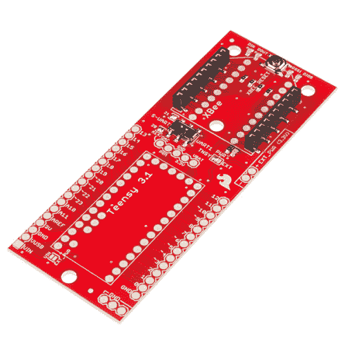

# Teensy XBee 适配器连接指南

> 原文：<https://learn.sparkfun.com/tutorials/teensy-xbee-adapter-hookup-guide>

## 介绍

**Note:** While the adapter was designed for the Teensy 3.1, it is compatible with the Teensy 3.2 as well. The Teensy 3.2 is populated with a more powerful 3.3V voltage regulator with the ability to power additional power-hungry 3.3V devices! Additionally, the adapter interfaces best with the Teensy 3.1, but the Teensy LC can be utilized as well. For more information, check out the specs on PJRC:

[PJRC Teensy 3.2 / 3.1 Specs](https://www.pjrc.com/teensy/teensy31.html#specs)**Heads up!** Originally, this tutorial was written to configure an XBee Series 1 to communicate in transparency mode. However, this can apply to the XBee Series 3 module as long as you configure the firmware to the legacy 802.15.4 protocol. For more information, check out the [Exploring XBees and XCTU](https://learn.sparkfun.com/tutorials/exploring-xbees-and-xctu) tutorial.

与 Arduino 相比，Teensy 是一种在更小的空间内获得更大计算能力的好方法。当需要一个范围适当、简单的无线串行链路时，XBee 系列是一个很好的解决方案。 [Teensy XBee 适配器](https://www.sparkfun.com/products/13311)轻松将二者连接起来，为您的小项目带来无线体验。本教程将演示使用适配器板的基本知识。

 

将**添加到您的[购物车](https://www.sparkfun.com/cart)中！**

### [Teensy 3.1 XBee 适配器](https://www.sparkfun.com/products/13311)

[In stock](https://learn.sparkfun.com/static/bubbles/ "in stock") BOB-13311

Teensy 是一个令人惊叹的开发平台，它可以让您获得比 Arduino Uno 更强的计算能力，并且速度更快

$5.952[Favorited Favorite](# "Add to favorites") 7[Wish List](# "Add to wish list")** **本教程演示了:

*   如何初始化 Teensy 3.1 硬件系列
*   如何使用软件串行库初始化 Teensy 3.1 软件串行
*   打包数据的基础知识。
*   如何制作一个简单的控制器来影响远处的东西

### 所需材料

至少，你需要一个 XBee explorer，两个 XBee，一个 Teensy 和适配器板。如果你想要两个都不在网上的青少年 XBee 电台，这里有一份你需要的物品清单，外加一些有用的额外物品。**