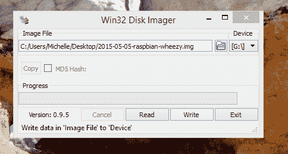

# SD 卡和书写图像

> 原文：<https://learn.sparkfun.com/tutorials/sd-cards-and-writing-images>

## 介绍

本教程旨在让您对 SD 卡有一个基本的了解，以及如何将不同的图像写入您选择的 SD 卡。

SD 卡是安全数字卡的缩写，现在随处可见，从数码相机到手机和平板电脑，甚至是单板机。在很多情况下，你的 SBC 不会安装 Linux 或其他操作系统。由您决定是否在 SD 卡上提供操作系统。除了 Raspberry Pi 的 Noobs，这通常不是一个拖放过程。

在本教程中，我们将讨论不同类型的 SD 卡和读卡器，格式化您的卡以擦除任何可能隐藏在周围的数据，安装您的映像，然后如何使用卡上剩余的空间。

*Single Board Computers, such as the Raspberry Pi, use SD and microSD cards to house various operating systems. Pictured here: a microSD card with full-size adapter.*

### 所需材料

为了跟随这个教程，你需要一个 [SD 卡](https://www.sparkfun.com/categories/351)，和一个[读卡器](https://www.sparkfun.com/search/results?term=microsd+reader+adapter)(关于不同类型的更多信息见相关章节)。最小卡的大小取决于 Linux 发行版。在刷新之前，确保检查您计划用于单板计算机的图像分布。你还需要一台电脑和互联网连接(如果你的电脑上没有所有的软件和你的图像)。最后，你需要你的 SBC 或者任何你要安装卡的设备。

*   [microSD 卡](https://www.sparkfun.com/categories/351)带最小卡尺寸
*   [microSD 读卡器](https://www.sparkfun.com/products/13004)
*   Linux 映像
*   单板电脑(即树莓 Pi、NVIDIA Jetson Nano 等。)
*   互联网连接

### 推荐阅读

谈到单板计算机，没有一个最佳的起点。然而，您可能会发现这些链接在您的 SBC 冒险中很有用。

*   [命令行入门](https://p1k3.com/userland-book/)
*   [使用 Noobs 用 Raspbian 设置树莓 Pi](https://learn.sparkfun.com/tutorials/setting-up-raspbian-and-doom)

## SD 卡

SD 卡几乎随处可见，在网上，在你当地的商店。但是是什么让它与众不同呢？什么才是好的 SD 卡？除了制造之外，卡之间的主要区别是物理尺寸、容量/标准和速度。以下是对这些元素的简要概述。

#### 大小

SD 卡有两种主要尺寸。全尺寸 SD 卡用于全球的数码相机，microSD(通常称为 SD 或 uSD)卡用于手机和平板电脑等。不过，从电学角度来看，它们是一回事。有没有注意到一些 microSD 卡附带的廉价塑料适配器？它们只不过是一个带有连接器的塑料外壳，可以通过 microSD 连接器连接到全尺寸连接器。在它们上面安装图像是一样的，只要确保你有适合你的设备和阅读器的卡(和适配器，如果需要的话)。

#### 标准

实际上有 4 种不同标准的 SD 卡，每个新版本都有更高的容量和更快的速度。这 4 个版本是:标准或 SD(高达 4GB)，高容量或 SDHC(高达 32GB，格式化为 FAT32)，扩展高容量或 SDXC(高达 2TB，格式化为 exFAT)，以及 SDIO(支持 I/O)。这些都可以，但要小心 SDXC 卡；由于许可问题，并非所有设备都支持 exFAT。

#### 速度

大多数卡片还会在上面列出一个等级或速度，以区分他们读写的速度。类别 2、4、6、8 和 10 分别为 2MB/s、4MB/s、6MB/s、8MB/s 和 10MB/s。UHS 1 类和 UHS 3 类分别为 10MB/s 和 30MB/s。在大多数情况下，这些数字是不相关的；请记住，有不同的速度，所以如果事情运行比你想要的慢，检查卡。

对于本教程，这些卡都可以使用。但是，请确保您的设备具有正确的物理大小，并且该卡具有足够大的容量来容纳您想要使用的图像。这款 8GB 卡应该可以处理任何事情，因为它有一个 SD 适配器和一个读卡器。

*SD cards, uSD cards, uSD adapters, and Wifi enabled SD card*

## 读卡器

你可以找到几乎和 SD 卡一样多的 SD 卡读卡器，但是真的没有那么多区别。您的本地计算机商店，甚至 conveinence 商店，很可能至少有一个 USB 适配器。如果你的电脑没有适配器，有大量的适配器可供选择，其中大部分将通过 USB 连接到你的电脑。有些只做 uSD，uSD 和 SD，或者一大堆不同类型的卡。对于我们的例子来说，这些都应该很好。

*A few different SD and uSD card readers*

大多数笔记本电脑，甚至一些台式机现在都有直接读写 SD 卡的插槽。这些通常直接连接到机器内部的 USB 端口，使它们与 USB 适配器相同，但并不总是如此。对于我们的例子来说，这些应该很好，但是如果您有问题，请尝试 USB 适配器。

现在大多数相机都使用 SD 卡，可以通过 USB 电缆插入电脑。在大多数情况下，数据是通过相机，而不是直接从计算机读取。因此，这对于我们的例子来说是不可行的，对于手机和其他设备来说也是如此。基本上，如果你的设备有一个除了“SD 适配器”之外的名字，它可能不会工作。

对于本教程，您需要在计算机中安装 SD 插槽或 USB 适配器。确保它适合您的卡的大小，或者您有合适的适配器。否则，从 [SparkFun 目录](https://www.sparkfun.com/categories/351)中获取 microSD USB 读卡器。

 

将**添加到您的[购物车](https://www.sparkfun.com/cart)中！**

### [microSD USB 读卡器](https://www.sparkfun.com/products/13004)

[In stock](https://learn.sparkfun.com/static/bubbles/ "in stock") COM-13004

这是一个很棒的微型 USB 读卡器。只需将您的 microSD 卡滑入 USB 连接器内部，然后将它插入 USB 连接器

$5.5011[Favorited Favorite](# "Add to favorites") 11[Wish List](# "Add to wish list")** **## 格式化您的卡片

我们将从格式化您的 SD 卡开始。这一步不是绝对必要的，但它确实有助于清理你的卡。在某些情况下，如果出了问题，这将有助于清理混乱，而不是把混乱带给你。

这样做的时候一定要小心，它会删除你卡上的所有内容，所以请确保你不介意丢失卡上的所有内容。此外，请确保您选择了正确的驱动器！或者，用来改变分区大小的工具也可以格式化任何卡或分区。如果你的卡已经被分区了，因为它上面已经有了一个图像，参见最后一节[调整大小和删除分区](#partitions)。

### Windows 操作系统

SD 协会推荐了一个设计用于 Windows 和 Mac 的格式化程序，你可以试一试或者使用下面的说明- [SD 卡格式化程序](https://www.sdcard.org/downloads/formatter_4/)

[Download SD Memory Card Formatter](https://www.sdcard.org/downloads/formatter_4/)

*   打开“我的电脑”
*   右键单击带有 SD 卡的驱动器
*   选择“格式”

*   选择您的文件系统(FAT32 也可以)
*   请随意在“卷标”中命名您的卡
*   快速格式化没有那么彻底，但是稍微快一点，两个选项都可以
*   选择“开始”

### 苹果个人计算机

SD 协会有一个设计用于 Windows 和 Mac 的格式化程序，你可以尝试一下或者使用下面的说明- [SD 卡格式化程序](https://www.sdcard.org/downloads/formatter_4/)。

[Download SD Memory Card Formatter](https://www.sdcard.org/downloads/formatter_4/)

*   打开磁盘工具(应用程序->工具->磁盘工具)
*   选择 SD 卡
*   选择“擦除”选项卡
*   选择您的文件系统- MSDOS(FAT)
*   在“名称”字段中随意命名您的卡
*   选择“擦除”

### Linux 操作系统

*   运行 Gparted(您可能需要先使用`sudo apt-get install gparted`安装它)
*   从右上方的下拉菜单中选择正确的设备
*   选择分区→格式化→ fat32
*   单击应用

## 下载并安装映像

最后，这是我们一直在等待的。那么，你为什么不把文件复制到卡上呢？当你看 SD 卡时，你实际上看不到卡上的所有位，你只看到主存储区。还有其他的部分允许卡是可引导的，这是需要写的。虽然您可以手动完成，然后添加您需要的所有文件，但通常您的文件是作为包含所有信息的图像发布的。这样，您可以使磁盘可引导，并添加文件都在一个简单的步骤。就像格式化你的 SD 卡一样，这将会删除上面的所有内容。请确保您想要这样做，并且选择了正确的磁盘。

### 下载图像

首先下载您想要使用的图像，不要忘记提取您的图像，这样您就有了一个 ***。img** 文件。以下是一些常见主板的文件；请注意，通常有不同的下载可用。您会发现不同的 Linux 发行版、Android 图像，甚至不同的图像，这取决于您想要使用的显示器。选择最适合您的应用程序的一个，并且记住，您可以随时返回并选择不同的一个。

*   Raspberry Pi (Noobs 的安装方式不同，请按照 Raspberry 页面上的说明操作)- [下载](https://www.raspberrypi.org/downloads/)
*   NVIDIA Jetson Nano [下载量](https://developer.nvidia.com/embedded/downloads)
*   PCDuino 3 - [下载](http://www.linksprite.com/?page_id=855)
*   阿卡迪亚- [下载量](http://www.linksprite.com/?page_id=1112)

### 简单的方法

为了在你的卡上安装你自己的图像，我们推荐一个叫做 [Etcher](https://etcher.io/) 的软件。

[Download Balena Etcher](https://etcher.io/)

这些人已经采取了所有需要的不同步骤，并把它们都放在一个软件中来处理所有的事情。下载你的图像，然后运行程序，选择你的图像，选择你的 uSD 卡驱动器，然后点击 flash。Etcher 将刷新卡，验证安装和卸载您的卡。一旦完成，取出你的卡，你就可以走了。

*GIF Courtesy of [Etcher.io](https://etcher.io/)*

### 艰难的道路-窗户

*   下载并解压[win32 diski manager](http://sourceforge.net/projects/win32diskimager/)
*   运行 Win32DiskImager.exe(您可能需要以管理员身份运行)
*   选择 SD 卡的驱动器
*   单击文件夹图标并选择您下载的图像
*   点击“写”,等待它完成

### 艰难的道路-麦克

*   运行`diskutil list`显示所有磁盘，找到正确的磁盘
*   运行`diskutil unmountDisk /dev/disk4`卸载磁盘(用正确的磁盘替换磁盘 4)
*   运行`sudo dd bs=1M if=your/file/here.img of=/dev/disk4`(再次用正确的磁盘替换 disk4，并将正确的路径添加到您的映像)
*   等到它完成

### 艰难的道路——Linux

*   运行`df-h`以查看您的系统上安装了哪些设备，您可能希望在没有卡的情况下执行此操作，然后在有卡的情况下执行此操作。
*   看一下左栏中的卡名。最后很可能会有一个数字，这是分区号。在下面的例子中，我的卡/dev/sdd 有一个分区(/dev/sdd5)。你的卡上可能有不止一个分区，如果你这样做的话，请记住这一点。
*   使用命令`umount /dev/sdd5`卸载您看到的任何分区，其中/dev/sdd5 是您卡上的分区。
*   接下来运行下面的命令来实际写入卡，请记住您需要知道您的映像在哪里，并且您希望使用卡的路径，并且末尾没有任何分区号。根据您的权限`dd if=2015-05-05-raspbian-wheezy.img of=/dev/sdd`，您可能需要也可能不需要以“sudo”身份运行此程序(确保使用文件和 SD 卡的正确路径)
*   等待...这将需要几分钟，没有状态栏，但即使在一个实时的 Linux 发行版上也只需要几分钟。
*   运行`sync`(这将刷新写缓存，以及其他有趣的事情)

## 调整分区大小

此时，你应该有一个工作正常的可启动 SD 卡，请随意停止。有时，尽管你去拿你放在身边的 16GB 卡，烧一个 1GB 的图像，然后想，好吧，这是愚蠢的，我已经失去了 15GB 的空间！现在，我们将改变分区大小，以便您的卡的剩余部分显示为一个单独的分区，您仍然可以使用它进行存储。在我们开始之前，你可能想启动你的卡并四处看看，许多发行版都有一个内置的工具来做这件事。如果你愿意，你也可以使用这些程序来调整分区的大小。

请记住，Windows 只能读取第一个分区，因此如果您使用 Windows 设备，您将无法将它用作一般存储。但是您可以在基于 Linux 的单板计算机(SBC)上将它用作存储。

如果你不想再在你的 SBC 上使用 SD 卡，这也是一个很好的方法让你的 sd 卡回到原来的完整分区。你需要删除所有分区，然后创建一个新的分区并格式化。

这些项目中的大部分实际上都有非常相似的布局和方向，而且网上还有很多其他的选择。

### 所有窗口

*   较新版本的 Windows 有一个内置的分区管理器(见下文)，但是对于较旧版本的 Windows 或功能更全的分区管理器，请尝试 [EaseUS 分区管理器](http://www.easeus.com/partition-manager/)
*   下载 [EaseUS 分区管理器](http://www.partition-tool.com/download.htm)
*   解压缩，并运行程序
*   在窗口的上部选择磁盘
*   您应该会在下半部分看到分区的图形表示
*   根据您安装的映像，您可能有各种选项。任何未分配的空间都可以转换成新的分区并进行格式化。你也可以把最后一个分区重新调整大小，这样它就可以占据卡的剩余部分。

*   确保应用您的更改(顶部工具栏中的复选标记)。这将应用您对卡所做的所有更改。

### Windows Vista，7，8

*   打开控制面板
*   在搜索框中键入分区
*   选择“创建和格式化硬盘分区”选项
*   在窗口的上部选择磁盘
*   您应该会在下半部分看到分区的图形表示
*   根据您安装的映像，您可能有各种选项。任何未分配的空间都可以转换成新的分区并进行格式化。你也可以把最后一个分区重新调整大小，这样它就可以占据卡的剩余部分。
*   确保应用您的更改(顶部工具栏中的复选标记)，这将应用您对卡所做的所有更改

### 苹果个人计算机

*   根据您的映像是否使用基于 Windows 的文件系统，这可能有效，也可能无效。如果你有问题，试试这些[替代品](http://alternativeto.net/software/gparted/?platform=mac)。
*   打开磁盘工具(应用程序->工具)
*   选择 SD 卡
*   选择“分区”选项卡
*   单击左下角的“+”添加一个分区
*   选择分区并拖动右下角以调整大小
*   单击应用

### Linux 操作系统

*   运行 Gparted(您可能需要先使用`sudo apt-get install gparted`安装它)
*   从右上方的下拉菜单中选择正确的设备
*   根据您安装的映像，您可能有各种选项。任何未分配的空间都可以转换成新的分区并进行格式化。你也可以把过去的分区重新调整大小，这样它就可以占据卡的其余部分。
*   确保应用您的更改。这将应用您对卡所做的所有更改。

## 资源和更进一步

既然您已经知道了如何在 SD 卡上安装映像，那么是时候开始创建一些伟大的 SBC 项目了。需要一些灵感吗？查看来自 SparkFun 的其他相关教程。

 [### 树莓 Pi 3 入门套件连接指南](https://learn.sparkfun.com/tutorials/raspberry-pi-3-starter-kit-hookup-guide) Guide for getting going with the Raspberry Pi 3 Model B and Raspberry Pi 3 Model B+ starter kit.[Favorited Favorite](# "Add to favorites") 13 [### PiRetrocade 装配指南](https://learn.sparkfun.com/tutorials/piretrocade-assembly-guide-) Build your very own retro gaming controller with a Raspberry Pi using the SparkFun PiRetrocade Kit 9 [### Raspberry Pi Zero Wireless 入门](https://learn.sparkfun.com/tutorials/getting-started-with-the-raspberry-pi-zero-wireless) Learn how to setup, configure and use the smallest Raspberry Pi yet, the Raspberry Pi Zero - Wireless.[Favorited Favorite](# "Add to favorites") 17 [### Sphero RVR 自主套件入门](https://learn.sparkfun.com/tutorials/getting-started-with-the-autonomous-kit-for-the-sphero-rvr) Want to get started in robotics? Look no further than the SparkFun autonomous kit for the Sphero RVR! Whether you purchased the Basic or Advanced kit, this tutorial will get you rolling...[Favorited Favorite](# "Add to favorites") 3

如果您没有将图像刷新到 microSD 卡，请查看其他与 SD 卡相关的项目。

 [### MicroSD 屏蔽和 SD 转接连接指南](https://learn.sparkfun.com/tutorials/microsd-shield-and-sd-breakout-hookup-guide) Adding external storage in the form of an SD or microSD card can be a great addition to any project. Learn how in this hookup guide for the microSD shield and SD breakout boards.[Favorited Favorite](# "Add to favorites") 1 [### MP3 播放器防护罩连接指南 V15](https://learn.sparkfun.com/tutorials/mp3-player-shield-hookup-guide-v15) How to get your Arduino groovin' using the MP3 Player Shield.[Favorited Favorite](# "Add to favorites") 6 [### 带电平转换器连接指南的 MicroSD 分线点](https://learn.sparkfun.com/tutorials/microsd-breakout-with-level-shifter-hookup-guide) How to use the level translating µSD device.[Favorited Favorite](# "Add to favorites") 9 [### OpenLog 连接指南](https://learn.sparkfun.com/tutorials/openlog-hookup-guide) An introduction to working with the OpenLog data logger.[Favorited Favorite](# "Add to favorites") 4

或者看看这篇博文。

 [### 硬件高峰日:克隆你的树莓派

March 8, 2017](https://www.sparkfun.com/news/2327 "March 8, 2017: Do you ever need to make a lot of Pi? This trick will save you some time!")[Favorited Favorite](# "Add to favorites") 4**