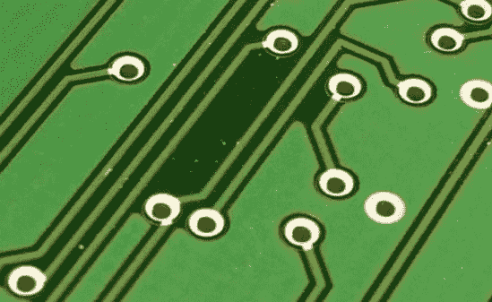
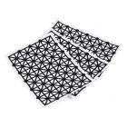
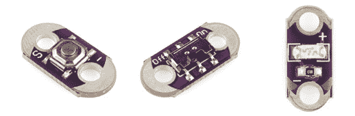
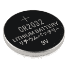
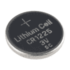

# 纸质电路大指南

> 原文：<https://learn.sparkfun.com/tutorials/the-great-big-guide-to-paper-circuits>

## 介绍

纸质电路在业余爱好电子领域越来越受欢迎。类似工艺品的材料容易获得，新产品越来越丰富，为寻求向电子项目飞跃的手工艺者创造了一个真正独特的生态系统。本指南是对纸电路工艺师可用的材料和技术的概述。

### 什么是纸电路？

纸质电路是构建在纸面上的功能性电子电路，而不是 [PCB](https://learn.sparkfun.com/tutorials/pcb-basics) 。项目范围从贺卡、折纸到传统艺术，如绘画或素描。它们的独特之处在于使用传统的美术技术创造了一个集美观和功能于一体的电路。

### 推荐阅读

在我们开始制作之前，这里有一些你应该熟悉的概念:

*   [什么是电？](https://learn.sparkfun.com/tutorials/what-is-electricity)
*   [什么是电路？](https://learn.sparkfun.com/tutorials/what-is-a-circuit)
*   [极性](https://learn.sparkfun.com/tutorials/polarity)

## 创建跟踪:概述

迹线是代替布线的路径，最常见于印刷电路板上。在纸电路中，我们将使用导电材料代替纸表面的导线来连接元件。在本教程中，我们将讨论三种类型的痕迹:油漆，胶带和墨水。

*The green lines on this PCB are the traces connecting parts of the board.*

## 导电胶带迹线

导电胶带是制作纸质电路最简单的方法之一。只需剥去纸背，按下你想要你的电路去哪里！铜带也是可焊接的，允许元件和迹线之间的牢固连接，这是用油漆和墨水方法无法实现的。

*Prototyping with copper tape and a [SparkFun](https://learn.sparkfun.com/tutorials/light-up-valentine-cards) template***Difficulty:** Beginner
**Cost:** Varies - copper tape ~$.06/ft, fabric tape ~$.79/ft
**Mess Level:** Minimal

#### 优点:

*   没有干燥时间。
*   可焊接(仅铜带)。
*   更容易在当地找到-铜带也用作蜗牛/蛞蝓驱避剂，在五金店有售。它也用于彩色玻璃制作，并可能在当地的工艺品或爱好商店。然而，并非所有的胶带都是一样的——这些胶带可能更难使用，而且粘合剂可能不导电。

#### 缺点:

*   铜带会让你被纸划伤，请小心！
*   更难创造平滑的线条或形状。你可以把胶带剪成更薄的宽度来帮助解决这个问题。
*   导电织物带可能非常昂贵。

### [铜带](https://www.sparkfun.com/products/10561)

 

将**添加到您的[购物车](https://www.sparkfun.com/cart)中！**

 **### 铜带-5 毫米(50 英尺)

[In stock](https://learn.sparkfun.com/static/bubbles/ "in stock") PRT-10561

铜带在电子领域有无数的应用，从制作电子元件的低轮廓走线到射频屏蔽…

$3.954[Favorited Favorite](# "Add to favorites") 31[Wish List](# "Add to wish list")**** 

将**添加到您的[购物车](https://www.sparkfun.com/cart)中！**

 **### [铜带-2”(50 英尺)](https://www.sparkfun.com/products/11081)

[In stock](https://learn.sparkfun.com/static/bubbles/ "in stock") PRT-11081

铜带在电子领域有无数的应用，从制作电子元件的低轮廓走线到射频屏蔽…

$18.507[Favorited Favorite](# "Add to favorites") 9[Wish List](# "Add to wish list")********The most common conductive tape for paper circuits is made of a thin sheet of copper with an adhesive on the bottom that comes on a roll. Manufacturers create the tape in a few different sizes, we like 5mm width tape because it is easy to work with on a smaller crafting scale.

### [镍/铜/钴 1 英寸宽的织物带](http://lessemf.com/fabric.html#225)

*Image from [LessEMF.com](http://lessemf.com/fabric.html#225)*

比铜带更不常见的是由镍、铜和钴制成的导电织物带。这种胶带经得起弯曲和挠曲，是有折叠的项目(如需要轨迹穿过中心折痕的卡片)的绝佳选择。

### 说明:

*   在走线应该走的地方剥离并粘贴，确保在元件将要放置的地方留出缝隙。为了获得最可靠的电路，请尝试在元件之间使用一条连续的胶带。根据需要，在角落周围使用折叠技术或将工件焊接在一起。
*   对于铜带——在弯曲的引线上使用透明胶带将它们固定在走线上。焊接是更安全的选择。对于织物带，我们建议使用导电胶或用导电线缝合连接。

*Note how the copper tape is cut to leave room for the LED.*

### 示例:

*This blushing robot card from [Chibitronics](http://chibitronics.com/) uses thin copper tape to spell the message inside and create the circuit for the LED on the front of the card.*

[https://www.youtube.com/embed/jr1UrKHhXIk#t=16/?autohide=1&border=0&wmode=opaque&enablejsapi=1](https://www.youtube.com/embed/jr1UrKHhXIk#t=16/?autohide=1&border=0&wmode=opaque&enablejsapi=1)

*Jie Qi's [Circuit Sketchbook](http://technolojie.com/circuit_sketchbook/) uses conductive fabric tape in the book's binding and copper tape on the inside cover.*

### 其他资源:

*   铜带纸电路 -这是齐杰在麻省理工学院高低技术实验室开发的铜带原始资料之一。该网站包括一些可打印的模板和技术。
*   [电子产品铜带入门](https://www.youtube.com/watch?v=XKTPqtRwwXA) -视频概述使用铜带、制作连接、折叠拐角和曲线。
*   [焊接导电织物](http://www.kobakant.at/DIY/?p=1718_)-koba Kant 的 Hannah Perner-Wilson 对焊接不同类型的织物所做的测试。

## 导电涂料痕迹

导电涂料是用电子产品创作艺术作品的好方法。使用刷子或挤压瓶创建曲线和漩涡连接组件的痕迹。导电涂料也可用于将元件“粘合”到迹线上。由于混乱的因素和干燥的时间，这种方法是最令人沮丧的。当开始使用这些材料时，我们建议耐心和练习。

**Difficulty:** Beginner - Intermediate (depending on complexity). Can be frustrating to get smooth lines.
**Cost:** Varies. Most conductive paints start at ~$10\.
**Mess Level:** Moderate
*Painting with Bare Conductive Paint and a paintbrush. Image via [Instructables.com](http://www.instructables.com/id/Making-an-Electro-Card-using-Bare-Paint/).*

#### 优点:

*   像使用其他水性涂料一样使用它。
*   干燥后可以用其他颜料介质(如丙烯酸)覆盖，创造出无缝的艺术品
*   很容易在现有迹线上涂上更多的油漆，以排除故障或修复不可靠的连接。

#### 缺点:

*   完全干燥后才能导电。根据你的画的厚度和油漆的类型，可能需要干燥一夜。吹风机或热风枪会加速这个过程。
*   可能需要一些练习来获得一致的线条/痕迹。
*   铜基涂料会很快氧化，保质期很短。
*   在压力下容易破裂。最适合平坦表面。褶皱或可弯曲项目上的绘画痕迹最有可能在重复移动时失败。

### [**裸露的导电油漆**](https://www.sparkfun.com/products/11521)

 

将**添加到您的[购物车](https://www.sparkfun.com/cart)中！**

 **### [【裸露导电-导电涂料(50m l)](https://www.sparkfun.com/products/10994)

[In stock](https://learn.sparkfun.com/static/bubbles/ "in stock") COM-10994

Bare Conductive 的电子涂料就像任何其他水性涂料一样...除了它是导电的！

$32.501[Favorited Favorite](# "Add to favorites") 33[Wish List](# "Add to wish list")**** 

将**添加到您的[购物车](https://www.sparkfun.com/cart)中！**

 **### [【裸导电-电油笔(10ml)](https://www.sparkfun.com/products/11521)

[In stock](https://learn.sparkfun.com/static/bubbles/ "in stock") COM-11521

Bare Conductive 的电动油漆笔就像其他任何水性涂料一样...除了它是导电的！

$12.953[Favorited Favorite](# "Add to favorites") 43[Wish List](# "Add to wish list")**** 

### [【裸导电印刷传感器(3 个装)](https://www.sparkfun.com/products/retired/14696)

[Retired](https://learn.sparkfun.com/static/bubbles/ "Retired") SEN-14696

裸导电创造了复杂的图案，这三包印刷传感器，供您在触摸和接近 se…

**Retired**[Favorited Favorite](# "Add to favorites") 7[Wish List](# "Add to wish list")**** ****Bare Conductive 的电子涂料是一种无毒、无溶剂、水溶性碳基涂料。可在挤压管中获得更细的线条，也可用于刷子和模板。

### **[LessEMF](http://lessemf.com/paint.html)的**的

铜涂料是一种含铜的水性涂料，类似于乳胶漆。4oz 通过加仑容器。由于打开后保质期/工作时间短，我们推荐 4oz 的尺寸。

### 说明:

*   规划电路设计时，首先要画出走线的走向。在绘画之前用铅笔或记号笔画出路径会使这个过程容易得多。

*   把你要用的任何部件都粘在纸上。使用镊子精确放置较小的元件。

*   使用油漆刷或挤压瓶，小心地沿迹线涂抹油漆，涂抹在电路中元件的电线或焊盘上。测试前让其完全干燥。

*Artist carefully following her lines with conductive paint during a [paintable electronics](http://softcircuitsaturdays.com/2010/05/09/paintable-electronics-workshop) workshop held at MIT.*

### 示例:

[https://www.youtube.com/embed/AI-6wMlaVTc/?autohide=1&border=0&wmode=opaque&enablejsapi=1](https://www.youtube.com/embed/AI-6wMlaVTc/?autohide=1&border=0&wmode=opaque&enablejsapi=1)

*[Electronic Popables](http://highlowtech.org/?p=5) is an interactive pop up book created using conductive paints and electronics**[Paper Piano](http://highlowtech.org/wiki/pmwiki.php?n=Main.PaperCircuits) created by [Hannah Perner-Wilson](http://www.plusea.at/?p=1069)*

### 其他资源:

*   麻省理工学院高低技术实验室的铜银涂料绘画指南。
*   [稀释电漆](http://www.bareconductive.com/make/diluting-electric-paint/) -稀释裸导电漆教程。
*   [用乙烯基模板制作模板图形](http://www.bareconductive.com/make/tutorial-1/) -如何制作与导电涂料一起使用的乙烯基模板。
*   [接电漆](http://www.bareconductive.com/make/connecting-to-electric-paint/) -用于裸露导电产品。
*   [导电涂料和油墨](http://www.kobakant.at/DIY/?p=634) -来自 Kobakant 的指南。

## 导电墨水迹线

导电墨水现在可以在预填充笔中使用，这使得通过简单地绘制它们来创建轨迹比以往任何时候都更容易。大多数导电墨水笔也比导电涂料干得快。这种方法可能是最容易应用的，但是附加组件可能更令人沮丧。

**Difficulty:** Beginner to Intermediate (depending on components you are attaching to the ink).
**Cost:** Higher - most pens start ~$20
**Mess Level:** Minimal
*Drawing with a Circuit Scribe pen. Image via Circuit Scribe's [Kickstarter](https://www.kickstarter.com/projects/electroninks/circuit-scribe-draw-circuits-instantly).*

#### 优点:

*   比导电涂料干得快。
*   精确的线条。
*   直观使用。

#### 缺点:

*   可能很难连接组件(参见[连接](https://learn.sparkfun.com/tutorials/the-great-big-guide-to-paper-circuits/making-connections)部分了解技术)。
*   纸张选择很重要-墨水不会附着在某些类型的纸张上。相纸效果最好。
*   可能很容易被误认为是普通的钢笔或记号笔，不小心浪费在非电子项目上。

### [电路划线](https://www.sparkfun.com/products/13254)

 

将**添加到您的[购物车](https://www.sparkfun.com/cart)中！**

 **### [电路划线导电墨水笔](https://www.sparkfun.com/products/13254)

[In stock](https://learn.sparkfun.com/static/bubbles/ "in stock") COM-13254

这是电路划线导电墨水笔，一个简单的看起来圆珠笔，让你画电路，而不是这样…

$6.50[Favorited Favorite](# "Add to favorites") 30[Wish List](# "Add to wish list")**** 

### [电路抄写员制作工具包](https://www.sparkfun.com/products/retired/13255)

[Retired](https://learn.sparkfun.com/static/bubbles/ "Retired") COM-13255

这是电路划线机工具包，一个大规模的导电油墨包，有各种各样的模块和其他项目，您可以…

**Retired**[Favorited Favorite](# "Add to favorites") 17[Wish List](# "Add to wish list")****[Circuit Scribe](https://www.sparkfun.com/products/13254) is a non-toxic, silver conductive ink pen that writes similarly to a gel pen. It is great for creating precise lines and drawings to showcase (and light up) your circuit.

### [AgIC 电路标记器](http://shop.agic.cc/collections/everything/products/agic-circuit-marker-starter-kit)

AgIC 是另一种银基墨水，以记号笔的形式出现。它只能在爱普生光面纸上工作，所以你需要相应地计划你的项目。

### 说明:

*   用铅笔(如果你的导电墨水包里有蜡纸，就用蜡纸)规划你的电路。墨水不能很好地附着在打印机墨粉上，如果你在电脑上设计电路，一定要留下填充的轮廓，而不是直接在上面画线。
*   用导电墨水笔仔细描出你的线条，确保在组件之间保持一条连续的路径。在元件将连接到走线的地方留下较大的圆圈/焊盘。
*   在墨水线上使用胶带、导电胶或电路贴纸来粘贴元件。

### 示例:

*[Paperduino 2.0](http://www.instructables.com/id/Paperduino-20-with-Circuit-Scribe/) - an entire Arduino made with Circuit Scribe ink and components. Image via [Instructables](http://www.instructables.com/id/Paperduino-20-with-Circuit-Scribe/).**Interactive art using Circuit Scribe modules and ink, crafted by SparkFun's Education Team.*

### 其他资源:

*   电子链接资源-Circuit Scribe 的制造商提供可免费下载的工作手册和其他关于使用导电墨水的信息。
*   123d Circuits:Circuit Scribe-AutoDesk 的免费在线编辑器，用于创建 Circuit Scribe 模板和仿真。
*   [Circuit Scribe 讲义](https://drive.google.com/open?id=0B57ZzMh8PXu1fmItcS1DWXBkME1OQUhqanZ3aG05M0ZZa19ZOUZMTEVBQzZ0Q1hJSHRaR2c&authuser=1)-spark fun Education 的 Circuit Scribe 制作模板。
*   [AgIC 入门指南](http://agic.cc/en/getting-started) -如何使用 AgIC 马克笔和一些样本模板进行绘画。

## 选择组件

现在，我们已经探讨了创建走线的选项，让我们来谈谈电路中可以使用的元件。并非所有元件都适合纸质电路走线材料。例如，如果你想焊接连接，铜带将是一个比导电墨水更好的选择。以下是我们对在您的项目中使用的组件的一些建议。

### 通孔元件

带有长引线的通孔元件(如 led)可以用钳子弯曲成可以平放在纸上的形状，并提供更多的表面积来连接走线。腿较短的组件(如 ATtiny85 上的[)可以用手指或钳子小心地弯平。](https://www.sparkfun.com/products/9378)

**与**一起使用

*   裸露导电油漆-使用油漆作为冷焊点。这里有一个[教程](http://www.bareconductive.com/make/connecting-to-electric-paint/)介绍这个过程。
*   铜带-在引线上使用透明胶带快速连接元件，或者直接焊接到铜带上。
*   导电织物带-用导电线缝合引线或使用导电胶进行连接。

### SMD 元件

虽然表面贴装器件(SMD)的工作有点棘手，但它是低姿态的，非常适合小型或扁平的项目，如贺卡。你将需要镊子来放置这些组件，并且需要一双好眼睛来看到部件本身上的标签。SMD 元件可以焊接到铜带上，通过在焊盘上涂上导电涂料进行连接，或者贴在铜带上。这个来自探索博物馆修补工作室的教程展示了两种贴附 SMD LEDs 的方法——焊接和透明胶带。

**与**一起使用

*   铜带-焊接或用导电胶粘贴。一些元件也可以用胶带固定在铜缆上。
*   导电涂料——用强力胶粘到纸上，然后在要连接的元件焊盘上涂上涂料。这里有一个很棒的[教程](http://highlowtech.org/?p=1376),来自高低技术公司，讲述了这个过程。
*   导电墨水——使用强力胶粘在纸上，注意不要夹在墨水垫和元件垫之间。用导电胶或 z 轴胶带连接到油墨。该方法在 Circuit Scribe 的[paper duin no 2.0](http://www.instructables.com/id/Paperduino-20-with-Circuit-Scribe/step5/Placing-components/)项目中使用。

### LilyPad 组件

[LilyPad](https://www.sparkfun.com/categories/135) 元件最初是为电子纺织品应用而制造的，因为它们具有较低的外形和较大的导电焊盘，所以可以很好地与纸质电路配合使用。LilyPad 元件焊接到铜带时效果最佳，但也可以使用 z 轴胶带或在焊盘上放置透明胶带来固定走线。*注意——如果使用透明胶带法，只有[按钮](https://www.sparkfun.com/products/8776)和[开关](https://www.sparkfun.com/products/9350)板有足够大的焊盘来实现良好接触。*

**与**一起使用

*   铜带焊接效果最好，但导电胶带、胶水和透明胶带可能是合适的选择。
*   面料带缝比较理想，还是 z 轴带。

### Chibitronics 电路贴纸

Chibitronics 贴纸上有导电胶，非常适合纸质电路项目。它们与几乎所有纸质电路走线兼容，但可能比使用现成的元件更贵。

**与**一起使用

*   铜带
*   导电织物带
*   导电涂料

### 电路划线模块

Circuit Scribe [模块](http://www.circuitscribe.com/collections/modules)的工作方式不同于我们目前展示的所有其他组件——它们是磁性的。为了附着在你的痕迹上，你需要在你的纸后面有一个金属片或表面。这是一个临时连接，而不是本教程中显示的更永久的连接。虽然它们的大小对于贺卡之类的小项目来说并不理想，但用这些模块制作壁挂或可重新配置的艺术品可能会很有趣。

**与**一起使用

*   铜带
*   导电织物带
*   导电墨水

## 建立联系

既然我们知道了如何创建跟踪，并且已经为我们的项目选择了组件，那么是时候将它们连接在一起了。以下是在元件和走线之间建立电气连接的各种技术。

### 胶带法

透明胶带是开始将元件贴附到纸质电路的一种简单方法，尽管它不如其他方法可靠。用胶带小心地压在元件引线或焊盘上，并向下压到铜带上。对于 SMD 元件，您可以用胶带覆盖整个器件。

*Taping over SMD LED. Image via [Jie Qi's](https://www.flickr.com/photos/jieq/6729196835/in/photostream/) flickr feed.*

**与**一起使用

*   铜带
*   通孔或 SMD 元件

### z 轴磁带

[Z 轴](http://solutions.3m.com/wps/portal/3M/en_US/Electronics_NA/Electronics/Products/Product_Catalog/~/3M-Electrically-Conductive-Adhesive-Transfer-Tape-9703?N=4294406280+5153906&Nr=AND%28hrcy_id%3A5CP6S9HG9Rgs_LXDB394ZN3_N2RL3FHWVK_GPD0K8BC31gv%29&rt=d)胶带是一种易于使用的压敏双面胶带，设计用于柔性电路和 PCB 的连接、粘合和接地。我们可以用小段胶带将元件贴在导电线路上。

**与**一起使用

*   铜带
*   具有较大表面积的组件，如标签(将电线弯曲成螺旋形或正方形，以便粘合剂更容易抓住表面)。
*   大面积的导电油墨——为元件和胶带绘制焊盘。

### 导电涂料

*Image from Bare Conductive's [How to Cold Solder Tutorial](http://www.bareconductive.com/make/how-to-cold-solder-with-bare-paint/).*

导电涂料可用作胶水/冷焊接点，将元件连接到走线。将组件推入湿漆中进行连接，并在通电前让其完全干燥。

**与**一起使用

*   导电涂料迹线——在原始迹线仍然潮湿时连接元件，以实现最佳连接。
*   非柔性表面——油漆在反复压力下会开裂或断裂。涂漆前，将组件支腿穿过纸张，以消除一些应力。
*   通孔和 SMD 元件

### 导电胶/环氧树脂

*An example of conductive epoxy from [Atom Adhesives](http://www.atomadhesives.com/AA-DUCT-CG2-Electrically-Conductive-Silver-Filled-Epoxy-Adhesive?search=cg4).*

导电胶或环氧树脂是连接组件的另一种选择。这些产品是将元件连接到您的纸质电路项目的较昂贵的方式之一，并且可能很难使用。通常它们需要长时间的干燥或热定形。尝试找到一个环氧树脂注射器，以减少混乱，并帮助精确放置。使用这些类型的胶水时，确保通读 MSDS 并遵循所有包装说明。

**与**一起使用

*   铜带
*   导电墨水
*   通孔和 SMD 元件
*   LilyPad 组件

### 焊接

焊接是你可以用纸电路进行的一种更强的连接，唯一的缺点是它只能在铜带上工作——你不能焊接到导电涂料、墨水或大多数织物上。如果你需要帮助学习如何焊接，查看我们的[教程](https://learn.sparkfun.com/tutorials/how-to-solder---through-hole-soldering)。

*Examples of soldering components to copper tape from left to right:
SMD LED from the [Tinkering Studio](http://tinkering.exploratorium.edu/tinkering/2013/09/20/working-with-surface-mount-leds-in-paper-circuits), LilyPad LED from [SparkFun](https://learn.sparkfun.com/tutorials/light-up-fathers-day-card), and 3mm LED from [High Low Tech](http://highlowtech.org/?p=1653).*

**与**一起使用

*   铜带
*   通孔和 SMD 元件
*   LilyPad 组件
*   电路贴纸

## 支持您的项目

纸电路项目可以很容易地用 3V 纽扣电池供电。对于贺卡等小型项目，我们建议使用直径为 20 毫米或 12 毫米的电池。

 

将**添加到您的[购物车](https://www.sparkfun.com/cart)中！**

 **### [纽扣电池- 20mm (CR2032)](https://www.sparkfun.com/products/338)

[In stock](https://learn.sparkfun.com/static/bubbles/ "in stock") PRT-00338

CR2032 锂金属 3V 250mAh 纽扣电池。非常适合为低功耗处理器供电或连续几周闪烁 LED 灯…

$2.10[Favorited Favorite](# "Add to favorites") 33[Wish List](# "Add to wish list")**** 

将**添加到您的[购物车](https://www.sparkfun.com/cart)中！**

 **### [纽扣电池- 12mm (CR1225)](https://www.sparkfun.com/products/337)

[In stock](https://learn.sparkfun.com/static/bubbles/ "in stock") PRT-00337

CR1225 锂金属 3V 12mm 47mAh 纽扣电池。微型传感器节点应用的完美小型电池。Thes…

$2.102[Favorited Favorite](# "Add to favorites") 14[Wish List](# "Add to wish list")**** ****大多数普通的硬币电池看起来就像上面的一样——电池的顶部和侧面是正极，有纹理的底部是负极。这对于附加到我们的痕迹上来说是很棘手的，所以我们将回顾一些技巧来尝试。

Safety Note: Never solder directly to a coin cell battery! To attach a battery, choose a battery holder or battery with tabs specifically for soldering.

在本教程中，您还可以找到一些电池使用和电量的好例子:

 [### LilyPad 基础:为您的项目提供动力

#### 2018 年 9 月 24 日](https://learn.sparkfun.com/tutorials/lilypad-basics-powering-your-project) Learn the options for powering your LilyPad projects, LiPo battery safety and care, and how to calculate and consider power constraints on your projects.[Favorited Favorite](# "Add to favorites") 8

### 创建您自己的电池盒

用手头的材料制作电池盒既快又简单！这里有几种不同的方法来制作你自己的电池盒。

**铜带夹:**

*We at SparkFun use this copper tape technique in all of our pop up card [tutorials](https://learn.sparkfun.com/tutorials/tags/e-craft).*

**纸和铜带夹:**

*Image via [Chibitronics](http://chibitronics.com/paper-battery-holder-tutorial/).*

Chibitronics 有一个关于使用铜带和一张纸制作电池袋的教程。

**纸和导电颜料盒:**

*Image via [Bare Conductive](http://www.bareconductive.com/make/paper-battery-holder-fold-holder/)*

Bare Conductive 有几个不同的纸质电池座教程:

*   [开关](http://www.bareconductive.com/make/paper-battery-holder-switch-holder/)
*   [正方形](http://www.bareconductive.com/make/square-paper-battery-holder/)
*   [折叠](http://www.bareconductive.com/make/paper-battery-holder-fold-holder/)
*   [狭缝](http://www.bareconductive.com/make/paper-battery-holder-slit-holder/)
*   [三角形](http://www.bareconductive.com/make/triangle-paper-battery-holder/)
*   [曝光](http://www.bareconductive.com/make/exposed-paper-battery-holder/)

### 电池座模块

电池座模块可以焊接到铜带上，或者用导电胶或涂料粘合。焊接前，务必记得将电池从支架上取下。

 

将**添加到您的[购物车](https://www.sparkfun.com/cart)中！**

 **### [LilyPad 硬币电池座-开关式- 20mm](https://www.sparkfun.com/products/13883)

[In stock](https://learn.sparkfun.com/static/bubbles/ "in stock") DEV-13883

当然，你那闪烁的、带有芯片曲调的 T 恤衫在聚会上真的很酷...但是在某些时候你需要关掉它。还有…

$2.1012[Favorited Favorite](# "Add to favorites") 49[Wish List](# "Add to wish list")**** 

将**添加到您的[购物车](https://www.sparkfun.com/cart)中！**

 **### 20mm 纽扣电池座(可缝)

[In stock](https://learn.sparkfun.com/static/bubbles/ "in stock") DEV-08822

这是普通 CR2032 型电池的硬币电池座。持有人有一个整洁的插入，弹出功能，使改变…

$1.504[Favorited Favorite](# "Add to favorites") 13[Wish List](# "Add to wish list")**** ****### 标签电池

你也可以购买带焊片的电池——这些电池可以焊接，用导电胶粘合，有时甚至用透明胶带压在适当的位置，以连接到电路上。当你购买带标签的电池时，试着找一个四周绝缘的，以避免意外短路。

*Some examples of tabbed batteries.*Many paper circuit-specific components such as LED stickers, boards, or modules have built-in resistors. If creating your own paper circuit components with off the shelf LEDs, you may need to add resistors to your circuit to account for different voltage requirements.

## 资源和更进一步

哇，我们在本教程中涵盖了很多概念！如果您不确定从哪里开始，尝试用小纸片做实验，探索哪种技术最适合您的项目想法。如果您正在寻找更多指导项目，请查看我们的一些教程:

 [### 点亮父亲节贺卡](https://learn.sparkfun.com/tutorials/light-up-fathers-day-card) Light up your dad's day with this electronic pop-up card 3 [### 让它闪耀节日贺卡](https://learn.sparkfun.com/tutorials/let-it-glow-holiday-cards) Craft a glowing card for friends and family this holiday season with paper circuits - no soldering required 11 [### 亮灯情人节卡片](https://learn.sparkfun.com/tutorials/light-up-valentine-cards) Light up your love with paper circuits - no soldering required 11 [### 裸露导电音乐画](https://learn.sparkfun.com/tutorials/bare-conductive-musical-painting-) Learn how to make a musical painting using the Bare Conductive Touch Board and Conductive Paint.[Favorited Favorite](# "Add to favorites") 6

寻找一些纸质电路设计？查看以下资源:

 [### 纸质电路引脚

#### 2014 年 3 月 31 日](https://learn.sparkfun.com/resources/70) This quick craft project shows you how to create a circuit using copper tape instead of wire to light up an LED and make a wearable piece of e-craft art.[Favorited Favorite](# "Add to favorites") 8 [### 纸质电路:莲花弹出卡

#### 2014 年 5 月 6 日](https://learn.sparkfun.com/resources/81) Templates used in the Have Fun with Paper Circuitry workshop at GESTEM on 5/9/14\.[Favorited Favorite](# "Add to favorites") 8

你也不必受限于只使用纸张。试试用纸板探索电路吧！

 [### 今日英语:纸板电路

November 30, 2017](https://www.sparkfun.com/news/2546 "November 30, 2017: Affordable, consumable, single-layer PCB design! ")[Favorited Favorite](# "Add to favorites") 6******************