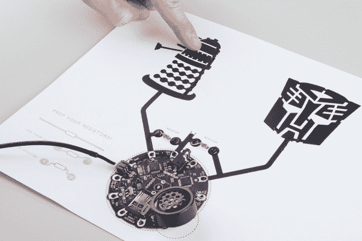

# 有声页面指南

> 原文：<https://learn.sparkfun.com/tutorials/sound-page-guide>

## 介绍

准备好做一些互动艺术了吗？

什么事？好了，我们开始吧！

我们将使用一管[裸露的导电涂料](https://www.sparkfun.com/products/11521)，你将使用它来制作形状、轮廓和图案。只要你将墨水连接到 [LilyPad MP3 板](https://www.sparkfun.com/products/11013)上，你就可以与作品互动。当您触摸其中一个轮廓时，扬声器会发出声音。虽然这种涂料确实导电，但别担心，它的电很小。不会让你震惊的。

本教程是基于裸露的导电涂料墙特色电气！

替换打开

[https://www.youtube.com/embed/pVvEQUbhar8](https://www.youtube.com/embed/pVvEQUbhar8)

替换关闭

### 使用的材料

您将需要一些组件来跟随本教程。以下是你需要的: