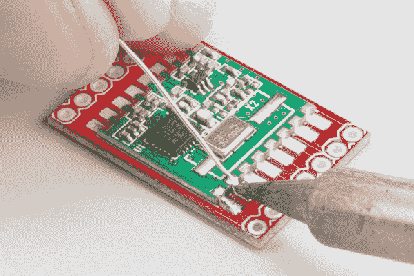

# 如何焊接:堞形安装孔

> 原文：<https://learn.sparkfun.com/tutorials/how-to-solder-castellated-mounting-holes>

## 介绍

制造商中流行的趋势是板对板焊接。这种技术允许公司在一块板上生产集成模块(通常包含几十个部件),这些模块可以在生产过程中构建到另一个组件中。生产用于安装到另一个 PCB 上的 [PCB](https://learn.sparkfun.com/tutorials/pcb-basics) 的一种简单方法是制造齿形安装孔。这些也被称为“堞形通孔”或“堞形”

在本教程中，我们将向您展示如何将带有齿形安装孔的电路板手工焊接到另一个具有适当[尺寸](https://learn.sparkfun.com/tutorials/making-custom-footprints-in-eagle)的 PCB 上。

在本教程中，我们将使用 [SparkFun RF 收发器分线点- RFM22B](https://www.sparkfun.com/products/10154) 作为示例。

### 录像

如果你是一个视觉学习者，我们制作了一个视频，展示如何焊接一个带有城堡形安装孔的模块。它涵盖了本教程中的大部分内容。

[https://www.youtube.com/embed/rGvvwXrv310/?autohide=1&border=0&wmode=opaque&enablejsapi=1](https://www.youtube.com/embed/rGvvwXrv310/?autohide=1&border=0&wmode=opaque&enablejsapi=1)

### 推荐阅读

如果你以前从未焊接过，我们绝对建议你阅读我们的通孔焊接教程，并尝试先焊接一些电镀通孔(PTH)零件。在继续之前，查看下面您不熟悉的任何其他教程。

*   [如何进行通孔焊接](https://learn.sparkfun.com/tutorials/how-to-solder-through-hole-soldering)
*   [印刷电路板(PCB)基础知识](https://learn.sparkfun.com/tutorials/pcb-basics)
*   [设计 PCB:SMD 尺寸](https://learn.sparkfun.com/tutorials/designing-pcbs-smd-footprints)
*   [在 Eagle 中创建自定义足迹](https://learn.sparkfun.com/tutorials/making-custom-footprints-in-eagle)

## 所需材料

像任何焊接工作一样，你需要一些设备。[通孔焊接教程](https://learn.sparkfun.com/tutorials/how-to-solder-through-hole-soldering)中有大量关于[烙铁和附件](https://learn.sparkfun.com/tutorials/how-to-solder---through-hole-soldering#soldering-irons)的信息。如果您需要复习每个工具的功能，请随意查看。

如果您想购买新工具或更新库存，我们[提供许多焊接工具和附件](https://www.sparkfun.com/categories/49)。

### 所需工具

#### 烙铁

任何可信赖的烙铁都可以。我们推荐可以调节温度的东西。

确保尖端足够小，能够安装在一个城堡形过孔的单个焊盘上。您不希望尖端太宽，会在几个焊盘或过孔(也称为引线)之间沉积焊料。这就是我们如何得到焊桥！

#### 黄铜海绵

黄铜海绵是清洁熨斗尖端的好选择。如果你没有黄铜海绵，普通海绵就可以了(一定要用一点水弄湿！).

#### 焊料

选择一些[焊料](https://www.sparkfun.com/search/results?term=solder+blend)。如果你需要复习，我们建议你重温一下你的[焊料知识](https://learn.sparkfun.com/tutorials/how-to-solder---through-hole-soldering#what-is-solder)。在本教程中，我们使用的是[无铅、直径 0.020 英寸的水溶性药芯焊料](https://www.sparkfun.com/products/10240)。

#### 流量

当焊接表面贴装或齿形元件时，强烈推荐使用焊剂。每当你熔化焊料时，焊料中的焊剂芯就会被烧掉。如果你需要再次加热焊料，你需要先加入助焊剂。焊剂有助于清洁表面，并通过改善焊料的[润湿](http://en.wikipedia.org/wiki/Wetting)特性使焊料更好地流动。

我们将使用[水溶性助焊剂笔](http://www.amazon.com/Kester-Formula-2331-ZX-Water-Soluble/dp/B00TZGC6EI/ref=sr_1_3?s=hi&ie=UTF8&qid=1428082632&sr=1-3&keywords=flux+pen+water+soluble)，因为我们焊料中的助焊剂芯是水溶性助焊剂。只要确保你的焊芯中的助焊剂与你正在使用的液态助焊剂相匹配。

#### 镊子

有时你可以把模块握在手里，同时把它滑到液态热焊料上。不过，我们不建议这样做。当你在非常热的东西周围移动时，你需要一把好的镊子来夹住模块。

#### 刷

任何便宜的硬毛刷都可以。我们推荐一种便宜的酸刷，刷毛修剪到大约 1/4 英寸(6 毫米)。焊接完成后，我们需要用它来清洁电路板。

#### 外用酒精

如果你使用“水溶性”或松香助焊剂(它会在笔或罐子上注明)，你会想在焊接后把它从电路板上清除掉。残留在 PCB 上的焊剂可能具有腐蚀性或导致引脚之间的高阻短路(不好！).从技术上来说，你应该使用热的去离子水作为“水溶性”助焊剂，但是我们可以用一些异丙醇来代替。你可以在任何药店或杂货店找到外用酒精。

### 可选工具

#### 尖头罐头盒

[烙铁头镀锡器](https://www.sparkfun.com/products/8966)清洁烙铁头。这是**可选的**，因为你可以直接添加焊料到尖端，并用黄铜海绵清理干净。然而，它对于需要一些新生命的非常旧的铁尖是非常有用的。

#### 焊料芯

[焊芯](https://www.sparkfun.com/products/8775)是**可选**，但是如果你搞砸了，需要移除焊料时，它是必须的。

#### 第三只手或老虎钳

一个好的第三只手(帮助手)或[手钳](https://www.panavise.com/index.html?pageID=1&page=full&--eqskudatarq=7)会帮助你把棋盘抬离桌面，如果你需要它更靠近眼睛的话。您还可以创建自己的[自定义第三只手](https://www.sparkfun.com/products/11784)。

#### 低绒抹布

清洁后，你可以用纸巾擦干你的板子，但纸巾有留下小块棉绒的习惯。我们推荐低绒任务擦拭布，如 [Kimwipes](http://www.amazon.com/Kimberly-Clark-Kimtech-Kimwipes-Delicate-Disposable/dp/B00RORBXA8/ref=sr_1_1?ie=UTF8&qid=1429286271&sr=8-1&keywords=kimwipes) 。

#### 对角切割器

你需要一些东西来切割焊芯，对角切割器通常是首选工具。然而，任何锋利和类似剪刀的东西都可以工作(比如[剥线钳](https://www.sparkfun.com/products/12630)的内部刀片)。

## 焊料！

### 设置您的工作站

在烙铁周围创建一个工作区。

*   确保该区域没有杂物。
*   我们建议放下一个 [ESD 垫](http://www.esdmat.com/)或其他你不会在意它是否被烧伤的表面。不会着火的东西是理想的(即报纸是坏的)。
*   插上你的熨斗，打开它。如果你能调节温度，我们建议大约 700 华氏度(370 摄氏度)。
*   把你的工具放在附近。
*   如果你用的是普通海绵，加水直到变湿。挤出一些多余的水。你希望它是湿的但不滴水。

### 清理你的小费

请务必使用干净的烙铁头。如果你注意到烙铁的顶端变黑、结块或氧化，你就需要清洁它。

*That tip is nasty!*

将焊料直接涂在热烙铁的顶端，直到熔化。你也可以把熨斗放在一个罐头盒里。焊料或锡应该熔化并覆盖尖端。用湿海绵或黄铜海绵擦去多余的焊料或锡。你的小费应该是干净闪亮的！如果没有，重复该过程。

*That tip is nice and clean!*

### 向一个焊盘添加焊料

找到一个角垫，并添加焊料。我们建议使用引脚 1 或角垫。将熨斗尖直接放在垫子上，等待 1-2 秒钟。

慢慢地将焊料注入烙铁头和烙铁垫之间的空间。

焊料应该会融化，你将会在焊盘上形成一个小小的焊料堆。先拆下一股焊料，然后拆下烙铁。

### 加大流量

将焊剂大量地涂在小焊料堆上。请记住，因为我们烧掉了焊料核心中的助焊剂，所以我们需要在重新加热焊料之前添加更多的助焊剂。小心，因为如果对笔尖施加太大的压力，笔可能会倒出焊剂。

### 贴上电路板

使用镊子，用一只手拿起模块。另一方面，拿起你的烙铁。将模块放在附近。我们将熔化一小堆焊料，然后将电路板滑动到位。

**重要提示:**确保您的模块面向正确的方向，或者具有正确的[极性](https://learn.sparkfun.com/tutorials/polarity)！你不想不小心把 PCB 上的零件焊反了。

用烙铁加热焊料堆，直到它熔化。

保持铁在土堆上(我们不希望焊料凝固！)，小心地将模块滑动到位。确保烙铁的尖端接触到第一个堞形过孔和带有熔化焊料的焊盘。我们希望城堡升温并吸走一些焊料。

移除铁之前，请确保模块上的城堡形过孔与封装对齐。当焊料仍然熔化时，您可以根据需要小心地扭转和滑动模块，使其对齐。

取出烙铁，等待焊料冷却凝固。在此过程中不要触摸电路板，否则会破坏良好的焊点。检查接头，确保焊料附着在焊盘和城堡形部分。

如果您发现模块没有与焊盘对齐，请在引脚 1 中添加一些助焊剂，用铁头接触接头以熔化焊料，并用镊子小心移动模块，以便一切对齐。这也是一个很好的时间来检查在板的另一边的城堡形安装孔，以确保它在添加更多的焊料之前是对齐的。

### 焊接下一个引脚

在下一个焊盘上，握住烙铁的尖端，使其接触城堡形过孔和焊盘。将焊料注入接点(烙铁头、过孔和焊盘的交叉点)。焊料开始熔化可能需要一段时间，所以请耐心等待。

一旦你有足够的焊料，首先去除焊料。

一旦焊料脱落，就将烙铁移开。在接触电路板之前，等待焊料冷却。检查接头，确保焊料覆盖了过孔和焊盘。

### 焊接其余部分

一个接一个地将每个齿形过孔焊接到焊盘上，直到所有过孔都焊接到焊盘上。

### 擦黑板

您完成的组装可能会在引脚附近的电路板或模块上残留一些助焊剂。它将是粘稠的，外观呈黑色或琥珀色。你会想把它擦干净的。

在碗中倒入一些外用酒精，用刷子蘸一下，在针和垫上擦洗，去除残留物。

用低绒毛巾或纸巾擦干板子。我们推荐类似于 [Kimwipes](http://www.amazon.com/Kimtech-Science-KimWipes-Delicate-Wipers/dp/B00RORBXA8/ref=sr_1_1?ie=UTF8&qid=1427912942&sr=8-1&keywords=kimberly+clark+kimwipes) 的东西来避免在板上留下棉绒。压缩空气或罐装空气对此也很有效。

检查你的作品！确保所有引脚都焊接到各自的焊盘上，电路板上没有助焊剂残留物。你可能需要重复几次清洗过程，以达到完全无焊剂。

## 解决纷争

本节将介绍表面贴装焊接的几个常见问题。

### 顽固的 GND 别针

你可能会注意到，只有几个你焊接的引脚比其他引脚更顽固，因为他们不愿意接受焊接。这是由于地(GND)面(或倒)。在 PCB 设计中，你可以通过走线(遍布 PCB 的细小铜线)进行连接，也可以创建一个平面或一堆铜(下图中暗红色 PCB 之间的浅红色斑点)。这些通常连接到 GND 或 Vcc，但可以连接到任何你想要的信号。无论它们连接到哪种信号，这种大面积的铜平面往往比细导线吸收更多的热量，这使得它们更难焊接。

*Each of the green arrows in the above photo are pointing to a pad that is connected to the pour instead of a trace.*

如果某个衬垫给你带来了麻烦，检查一下它是不是和一个倒相连接的衬垫。如果是这样的话，在焊接之前，多花几秒钟加热焊盘。一点额外的流量也将有助于 stuborn 垫。

### 修正错误

如果你犯了一个错误，比如把两个引脚焊接在一起，会发生什么？

最简单的解决方法是使用一点点焊料芯和一些焊剂来去除焊料。

#### 准备灯芯

如果焊芯末端有任何焊料，将其夹掉。焊料将是银色的。

在灯芯末端涂上助焊剂。大多数焊芯都含有一些助焊剂，但多加一些也有帮助。

#### 去除多余的焊料

将焊芯压在焊桥上，并将烙铁头固定在焊芯上。等待几秒钟，引脚之间的焊料会被吸到灯芯中。

#### 固定销

如果你不小心从一个接点上去除了太多的焊料，你可以简单地在接点上添加助焊剂，将烙铁头固定在接点上，再添加一点焊料。

#### 清洁接缝

任何时候你添加助焊剂或焊料(可能含有助焊剂)到接头上，你都要用刷子和一些外用酒精来清洁。

#### 检查你的工作

再次检查接头，确保桥接已经移除，并且所有引脚上都有良好的焊料沉积。

## 资源和更进一步

### 先进的技术

虽然它最初是为 PTH 焊接而创建的，但 Joel 在视频中展示了一些非常先进的焊接技术。

如果你有一个足够小的模块或适合热空气返工站的正确提示，你可以使用 David 在本视频中展示的部件拆除技术来拆除模块。

### 资源

如果您对焊接的更多信息感兴趣，这里有一些资源:

*   [如何与大卫·斯蒂尔曼焊接](https://www.youtube.com/watch?v=f95i88OSWB4)
*   [电子产品如何在 SparkFun 上制造](https://learn.sparkfun.com/tutorials/electronics-assembly)
*   [学习焊接套件](https://www.sparkfun.com/search/results?term=learn+to+solder&what=products&_ga=1.96588639.1931450371.1419877130)

如果您希望设计自己的 PCB，我们有一系列优秀的教程，涵盖了使用 Eagle 这一免费 PCB 设计软件的设计过程。

 [### 如何安装和设置 EAGLE](https://learn.sparkfun.com/tutorials/how-to-install-and-setup-eagle) Not just how to download and install EAGLE, but how to install the SparkFun EAGLE Libraries and scripts.[Favorited Favorite](# "Add to favorites") 39 [### 使用 EAGLE:原理图](https://learn.sparkfun.com/tutorials/using-eagle-schematic) How to design a PCB in EAGLE using through-hole parts.[Favorited Favorite](# "Add to favorites") 42 [### 使用 EAGLE:纸板布局](https://learn.sparkfun.com/tutorials/using-eagle-board-layout) Part 2 of the Using Eagle tutorials, this one covers how to lay out a board after designing a schematic.[Favorited Favorite](# "Add to favorites") 37