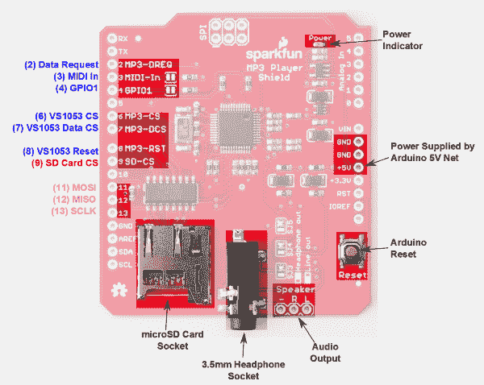
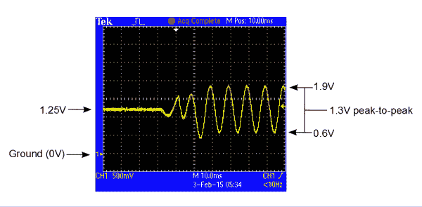
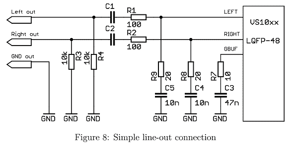

# MP3 播放器防护罩连接指南 V15

> 原文：<https://learn.sparkfun.com/tutorials/mp3-player-shield-hookup-guide-v15>

## 介绍

你想在你的项目中加入一些新的元素吗？你的鬼屋或者万圣节服装需要嵌入一些音效吗？你只是想说你制作了自己的 MP3 播放器吗？ [MP3 播放器保护罩](http://www.sparkfun.com/products/12660)是向您的项目添加音乐或声音效果的简单方法。

[](https://www.sparkfun.com/products/12660) 

将**添加到您的[购物车](https://www.sparkfun.com/cart)中！**

 **### [SparkFun MP3 播放器屏蔽](https://www.sparkfun.com/products/12660)

[In stock](https://learn.sparkfun.com/static/bubbles/ "in stock") DEV-12660

SparkFun MP3 播放器盾是一个可怕的 MP3 解码器，能够存储音乐文件到一个普通的…

$28.9515[Favorited Favorite](# "Add to favorites") 39[Wish List](# "Add to wish list")** **在本教程中，我们将检查 MP3 播放器屏蔽的所有细节。然后我们将继续介绍一些示例代码。希望在通读完这篇教程后，你会受到启发，制作下一个伟大的 [MP3 Shield 音乐盒](https://learn.sparkfun.com/tutorials/mp3-player-shield-music-box)或另一个摇滚的、播放音乐的 Arduino 项目。

### 要求

要完成本教程，您需要以下物品:

*   当然是一个 [MP3 播放器屏蔽](https://www.sparkfun.com/products/12660)。演出的明星。
*   SD 卡和一台可以下载音乐文件的电脑。
*   一个 [Arduino Uno](https://www.sparkfun.com/products/11021) 、 [RedBoard](https://www.sparkfun.com/products/11575) 、 [Arduino Pro](http://www.sparkfun.com/products/10915) 或任何其他 Arduino 兼容板。
*   带有 3.5 毫米插孔终端或[有源扬声器](https://www.sparkfun.com/products/9151)的耳机。
*   有些 **MP3 文件**要槽到。

### 检查您的硬件版本

本连接指南描述了 MP3 shield 1.5 版中增加的输出配置功能。

如果你不确定你得到了哪个版本，在耳机插孔下面的底部铜层上有一个版本号，如下所示。本指南适用于标有“V15”的电路板(铜线中省略了小数，因此 1.5 版 PCB 标有 15)。

[](https://cdn.sparkfun.com/assets/learn_tutorials/3/4/4/versions.jpg)*At Top: Older Revision (4-1-11)
Below: Current Revision (V15)*

如果你有一个旧版本的标有日期代码“4-1-11”的 MP3 保护罩，你可以在这里找到匹配的连接指南[。最显著的区别在于，V15 板增加了一些元件来支持交流耦合线路输出。](https://learn.sparkfun.com/tutorials/mp3-player-shield-hookup)

### 推荐阅读

在开始学习本教程之前，您应该熟悉一些基本概念。如果这些教程的主题对你来说听起来很陌生，那么在继续学习这个连接指南之前先阅读一下。

*   什么是 Arduino？
*   [Arduino 盾牌](https://learn.sparkfun.com/tutorials/arduino-shields-v2)
*   [如何安装 Arduino 库](https://learn.sparkfun.com/tutorials/installing-an-arduino-library)
*   [串行外设通信(SPI)](https://learn.sparkfun.com/tutorials/serial-peripheral-interface-spi)

## 硬件概述

MP3 播放器保护罩的核心是一个 [VS1053B 音频编解码器 IC](https://www.sparkfun.com/datasheets/Components/SMD/vs1053.pdf) 。VS1053B 是一款多功能小芯片。除了 MP3 之外，它还可以解码 Ogg Vorbis、AAC、WMA 和 MIDI。(它还能够对音频进行*编码*，尽管这超出了 MP3 Shield 的范围。)

支持 VS1053B 的是一个 **SD 卡插口**，可以用来存储 MP3 文件。使用 Arduino [SD 库](http://arduino.cc/en/Reference/SD)，很容易从 SD 卡上读取音乐文件，并将其传输到 VS1053B。板上还有额外的电路，可将信号电平转换至 SD 卡允许的最大 3.3V。

以下是 MP3 播放器保护罩上的重要连接器和其他组件的快速直观概述:

[](https://cdn.sparkfun.com/assets/learn_tutorials/3/4/4/flat-labeled.png)

在上图中，蓝色标签是 VS1053 MP3 编解码器 IC 使用的引脚，红色标签用于与 SD 卡通信，紫色标签的引脚由*两个*组件使用(耶 [SPI](https://learn.sparkfun.com/tutorials/serial-peripheral-interface-spi) ！).

#### 正在使用哪些引脚？

MP3 播放器保护罩需要*专用*几个插脚。这些引脚*不能*用于连接其他设备:

*   **D2** 连接到 VS1053B 的**数据请求**输出。此引脚是一个中断，它告诉 Arduino 需要更多音乐数据。
*   **D6** 连接到 VS1053B 的**片选**输入。此低电平有效引脚告知芯片何时有数据发送给它。
*   **D7** 连接到 VS1053B 的**数据芯片选择**输入，告知芯片音乐数据何时发送。
*   **D8** 接 VS1053B 的**复位**输入。
*   **D9** 接 SD 卡的**片选**输入。

Arduino 的三个 SPI 数据和时钟引脚 D11、D12 和 D13 可用于连接其它 SPI 器件。然而，除了 SPI 之外，它们不能用于任何目的。

**Heads up!** The shield was designed with the Arduino Uno R3 with ATmega328P footprint in mind. As with any development board, you may need to reroute pins and convert the logic levels if you are not using an ATmega328P-based board. For example, the [Arduino Mega 2560 has SPI pins](https://www.arduino.cc/en/reference/SPI) located on a different part of the board. You will need to reroute the SPI pins and CS has to be declared in code during initialization as pin 53\. From user experience, you may want to avoid using pin 2, 6, 7, and 8\. Since it is a 5V board, you would not need to worry about any logic conversion.

#### 哪些引脚是空闲的？

咻！屏蔽确实消耗了相当多的引脚，但这里的引脚仍然可以连接到其他组件。

*   管脚 0 和 1 上的硬件 UART 管脚- **RX** 和 **TX**
*   **D5** 和 **D10** (PWM 引脚！)
*   所有模拟引脚( **A0 至 A5** )。

#### 可选引脚跳线

我们还没有提到的两个引脚是 D3 和 D4，它们分别连接到 VS1053B 的 MIDI-In 和 GPIO1 引脚。这些引脚的使用**可选**。大多数 MP3 播放功能都不需要它们，包括我们将在本教程中展示的例子。

[](https://cdn.sparkfun.com/assets/learn_tutorials/3/4/4/midi-jumpers-labeled.png)

要禁用这些引脚中的任何一个，可以使用[业余爱好刀](https://www.sparkfun.com/products/9200)切断标签旁边的**跳线**。

## 获取音频

VS1053 在一个小小的芯片上集成了许多功能。它在单个 IC 中集成了 MP3 解码器、音量控制和耳机放大器。它是许多小型 MP3 播放器的核心。然而，由于 SparkFun MP3 播放器 Shield 在便携式设备之外的应用中找到了出路，因此输出需要更加灵活。在下面的部分中，我们将探索如何配置输出硬件，以及配置背后的原因。

### 输出连接

电路板的音频输出位于 3.5 毫米耳机插孔和相邻的 0.1 英寸焊盘上。

[](https://cdn.sparkfun.com/assets/learn_tutorials/3/4/4/outputs-labeled.png)*You can use the 3.5mm jack or solderpads to access the output*

焊盘和耳机插孔是并联的-焊盘和插孔上都有相同的信号。它们的连接方式如下。

| **信号名称** | **插孔连接** | **焊盘连接** |
| 左声道 | 小费 | " L " |
| 右声道 | 戒指 | " R " |
| 参考
(接地或 GBUF) | 袖子 | "-" |

### 快速测试

要听到 MP3 Shield 的输出，最简单的方法是将一套耳机插入 3.5 毫米的连接器。VS1053B 的额定驱动负载阻抗为 16 &ohm;或更高的手机——典型的耳机和耳塞通常为 32 &ohm;，远远超过限制。

如果耳机是您想要的输出方式，您可以插入耳机并[跳到下一节](https://learn.sparkfun.com/tutorials/mp3-player-shield-hookup/assembly--preparation)。但是，如果你想与其他设备接口，如连接到电脑，外部放大器，或更大的扬声器，请继续阅读。

### 输出电路细节

VS1053B 设计用于驱动耳机的电池供电应用。特别是，耳机放大器电路针对这种情况进行了优化，这使得其他用例变得有点困难。这是一个足够复杂的话题，VLSI 发布了一篇[应用笔记](http://www.sparkfun.com/datasheets/Widgets/MP3Trigger/vs10XXan_output.pdf)来说明正确的互连。

首先，让我们仔细看看输出是如何为驱动耳机量身定制的。

具体来说，来自 VS1053 的信号被 **DC 耦合**。这意味着交流(AC)音频信号在 1.25 V DC 偏移之上。数据手册规定输出的峰峰值摆幅约为 2 V，因此输出信号的摆幅在 0.25V 至 2.25 V 之间。

[](https://cdn.sparkfun.com/assets/learn_tutorials/3/4/4/dc-offset-scope.png)*Headphone signals, riding on a 1.25V DC offset*

有两件棘手的事情可以让这个工作。首先，耳机是独立的——它们没有任何其他的接地连接。

另一件事是 VS1053B 提供了一个特殊的 DC 参考电压输出。该芯片产生“GBUF”输出，保持在 1.25 VDC，连接到耳机连接的套管。播放器安静的时候，输出和基准都是 1.25 V，所以没有电流流过。当信号存在时，输出和 GBUF 之间的电势差产生电流，使耳机中的驱动器移动，产生声音。

尽管名字中有“G”，GBUF 是*而不是*地——在引脚描述中，数据表特别警告我们**“耳机的公共缓冲器，不要接地！”**

### 在哪里分解

虽然这对于耳机来说很好，但当我们想要将输出连接到其他设备时，事情就变得复杂了，尤其是当它们自己有接地连接时。数据手册描述了以下情况:

*   该播放器通过 USB 连接到 PC 来供电，就像我们通常使用 Arduino 板一样。USB 插孔在电脑内部接地。
*   使用一根[3.5 毫米电缆](https://www.sparkfun.com/products/8566)将播放器的输出插入 PC 线路输入插孔。

如上所述，耳机输出的套管是 GBUF 信号，其上有 1.25V DC 偏移，但 PC 线路输入的套管接地，为 0 V

[](https://cdn.sparkfun.com/assets/learn_tutorials/3/4/4/pc-connection.png)

将它们插在一起会导致短路，并可能损坏连接两端的电路！

### 接合交流耦合

为了解决这个问题，我们需要消除 MP3 播放器屏蔽输出端的 DC 电压。摆脱 DC 电压被称为**交流耦合**(有时也被称为 **DC 阻断**)。输出的交流部分(音频波形本身)被传输(或**耦合**)到另一个设备，但 DC 偏移被消除。VS1053B 应用笔记针对交流耦合输出提出了一些建议，我们实现了图 8 所示的电路。

[](https://cdn.sparkfun.com/assets/learn_tutorials/3/4/4/fig8.png)

交流耦合电路通过焊接跳线 SJ3、SJ4 和 SJ5 启用。通过重新配置这些跳线，我们可以将 DC 耦合耳机输出转换为交流耦合**线路输出**。

*   SJ3 和 SJ4 在 L 和 R 输出端增加 10 F 电容。1.25 V 偏移不会越过电容，有效地将波形重新集中在 0V 左右
*   SJ5 将套管和“-”端子改为接地，而不是 GBUF，避免了上述短路

跳线都一起工作-它们都应该设置在同一个方向。

要更换跳线，首先加热并使用或移除默认斑点。然后让新焊料流到另一对焊盘上。用放大镜或连续性测试仪来检验你的工作是很有用的。

[](https://cdn.sparkfun.com/assets/learn_tutorials/3/4/4/blobs.jpg)*Jumpers set for Line Output*

交换跳线后，输出波形围绕地重新定向。

[](https://cdn.sparkfun.com/assets/learn_tutorials/3/4/4/ac-coupled-scope.png)*Waveform centered on ground.*

那么，为什么不一直启用交流耦合电路呢？有一个主要原因:与输出串联的附加电阻使耳机比 DC 耦合配置安静得多。对于线路输入来说，这不是问题，线路输入通常为 10k &ohm;或更高，但在驱动低阻抗耳机时，这成为一个重要的[分压器](https://learn.sparkfun.com/tutorials/voltage-dividers)。大点声*就是*更好，对吧？

### 外部扬声器

如果您想让其他人听到 MP3 播放器的声音，您需要添加外部扬声器。虽然你可以简单地将扬声器插入耳机输出，但板载电路不足以驱动它们——它们会非常安静。

在 SparkFun 总部出现的一个简单的解决方案是简单地将播放器插入一组自供电的多媒体 PC 扬声器。

如果你正在寻找驱动扬声器的 DIY 解决方案，考虑使用我们的[单声道音频放大器分线点](https://www.sparkfun.com/products/11044)或[立体声放大器套件](https://www.sparkfun.com/products/9612)。

* * *

### 输出配置汇总

| **连接** | **设置 SJ3、SJ4、SJ5** | **附加硬件** |
| 耳机 | 耳机用
(向右) | - |
| 外部有源设备
(电脑、立体声接收器、有源扬声器等) | 用于直线输出
(向左) | - |
| 无源扬声器 | 用于直线输出
(向左) | 音频放大器 |

## 组装和准备

在我们开始上传代码和播放一些音乐之前，首先要做一些准备工作。你需要[焊接](https://learn.sparkfun.com/tutorials/how-to-solder-through-hole-soldering)一些东西到屏蔽上，并准备一个 SD 卡。

### 添加标题

要开始屏蔽，你需要焊接一些头。如果您想保持屏蔽层的可堆叠性，[我们的 R3 可堆叠插头套件](https://www.sparkfun.com/products/11417)可能是最佳选择。否则，[直男标题](https://www.sparkfun.com/products/116)也一样管用。

[](https://cdn.sparkfun.com/assets/learn_tutorials/3/4/4/headers.jpg)*An MP3 Player Shield with stackable headers soldered on.*

查看我们的[防护罩装配指南](https://learn.sparkfun.com/tutorials/arduino-shields-v2/installing-headers-preparation)以获得更多帮助，为您的防护罩添加接头。

### MP3 文件和 SD 卡设置

在连接的这个阶段，您可能还需要开始准备您的 SD 卡。首先，确保**的格式**正确。我们将使用的 SDFat Arduino 库仅支持 FAT16 或 FAT32 格式的卡。您的卡可能已经被格式化为这些标准中的一个，但是仔细检查一下也无妨。

[](https://cdn.sparkfun.com/assets/learn_tutorials/3/4/4/card-filesystem.png)

你可能也想准备你的音乐文件。VS1053B 能够播放 MP3、AAC、WMA、MIDI 和 Ogg Vorbis 音频文件。VS1053B 支持各种文件类型的采样速率和比特率。查看[数据表](https://www.sparkfun.com/datasheets/Components/SMD/vs1053.pdf)(从第 8 节-第 26 页开始)，确保您的音频文件受支持。例如，MP3 支持高达 320 kbps 的比特率和 48 kHz 的采样率。

最后，在将音频文件加载到您的 SD 卡之前，您需要**修改它们的名称**。SDFat 库仅支持“8.3”文件名——即“.”前的八个字符以及后面的三个字符(例如“track001.mp3”)。此外，我们稍后将使用的一些示例代码要求使用特殊的约定来命名音频文件。在 [MP3 触发示例](https://learn.sparkfun.com/tutorials/mp3-player-shield-hookup/example-sketch-mp3-trigger)中，需要将文件命名为“track001.mp3”、“track002.mp3”等。

## 使用 SFEMP3Shield 库

由比尔·波特、迈克尔·弗拉格、ddz 和韦德·布雷纳德合作编写的 SFEMP3Shield Arduino 库是 MP3 播放器 Shield 的一个惊人资源。结合同样令人敬畏的 [SdFat 库](https://code.google.com/p/sdfatlib/)，SFEMP3Shield 大大简化了与 VS1053 接口和使用 MP3 播放器屏蔽的任务。

我们建议将 SFEMP3Shield 库与此屏蔽一起使用。在这一页，我们将了解如何安装和使用该库。在下一页，我们将用它画一个有趣的草图。

### 安装 SFEMP3Shield 库

要下载 SFEMP3Shield 的最新版本，请单击库的 [GitHub 页面](https://github.com/madsci1016/Sparkfun-MP3-Player-Shield-Arduino-Library)上的“下载 ZIP”链接。你应该也能从[这里](https://github.com/madsci1016/Sparkfun-MP3-Player-Shield-Arduino-Library/archive/master.zip)直接抢到。

这个 GitHub repo 已经包含了一个 **SdFat 库**的副本，所以你可以在这里看到。

您提取的“spark fun-MP3-Player-Shield-Arduino-Library-master”文件夹中应该有一些文件夹。特别需要将**“SF EMP 3 shield”**和**“SdFat”**文件夹安装为 Arduino 库。要获得安装库的帮助，请查看我们的[安装 Arduino 库教程](https://learn.sparkfun.com/tutorials/installing-an-arduino-library)。您需要将这两个文件夹放在您的 Arduino sketchbook 中(默认情况下在您的 home/Arduino 文件夹中)。安装后，您的文件结构应该如下所示:

[](https://cdn.sparkfun.com/assets/learn_tutorials/3/4/4/lib-dialog.png)

现在重新启动 Arduino(如果它是打开的)，检查“草图”>“导入库”菜单，确保“SFEMP3Library”和“SdFat”都列在那里。

### 上传示例草图

SFEMP3Shield 库包括一些有趣的示例草图，展示了它所有令人敬畏的能力。首先，通过进入“文件”>“示例”>“SF EMP 3 shield”>“示例”>“文件播放器”，尝试加载**“文件播放器”**示例。

确保 MP3 播放器保护罩舒适地放在您的 Arduino 上，然后上传！

上传后，打开 **[串口监视器](https://learn.sparkfun.com/tutorials/terminal-basics)** ，设置波特率为 **115200** bps。根据我们的经验，这个草图在 Arduino IDE 中与串行监视器配合使用效果最好。一旦草图初始化，它将为您呈现一个可导航的菜单:

[](https://cdn.sparkfun.com/assets/learn_tutorials/3/4/4/serial-menu.png)

希望在菜单的底部，你会看到草图在你的 SD 卡上找到的 MP3 文件列表。尝试发送一个带前导零的 3 位数(如 001、003 等)。)使其中一个列出的文件开始播放。你开始跳舞了吗？

如果太安静了，请尝试使用“+”命令调高音量，或者使用“-”调低音量。还有各种其他有趣的选择可以尝试。

### 有用的 SF EMP 3 屏蔽库文档

如果您正在寻找使用 SFEMP3Shield 的帮助，请查看他们的支持网站的[主页。这里有一些很好的故障排除信息。](http://mpflaga.github.io/Sparkfun-MP3-Player-Shield-Arduino-Library/)

要深入研究代码，您可以查看他们的 [GitHub 库](https://github.com/madsci1016/Sparkfun-MP3-Player-Shield-Arduino-Library/tree/master/SFEMP3Shield)。还有一个有用的 [SFEMP3Shield 类参考](http://mpflaga.github.io/Sparkfun-MP3-Player-Shield-Arduino-Library/class_s_f_e_m_p3_shield.html)指南，它列出了该库提供的所有功能。

* * *

在下一页，我们将使用 MP3ShieldLibrary 制作一个示例草图，展示它的一些更基本的功能。

## 示例草图:MP3 触发器

无论是[红色](https://www.sparkfun.com/products/11029)还是[紫色](https://www.sparkfun.com/products/11013)，每个人都喜欢一个好的 MP3 触发器。只需一个简单的按钮或开关就能触发歌曲或音效。让我们用 MP3 播放器盾库做一个可以媲美大男孩的 MP3 触发器。

这是一个简单的例子，展示了如何使用 SFEMP3Shield 库来播放和停止音轨。使用引脚 0、1、5、10 和 A0-A4，屏蔽最多可以触发九个轨道。A5 可用于停止当前播放的曲目。

### 第一步:安装 SD 卡

在将 SD 卡插入您的保护罩之前，您需要重命名您的 MP3 文件。九首曲目中的每一首都需要具体命名，从“track001.mp3”到“track009.mp3”。

[](https://cdn.sparkfun.com/assets/learn_tutorials/3/4/4/track-layout.png)

第一个触发器 D0 将播放名为“track001.mp3”的 MP3，第二个触发器 D1 将播放“track002.mp3”，依此类推，直到 A4 将播放“track009.mp3”。

### 步骤 2:安装硬件

当然，shield 会为您设置大部分硬件。除了在你的 Arduino 上贴上护盾之外，你还需要找到触发针的东西。你可以使用一个[开关](https://learn.sparkfun.com/tutorials/button-and-switch-basics)，其中有大量的选项，或者你可以只使用一个简单的跳线来接地其中一个触发引脚。

[](https://cdn.sparkfun.com/assets/learn_tutorials/3/4/4/524f0233757b7f69648b4569.png)

上图显示了 MP3 播放器保护罩的早期版本。连接 MP3 触发器示例的电路是相同的。

一旦[配置了输出](https://learn.sparkfun.com/tutorials/mp3-player-shield-hookup-guide-v15#getting-audio-out)，你可以将耳机插入板载插孔收听，或者，如果你想用它来玩玩，使用三个断开的“扬声器”引脚。这是我们用[单音分线点](https://www.sparkfun.com/products/11044)和[8ω扬声器](https://www.sparkfun.com/products/9151)组合的设置:

### 步骤 3:加载代码

这是我们的 MP3 屏蔽触发器草图。从下面复制/粘贴，或在此下载:

```
language:c
/*
  MP3 Shield Trigger
  by: Jim Lindblom
      SparkFun Electronics
  date: September 23, 2013

  This is an example MP3 trigger sketch for the SparkFun MP3 Shield.
  Pins 0, 1, 5, 10, A0, A1, A2, A3, and A4 are setup to trigger tracks
  "track001.mp3", "track002.mp3", etc. on an SD card loaded into
  the shield. Whenever any of those pins are shorted to ground,
  their respective track will start playing.

  When a new pin is triggered, any track currently playing will
  stop, and the new one will start.

  A5 is setup to globally STOP playing a track when triggered.

  If you need more triggers, the shield's jumpers on pins 3 and 4 
  (MIDI-IN and GPIO1) can be cut open and used as additional
  trigger pins. Also, because pins 0 and 1 are used as triggers
  Serial is not available for debugging. Disable those as
  triggers if you want to use serial.

  Much of this code was grabbed from the FilePlayer example
  included with the SFEMP3Shield library. Major thanks to Bill
  Porter and Michael Flaga, again, for this amazing library!
*/

#include <SPI.h>           // SPI library
#include <SdFat.h>         // SDFat Library
//#include <SdFatUtil.h>     // SDFat Util Library
#include <SFEMP3Shield.h>  // Mp3 Shield Library

SdFat sd; // Create object to handle SD functions

SFEMP3Shield MP3player; // Create Mp3 library object
// These variables are used in the MP3 initialization to set up
// some stereo options:
const uint8_t volume = 0; // MP3 Player volume 0=max, 255=lowest (off)
const uint16_t monoMode = 1;  // Mono setting 0=off, 3=max

/* Pin setup */
#define TRIGGER_COUNT 9
int triggerPins[TRIGGER_COUNT] = {0, 1, 5, 10, A0, A1, A2, A3, A4};
int stopPin = A5; // This pin triggers a track stop.
int lastTrigger = 0; // This variable keeps track of which tune is playing

void setup()
{
  /* Set up all trigger pins as inputs, with pull-ups activated: */
  for (int i=0; i<TRIGGER_COUNT; i++)
  {
    pinMode(triggerPins[i], INPUT_PULLUP);
  }
  pinMode(stopPin, INPUT_PULLUP);

  initSD();  // Initialize the SD card
  initMP3Player(); // Initialize the MP3 Shield
}

// All the loop does is continuously step through the trigger
//  pins to see if one is pulled low. If it is, it'll stop any
//  currently playing track, and start playing a new one.
void loop()
{
  for (int i=0; i<TRIGGER_COUNT; i++)
  {
    if ((digitalRead(triggerPins[i]) == LOW) && ((i+1) != lastTrigger))
    {
      lastTrigger = i+1; // Update lastTrigger variable to current trigger
      /* If another track is playing, stop it: */
      if (MP3player.isPlaying())
        MP3player.stopTrack();

      /* Use the playTrack function to play a numbered track: */
      uint8_t result = MP3player.playTrack(lastTrigger);
      // An alternative here would be to use the
      //  playMP3(fileName) function, as long as you mapped
      //  the file names to trigger pins.

      if (result == 0)  // playTrack() returns 0 on success
      {
        // Success
      }
      else // Otherwise there's an error, check the code
      {
        // Print error code somehow, someway
      }
    }
  }
  // After looping through and checking trigger pins, check to
  //  see if the stopPin (A5) is triggered.
  if (digitalRead(stopPin) == LOW)
  {
    lastTrigger = 0; // Reset lastTrigger
    // If another track is playing, stop it.
    if (MP3player.isPlaying())
      MP3player.stopTrack();
  }
}

// initSD() initializes the SD card and checks for an error.
void initSD()
{
  //Initialize the SdCard.
  if(!sd.begin(SD_SEL, SPI_HALF_SPEED)) 
    sd.initErrorHalt();
  if(!sd.chdir("/")) 
    sd.errorHalt("sd.chdir");
}

// initMP3Player() sets up all of the initialization for the
// MP3 Player Shield. It runs the begin() function, checks
// for errors, applies a patch if found, and sets the volume/
// stero mode.
void initMP3Player()
{
  uint8_t result = MP3player.begin(); // init the mp3 player shield
  if(result != 0) // check result, see readme for error codes.
  {
    // Error checking can go here!
  }
  MP3player.setVolume(volume, volume);
  MP3player.setMonoMode(monoMode);
} 
```

检查代码中的注释，以获得分步演练。这个例子显示了使用 MP3 播放器保护罩是多么容易(非常感谢比尔·波特和迈克尔·弗拉格的图书馆，T2)。调用`MP3player.playTrack()`函数开始一首歌，使用`MP3player.stopTrack()`调用停止。

### 第四步:触发一些曲调

加载草图后，您只需将其中一个触发引脚接地(0、1、5、10、A0、A1、A2、A3、A4)。当新的触发引脚接地时，任何当前播放的歌曲都将停止，与之相关的 MP3 文件将开始播放。如果你想停止一个轨道，简单地将 A5 接地。

您可以将这些触发引脚中的任何一个连接到所有类型的[按钮或开关](https://www.sparkfun.com/categories/145)，或者仅使用一股电线将它们暂时接地。

## 资源和更进一步

本教程已经结束，但仍有大量资源可以帮助您充分利用 MP3 播放器保护罩:

*   [MP3 播放器防护罩示意图](https://cdn.sparkfun.com/datasheets/Dev/Arduino/Shields/MP3%20Shield_v15.pdf)
*   [MP3 播放器盾鹰文件](https://cdn.sparkfun.com/datasheets/Dev/Arduino/Shields/MP3%20Shield_v15.zip)
*   [VS1053B 数据表](http://www.sparkfun.com/datasheets/Components/SMD/vs1053.pdf)
*   [VLSI VS1053B 产品页面](http://www.vlsi.fi/en/products/vs1053.html)
*   比尔·波特的[SF EMP 3 shield Library GitHub Repository](https://github.com/madsci1016/Sparkfun-MP3-Player-Shield-Arduino-Library)
*   [SF EMP 3 屏蔽库支持页面](http://mpflaga.github.io/Sparkfun-MP3-Player-Shield-Arduino-Library/)
*   [GitHub 回购](https://github.com/sparkfun/MP3_Player_Shield/)

### 更进一步

你的 MP3 播放器保护罩已经装好了！你打算坚持做什么项目？如果你正在寻找一些灵感，看看这些教程:

*   [LilyPad MP3 播放器入门](https://learn.sparkfun.com/tutorials/getting-started-with-the-lilypad-mp3-player)-lily pad MP3 播放器是 lily pad、Arduino 和 MP3 播放器 Shield 的独特组合。你可以用它来创建各种嘈杂的项目，从 MP3 帽衫到会说话的泰迪熊。
*   [我的醉酒厨房围裙](https://learn.sparkfun.com/tutorials/my-drunk-kitchen-apron) -一个有趣的“说话”围裙，使用 LilyPad MP3 触发器。
*   [MP3 播放器屏蔽音乐盒](https://learn.sparkfun.com/tutorials/mp3-player-shield-music-box) -你有没有想过打造一个以神秘博士为主题的音乐盒？本教程将告诉你如何做！
*   [RN-52 蓝牙连接指南](https://learn.sparkfun.com/tutorials/rn-52-bluetooth-hookup-guide) -稍微改变一下...如果你想把音乐从那些束缚的线缆中解放出来，试试 RN-52 **蓝牙**音频模块。**