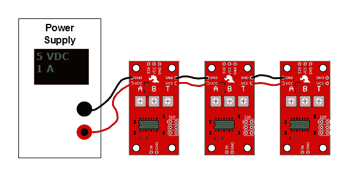

# 伺服触发器连接导轨

> 原文：<https://learn.sparkfun.com/tutorials/servo-trigger-hookup-guide>

## 介绍

[伺服触发器](https://www.sparkfun.com/products/13118)是一个小板子，帮助你部署业余爱好 RC 伺服电机。当外部开关或逻辑信号改变状态时，伺服触发器告诉相连的伺服电机从位置 A 移动到位置 b。

*The Servo Trigger in action.*

要使用伺服触发器，您只需连接一个业余爱好伺服和一个开关，然后使用板载电位计来调整开始/停止位置和过渡时间。你可以在你的项目中使用业余爱好伺服系统，而不必做任何编程！

### 在本教程中

这个连接指南从一些关于业余爱好伺服电机的背景信息开始。从那里，它跳转到让伺服触发器与一个小伺服一起工作，然后检查一些内部工作。最后，对于喜欢冒险的人，它解释了如何通过重新编程来定制伺服触发器。

### 推荐阅读

*   一个[电机介绍](https://learn.sparkfun.com/tutorials/motors-and-selecting-the-right-one)。
*   更多关于[爱好伺服电机](https://www.sparkfun.com/tutorials/283)的信息。
*   关于[脉宽调制](https://learn.sparkfun.com/tutorials/pulse-width-modulation)的一些背景知识。

## 伺服电机背景

从最一般的意义上来说，“伺服机构”(简称为 *servo* )是一种利用反馈来达到预期结果的装置。反馈控制用于许多不同的领域，控制速度、位置和温度等参数。

在我们这里讨论的上下文中，我们谈论的是**爱好**或**无线电控制伺服电机**。这些小型马达主要用于操控无线电遥控车辆。因为位置容易控制，它们对机器人和电子动画也很有用。然而，它们不应该与其他类型的伺服电机混淆，例如工业机械中使用的大型电机。

*An Assortment of Hobby Servos*

钢筋混凝土伺服是合理的标准化-他们都是一个类似的形状，与安装法兰在每一端，可在分级尺寸。伺服系统通常带有几个轮子或杠杆，称为“喇叭”，可以连接到轴上，以适应他们正在操作的设备。

*Example Servo Horns*

### 电气连接

大多数业余爱好伺服使用标准类型的 3 针插头，具有相同的控制信号，这使得钢筋混凝土伺服合理互换。

该连接器是一个 3 针、0.1 英寸间距的接头。容易混淆的一点是电线颜色代码并不总是一致——有几种颜色代码在起作用。好消息是这些针通常都是同样的顺序，只是上面的颜色不同。

下表总结了常见的配色方案。

| **Pin 码** | **信号名称** | **配色方案 1
(双叶)** | **配色方案 2
(JR)** | **配色方案 3
(Hitec)** |
| one | 地面 | 黑色 | 褐色的 | 黑色 |
| Two | 电源 | 红色 | 红色 | 红色还是棕色 |
| three | 控制信号 | 怀特（姓氏） | 柑橘 | 黄色还是白色 |

*Servo connection Color Coding***Heads up!** If you're in doubt about your color scheme, check the documentation -- don't plug it in backwards!

### 驱动伺服系统

在遥控车辆中，5.5V 是标称电池电压。充电后会稍微高一些，随着电池放电会下降。随着电压下降，可用扭矩也下降-如果你驾驶过遥控车辆，你无疑熟悉电池变弱时发生的失控。它在死亡前开始感觉迟钝。

如果你不用电池，从普通电源获得的 5v 直流电压是一个不错的选择。如果您使用伺服触发器来控制您的电机，则应该施加的**绝对最大值**电源电压为 **5.5 VDC** 。

不管你如何给它们供电，值得注意的是，电机消耗的电流随着机械负载的增加而增加。一个轴上没有任何附件的小型伺服系统可能消耗 10 毫安，而一个转动沉重杠杆的大型伺服系统可能消耗 1 安培甚至更多！

### 控制信号

伺服系统由特定类型的脉冲序列信号控制。脉冲以 20 毫秒(50 赫兹)的间隔出现，宽度在 1 到 2 毫秒之间变化。微控制器上可用的[脉宽调制](https://learn.sparkfun.com/tutorials/pulse-width-modulation)硬件是产生伺服控制信号的一种很好的方式。

当脉冲在 1 到 2 毫秒之间变化时，普通的伺服系统在 90°的范围内旋转-当脉冲为 1.5 毫秒时，它们应该在它们的机械范围的中心。

在内部，伺服电机的机制使用一个附在旋转轴上的电位计来感测位置。它测量输入脉冲的宽度，并向电机施加电流以相应地转动轴。

这是一个被解剖的伺服机构的内部。你可以看到 DC 电机，位置电位计，和一个小 PCB。PCB 的一侧有一个芯片，可能是一个小型微控制器。

*Inside an RC servo*

PCB 的另一侧有一些分立晶体管，可能采用 H 桥配置，使控制器能够控制电流以顺时针和逆时针两个方向流过电机。

*Back of the PCB*

### 另一个有用的伺服系统

普通的遥控伺服系统可以在 90 度的范围内转动——这对于转动转向联动装置或者调整飞机上的操纵面很有用，但是作为驱动机构就没那么有用了。这就是**全**或**连续旋转**伺服系统的用武之地。

连续旋转伺服系统不是控制位置，而是将相同的脉冲序列信号转换成轴的旋转速度和方向。否则，他们非常类似于定期钢筋混凝土伺服-他们使用相同的电源，控制信号，3 针连接器，并可在相同的大小作为钢筋混凝土伺服。

整体速度相对较低——大约 60 转/分是常见的最大速度——如果你需要更高的转速，伺服系统不是最好的选择—[DC 减速电机](https://www.sparkfun.com/categories/247)或无刷 DC 电机更有可能是候选产品，但它们不直接与伺服控制信号兼容。

### 用伺服触发器

伺服触发器能够控制常规和连续旋转伺服。我们将在接下来的章节中探索一些更具体的用例。

## 快速入门

让我们跳进去，构建一个电路来展示伺服触发器是如何工作的！

### 材料和工具

您需要以下材料来构建此示例电路。

*   [伺服触发](https://www.sparkfun.com/products/13118)模块。
*   业余爱好伺服电机-我们将使用我们的[微型金属齿轮伺服](https://www.sparkfun.com/products/10333)。
*   开关-任何瞬时接触开关都是合适的，所以我们将使用一个[12 毫米的触觉按钮](https://www.sparkfun.com/products/9190)。
*   一个 [5V 电源](https://www.sparkfun.com/products/12889)。
*   一个[桶形千斤顶适配器](https://www.sparkfun.com/products/10288)使连接电源更容易。
*   可咬合割台的 3 针部分，直的[或直角的](https://www.sparkfun.com/products/116?_ga=1.192696362.1678495895.1378918345)。
*   一把小螺丝刀，用于调节装饰杆。
*   最后，没有显示，我们需要一些连接线和焊接工具。

### 开始步骤

首先，将一些电线焊接到触摸开关上。如果你把腿焊接在相对的角上(例如，右上角和左下角)，你可以确信当你按下按钮时你会得到一个触点闭合。

*Switch Assembly*

然后准备好电源插头引线。拿一对电线，剥去两端，然后将它们拧到电源插孔适配器上——如果你仔细观察适配器，你会注意到塑料上有一个小的`+`和`-`浮雕。我们在`+`终端上用红色电线连接 VCC，在`-`终端上用黑色电线连接地线。

*Power Jack Closeup*

接下来，将 3 针接头焊接到电路板末端的 3 个焊盘上，并将伺服系统插入接头。小心确保插头方向正确——您可以查看上一节中的[颜色代码表](https://learn.sparkfun.com/tutorials/servo-trigger-hookup-guide#colortable),或者查阅伺服制造商的数据表。

然后将开关线焊接到伺服触发器上的`IN`和`GND`焊盘，将电源引线焊接到电路板边缘的`VCC`和`GND`焊盘。这些都反映在电路板的相对边缘-他们是平行的，所以你可以使用任何一组垫。红线应连接到`VCC`焊盘，黑线连接到`GND`。

在我们开机之前，花一点时间对照下面的照片仔细检查你的工作(点击图片查看大图)。特别是，确保电源和伺服连接方向正确。

调整电路板背面的微调按钮。逆时针将`A`完全设定，顺时针将`B`完全设定，并将`T`设定到中间。

最后，施加力量。当你这样做时，伺服系统可能会跳到一个新的位置。

然后，按住开关。伺服机构将旋转，需要几秒钟到达新的位置。松开开关，它就会回到起点。

现在，您可以调整微调按钮来配置伺服系统。

*   `A`设置开关打开时伺服机构所处的位置。
*   `B`设置开关闭合时伺服移动到的位置
*   `T`设置从 A 到 B 往返所需的时间。

顺时针转动位置电位计将使电机进一步顺时针转动。如果 A 高于 B，那么当开关启动时，伺服机构将逆时针转动。计时范围在 50 毫秒和 3 秒之间可调。过渡时间是恒定的-当设置为 2 秒时，无论位置设置有多接近，伺服将花费 2 秒在 A 和 B 之间移动。

在下一节中，我们将探索伺服触发器的一些更好的细节。

## 更多细节

### 董事会

让我们看看板上的元件，看看它是如何工作的。

伺服触发器的核心是 Atmel ATTiny84 微控制器，运行一个小程序来实现我们在这里讨论的伺服控制功能。仅仅因为伺服触发器让你不需要写代码，并不意味着没有编程！

伺服控制信号由 16 位硬件定时器产生。它采用 1 MHz 时钟，计数到 20000 以产生 20 毫秒(50 Hz)的周期，并配置为产生 1000 至 2000 秒(1 至 2 毫秒)的脉冲。

三个电位计作为分压器连接在 VCC 和地之间。它们通过模拟输入 ADC0、ADC3 和 ADC7 读取。

使用 PortA 的输入引脚 1 读取开关输入。它在软件中去抖，可以配置为观察开关闭合或逻辑电平脉冲。

如果你有兴趣，你可以从[伺服触发器 GitHub 库](https://github.com/sparkfun/Servo_Trigger)下载原理图、PCB 布局和固件文件。该板还包括通用的 6 针系统内编程接头，我们将在[专家练习](https://learn.sparkfun.com/tutorials/servo-trigger-hookup-guide/all#expert-exercises)部分讨论。但是我们有点超前了——有一些无需编程就可以使用的配置选项。

### 配置

伺服触发器有几个配置选项。如果你看 PCB 的背面，你会注意到两个焊接跳线，可以用来改变伺服触发器的响应。

*Configuration Jumpers, SJ1 and SJ2.*

当它第一次通电时，伺服触发器读取这些跳线，并相应地配置自己。

#### 模式

伺服触发器有两种不同的伺服控制模式，通过跳线 1 (SJ1)选择。它们可用于针对不同应用定制电路板的响应。

默认模式执行**双稳态**控制——根据输入驱动，伺服将位于位置 A 或位置 B。当开关停留在 a 状态时，伺服停留在相应的位置——在*两种*不同状态下*稳定*。

*Jumper Cleared - Bistable Control*

这种行为可以通过在跳线的焊盘之间流动焊料来改变。

随着跳线闭合，模式变为**单稳态**或**单稳态**。当输入被激活时，伺服机构将从 A 移动到 B，然后回到 A -伺服机构稳定在 A 位置，并且仅暂时通过 B 位置。无论输入何时被清除，伺服机构都将进行一次完整的转换。

*Jumper Soldered - One-Shot Control*

#### 输入极性

也可以使用跳线 2 (SJ2)改变伺服触发器输入灵敏度。

默认配置不使用焊料，将伺服触发器配置为与常开开关一起使用，微控制器上的内部上拉电阻使能。这种配置也适用于低电平有效逻辑输入。

SJ2 闭合时，内部上拉电阻禁用，输入设为高电平有效逻辑输入。

如果 SJ2 闭合，当输入没有连接到任何东西时，要小心给伺服触发器加电。当输入浮动时，它可以在有效和无效之间随机切换，并可能导致电机出现不可预测的行为。

*关于术语的注意事项*:由于输入极性可以交换，这可能很难谈论——电压可能很高，但当意义颠倒时，它表明输入没有被激活。为了帮助导航，极性中性术语**有效**或**有效**用于描述输入何时被使用，而**无效**或**无效**用于描述默认状态。

### 更多组件

伺服触发器可以与比以上示例中使用的更多种类的外部元件一起使用。我们使用了一个中等大小的伺服系统，尽管我们有许多其他的候选系统，各种大小的扭矩等级&。

也可以使用不同的开关，如[微动开关](https://www.sparkfun.com/products/9506)和[脚踏开关](https://www.sparkfun.com/products/11192)。

### 电力说明

与伺服电机相比，伺服触发板消耗的电流非常小，大约为 5 mA。

电机消耗的电流要大得多——一个使用小型伺服系统的快速台架测试显示，电机闲置时消耗 10 毫安，移动时消耗约 70 毫安。抓住喇叭并扭转会导致控制器向电机施加电流，抵消扭转。在这次测试中，它消耗了 700 毫安的电流——一个更大的伺服系统可以消耗更多的电流！

当你给系统增加更多的电机时，这些电流会变得惊人的高——你需要选择一个有足够容量的电源。

伺服触发器旨在使菊花链板变得容易-您可以简单地连接相邻板上的 VCC 和 GND 焊盘。

在电机移动重要负载的应用中，最好使用更粗的电线，让每个伺服触发器直接连接到电源。这种配置通常被称为“星形电源”

如果有疑问，拿一个万用表，测量消耗的电流，并检查当伺服系统转动时，电路板输入端的 VCC 是否低于额定电压。

### 解决纷争

如果启动输入时没有运动，首先检查 A 和 B 是否设置相同，否则没有位置变化！

如果从外部器件向输入端输入逻辑信号，请确保驱动信号的时间超过 50 毫秒。PWM 信号每 50 毫秒更新一次，短于该时间的事件可能会被错过。

也可以将 T 设置为短于伺服电机实际旋转所需的时间。在这种情况下，电机可能无法在返回 a 之前到达 B。尝试调高 T，以查看较长的过渡时间是否允许电机转动。

## 专家练习

### 定制伺服触发器

伺服触发器旨在使使用伺服电机变得容易，但它可能不适合每一个应用。您可能需要不同的时序或不同的逻辑来解释如何将输入转换为电机驱动信号。

由于伺服触发器的核心是一个微控制器，该控制器上的固件可以重新编程。由于该设计是作为开源硬件发布的，固件的源代码发布在设备的 [GitHub 库](https://github.com/sparkfun/Servo_Trigger)中。欢迎下载修改！

#### 工具链

伺服触发固件在 [Atmel Studio 6.2.1153](http://www.atmel.com/tools/atmelstudio.aspx) 中开发，使用一个 [JTAGICE3](http://www.atmel.com/tools/jtagice3.aspx) 调试模块。JTAGICE3 可以对芯片进行配置和编程，还提供全功能交互式调试器。您可以暂停执行并检查芯片内部，这大大简化了应用程序的故障排除——尤其是因为 Tiny84 缺少可以打印调试信息的串行端口。

如果您使用 Atmel Studio，repo 中的`/firmware/`目录包含项目和解决方案文件。

虽然 Atmel Studio 是一个很好的图形前端，并有一个全功能的调试器，但它不需要重新编译固件或重新编程 IC。你可以使用命令行 [WinAVR](http://sourceforge.net/projects/winavr/) 工具，并使用 [AVR-Dude](http://www.nongnu.org/avrdude/) 兼容的编程器对电路板进行编程，就像我们的[微型 AVR 编程器](https://www.sparkfun.com/products/11801)。如果你走这条路，`Firmware\ServoTrigger\Debug`包含了 WinAVR 兼容的 makefile。

### 固件修改

#### 时机

由`T`电位计访问的渡越时间范围由软件值表定义——该表使用指数曲线解释电位计位置，这允许在低端对非常短的时间进行精细控制，但在高端仍预设有用的较长范围。但也许这些时间并不特别适合您的应用——也许您在低端需要额外的分辨率，或者在高端需要更长的时间。你可以改变时间表来做到这一点。

该表是使用" translation.ods "电子表格计算的。只需在绿色单元格中输入以秒为单位的所需时间。工作表会重新计算计时值，并更新黄色单元格。将黄色单元格剪切并粘贴到`timelut`数组中。

该表只有 17 个条目，看起来相当短，但请记住，我们使用的微控制器只有 8KB 的闪存和 512 字节的 RAM，我们不希望时序表填满整个存储器。为了提高表格条目之间的分辨率，固件执行[线性插值](http://en.wikipedia.org/wiki/Linear_interpolation)以在条目之间创建更精细的点。

#### 模式

伺服触发器带有几个响应模式，对于大多数伺服控制需求应该是有用的，但如果它们不是很合适，可以修改。

源文件中还隐藏了其他几种模式。除了这两种默认模式，还有三种其他模式。您可以通过更改项目中的编译时符号来进行选择。在 Atmel Studio 中，选择“伺服触发器”选项卡，然后导航到“工具链-> AVR/GNU C 编译器->符号”项。

如果使用命令行工具，符号定义可以在 Makefile 中的编译器调用中找到。

`FSMA`和`FSMB`符号决定伺服触发器上编程的模式。FSMA 定义了无跳跃(默认)模式，FSMB 定义了跳跃模式。源文件中目前定义了五种模式。

1.  `bistableFSM` -默认模式-当输入有效时，它从位置 A 移动到 b。当输入保持时，它将停留在 b。当释放时，它移动回 A。
2.  `oneshotFSM` -每次输入有效时执行一个完整的循环-从 A 到 B，然后回到 A。
3.  `ctpFSM` -为互动艺术家 Christopher T Palmer 定制 oneshotFSM，允许 B-to-A 返回周期被新的输入动作中断。
4.  `togglingFSM` -每次输入有效时，它从 A 变为 B，或从 B 变为 A。该模式对驱动连续旋转伺服系统特别有用。
5.  `astableFSM` -当输入有效时，它在 A 和 b 之间来回循环。当输入无效时，它停留在原来的位置。

您可以在任一插槽中放置任何模式，甚至可以在两个插槽中放置相同的模式。

#### 实施细节

正如您可能已经从名称中猜到的那样，这些模式是使用有限状态机实现的。有限状态机是一种设计概念，它定义了一组状态和一组确定如何在状态之间转换的相应规则。

在伺服触发器中，每种模式都使用相同的基本状态集，这些状态反过来描述了它如何驱动伺服。这些状态是:

1.  坐在位置 a。
2.  从 A 地移动到 b 地。
3.  坐在 b 位置。
4.  从 B 地转移到 a 地。

定义状态何时可以改变的规则可以显著地改变行为。伺服触发器的不同模式都使用相同的状态来实现，但是具有不同的转换规则。

FSM 通常使用“气泡图”来说明，气泡图将状态画为圆圈，将规则画为圆圈之间的箭头。这是双稳态 FSM 的气泡图。

#### 构建新的状态机

在伺服触发器中，状态机被实现为单个函数，它包含一个`switch`语句，其中每个状态是一个`case`。在每个 PWM 周期开始时，调用状态机功能来确定脉冲宽度，并可能转移到新的状态。

如果你想实现一个新的状态机，从画气泡图开始会很有用。

如果您的新 FSM 是对现有 FSM 的轻微修改，那么查看现有 FSM 的下一个最佳位置——可能就像将状态转换规则从一个函数移植到另一个函数一样简单。如果您的 FSM 更有野心，阅读和理解 FSM 如何与固件的其余部分交互仍然是有用的。

您的应用可能需要现有 FSM 的细微变化，或者完全重新制定。因为源代码是可用的，所以欢迎您修改它来满足您的需要！

## 资源和更进一步

现在您已经运行了您的伺服触发器，是时候将它合并到您自己的项目中了！

如果您有任何反馈，请访问[评论](https://learn.sparkfun.com/tutorials/servo-trigger-hookup-guide/discuss)或联系我们在 TechSupport@sparkfun.com[的技术支持团队](mailto:techsupport@sparkfun.com?subject=)。

### 资源

*   设计文档可从[伺服触发器 Github 库](https://github.com/sparkfun/Servo_Trigger)下载。
*   固件是使用 [Atmel Studio](http://www.atmel.com/tools/atmelstudio.aspx) 开发的，带有 [JTAG-ICE3](http://www.atmel.com/tools/jtagice3.aspx) 调试模块。
*   没有 JTAG 冰，你仍然可以用[微型编程器](https://www.sparkfun.com/products/11801)对电路板重新编程。您可能想将它与 [pogopin 适配器](https://www.sparkfun.com/products/11591)配合使用。你还需要命令行 [WinAVR](http://sourceforge.net/projects/winavr/) 工具。

### 更进一步

*   伺服触发器可以控制我们任何一个[爱好伺服](https://www.sparkfun.com/categories/245)。
*   你可以使用我们的许多[按钮和开关](https://www.sparkfun.com/categories/145)触发它。
*   [开放式伺服](https://www.sparkfun.com/products/9014)是一种不同的控制伺服电机的方法，通过让它们说 I2C 语。
*   维基百科有一篇关于[有限状态机](http://en.wikipedia.org/wiki/Finite-state_machine)的非常详细的文章。