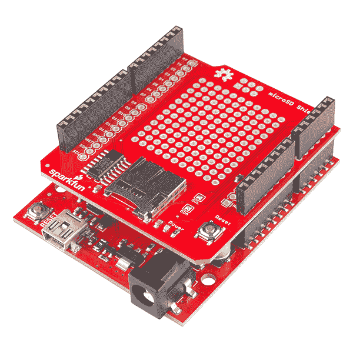
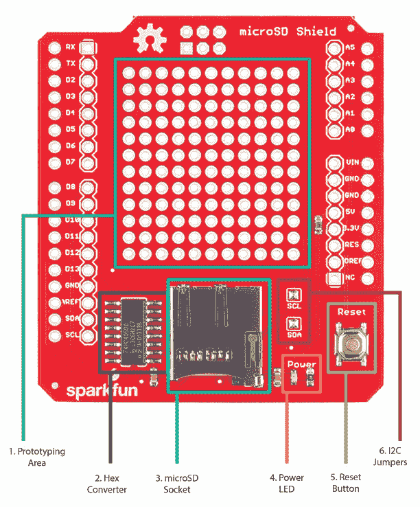
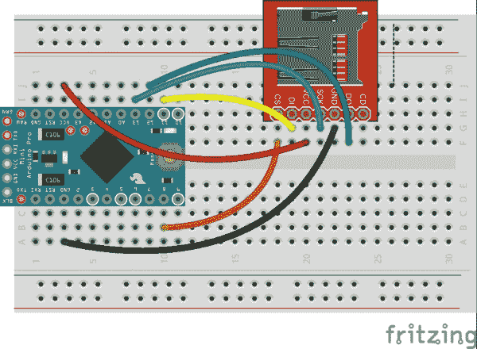
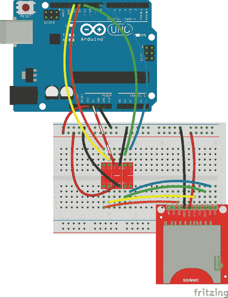

# MicroSD 屏蔽和 SD 转接连接指南

> 原文：<https://learn.sparkfun.com/tutorials/microsd-shield-and-sd-breakout-hookup-guide>

## 介绍

SparkFun microSD Shield 可以轻松地为您的项目添加海量存储。

[](https://cdn.sparkfun.com/assets/learn_tutorials/1/2/7/assembled_microsd.jpg)

### 所需材料

*   1x [SparkFun microSD Shield](https://www.sparkfun.com/products/12761)
*   1x [包 R3 可堆叠接头](https://www.sparkfun.com/products/11417)用于屏蔽。
*   1x 您选择的 microSD 卡，最高 32GB，如 SparkFun 的 [8GB 卡和适配器包](https://www.sparkfun.com/products/11609)
*   1x SparkFun [RedBoard](https://www.sparkfun.com/products/12757) 或 [Arduino Uno](https://www.sparkfun.com/products/11021) 和一根 USB 线

### 装配

使用前，您需要将接头焊接到屏蔽层上。[如果你需要复习，可以看看屏蔽装配教程](https://learn.sparkfun.com/tutorials/arduino-shields#installing-headers-preparation)。microSD Shield 使用 Uno R3 封装，带有[1 个 10 针、2 个 8 针和 1 个 6 针接头](https://www.sparkfun.com/products/11417)。

### 推荐阅读

*   什么是 Arduino？-Arduino 新手？从这里开始。
*   [安装 Arduino IDE](https://learn.sparkfun.com/tutorials/installing-arduino-ide) -关于使用 Arduino 环境的复习。
*   Arduino 盾牌基础知识 -涵盖了一般角度的盾牌。
*   [串行外设接口(SPI)](https://learn.sparkfun.com/tutorials/serial-peripheral-interface-spi) -本教程向您展示如何通过 SPI 与 SD 卡通信。
*   [SD 卡和写图像](https://learn.sparkfun.com/tutorials/sd-cards-and-writing-images) -学习 SD 和 microSD 卡的基础知识。

## 硬件概述

microSD 屏蔽的特点如下:

[](https://cdn.sparkfun.com/assets/learn_tutorials/1/2/7/sd-card-overview.jpg)

1.  一个大的原型制作区域，你可以在这里为你的项目焊接其他部件。

2.  一个十六进制转换器 IC(充当 Arduino 的 5V 逻辑和 microSD 卡的 3.3V 兼容引脚之间的电压电平转换器)。该 IC 的数据手册可在此处找到[。](http://www.nxp.com/documents/data_sheet/74HC4050_CNV.pdf)

3.  一个 microSD 插座。

4.  电源指示灯。Arduino 一通电就会亮起。

5.  连接到 Arduino 复位线的复位按钮。

6.  **SCL** 和 **SDA** 跳线将 SDA 和 SCL 引脚(在 R3 屏蔽层上断开)连接到 A4 和 A5 引脚，为较旧的 UNO 型号提供向后兼容性。当使用具有不同 I2C 引脚分配的电路板时，如 [Leonardo、Mega 和 Due](https://www.arduino.cc/en/Reference/Wire) ，这些跳线可以打开以释放 A4 和 A5 引脚。

## 代码示例

将完成的 microSD 盾压在 Arduino 上，并使用 Arduino 的 USB 电缆将板连接到计算机。

对于这个例子，你将使用每个 [Arduino IDE 安装](https://learn.sparkfun.com/tutorials/installing-arduino-ide)附带的 **SD 库**。Arduino 网站上有 SD 库[的附加参考资料。SD 库示例草图位于 Arduino examples 文件夹中的**文件>示例> SD** 下](http://arduino.cc/en/Reference/SD)

SparkFun microSD shield 使用引脚 8 作为**芯片选择线。**要将 SD 库与盾一起使用，您需要将 CardInfo.ino 草图中的线`const int chipSelect = 4;`改为`const int chipSelect = 8;`(如果您想复制粘贴，下面的草图已经被修改过了)，然后按**上传**。

```
language:c
/*
  SD card test

  created  28 Mar 2011
  by Limor Fried
  modified 9 Apr 2012
  by Tom Igoe

  Hookup for the SparkFun microSD shield 
  on a SparkFun RedBoard/Arduino Uno R3

  MOSI - 11
  MISO - 12
  CLK - 13 
  CS - 8
*/

// include the SD library:
#include <SPI.h>
#include <SD.h>

// set up variables using the SD utility library functions:
Sd2Card card;
SdVolume volume;
SdFile root;

// The Sparkfun microSD shield uses pin 8 for CS
const int chipSelect = 8;

void setup()
{
  // Open serial communications and wait for port to open:
  Serial.begin(9600);
  while (!Serial) {
    ; // wait for serial port to connect. Needed for Leonardo only
  }

  Serial.print("\nInitializing SD card...");

  // Note that even if it's not used as the CS pin, the hardware SS pin
  // (10 on most Arduino boards, 53 on the Mega) must be left as an output
  // or the SD library functions will not work.

  pinMode(10, OUTPUT);

  // we'll use the initialization code from the utility libraries
  // since we're just testing if the card is working!
  if (!card.init(SPI_HALF_SPEED, chipSelect)) {
    Serial.println("initialization failed. Things to check:");
    Serial.println("* is a card is inserted?");
    Serial.println("* Is your wiring correct?");
    Serial.println("* did you change the chipSelect pin to match your shield or module?");
    return;
  } else {
    Serial.println("Wiring is correct and a card is present.");
  }

  // print the type of card
  Serial.print("\nCard type: ");
  switch (card.type()) {
    case SD_CARD_TYPE_SD1:
      Serial.println("SD1");
      break;
    case SD_CARD_TYPE_SD2:
      Serial.println("SD2");
      break;
    case SD_CARD_TYPE_SDHC:
      Serial.println("SDHC");
      break;
    default:
      Serial.println("Unknown");
  }

  // Now we will try to open the 'volume'/'partition' - it should be FAT16 or FAT32
  if (!volume.init(card)) {
    Serial.println("Could not find FAT16/FAT32 partition.\nMake sure you've formatted the card");
    return;
  }

  // print the type and size of the first FAT-type volume
  uint32_t volumesize;
  Serial.print("\nVolume type is FAT");
  Serial.println(volume.fatType(), DEC);
  Serial.println();

  volumesize = volume.blocksPerCluster();    // clusters are collections of blocks
  volumesize *= volume.clusterCount();       // we'll have a lot of clusters
  volumesize *= 512;                            // SD card blocks are always 512 bytes
  Serial.print("Volume size (bytes): ");
  Serial.println(volumesize);
  Serial.print("Volume size (Kbytes): ");
  volumesize /= 1024;
  Serial.println(volumesize);
  Serial.print("Volume size (Mbytes): ");
  volumesize /= 1024;
  Serial.println(volumesize);

  Serial.println("\nFiles found on the card (name, date and size in bytes): ");
  root.openRoot(volume);

  // list all files in the card with date and size
  root.ls(LS_R | LS_DATE | LS_SIZE);
}

void loop(void) {

} 
```

通过进入**工具>串行监视器**来打开你的 [Arduino 串行监视器](https://learn.sparkfun.com/tutorials/terminal-basics/arduino-serial-monitor-windows-mac-linux)以查看卡测试的结果。

一旦你的卡被检测到，你就可以继续到*使用*额外的空间做一些事情！下面是 SD 卡库中一个简单的模拟数据记录草图，有相同的修改-将 CS 引脚改为 8。`const int chipSelect = 8;`

```
language:c
#include <SPI.h>
#include <SD.h>

// On the Ethernet Shield, CS is pin 4\. Note that even if it's not
// used as the CS pin, the hardware CS pin (10 on most Arduino boards,
// 53 on the Mega) must be left as an output or the SD library
// functions will not work.
const int chipSelect = 8;

void setup()
{
  // Open serial communications and wait for port to open:
  Serial.begin(9600);
  while (!Serial) {
    ; // wait for serial port to connect. Needed for Leonardo only
  }

  Serial.print("Initializing SD card...");
  // make sure that the default chip select pin is set to
  // output, even if you don't use it:
  pinMode(10, OUTPUT);

  // The chipSelect pin you use should also be set to output
  pinMode(chipSelect, OUTPUT);

  // see if the card is present and can be initialized:
  if (!SD.begin(chipSelect)) {
    Serial.println("Card failed, or not present");
    // don't do anything more:
    return;
  }
  Serial.println("card initialized.");
}

void loop()
{
  // make a string for assembling the data to log:
  String dataString = "";

  // read three sensors and append to the string:
  for (int analogPin = 0; analogPin < 3; analogPin++) {
    int sensor = analogRead(analogPin);
    dataString += String(sensor);
    if (analogPin < 2) {
      dataString += ",";
    }
  }

  // open the file. note that only one file can be open at a time,
  // so you have to close this one before opening another.
  File dataFile = SD.open("datalog.txt", FILE_WRITE);

  // if the file is available, write to it:
  if (dataFile) {
    dataFile.println(dataString);
    dataFile.close();
    // print to the serial port too:
    Serial.println(dataString);
  }
  // if the file isn't open, pop up an error:
  else {
    Serial.println("error opening datalog.txt");
  } 
```

## SD 卡分线板

如果你有一个较小的 Arduino(或者你想在你的项目中放一个全尺寸的 SD 卡)，你可以使用带有 SD 卡库的[spark fun microSD Transflash Breakout](https://www.sparkfun.com/products/544)或 [SparkFun SD/MMC 卡 Breakout](https://www.sparkfun.com/products/12941) 。

由于这些较小的分线点没有内置电平转换，请确保您在电路中有一个逻辑电平转换器，如 [SparkFun 逻辑电平转换器](https://www.sparkfun.com/products/12009)，或者使用一个 3.3V Arduino，如 [SparkFun Pro Mini 3.3V/8Mhz](https://www.sparkfun.com/products/11114)

两个例子都使用引脚 8 作为片选线，就像上面的屏蔽例子一样。

[](https://cdn.sparkfun.com/assets/learn_tutorials/1/2/7/micro_sd_hookup_bb.jpg)*You can use either breakout with a 3.3V Arduino.*
[](https://cdn.sparkfun.com/assets/learn_tutorials/1/2/7/full_sd_with_5v_bb.jpg)*Use a level shifter between the card breakout and your 5V Arduino.*

## 解决纷争

Arduino SD 卡库页面上的[注释中有故障排除提示，包括格式化新卡(如果需要)和将 SD 卡库用于其他 Arduino 板的说明。](http://arduino.cc/en/Reference/SDCardNotes)

## 资源和更进一步

既然你已经知道了如何给你的 Arduino 项目添加更多的存储空间，那么是时候去创造一些令人惊奇的东西了。需要一些灵感吗？查看其他 SparkFun 教程。

*   SD 卡是向物联网项目添加更多存储的好方法。你可以在 wif Shield 上增加一个 microSD Shield 来提供更大的网页或者存储更多的数据。也可以使用 [CC3000 Shield](https://learn.sparkfun.com/tutorials/cc3000-hookup-guide?_ga=1.160109182.273388466.1418147030) ，内置 microSD 卡槽。
*   需要比你的 Arduino 所能提供的更多的能量？看看爱迪生 T1，它也有一个 T2 的 microSD 卡块 T3 来为更大的项目增加更多的存储空间。
*   记录数据是 SD 卡的常见用途。使用 [Logomatic](https://learn.sparkfun.com/tutorials/logomatic-hookup-guide?_ga=1.97236700.273388466.1418147030) 将您的日志项目提升到一个新的水平。