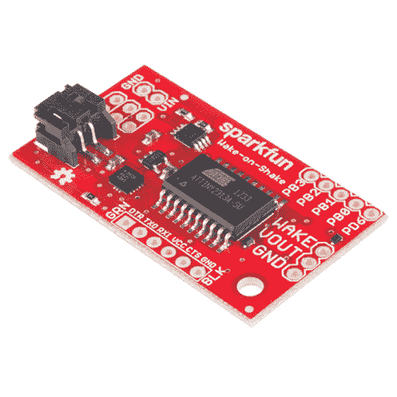

# 摇动唤醒连接指南

> 原文：<https://learn.sparkfun.com/tutorials/wake-on-shake-hookup-guide>

## 介绍

SparkFun Wake-on-Shake 是一个很棒的小传感器板，让你能够让你的项目进入休眠状态，直到被撞或被摇醒。这意味着你可以设计长时间保持惰性的项目，甚至可能是几年，这取决于项目使用的电池类型。

 

### [摇一摇就醒](https://www.sparkfun.com/products/retired/11447)

[Retired](https://learn.sparkfun.com/static/bubbles/ "Retired") SEN-11447

你曾经希望你的项目只是“休眠”直到有人拿起它或移动它吗？这是一个伟大的战略戏剧…

**Retired**[Favorited Favorite](# "Add to favorites") 16[Wish List](# "Add to wish list")

[https://www.youtube.com/embed/L06-QwyaaaA/?autohide=1&border=0&wmode=opaque&enablejsapi=1](https://www.youtube.com/embed/L06-QwyaaaA/?autohide=1&border=0&wmode=opaque&enablejsapi=1)

### 所需材料

我们推荐以下材料，以便跟随本教程。