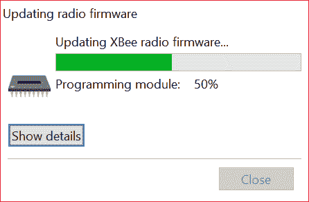

# 探索 XBees 和 XCTU

> 原文：<https://learn.sparkfun.com/tutorials/exploring-xbees-and-xctu>

## 介绍

**Heads up!** Originally, this tutorial was written to configure an XBee Series 1 to communicate in transparency mode. However, this can apply to the XBee Series 3 module as long as you configure the firmware to the legacy 802.15.4 protocol. For more information, read through this guide!

你的项目被电线拖垮了吗？想轻松过渡到无线通信吗？如果您想要可靠、低成本、中速双向通信， [XBee](https://www.sparkfun.com/categories/tags/xbee) 可能是您的解决方案！

XBees 是非常受欢迎的无线收发器，原因有很多。它们**灵活**——它们通过[串行端口](https://learn.sparkfun.com/tutorials/serial-communication)发送和接收数据，这意味着它们兼容计算机和微控制器(像 [Arduino](https://learn.sparkfun.com/tutorials/what-is-an-arduino) )。它们是高度可配置的，你可以拥有几十个 XBees 的网状网络，或者仅仅一对交换数据。你可以用它们来远程控制你的机器人，或者在你的房子里到处布置它们来监控每个房间的温度或照明条件。

### 本教程涵盖的内容

一对 XBees 不会让你走得太远。在大多数情况下，你需要一个单独的模块与 XBee 接口。你可以使用 [XBee Shield](https://www.sparkfun.com/products/10854) 将 XBee 连接到你的 Arduino。或者你可以使用 [XBee Explorer](https://www.sparkfun.com/products/11812) 将 XBee 连接到你的电脑。

本教程的重点是解释如何将 **XBee Explorer** 用于 XBee。有各种各样的浏览器板，都旨在实现相同的目的:在您的计算机和 XBee 之间创建一个通信网关。

*The Explorers: [USB Explorer](https://www.sparkfun.com/products/11812), [Explorer Dongle](https://www.sparkfun.com/products/11697), and [Serial Explorer](https://www.sparkfun.com/products/13225).*

在你的电脑和 XBee 之间连接一个 XBee Explorer，在 **X-CTU** 软件的帮助下，你可以轻松地配置 XBee，测试连接，并在你的电脑和远程 XBee 之间传递数据。我们将在本教程中向您展示如何做到这一切！

### 所需材料

XBees 只有在你至少有一对的情况下才有用。他们需要伙伴来倾诉！因此，在这个材料列表中有很多“2x”。要跟随本教程，您将需要以下材料。你可能不需要所有的东西，这取决于你拥有什么。将它添加到您的购物车，通读指南，并根据需要调整购物车。

*   **2x xbee**-xbee 存在于各种**系列**、**频率**、**范围**。如果你刚刚开始使用 XBee，我们强烈推荐使用带有内置天线的**系列 1** (或配置了 802.15.4 协议的系列 3)型号——或者带有[跟踪天线](https://www.sparkfun.com/products/11215)、[有线天线](https://www.sparkfun.com/products/8665)。你也可以买一个带 [u.fl 连接器](https://www.sparkfun.com/products/8666)的，但是你需要一个合适的外部天线。
    *   要获得更多挑选 XBee 的帮助，请查看我们的 [XBee 购买指南](https://www.sparkfun.com/pages/xbee_guide)。
*   **2x 探索者**—[探索者 USB](https://www.sparkfun.com/products/11812) 、[探索者 USB 加密狗](https://www.sparkfun.com/products/11697)或[探索者系列](https://www.sparkfun.com/products/13225)。
    *   这些板充当你的计算机和 XBee 之间的接口。它们用于配置您的 XBee 并将数据传入和传出您的电脑。
    *   根据你使用的浏览器，你可能还需要一根匹配的 [mini-B USB](https://www.sparkfun.com/products/11301) 或[串行电缆](https://www.sparkfun.com/products/65)。
*   至少一台安装了[X-CTU](http://www.digi.com/products/wireless-wired-embedded-solutions/zigbee-rf-modules/xctu)T3 的**电脑。**
    *   最新版本的 X-CTU 可用于 Mac 和 Windows 系统！

### 推荐阅读

不知道从什么 XBees 入手？尝试查看我们的购买指南，比较不同的模块。

*   XBee 购买指南 -如果你是第一次玩系列 1 XBee，我们强烈推荐。如果你对其他 XBee 类感兴趣，看看这个指南吧！

本教程建立在一些低级电子概念的基础上。如果你不熟悉下面的主题，我们建议你先看看那些教程。

*   [串行通信](https://learn.sparkfun.com/tutorials/serial-communication) - XBee 通过串行端口进行通信。本教程将让你熟悉诸如“RX”、“TX”、“波特率”、“停止位”和“奇偶校验”等术语。
*   [串行终端基础知识](https://learn.sparkfun.com/tutorials/terminal-basics) -我们将使用的 X-CTU 软件有一个集成的串行终端，称为“控制台”。您可以使用您喜欢的终端；如果您没有首选的串行终端，请查看本教程。
*   [如何安装 FTDI 驱动程序](https://learn.sparkfun.com/tutorials/how-to-install-ftdi-drivers) -如果你使用 FTDI 连接 XBees，你需要安装合适的驱动程序。
*   [十六进制](https://learn.sparkfun.com/tutorials/hexadecimal) - XBee 配置设置-如地址和网络 ID-都是用十六进制编程的。基数 16。如果你不知道如何用 0-9 和 A-F 做数字，可以看看这个教程。

 [### 串行通信](https://learn.sparkfun.com/tutorials/serial-communication) Asynchronous serial communication concepts: packets, signal levels, baud rates, UARTs and more 100 [### 如何安装 FTDI 驱动程序](https://learn.sparkfun.com/tutorials/how-to-install-ftdi-drivers) How to install drivers for the FTDI Basic on Windows, Mac OS X, and Linux.[Favorited Favorite](# "Add to favorites") 12 [### 串行终端基础知识](https://learn.sparkfun.com/tutorials/terminal-basics) This tutorial will show you how to communicate with your serial devices using a variety of terminal emulator applications.[Favorited Favorite](# "Add to favorites") 46 [### 十六进制的](https://learn.sparkfun.com/tutorials/hexadecimal) How to interpret hex numbers, and how to convert them to/from decimal and binary.[Favorited Favorite](# "Add to favorites") 32

## 选择浏览器

[**Compatibility with XBee 3's**](#xbee3compatibility) Overall, SparkFun boards designed with the XBee footprint are hardware compatible with XBee Series 3 modules. They modules are drop-in replacements for Series 1 and Series 2 with a few exceptions. Below are two of those exceptions taken out of the migration guide and hardware reference manual.

*   XBee 3 硬件不支持 XBee 系列 1 上的 VREF - VREF(引脚 14)。如硬件参考手册所述，在标有 VREF 的板上，不应连接到此引脚。
*   **掉电** -如果您的 XBee 3 在通电时遇到任何电压掉电或电源骤降，您的 XBee 可能无法按预期启动。《硬件参考手册》指出:

    > 在极少数情况下,带有早期版本微控制器单元(微控制器)的器件可能会遇到从掉电中恢复的问题

    要解决该问题，您必须重启 XBee Series 3 模块。一种方法是在板通电时移除 XBee。然后小心地将模块重新插入插座。否则，您可以通过切换 XBee 3 的 reset 引脚来执行硬件复位。为了实现自动化，在启动过程中，您可以在复位引脚和微控制器的 3.3V I/O 引脚之间焊接一根导线，以至少 50 纳秒至 100 纳秒的时间切换复位引脚，将会复位 XBee Series 3。例如，在无线操纵杆上查看 XBee Series 3 的这个 [Arduino 示例代码。](https://github.com/bboyho/Wireless_Remote_Controlled_RedBot_with_XBees/blob/master/Test/A_TEST_Wireless_Joystick_Controller/A_TEST_Wireless_Joystick_Controller.ino#L68)

For more detailed information regarding the differences, check out the XBee 3 Documentation.

*   [迁移指南](https://www.digi.com/resources/documentation/digidocs/pdfs/90002279.pdf)
*   [硬件参考手册](https://www.digi.com/resources/documentation/digidocs/pdfs/90001543.pdf)

[**Special Considerations for XBee XSC Modules!**](#xsc) For those using an XBee XSC series, the pinout is slightly different in the XBee family. Pin 6 on the XBee XSC series uses it as a configuration pin ([as stated on page 96 of the datasheet](https://cdn.sparkfun.com/datasheets/Wireless/Zigbee/90002173_N.pdf)), instead of having an RSSI pin on pin 6 like most XBees. For standard serial UART pass-through uses, this module can be mounted to one of our XBee Explorer boards with a small adjustment. For the explorer's, locate the RSSI jumper on the back, and [cut the trace between the pads](https://learn.sparkfun.com/tutorials/how-to-work-with-jumper-pads-and-pcb-traces) with a hobby knife. For the XBee shield, simply disconnect the resistor or LED next to the RSSI pin using a soldering iron.

与 XBee 通信的第一步是选择一个接口板，它允许您。XBee Explorers 充当您的计算机和 XBee 之间的网关。有几个可供选择，每个都提供了自己的关键差异。以下是对每一项的快速概述:

### XBee 浏览器 USB

XBee Explorer USB 是最受欢迎的探索者。它配有一个 mini-B USB 连接器，所以你需要[合适的 USB 电缆](https://www.sparkfun.com/products/11301)将它连接到你的电脑。

该板的亮点是一个 [FT231X USB 转串行转换器](https://www.sparkfun.com/products/11736)。这就是你的电脑和 XBee 之间的数据转换。还有一个**重置按钮**，以及一个电压调节器，为 XBee 提供充足的电力。此外，如果你需要调试 XBee，还有四个 led 灯可以帮助你:RX、TX、RSSI(信号强度指示器)和一个电源指示器。

该板还将 XBee 的每个 I/O 引脚连接到一对试验板兼容接头。因此，如果你想利用 XBee 的扩展功能，你可以将一些[插头引脚](https://www.sparkfun.com/products/116)焊接到这些引脚中，甚至只是焊接一些导线。

 

将**添加到您的[购物车](https://www.sparkfun.com/cart)中！**

 **### 

[In stock](https://learn.sparkfun.com/static/bubbles/ "in stock") PRT-11367

各种颜色的电线:你知道这是一个美丽的东西。六种不同颜色的硬纸板实芯焊丝…

$21.5037[Favorited Favorite](# "Add to favorites") 86[Wish List](# "Add to wish list")**** 

将**添加到您的[购物车](https://www.sparkfun.com/cart)中！**

 **### [破开头球——直击](https://www.sparkfun.com/products/116)

[In stock](https://learn.sparkfun.com/static/bubbles/ "in stock") PRT-00116

一排标题-打破适应。40 个引脚，可切割成任何尺寸。用于定制 PCB 或通用定制接头。

$1.7520[Favorited Favorite](# "Add to favorites") 133[Wish List](# "Add to wish list")**** 

将**添加到您的[购物车](https://www.sparkfun.com/cart)中！**

 **### [女标题](https://www.sparkfun.com/products/115)

[In stock](https://learn.sparkfun.com/static/bubbles/ "in stock") PRT-00115

单排 40 孔，内螺纹接头。可以用一把钢丝钳切割成合适的尺寸。标准 0.1 英寸间距。我们广泛使用它们…

$1.758[Favorited Favorite](# "Add to favorites") 71[Wish List](# "Add to wish list")****** ******### XBee Explorer USB 加密狗

XBee 探索者加密狗是探索者的延伸。事实上，这和它的前辈唯一真正的区别是 USB 连接器。加密狗可以直接连接到您的笔记本电脑或 PC 的 USB 端口。

或者，如果你需要与电脑保持一定距离，你可以使用一根 [USB 延长线](https://www.sparkfun.com/products/517)。

 

将**添加到您的[购物车](https://www.sparkfun.com/cart)中！**

 **### [USB 线延长线- 6 脚](https://www.sparkfun.com/products/517)

[Only 1 left!](https://learn.sparkfun.com/static/bubbles/ "only 1 left!") CAB-00517

这些延长线的一端有一个 A 型插头，可以插入任何计算机。相反的一端有一个*母*…

$4.50[Favorited Favorite](# "Add to favorites") 1[Wish List](# "Add to wish list")** **该加密狗仍然分享其同胞的所有功能-复位按钮，发光二极管，稳压器，和试验板兼容的引脚突破。

### XBee 浏览器系列

带有 RS-232 串行端口的计算机变得越来越难找到，但如果你有一台这样的古董，XBee Explorer Serial 是一个可行的选择。

串行资源管理器比基于 USB 的同类产品占地面积更大，但仍具有大部分相同的功能。有 RX 和 TX LEDs、复位按钮、分支引脚和稳压器。串行资源管理器的另一个特性是板上的开/关开关。这使用户能够打开或关闭 XBee 模块的电源。

串行资源管理器的另一个特性是 DB9 连接器附近有两个跳线。这些允许用户交换 DB9 连接器的配置，以与直通电缆( [DCE](http://en.wikipedia.org/wiki/Data_circuit-terminating_equipment) 配置)或交换电缆( [DTE](http://en.wikipedia.org/wiki/Data_terminal_equipment) 配置)一起工作。如果你使用我们的[串行电缆](https://www.sparkfun.com/products/65)，跳线的默认 DCE 配置就可以了。

 

将**添加到您的[购物车](https://www.sparkfun.com/cart)中！**

 **### [串行电缆 DB9 M/F - 6 脚](https://www.sparkfun.com/products/65)

[In stock](https://learn.sparkfun.com/static/bubbles/ "in stock") CAB-00065

任何开发板的基本连接电缆。使用这些电缆连接任何带有标准 RS232 串行端口的计算机…

$4.25[Favorited Favorite](# "Add to favorites") 5[Wish List](# "Add to wish list")** **串行浏览器*不需要外部电源。它有一个筒式插孔连接器，可以与我们的 [12V](https://www.sparkfun.com/products/9442) 、 [9V](https://www.sparkfun.com/products/298) 或 [5V 墙壁适配器](https://www.sparkfun.com/products/12889)配合使用。确定所选电源能够为您正在使用的 XBee 提供足够的电流。*

 

### [墙壁适配器电源- 9VDC 650mA](https://www.sparkfun.com/products/retired/298)

[Retired](https://learn.sparkfun.com/static/bubbles/ "Retired") TOL-00298

专为 Spark Fun Electronics 制造的高质量开关“壁式电源”AC 到 DC 9V 650mA 壁式电源。T…

12 **Retired**[Favorited Favorite](# "Add to favorites") 23[Wish List](# "Add to wish list") 

### [墙壁适配器电源- 12VDC 600mA](https://www.sparkfun.com/products/retired/9442)

[Retired](https://learn.sparkfun.com/static/bubbles/ "Retired") TOL-09442

这是一个高质量的交流到 DC 的“壁式电源”，在高达 600 毫安时产生 12v 直流稳压输出。这些是开关模式…

13 **Retired**[Favorited Favorite](# "Add to favorites") 15[Wish List](# "Add to wish list") 

### [壁式适配器电源- 5V DC 2A(桶形插孔)](https://www.sparkfun.com/products/retired/12889)

[Retired](https://learn.sparkfun.com/static/bubbles/ "Retired") TOL-12889

这是一个高品质的开关“壁式电源”交流到 DC 5V 2000 毫安桶形插座壁式电源，专为…

16 **Retired**[Favorited Favorite](# "Add to favorites") 19[Wish List](# "Add to wish list")

* * *

**Heads up!** If you're using an Arduino, another option available is the [XBee Shield](https://www.sparkfun.com/products/10854). That's a subject for [another tutorial](https://learn.sparkfun.com/tutorials/xbee-shield-hookup-guide). Let's focus on configuring a pair of XBees first.

 [### XBee 屏蔽连接指南

#### 2014 年 6 月 5 日](https://learn.sparkfun.com/tutorials/xbee-shield-hookup-guide) How to get started with an XBee Shield and Explorer. Create a remote-control Arduino 13

## 驱动器和组件

基于 USB 的 XBee Explorers 都使用一个 [FTDI FT231X 芯片](https://www.sparkfun.com/products/11736)进行操作，该芯片可以将串行转换为 USB，反之亦然。这是我们最喜欢的芯片之一，因为它支持所有的计算机平台，并且易于操作。如果这是你第一个连接到电脑上的 FTDI 芯片(很可能不会是最后一个)，就需要安装一些驱动程序。

我们已经写了一个详细介绍如何安装 FTDI 驱动程序的教程。所以继续吧，**把你的 USB 浏览器插入你的电脑**，然后前往那里的 [Windows](https://learn.sparkfun.com/tutorials/how-to-install-ftdi-drivers/windows---quick-and-easy) 、 [Mac](https://learn.sparkfun.com/tutorials/how-to-install-ftdi-drivers/mac) 或 [Linux](https://learn.sparkfun.com/tutorials/how-to-install-ftdi-drivers/linux) 部分。(忽略调用 Arduino 软件的最后步骤。)不管你用的是 Mac 还是 Windows，一旦你的浏览器安装了驱动程序，它就会被分配一个唯一的 COM 端口号。记下该端口号，因为您将在接下来的页面中用到它。

 [### 如何安装 FTDI 驱动程序

#### 2013 年 6 月 4 日](https://learn.sparkfun.com/tutorials/how-to-install-ftdi-drivers) How to install drivers for the FTDI Basic on Windows, Mac OS X, and Linux.[Favorited Favorite](# "Add to favorites") 12

### 基本组装:插一个 XBee！

是时候“组装”XBee Explorer 了。抓住你选择的 XBee。注意它是如何有一个平边和一个更有角度/对角线的边？将足迹与 XBee Explorer 上的白线匹配，并小心地插入！注意不要弄弯任何 XBee 引脚——插入时要小心。(如果您要移除它，请更加小心！)

干得好！您已经组装了 XBee Explorer。你已经为下一步做好了准备[。或者，如果你是一个超级用户，想充分利用你的浏览器，你可以看看下面更“高级”的组件。](https://learn.sparkfun.com/tutorials/exploring-xbees-and-xctu/starting-with-x-ctu)

### 高级组件(完全可选)

对于大多数基本的使用情况，一旦你安装了驱动程序，所有的浏览器板都应该可以使用了。如果你想使用 XBee 的任何 I/O 引脚，你可以*将* [焊接](https://learn.sparkfun.com/tutorials/how-to-solder-through-hole-soldering) [公接头](https://www.sparkfun.com/products/116)到 XBee 接头内 0.1 英寸间距的引脚。这将允许您将电路板插入试验板，以便您可以将其他组件连接到 XBee。每个 XBee 引脚都标在电路板的底部。您也可以查看[示意图](https://cdn.sparkfun.com/datasheets/Wireless/Zigbee/XBee-Explorer-v21b.pdf)以帮助定位特定的引脚。

*The XBee Explorer can be used with a USB cable and breadboard concurrently -- just solder some headers into the breakout pins. (Actually solder them, don't pretend like we did in the image above.)*

如果公接头不符合您的目的，您可以选择焊接[母接头](https://www.sparkfun.com/products/115)(以插入[跳线](https://www.sparkfun.com/products/8431))，甚至只是[裸线](https://www.sparkfun.com/products/11367)。只要确保你没有把任何东西焊接到电路板的顶部，否则你可能无法插入 XBee！

**Tip:** We won't cover it in this tutorial, but those "DIO#" pins can be configured as either inputs or outputs. That means you can use an XBee to directly drive LEDs or motors, and read analog sensors or buttons. Just make sure to use a [logic level converter](https://www.sparkfun.com/products/12009) or transistor when using the pins for I/O line passing. More information about configuring the pins for I/O line passing can be found in the XBee's user manual.

## 从 X-CTU 开始

[X-CTU](http://www.digi.com/products/wireless-wired-embedded-solutions/zigbee-rf-modules/xctu) 是由[Digi](http://www.digi.com/)(XBee 的制造商)提供的免费软件，我们用它来**配置**和**管理**XBee，并测试 XBee 网络。如果你还没有，去他们的网站[下载最新版本](http://www.digi.com/support/productdetail?pid=3352&type=utilities)并按照他们的指示安装软件。

[Download X-CTU](http://www.digi.com/support/productdetail?pid=3352&type=utilities)**Tip:** The latest XBee Series 3 has enhanced features including new AT commands, Bluetooth, and MicroPython. While MicroPython is available for the XBee Series 3, not all [MicroPython modules are available for the XBee Series 3](https://www.digi.com/resources/documentation/digidocs/90002219/default.htm#reference/r_features.htm%3FTocPath%3D_____2). For more information, make sure to check the [support documentation.](https://www.digi.com/products/embedded-systems/rf-modules/2-4-ghz-modules/xbee3-zigbee-3#productsupport-support)

### 添加 XBee 的

在继续之前，确保您已经将 XBee(正确地)插入到您的浏览器中，并将浏览器插入到您的计算机中。当你为你的浏览器安装驱动程序时，它应该已经被分配了端口号。你很快就会需要的。

最初打开 X-CTU 后，您会看到一个类似这样的窗口:

要添加 XBee，**单击窗口左上角的“添加设备”图标** - 。这将提示屏幕显示:

#### 选择您的通信端口

如果你很幸运(或者只是没有很多东西连接到你的电脑上)，你可能只有一个选择。否则，Windows 用户应该寻找写有“ *USB 串行端口*的条目，Mac 用户应该寻找类似“ *usbserial-XXXXXXXX* ”的条目，如果你使用的是 USB XBee 板的话。如果你使用的是串行浏览器，选择“通讯端口”选项。如果串行浏览器没有出现，请确保板载开关设置为“开”！

此窗口还允许您指定更具体的串行特征，如波特率、数据位和停止位。假设这是你第一次使用 XBee，你可以**保留这些设置**。所以确保这些值看起来就像上图中的一样，然后**点击完成**。

A " *发现无线电模块...*”窗口将短暂滚动，之后您将看到原来的窗口，但在左侧增加了“收音机模块”部分。(如果 X-CTU 找不到模块，请查看我们的[故障排除页面](https://learn.sparkfun.com/tutorials/exploring-xbees-and-xctu/troubleshooting)。)

点击新模块，等待几秒钟，让 X-CTU 读取 XBee 的配置设置。然后，您应该会看到 XBee 的整个配置。下图显示了连接到 XCTU 的 XBee 系列 1。

正如你向下滚动右半部分所看到的，有许多配置设置可用。我们稍后会讲到其中的一些。不过现在，请验证上面截图中可见的可配置设置是否与您的 XBee 匹配:

*   **通道** = C
*   **潘 ID** = 3332
*   **DH** = 0
*   **DL** = 0
*   **我的** = 0

如果您使用的是 XBee 系列 3，您将需要按照下一节为 802.15.4 协议(也称为系列 1)配置固件！

### [将 XBee 系列 3 配置为传统系列 1 固件](#xbee3)

如果您正在使用 XBee Series 3，您将拥有不同的配置设置。要继续学习本教程，请单击“更新固件”按钮。如果您使用 XBee Series 1，只需转到下一步配置 XBee。

将弹出一个窗口，指示可用于闪存的固件类型。默认会列为 *Digi XBee2 Zigbee 3.0 TH* 功能协议。您可以选择传统 XBee 系列 1 或传统 XBee 系列 2 固件。在本教程中，我们将使用 *Digi XBee3 802.15.4 TH* 函数集。然后，您将选择固件版本。在这种情况下，它是 *2002* 。准备好后，点击**更新**按钮。

*   **产品系列** = XB3-24
*   **功能集** = Digi XBee3 802.15.4 TH
*   **固件版本** = 2002(最新)

将弹出一个窗口，指示 XCTU 正在更新固件。这可能需要几秒钟的时间。

完成后，您将收到固件成功刷新的通知。点击**确定**继续。

确保使用相同的协议更新网络中所有 XBee 节点上的固件。否则，在整个网络中发送数据会有问题。此时，将第二台 XBee Series 3 连接到您的计算机，并重复上述过程来配置固件。

### 再做一次

要测试 XBee 之间的通信，您还需要将第二台 XBee 连接到电脑。这意味着如果你还没有跳“添加设备”舞，那就再跳一次。

如果您有另一台可用的电脑，您也可以在上面安装 X-CTU 并执行相同的设置。您当然也可以在两台 XBee 连接到同一台电脑的情况下执行该测试，只是要确保在添加第二台 XBee 时选择了正确的端口号。

如果您将第二个 XBee 添加到同一台计算机，第二个条目将被添加到“无线电模块”列表中。选择这些条目中的任何一个都将显示该特定 XBee 的配置设置。

*Note that there are two XBees in the list on the left. The configuration values shown are for the highlighted XBee.*

如果你不确定哪个 XBee 是哪个，试着匹配一下 MAC 的号码。这些数字印在 XBee 底部的标签上，也在 XCTU 中列出。(列为“序号”高低，不可修改。)

|  |  |
| *每个 XBee 都有一个唯一的 MAC 地址，
印在突出显示区域的标签上。* |

与最后一个模块一样，确保所有设置都默认为相同的值。这将使下一步成为可能。

*   通道= C
*   PAN ID = 3332
*   DH = 0
*   DL = 0
*   我的= 0

### 快速简单的测试

**点击窗口右上方的“切换到控制台”图标** - 。这将从配置选项卡切换到控制台。我们可以使用控制台向 XBee 发送角色，XBee 会将该角色无线路由到它所连接的任何其他 XBee。

如果您的电脑连接了两个 XBees，您可以通过选择左侧的设备在每个收音机的控制台之间切换。

首先，**通过点击连接图标- 在每个设备上打开一个串行连接**。图标会改变，控制台的边框会变成绿色。

接下来，点击控制台的**左半部分**，**输入字母或数字**。您应该注意到字符以蓝色字体回显(右边的[十六进制](https://learn.sparkfun.com/tutorials/hexadecimal)数字代表 ASCII 值)。现在点击进入另一个 XBee 的控制台。只要它是开着的，你就会看到同样的字符，但是*是红色的*。尝试在第二个 XBee 的控制台中键入不同的字符，您应该会看到它以另一种方式工作。

如果成功了，那么你的 XBees 就可以互相交流了！如果没有，请查看[故障排除页面](https://learn.sparkfun.com/tutorials/exploring-xbees-and-xctu/troubleshooting#comm-fail)。

* * *

你的 XBees 可以开箱即用，这并不令人惊讶。默认情况下，它们都配置在同一个网络上，具有相同的地址。这可能没问题，但是如果你的邻居正在运行一个基于 XBee 的机器人控制网络，而你正在尝试自动化你的房子呢？每当他们试图向前滚动机器人，你的车库门可能会打开！为了安全起见，您应该将 XBees 配置为在唯一的网络上运行。幸运的是，这一点和大多数其他 XBee 设置都很容易更改。进入下一页！

## 配置网络

XBees 可以配置成几种不同的模式来发送/接收信号。其中包括:

*   透明方式
*   apic 模式
*   输入输出线通过

为简单起见，我们将使用一对设置为透明模式的 XBee 系列 1(或配置了 802.15.4 协议的 XBee 系列 3)来代替有线串行 UART 连接。

### 透明方式

正如我们提到的，XBees 非常棒，因为它们高度且易于配置。大多数 XBee 配置设置归结为控制它可以与哪些其他 XBee 对话。在这一页，我们将向您展示如何配置点对点通信的三个最重要的 XBee 设置:

*   平移 ID
*   我的地址
*   目的地址

### 频道

XBee 网络有几个层次。首先是**频道**。这将控制 XBee 通信的频段。大多数 XBee 在 2.4GHz 802.15.4 频段上工作，该频道进一步校准该频段内的工作频率。您通常可以保留频道设置，或者至少确保您想要在同一网络上的每个 XBee 都在同一频道上运行。

### 平移 ID (ID)

XBee 网络的下一级是**个人区域网络 ID (PAN ID)** 。网络 ID 是介于 0 和 0xFFFF 之间的某个十六进制值。XBees 只有拥有相同的网络 ID 才能相互通信。有 65536 个可能的 ID，您的邻居在同一个网络上运行的可能性非常小(只要您更改默认设置！).

### 地址(我的，DH，DL)

最后是我的和目的地的地址。网络中的每个 XBee 都应该被分配一个 16 位地址(也在 0 和 0xFFFF 之间)，该地址被称为**我的地址**，或者“源”地址。另一个设置是**目的地址**，它决定了 XBee 可以向哪个源地址发送数据。为了使一个 XBee 能够向另一个 XBee 发送数据，它必须与另一个 XBee 的源具有相同的目的地址。

例如，如果 XBee 1 的 MY 地址为 0x1234，XBee 2 的等效目标地址为 0x1234，则 XBee 2 可以向 XBee 1 发送数据。但是如果 XBee 2 的 MY 地址是 0x5201，XBee 1 的目的地址是 0x5200，那么 XBee 1 就无法向 XBee 2 发送数据。在这种情况下，两个 XBee 之间只允许单向通信(只有 XBee 2 可以向 XBee 1 发送数据)。

我们可以使用 X-CTU 轻松配置这些设置。方法如下:

### 无线电配置

在最后一页之后，你应该已经有至少一个 XBee 连接到 X-CTU。如果你还在控制台标签页，点击返回到**配置标签页** - 。看一看最初的几个设置，您应该会看到一些熟悉的缩写:CH、ID、DH、DL 和 MY。每个模块旁边都有一个文本框，我们可以在这里输入新的设置。

#### 网络 ID (ID)

首先提供一个唯一的网络 ID 号。在 0 到 65535 之间想出你最喜欢的数字，咨询你的朋友和邻居，确保你最喜欢的不是他们最喜欢的，然后[将其转换为十六进制](https://learn.sparkfun.com/tutorials/hexadecimal/conversion-calculators)。或者如果你不想投入那么多精力，使用一个类似的随机值。

在 **PAN ID** 旁边的白色文本框中输入您的 16 位网络 ID。

#### 我的地址

你的下一个工作是为你网络中的每个 XBee 创建地址。这些值对于网络中的每个 XBee 应该是唯一的。MY 地址可以是 0x0000 到 0xFFFF 之间的任何值。将该地址输入“ **MY** 16 位源地址”旁边的文本框。

如果你只有两个 XBees，你可以**给第一个分配地址 0，给另一个分配地址 1** 。

**Note:** Your XBee's can share the same MY address, they'll both receive the same data if it's broadcasted to that address.

#### 目的地址(DH & DL)

目的地址定义了你的源 XBee 正在与哪个 XBee 对话。实际上有两个值用于设置目的地:目的地高(DH)和目的地低(DL)。您可以通过以下两种方式之一使用这对值来设置 XBee 的配对:

1.  将 DH 设置为 0，并将 DL 设置为接收 XBee 的**我的地址**。
2.  将 DH 设置为目的 XBee 的**序列号高(SH)** ，DL 设置为**序列号低(SL)** 。

这两种方法都可行，但是前者——将 DH 设置为 0，将 DL 设置为目的地的 MY address——通常更容易。

* * *

下面是为一对 XBees 设置 ID、DH、DL 和 MY 值的示例:

| 环境 | 首字母缩略词 | XBee 节点 1 | XBee 节点 2 |
| 频道 | 荣誉勋位爵士 | C | C |
| 平移 ID | 身份证明 |  |  |
| 目的地址高 | DH | Zero | Zero |
| 目的地址低 | 分升 | one | Zero |
| 16 位源地址 | 机动游艇 | Zero | one |

注意唯一真正的区别是 DL 和 MY 值，它们在每个 XBee 上都是翻转的。

### 写入更改

一旦你对文本域做了修改，点击棕色铅笔图标()到**写下你的修改**。属性背景应该从绿色变成蓝色，表示它已经被写入非默认值。

*XBee 1's config tab after writing the changes.*

现在，就像上次一样，您可以尝试通过**控制台**将数据从一个 XBee 发送到另一个 XBee。只要地址和 PAN ID 匹配，你应该和上次一样成功。

* * *

虽然看起来要回到原来的位置需要做大量的工作，但是使用唯一的 PAN ID 和寻址方案将使您的数据传输更加安全和可靠。

## 解决纷争

如果你的 XBee 给你带来任何麻烦，这里有一些我们推荐的常见问题和修复方法:

*   [找不到设备](#cant-find) -如果 XCTU 找不到您的 XBee，我们建议恢复或发现。
*   [xbee 无法无线通信](#comm-fail) -如果一对 xbee 无法通信，我们建议将一切重置为默认值。
*   重置 XBee-重置 XBee 的一个技巧(如果你没有重置按钮)。

### 找不到设备

你很难找到 XBee 吗？如果您的“添加设备”过程之后出现如下窗口:

我们建议有两种选择:发现或恢复。

#### 发现

**发现无线电设备**工具是“添加设备”的扩展。点击左上角的 XBee/放大镜图标- ，打开发现窗口。

系统将再次提示您选择 XBee 连接到哪个通信端口。仔细检查你是否选择了正确的一个(或者甚至尝试多个)。下一个窗口将显示每个可用的单个串行设置，以及大量复选框:

大多数情况下你的 XBee 被隐藏是因为**波特率**被改变了。对此的快速解决方法是**在发现窗口中选择所有可能的波特率**，然后**点击完成**。发现过程与添加过程非常相似，只是它会测试您在此窗口中所做的每个选择——这意味着它将需要更长的时间来完成。

希望你已经找到了一个 XBee，它被配置成以一种奇怪的波特率说话。如果没有，您*也可以*选择任何其他复选框，但这将使发现过程越来越长。点击每个复选框，你可能要等一个多小时才能发现你的 XBee(排列！).

如果你没有任何发现，下一步就是恢复。

#### 恢复

如果你的 XBee 看起来像砖头，不要担心！你很有可能恢复它。要进入恢复屏幕，点击**工具**图标，并选择 **XBee 恢复**。

同样，您需要选择您的 COM 端口，还需要选择产品系列。这可以在你 XBee 的底部贴纸上找到。如果您使用的是 1 系列模块，系列应该是 **XB24** 。除此之外，你需要选择一个“功能集”和“固件版本”。对于这两个值，选择列表中最上面的值应该是安全的。

完成所有选择后，**点击恢复**。

恢复过程可能需要几分钟时间。系统会提示您**重置 XBee** 。如果你的浏览器有一个重置按钮，只要在提示时按下它，否则参见下面的[“重置”部分。](#reset)

在恢复过程中，如果 XCTU 可以找到你的 XBee，它会的。它还会**更新固件**，并将你设置回**默认设置**。如果你知道最初是什么让你的 XBee 被砖砌了...也许不要再这样做了。

### XBee 不通信，重置为默认值

如果无论你对配置设置做什么改变，你的 XBee 都不能互相通信，试着把它们都重置为默认值。

在 config 选项卡中，单击“加载默认固件设置”图标- (不确定如何描述该图标)。然后**点击**确认你要重置一切。

如果你看到任何红色背景的错误通知(如下)，首先点击绿色图标，尝试**刷新值**。

如果这不能修复错误，您可能可以在该框中键入“0”(通常对于像加密密钥或其他需要保密的值这样的属性会弹出这个框)。

在你加载了默认值之后，你仍然需要通过点击上面的**大铅笔图标**-来**写设置**。

在默认两个无线电之后，地址、网络和其它设置都应该是兼容的。再次尝试通过控制台通信。

### 重置旧的(预重置按钮)浏览器

当它与 XBee 通信有问题时，XCTU 可能会向您显示如下通知:

USB explorers 在 2014 年 5 月进行了修订，增加了一个重置按钮，因此在这些较新的主板上重置应该很容易。然而，如果你使用的是旧的浏览器，你就必须使用“跳线方法”。抓住一根[跳线](https://www.sparkfun.com/products/8431)，当出现“需要操作”窗口提示时，将 RST 引脚短暂连接到 GND。

将它们短接约一秒钟，然后移除电线。如果您已经在 XCTU 提供的时间窗口内完成了，它应该会继续下一步。如果不行，再试一次...这需要一些练习。

## 资源和更进一步

这应该足够让你开始了。如果您正在寻找更多 XBee 和 XBee Shield 信息，请查看以下资源:

*   [本教程的降价版本](https://cdn.sparkfun.com/assets/learn_tutorials/3/5/3/Exploring_XBees_and_XCTU.md)
*   XBee 浏览器 USB
    *   [示意图(PDF)](https://cdn.sparkfun.com/datasheets/Wireless/Zigbee/XBee-Explorer-v21b.pdf) -如果你对分线点上的部件如何互连感到困惑，请查看 USB Explorer 的 PDF。
    *   GitHub Repo -在这里你可以找到最新最好的 USB Explorer PCB 设计文件。
*   XBee 浏览器加密狗
    *   [原理图(PDF)](https://cdn.sparkfun.com/datasheets/Wireless/Zigbee/XBee-Explorer-Dongle-v22.pdf) -加密狗板原理图。
    *   [GitHub Repo](https://github.com/sparkfun/XBee_Explorer_Dongle) -该库包含最新的加密狗 PCB 设计文件。
*   XBee 浏览器系列
    *   [示意图](https://cdn.sparkfun.com/datasheets/Wireless/Zigbee/SparkFun_XBee_Serial_Explorer_v13.pdf) -显示浏览器串行板内部连接的示意图。
    *   [GitHub Repo](https://github.com/sparkfun/XBee_Explorer_Serial) -包含 XBee Explorer 系列最新 PCB 设计文件的 GitHub 存储库。
*   [XBee 无线课程材料](https://learn.sparkfun.com/resources/14) -查看我们偶尔领导的 XBee 课程的教学材料。

或者查看来自 [Digi](https://www.digi.com/) 的一些链接。

*   [Digi 支持](https://www.digi.com/support)
*   资源
    *   [示例和指南](https://www.digi.com/blog/category/examples-guides/page/5/) -配置 XBee 系列 2 (ZigBee 协议)以透明模式发送数据，就像系列 1 (802.15.4 协议)或无线控制灯一样！有关更多信息，请查看 Digi 上列出的示例。
    *   [项目图库](https://www.digi.com/resources/project-gallery) -查看图库中的 110 多个项目，寻找灵感。
    *   XBee 系列 1 手册 -对于更高级的用户，如果你真的想利用 XBee 的独特能力，看看这个指南。

有了 XBee 和 XBee Explorer，您就拥有了将项目搬上电视所需的大部分工具。如果你正在寻找将 Arduino 添加到组合中，我们建议使用 [XBee Shield](https://www.sparkfun.com/products/10854) 并遵循我们的 [XBee Shield 连接指南](https://learn.sparkfun.com/tutorials/xbee-shield-hookup-guide)。

 [### XBee 屏蔽连接指南

#### 2014 年 6 月 5 日](https://learn.sparkfun.com/tutorials/xbee-shield-hookup-guide) How to get started with an XBee Shield and Explorer. Create a remote-control Arduino 13

你打算做什么？需要一些灵感吗？查看这些相关教程:

*   [XBee WiFi 连接指南](https://learn.sparkfun.com/tutorials/xbee-wifi-hookup-guide) -使用 XBee WiFi，开始 XBee 的下一步。这些模块允许您连接到无线网络，并为您的 Arduino 提供互联网接入！
*   Simon Splosion Wireless -本教程演示了“黑掉”Simon 说的许多技术之一——使用 XBee 使 Simon 游戏无线化！
*   RedBot 入门——red bot 是我们广受欢迎的基于 Arduino 的机器人平台。一旦你让它运转起来，你可以通过 XBee 控制它更进一步！

 [### XBee WiFi 连接指南](https://learn.sparkfun.com/tutorials/xbee-wifi-hookup-guide) An overview of Digi's WiFi XBees, and a quick how-to on getting them connected and interfacing with the cloud.[Favorited Favorite](# "Add to favorites") 10 [### 探索 XBees 和 XCTU](https://learn.sparkfun.com/tutorials/exploring-xbees-and-xctu) How to set up an XBee using your computer, the X-CTU software, and an XBee Explorer interface board.[Favorited Favorite](# "Add to favorites") 18 [### 带影子底盘的 RedBot 实验指南](https://learn.sparkfun.com/tutorials/experiment-guide-for-redbot-with-shadow-chassis) This Experiment Guide offers nine experiments to get you started with the SparkFun RedBot. This guide is designed for those who are familiar with our SparkFun Inventor's Kit and want to take their robotics knowledge to the next level.[Favorited Favorite](# "Add to favorites") 11 [### 物联网的连通性](https://learn.sparkfun.com/tutorials/connectivity-of-the-internet-of-things) An overview of the different protocols that can be used for the development of Internet of Things (IoT)-based projects.[Favorited Favorite](# "Add to favorites") 26

或者看看下面的一些博客帖子来寻找灵感:

 [### 你想玩游戏吗？

June 8, 2017](https://www.sparkfun.com/news/2405 "June 8, 2017: Fence-a-Mole: A real-world "fencing training" game made using XBee and the ADXL345")[Favorited Favorite](# "Add to favorites") 1 [### 乘着 XBee，RPi 的翅膀飞向太空

November 9, 2017](https://www.sparkfun.com/news/2528 "November 9, 2017: Autonomous robots designed to navigate extra-terrestrial terrain")[Favorited Favorite](# "Add to favorites") 0 [### Enginursday:原型电容式触摸舞池

August 30, 2018](https://www.sparkfun.com/news/2761 "August 30, 2018: Prototype interactive dance floor using the Teensy's built-in capacitive touch pins and XBee Series 1s configured for I/O line passing.")[Favorited Favorite](# "Add to favorites") 2**********