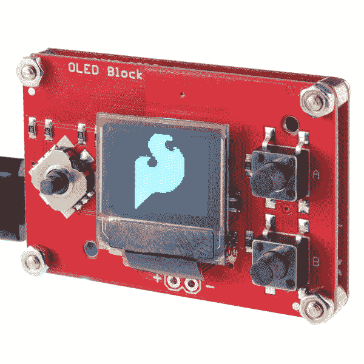
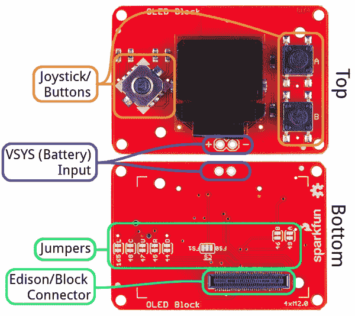
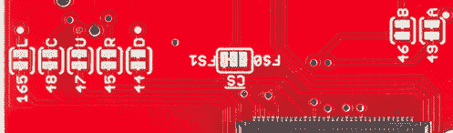
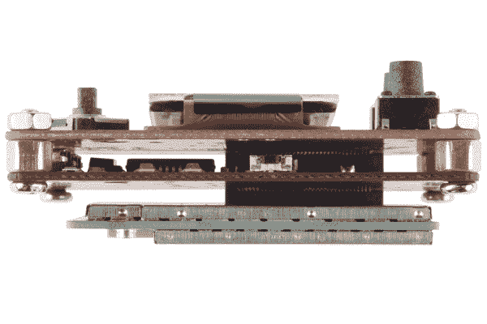
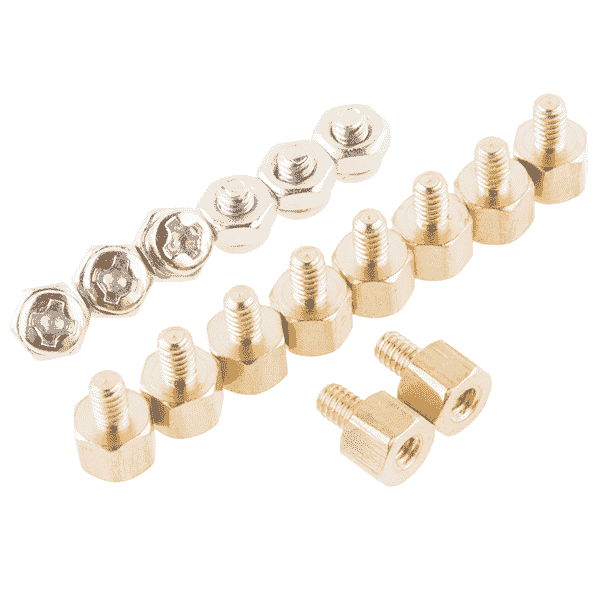
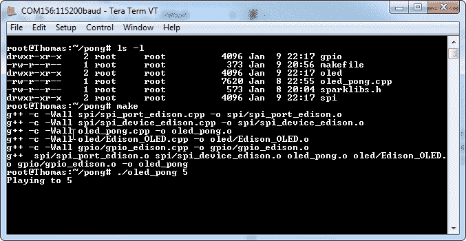
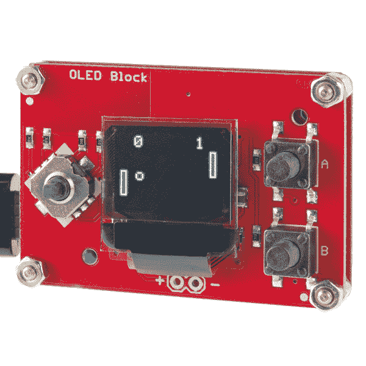

# 英特尔爱迪生有机发光二极管模块的 SparkFun 模块

> 原文：<https://learn.sparkfun.com/tutorials/sparkfun-blocks-for-intel-edison---oled-block->

## 介绍

英特尔爱迪生是一台强大的单板计算机，但它缺乏任何形式的显示输出。[有机发光二极管模块](https://www.sparkfun.com/products/13035)用于向强大的爱迪生模块提供至少某种形式的输出能力。清晰的蓝底黑字有机发光二极管显示屏为 64x48 像素，对角线长约 1.6 英寸。它很小，但这使它能够保持爱迪生的微小外形。并且，它仍然为文本或游戏留有空间。

[](https://cdn.sparkfun.com/assets/learn_tutorials/2/7/8/oled_sfe_logo.jpg)

说到游戏，该板还包括一个 4 向操纵杆(带选择开关)和两个瞬时按钮。有人开始着手将 NES 仿真器移植到 Edison 上！

### 推荐阅读

如果你不熟悉积木，看看英特尔爱迪生的[spark fun 积木通用指南。](https://learn.sparkfun.com/tutorials/general-guide-to-sparkfun-blocks-for-intel-edison)

其他可能对您的爱迪生之旅有所帮助的教程包括:

*   [为您的项目提供动力](https://learn.sparkfun.com/tutorials/how-to-power-a-project)
*   [电池技术](https://learn.sparkfun.com/tutorials/battery-technologies)
*   [连接器基础知识](https://learn.sparkfun.com/tutorials/connector-basics)

## 主板概述

在开始使用有机发光二极管模块之前，我们先来快速了解一下该板包括哪些特性和组件:

[](https://cdn.sparkfun.com/assets/learn_tutorials/2/7/8/annotated_oled_block.png)

### 按钮引脚映射

有机发光二极管模块总共有七个按钮/操纵杆输入，下面是它们如何映射到 Edison 的 GPIO 引脚:

| 纽扣 | 爱迪生 GPIO 引脚 |
| 向上 | Forty-seven |
| 向下 | forty-four |
| 左边的 | One hundred and sixty-five |
| 对吧 | Forty-five |
| 挑选 | Forty-eight |
| A | forty-nine |
| B | Forty-six |

**注 1**:“Up”朝向屏幕上方(无黑色带状连接器的*侧)。
**注 2** :“选择”按钮是指向下按操纵杆。*

### 电池电源输入

屏幕底部下面的一对通孔，标记为“+”和“-”，可用于向爱迪生提供电池输入。

[](https://cdn.sparkfun.com/assets/learn_tutorials/2/7/8/oled_battery-cropped.png)

该电压直接提供给 Edison 的 *VSYS* 引脚，并且应该在 3.3 到 4.5V 之间**。该电压是*而不是*调节的，所以在向该输入施加电压时要非常小心。单体锂聚合物电池是这种电源的完美移动选择。**

### 针织套衫

有机发光二极管块的底部充满了跳线，这使您可以定制块，以适应您的项目。

[](https://cdn.sparkfun.com/assets/learn_tutorials/2/7/8/oled_jumpers-cropped.png)

八个跳线中的七个允许您从 Edison 断开任何操纵杆或按钮输入，以防您出于其他目的需要这些 GPIO。请记住，如果您切断任何跳线，该按钮将没有任何用处，除非您将它连接到另一个引脚或重新焊接跳线。

“ CS ”跳线允许您将有机发光二极管的芯片选择引脚从“FS0”(默认)翻转到“FS1”。如果您切换此 pin，您需要相应地修改代码。

## 使用有机发光二极管块

要使用有机发光二极管积木，请将其连接到爱迪生积木或其他 SparkFun 积木上。与大多数爱迪生积木不同，这种板只有单面，因此它必须在您的堆叠的顶部(您不会想要覆盖那个漂亮的显示器！).

有机发光二极管模块*可以*使用电池供电输入为爱迪生供电，但我们建议将其与开发模块一起使用，如[控制台模块](https://www.sparkfun.com/products/13039)或[基座模块](https://www.sparkfun.com/products/13045)。

[](https://cdn.sparkfun.com/assets/learn_tutorials/2/7/8/oled_stack.jpg)*OLED Block in a stack with the Edison and a Console Block.*

块可以在没有硬件的情况下堆叠，但是这使得扩展连接器不受机械应力的保护。我们建议从我们的[硬件包](https://www.sparkfun.com/products/13187)中添加几个螺钉在有机发光二极管和下一个模块之间。

[](https://www.sparkfun.com/products/13187)*[Intel Edison Hardware Pack](https://www.sparkfun.com/products/13187)*

## 为有机发光二极管区块编程

要让你的显示器启动并运行，需要一点编码。爱迪生有各种各样的编程语言支持，但我们决定坚持用 C++来控制显示器。

我们编写了一个简单的库来帮助您入门。你可以从我们的 [GitHub 库](https://github.com/sparkfun/Edison_OLED_Block/tree/master/Firmware/pong)下载最新版本，或者点击下面的按钮将其放入 zip 文件夹。

[Download the C++ Library and Example](https://cdn.sparkfun.com/assets/learn_tutorials/2/7/8/March2016_pong.zip)

示例代码包括一个简单的 makefile 文件，可以直接在 Edison 上编译。但首先，你需要把这些文件放到爱迪生号上。有几种方法可以做到这一点。例如，你可以将 Edison 连接到一个 WiFi 网络，并对其进行 SSH-查看我们的 Edison 入门教程中的 [SSH 操作部分，以获得帮助。更好的是，你可以跟随我们的](https://learn.sparkfun.com/tutorials/edison-getting-started-guide#ssh-ing-into-the-edison)[对英特尔 Edison: Beyond the Arduino IDE](https://learn.sparkfun.com/tutorials/programming-the-intel-edison-beyond-the-arduino-ide) 进行编程，并设置 Eclipse 远程上传代码——甚至在你的开发计算机上远程编译它。

一旦你加载了代码，导航到“pong”文件夹并输入`make`。将构建依赖项(spi、gpio 和 oled 库)，然后构建主示例代码(“oled_pong.cpp”)以创建“oled_pong”可执行文件。

[](https://cdn.sparkfun.com/assets/learn_tutorials/2/7/8/compile-example.png)

代码成功构建后，键入`./oled_pong`即可播放。这应该会触发有机发光二极管点亮并开始一场乒乓游戏。玩得开心！

[](https://cdn.sparkfun.com/assets/learn_tutorials/2/7/8/oled_pong.jpg)*Edison Pong in action!*

### 使用有机发光二极管图书馆

包括在上面下载中的有机发光二极管库，允许你在小显示器上画任何东西，从像素和线条到形状和文本。

“pong”示例代码应该是一个很好的教学工具。首先，创建一个`edOLED`类的实例，然后像这样初始化显示:

```
language:c
edOLED oled;
...
oled.begin()
oled.clear(ALL);
oled.display(); 
```

然后，继续使用`oled`对象绘制像素、线条和其他形状，如下所示:

```
language:c
oled.pixel(x, y);   // Draw a pixel at x,y
oled.line(x0, y0, x1, y1);  // Draw a line from x0,y0 to x1,y1
oled.rect(x, y, width, height); // Draw a rectangle, begnning at x,y with a set width and height
oled.circle(x, y, radius);  // Draw a circle, centered at x,y with a set radius 
```

或者，您可以通过函数调用在屏幕上绘制文本，如:

```
language:c
oled.setCursor(x, y);   // Set the text cursor to x,y
oled.setFontType([0:3]);    // Set the font to one of four types.
oled.print(char);       // Draw a character
oled.write(char *);     // Draw an array of characters (string)
oled.write(int);        // Draw an integer value 
```

不要忘记:有机发光二极管的显示不会更新，直到你调用`oled.display()`。

### 使用 GPIO 库

“gpio”库也包含在示例代码中，可用于监听按钮按压。同样，pong 示例应该作为开始学习如何使用这个库的好地方。

首先，您需要初始化 pin:

```
language:c
gpio BUTTON_UP(47, INPUT);  // UP button is tied to GPIO 47
gpio BUTTON_DOWN(44, INPUT); // Down is tied to GPIO 44
gpio BUTTON_LEFT(165, INPUT); // Left is tied to GPIO 165
gpio BUTTON_RIGHT(45, INPUT); // Right is tied to GPIO 45
gpio BUTTON_SELECT(48, INPUT); // Select (pushing the joystick down) is GPIO 48
gpio BUTTON_A(49, INPUT); // Button A is GPIO 49
gpio BUTTON_B(46, INPUT); // Button B is GPiO 46 
```

然后您可以使用`gpio`类的`readPin()`函数来查看它们是高还是低。这些按钮都被拉高了，所以如果按下的话，读数会很低。

```
language:c
if (BUTTON_UP.pinRead() == LOW)
{
    printf("You're pressing down");
}
if (BUTTON_A.pinRead() == LOW)
{
    printf("You're pressing the A button");
} 
```

希望这份简短的入门书能让你准备好开始开发爱迪生有机发光二极管区块。如果您还没有，我们强烈建议您遵循我们的[编程英特尔(R)爱迪生](https://learn.sparkfun.com/tutorials/programming-the-intel-edison-beyond-the-arduino-ide)教程，以帮助您设置编程工具链。

## 资源和更进一步

现在，你已经有了有机发光二极管块的简要概述，看看这些其他教程。这些教程涵盖编程、模块堆叠以及与英特尔 Edison 生态系统的接口。

*   [英特尔爱迪生 Sparkfun 模块通用指南](https://learn.sparkfun.com/tutorials/general-guide-to-sparkfun-blocks-for-intel-edison)
*   [爱迪生入门指南](https://learn.sparkfun.com/tutorials/edison-getting-started-guide)
*   [在 Edison 上加载 Debian(Ubilinix)](https://learn.sparkfun.com/tutorials/loading-debian-ubilinux-on-the-edison)

查看 SparkFun 的其他爱迪生相关教程:

[](https://learn.sparkfun.com/tutorials/sparkfun-blocks-for-intel-edison---dual-h-bridge) [### 英特尔 Edison 的 SparkFun 模块-双 H 桥](https://learn.sparkfun.com/tutorials/sparkfun-blocks-for-intel-edison---dual-h-bridge) A quick overview of the features of the Dual H-bridge Block.[Favorited Favorite](# "Add to favorites") 2[](https://learn.sparkfun.com/tutorials/sparkfun-blocks-for-intel-edison---battery-block) [### 英特尔爱迪生公司的 SparkFun 模块-电池模块](https://learn.sparkfun.com/tutorials/sparkfun-blocks-for-intel-edison---battery-block) A quick overview of the features of the Battery Block.[Favorited Favorite](# "Add to favorites") 7[](https://learn.sparkfun.com/tutorials/sparkfun-blocks-for-intel-edison---console-block) [### 英特尔 Edison 的 SparkFun 模块-控制台模块](https://learn.sparkfun.com/tutorials/sparkfun-blocks-for-intel-edison---console-block) A quick overview of the features of the Console Block.[Favorited Favorite](# "Add to favorites") 2[](https://learn.sparkfun.com/tutorials/sparkfun-inventors-kit-for-edison-experiment-guide) [### 爱迪生实验指南](https://learn.sparkfun.com/tutorials/sparkfun-inventors-kit-for-edison-experiment-guide) Learn how to harness the power of the Intel® Edison using JavaScript to post data to the cloud, control electronics from smartphones, and host web pages that interact with circuits.[Favorited Favorite](# "Add to favorites") 4